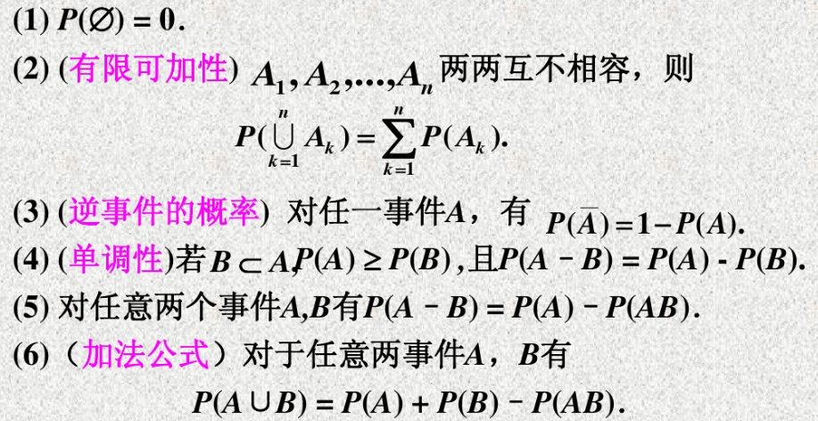

# 1. 随机事件之间的关系运算
- **包含关系**
> **可以这样理解，$B=A\cup C$，表示事件B发生等价于A或C发生，因此若A发生,则B一定发生。**

- **相等关系**
> 若 $A\subset B$，且$B\subset A$，则称事件$A$与事件$B$相等。

- **事件的和(并)：**
> 

- **事件的积(交)：**
> 

- **事件的差：**
> 

- **互不相容事件：$A\cap B=\phi$**
> 

- **对立事件：$A\cap B=\phi$且$A\cup B=S $**

**总结：**
> 

# 2. 概率
**公理化定义：**
> 设$S$是随机试验$E$的样本空间，按照某种方法，对随机试验$E$的每一个事件$A$赋予一个实数$P(A)$，且满足下列三条公理：
> - 非负性。对任意事件$A$，有$P(A)\ge 0$;.
> - 规范性。对必然事件$S$，有$P(S)=1$;
> - 可列可加性。对于两两不相容的柯列多个事件$A_{1},A_{2},\cdots,A_{k},\cdots$，有
> $$P(A_{1}\cup A_{2}\cup \cdots\cup A_{k}\cup\cdots)=P(A_{1})+P(A_{2})+\cdots+P(A_{k})+\cdots
> $$则称实数$P(A)$为事件$A$的概率。

**概率的性质：**
> 

# 3. 古典概率模型
**古典概型的两个特点**：
>  - 试验的样本空间只含有有限个样本点，即基本事件数有限；
>  - 在每一次试验中，每个基本事件的发生的可能性相同。
>  

# 4. 条件概率
**定义：**
> 设A与B是两个事件，且$P(B)>0$,称
> $$P(A|B)=\frac{P(AB)}{P(B)}
> $$为在事件$B$发生的条件下，事件$A$发生的概率。

**乘法公式：**
> - 若$P(A)>0$，则有$P(AB)=P(A)P(B|A)$；
> - 若$P(B)>0$，则有
> - $P(AB)=P(B)P(A|B)$。
> - 推广到多个事件积的情况，有
> $$P(A_{1}A_{2}\cdots A_{n})=P(A_{1})P(A_{2}|A_{1})\cdots P(A_{n}|A_{1}A_{2}\cdots A_{n-1})

$$
**全概率公式：重要**
> **划分的定义：**设随机试验$E$的样本空间为$S$，$B_{1},B_{2},\cdots,B_{n}$是样本空间的一组事件，若满足：
(1). $B_{1},B_{2},\cdots,B_{n}$两两互不相容；
(2). $S=B_{1},B_{2},\cdots,B_{n}$
则$B_{1},B_{2},\cdots,B_{n}$是样本空间的一组**划分**。

**事件的独立性：**
> 

**贝努里试验：**
> 如果再一个试验中只关心事件的发生与否，这种试验为**贝努里试验**
> 
> **n重贝努里试验：**设$P(A)=p$，则事件$A$恰好发生$k$次的概率为
$$P_{n}(k)=C_{n}^{k}p^{k}(1-p)^{n-k},k=0,1,\cdots,n.
$$