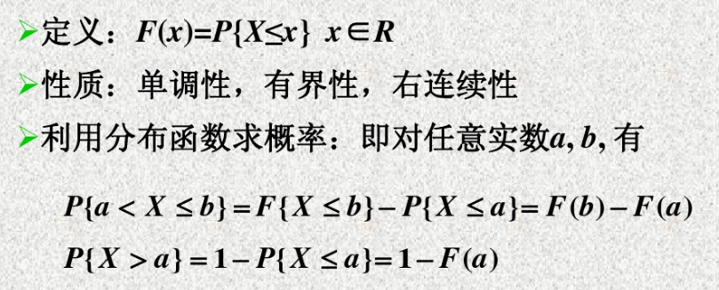
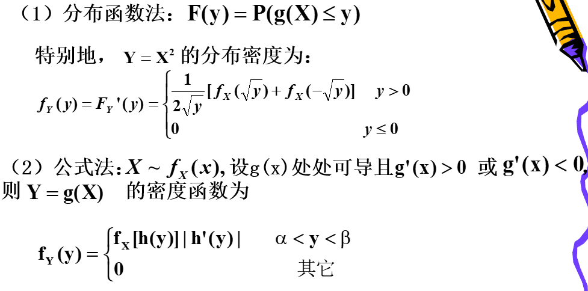

# 1. 随机变量及其分布函数
**随机变量的定义：**
> 设$S=\{e\}$是随机试验$E$的样本空间。如果对于每一个$e\in S$，都有一个实数$X(e)$与之对应，得到一个定义在$S$上的实值单值函数$X(e)$，称$X(e)$为定义在$S$上的一个**随机变量**。

**随机变量的分布函数$F(x)$：**
> 

# 2. 离散型随机变量分布
> 设$X$是离散型随机变量，$X$的所有可能取值为$x_{1},x_{2},\cdots,x_{n}$,则
> $$P(X=x_{k})=p_{k},k=1,2,\cdots.
> $$为随机变量$X$的**概率分布**。

**常见的离散型随机变量分布：**
> - **0-1分布(两点分布)**：若随机变量$X$的所有可能取值为0和1，且它的分布律为
> $$P(x=k)=p^{k}(1-p)^{1-k},k=0,1
> $$则X服从参数为$p$的(0-1)分布
>
> - **二项分布**：若随机变量的所有取值为$0,1,2,\cdots,n$，且它的分布律为
> $$P(x=k)=C_{n}^{k}p^{k}(1-p)^{n-k},k=0,1,\cdots,n
> $$则称$X$服从二项分布，记为$X\sim B(n,p)$
> **二项分布的重要性质：泊松定理**，设$X_{n}\sim B(n,p_{n})$，且$\lim_{n\rightarrow \infty}np_{n}=\lambda$，其中$\lambda>0$，对于任意一个非负的常数有
> $$\lim_{n\rightarrow\infty}P(X_{n}=k)=\lim_{n\rightarrow\infty}C_{n}^{k}p_{n}^{k}(1-p_{n})^{n-k}=\frac{\lambda^{k}e^{-\lambda}}{k! }
$$
> 
> - **泊松分布：**若随机变量$X$的所有可能取值一切为非负整数，且它的分布律为
$$P(x=k)=\frac{\lambda^{k}e^{-\lambda}}{k!}
$$其中,$\lambda > 0$，则称$X$服从参数为$\lambda$的**泊松分布**，记为$X\sim \pi(\lambda)$。
**性质：**设$X\sim \pi(\lambda)$，则当$k=[\lambda]$时，P(x=k)取得最大值。
# 3. 连续性随机变量分布
**概率密度函数$f(x)$：**
> **重要性质：**设$X$为连续性随机变量，则对任意的实数$x_{0}$都有$P(X=x_{0})=0$

**常见的连续性随机变量的分布：**
> 其中指数分布的概率密度函数也可以写为$$f(x)=\begin{cases}\theta e^{-\theta x}, &x>0\\  0, &x\le0
\end{cases}
$$
>
>接下来，我们重点来讨论**标准正态分布**：
>- **性质1：**设$X\sim N(0,1)$，则其概率密度函数和分布函数为
>$$\begin{split}\varphi(x)=\frac{1}{\sqrt{2\pi}}e^{-\frac{x^{2}}{2}},&- \infty<x<\infty,\\ \phi(x)=\frac{1}{\sqrt{2\pi}}\int_{-\infty}^{x}e^{-\frac{t^{2}}{2}}dt,&- \infty<x<\infty
>\end{split}
>$$则$\phi(x)$有如下性质：
>$$\phi(-x)=1-\phi(x)
>$$
>- **性质2：**若$X\sim N(\mu,\sigma)$，则$Z=\frac{X-\mu}{\sigma}\sim N(0,1)$

# 4. 随机变量函数的分布
**离散型随机变量函数的分布：打表，将相同的取值的概率相加即可。**

**连续性随机变量函数的分布：先求分布函数，再求概率密度函数**

> 