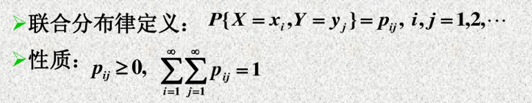
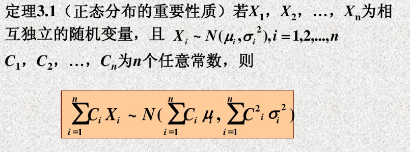

# 1. 二维随机变量及其分布函数
**二维随机变量的定义：**
> 设$S={e}$为试验$E$的样本空间，$X=X(e),Y=Y(e)$是定义再$S$上的两个随机变量，则称有序组$(X,Y)$为**二维随机变量**

**二维随机变量的联合分布函数：**
> 
> **性质：**
> - $F(x,y)\in [0,1]$
> - $F(x,y)$对于每个变量都是单调不减函数。
> - $F(x,-\infty)=F(-\infty,y)=F(-\infty,-\infty)=0,F(+\infty,+\infty)$
> - $F(x,y)$对每个自变量都是右连续的。
> - $P(x_{1}< X\le x_{2},y_{1}< Y\le y_{2})=F(x_{2},y_{2})-F(x_{1},y_{2})-F(x_{2},y_{1})+F(x_{1},y_{1})$

# 2. 二维离散型随机变量分布
> 

# 3. 二维连续型随机变量分布
**二维联合概率密度函数：**
> 
> **性质：**
> - $f(x,y)\ge 0$
> - $\int_{-\infty}^{\infty}\int_{-\infty}^{\infty}f(x,y)dxdy=1$
> - $P((X,Y)\in D)=\int\int_{D}$f(x,y)dxdy.
> - $f(x,y)$在点$(x,y)$连续，则有
> $$\frac{\partial^{2}F(x,y)}{\partial x \partial y}=f(x,y)
$$
**常见的二维连续性随机变量的分布：**

# 4. 边缘分布
**边缘分布定义：**
> 二维随机变量$(X,Y)$其分量$X$与$Y$也有自己的分布函数，记为$F_{X}(x)$和$F_{Y}(y)$，事实上：
$$\begin{split}&F_{x}(x)=P(X\le x)=P(X\le x, Y<+\infty)=F(x,+\infty)\\ &F_{Y}(y)=P(Y\le y)=P(X\le +\infty,Y\le y)=F(+\infty,y)
\end{split}
$$

**二维离散型随机变量的边缘分布律：**
> 

**二维连续型随机变量的边缘分布律：**
> **边缘分布函数：**
>
> **边缘概率密度函数：结合边缘分布函数推导**
> 

# 5. 二维随机变量的独立性
**定义：**
> 

**离散型随机变量的独立性：**
> 

**连续性随机变量的独立性：**
> 

# 6. 二维随机变量函数的分布
**问题：**
 设$(X,Y)$是一个二维随机变量，$z=g(x,y)$是连续函数，则$Z=g(X,Y)$也是一个随机变量，如何求$Z$的概率分布呢？

**离散型随机变量函数的分布：打表，相同的(X,Y)概率相加。**

**连续型随机变量函数的分布：**
> 设二维连续性随机变量$(X,Y)$的概率密度为$f(x,y)$，则随机变量$Z=g(X,Y)$的分布函数为
> $$F_{Z}(z)=P(Z\le z)=P(g(X,Y) \le z)=\int\int_{g(x,y)\le z}f(x,y)dxdy
> $$由此可得$Z=g(X,Y)$的概率密度函数为
> $$f_{Z}(z)=\frac{dF_{Z}(z)}{dz}=\frac{d}{dz}(\int\int_{g(x,y)\le z}f(x,y)dxdy)
> $$

**常见的连续性随机变量函数分布：**
> - **$Z=X+Y$的分布：**
> $$\begin{split}& f_{Z}(z)=\int_{-\infty}^{+\infty}f(z-y,y)dy=\int_{-\infty}^{+\infty}f(x,z-x)dx\end{split}
> $$当$X$与$Y$独立时，有$$\begin{split}& f_{Z}(z)=\int_{-\infty}^{+\infty}f_{X}(x)f_{Y}(z-x)dx=\int_{-\infty}^{+\infty}f_{X}(Z-Y)f_{Y}(y)dy\end{split}
> $$**正态分布的重要性质：**
> - **$Z= \min(X_{1},X_{2},\cdots,X_{n})$和$Z=\max(X_{1},X_{2},\cdots,X_{n})$的分布：**