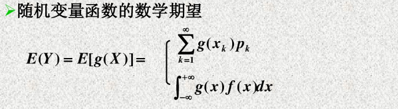
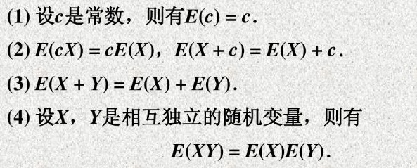
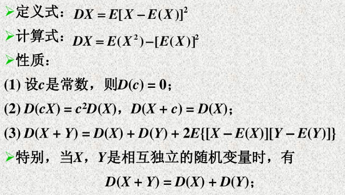
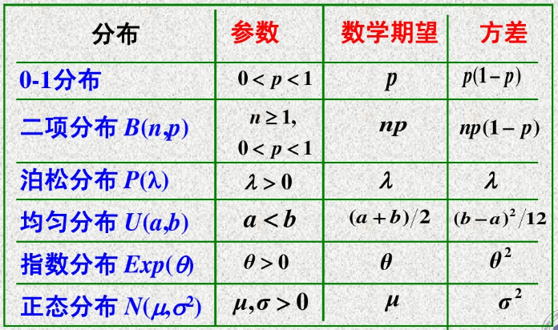
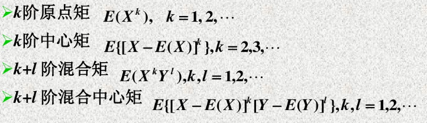

# 1. 数学期望
数学期望刻画了随机变量X的所有可能取值在概率意义下的**平均值**，实际上是**均值**的一种体现。

**离散型随机变量的数学期望：**
> 

**连续型随机变量的数学期望：**
> 

**随机变量函数的数学期望:**
> 

**数学期望的性质：**
> 

# 2. 方差
**定义：反应随机变量与其数学期望的偏离程度**
> 设$X$是一个随机变量，如果$E([X-E(X)])^{2}$存在，则称$E([X-E(X)])^{2}$为$X$的**方差**，记为$D(X)$，即
> $$D(X)=E([X-E(X)])^{2}
> $$称$\sqrt{D(X)}$为$X$的**标准差**。

**性质：**
> 

**重要分布的期望和方差：**
>其中，指数分布的概率密度函数为：$$f(x)=\begin{cases}\frac{1}{\theta} e^{-\frac{1}{\theta} x}, &x>0\\  0, &x\le0
>\end{cases}
$$
# 3. 协方差
描述二维随机变量$(X,Y)$之间的$X$与$Y$的关系。

**协方差的定义：**
> 

**协方差的计算式以及性质：**
> **补：**
$$D(X\pm Y)=D(X)+D(Y)\pm 2Cov(X,Y)
$$推广到n维随机变量得到：
$$D(\sum_{i=1}^{n}X_{i})=\sum_{i=1}^{n}D(X_{i})+2\sum_{1\le i<j \le n}Cov(X_{i},X_{j})
$$

# 4. 相关系数
**相关系数的定义："标准化的协方差"**
> 设$(X,Y)$是二维随机变量，若$D(X)>0,D(Y)>0$，称
> $$\rho_{XY}=\frac{Cov(X,Y)}{\sqrt{D(X)}\sqrt{D(Y)}}
> $$为$X$和$Y$的相关系数，当$\rho_{XY}=0$，称随机变量$X$与$Y$**不相关**。
> **注意：**当$X$与$Y$独立时，$X$与$Y$不相关。因为：
> $$Cov(X,Y)=E(XY)-E(X)E(Y)=0
> $$
>
> **等价定义：**将随机变量标准化为
> $$X^{*}=\frac{X-E(X)}{\sqrt{D(X)}},Y^{*}=\frac{Y-E(Y)}{\sqrt{D(Y)}}
> $$则，$\rho_{XY}=E(X^{*}Y^{*})=Cov(X^{*},Y^{*})$

**相关系数的性质：**
> 设$\rho_{XY}$为随机变量$(X,Y)$的相关系数，则有：
> (1). $|\rho_{XY}|\le 1$。
> (2). $|\rho_{XY}| = 1$的充要条件是$X$与$Y$依概率线性相关，即存在常数$a(a\ne 0),b$，使$$P(Y=aX+b)=1
> $$证明过程见《概率论与随机过程》P115
>
> **讨论：**
> - 当$|\rho_{XY}| = 1$时，$X$与$Y$存在线性相关的概率为1，不存在线性相关的概率为0.
> - 当$|\rho_{XY}| < 1$时，这种线性相关的概率随着$\rho_{XY}$的降低而减小。
> - 当$|\rho_{XY}| = 0$时，它们之间不存在线性关系。

# 5. 矩的概念
> 