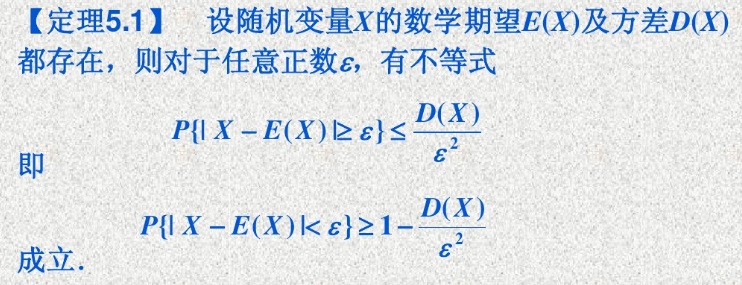
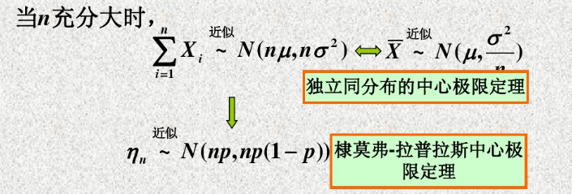

大数定理是研究**随机变量序列**的算术平均的收敛性问题；而中心极限定理是研究随机变量有限和的分布函数的收敛性问题。

**注意：**大数定律与中心极限定义研究的是随机变量序列$\{X_{n}\}$

# 1. 切比雪夫不等式
> **这说明方差越小，随机变量取值密集在数学期望附近的概率越大**，这个结论也说明方差是描述随机变量取值与数学期望离散程度的一个量。

# 2. 随机变量序列的极限
**定义：**
> 设$X_{1},X_{2},\cdots,X_{n},\cdots$是一随机变量序列，如果存在一个常数$a$，使得对任意一个实数$\varepsilon>0$，总有
> $$\lim_{n\rightarrow \infty}P(|X_{n}-a|<\varepsilon)=1
> $$成立，则称随机变量序列$X_{1},X_{2},\cdots,X_{n},\cdots$依概率收敛于$a$，记为$X_{n}\stackrel{P}{\longrightarrow a}$。
> 依概率收敛的直观意义是：当$n$充分大时，随机变量序列$\{X_{n}\}$与$a$的距离充分小的事件概率趋于1.

**如何证明用频率来表示概率？**
> 在$n$重贝努里试验中，设$N_{A}$为事件$A$发生的次数，每次试验发生的概率$P(A)=p$，则$A\sim B(n,p)$，事件A发生的频率为$\frac{N_{A}}{n}$，则
> $$\begin{split} &E(\frac{N_{A}}{n})=\frac{np}{n}=p\\  &D(\frac{N_{A}}{n})= \frac{np(1-1)}{n^{2}} = \frac{p(1-P)}{n} \end{split}
> $$根据切比雪夫不等式可得，对任意一个实数$\varepsilon>0$，当$n \rightarrow\infty$时，有
> $$0\le P(|\frac{N_{A}}{n}-p|\ge \varepsilon) \le \frac{p(1-p)}{n\varepsilon} \le \frac{1}{4n\varepsilon}\rightarrow 0 
> $$则有$\frac{N_{A}}{n}\stackrel{P}{\longrightarrow}p$，上述证明即为**频率稳定性**的严格证明。

# 3. 大数定律
**定义:**
> 设$\{X_{n}\}$是一随机变量序列，其数学期望$E(X_{n})$存在，$n=1,2,\cdots,$，令$\varepsilon_{n}=\frac{1}{n}\sum_{i=1}^{n}X_{i}$，若$\varepsilon_{n}-E(\varepsilon_{n})\stackrel{P}{\longrightarrow}0$，则称随机变量序列$\{X_{n}\}$服从**大数定律**。

**三种大数定律：**
> - **切比雪夫大数定律：**设$X_{1},X_{2},\cdots,X_{n},\cdots$是相互独立的随机变量序列，如果存在常数$C$，使得$D(X_{i})\le C,i=1,2,\cdots,$
> 则此随机变量序列服从大数定律，即对任意的$\varepsilon > 0$，有
> $$\lim_{n\rightarrow\infty}P(|\frac{1}{n}\sum_{i=1}^{n}X_{i}-\frac{1}{n}\sum_{i=1}^{n}E(X_{i})|<\varepsilon)=1$$

> - **贝努里大数定律：**设$N_{A}$是$n$重贝努里试验中$A$发生的次数，$p$是$A$发生的概率，则对任意的实数$\varepsilon > 0$，有
> $$\lim_{n\rightarrow\infty}P(|\frac{N_{A}}{n}-p|<\varepsilon) =1
> $$上式实际上就是**频率稳定性的严格数学描述**。
> - **辛钦大数定律**：设$X_{1},X_{2},\cdots,X_{n},\cdots$是独立同分布的随机变量序列，且
> $$E(X_{i})=\mu,i=1,2,\cdots,
> $$则对任意的实数$\varepsilon >0$，有
> $$\lim_{n\rightarrow\infty}P(|\frac{1}{n}\sum_{i=1}^{n}X_{i}-\mu|<\varepsilon) =1
> $$由辛钦大数定律可知，当n充分大时，对某随机变量的n次测量结果$x_{1},x_{2},\cdots,x_{n}$的算术平均值作为该随机变量的期望的近似值。

# 4. 中心极限定理
中心极限定理本质上是研究**随机变量序列的有限和**在什么条件下，它的极限分布是**标准正态分布**的问题。

**定义：**
> 凡是使得概率分布函数$F_{n}(x)\stackrel{n\rightarrow \infty}{\longrightarrow} \phi(x) $一致成立的定理都叫做中心极限定理。其中$\phi(x)$是**标准正态分布**的概率分布函数。

**随机变量序列的标准化：**
> 令
> $$\varepsilon_{n}=\frac{\sum_{i=1}^{n}[X_{i}-E(X_{i})]}{\sqrt{D(\sum_{i=1}^{n}X_{i})}}
> $$则有
> $$E(\varepsilon_{n})=0,D(\varepsilon_{n})=1,n=1,2,\cdots,
> $$所以$\varepsilon_{n}$就是$\sum_{i=1}^{n}X_{i}$经标准化后的随机变量序列。

**独立同分布下的中心极限定理：**
> 设$X_{1},X_{2},\cdots,X_{n}$是独立同分布的随机变量序列，当$n$充分大时，可近似认为
> $$\frac{\sum_{i=1}^{n}X_{i}-n\mu}{\sqrt{n}\sigma}\sim N(0,1)
> $$或
> $$\sum_{i=1}^{n}X_{i}\sim N(n\mu,n\sigma^{2})
> $$一般地，当$n$充分大时，可用以下近似等式计算概率
> $$\begin{split} &(1). \space \space \space P(a<\frac{\sum_{i=1}^{n}X_{i}-n\mu}{\sqrt{n}\sigma} \le b)\approx \phi(b)-\phi(a)\\  &(2). \space\space \space P(a<\sum_{i=1}^{n}X_{i} \le b)\approx \phi(\frac{b-n\mu}{\sqrt{n}\sigma})- \phi(\frac{a-n\mu}{\sqrt{n}\sigma} )\end{split}$$

**拉普拉斯中心极限定理：**
> 设$N_{A}$是$n$次独立重复试验中事件$A$发生的次数，$p$是每次试验事件A发生的概率，$N_{A}\sim B(n,p)$，则对任意有限区间$(a,b]$，有$$\lim_{n\rightarrow\infty}P(a<\frac{N_{A}-np}{\sqrt{np(1-p)}} \le b)= \phi(b)-\phi(a) 
> $$

> 