# 1. 样本
**定义：**
> 设$X$是具有分布函数$F$的随机变量，若$X_{1},X_{2},\cdots,X_{n}$是具有分布函数F的相互独立的随机变量，则称$X_{1},X_{2},\cdots,X_{n}$为来自总体$X$的简单随机样本，样本的观察值$x_{1},x_{2},\cdots,x_{n}$称为样本值。

# 2. 抽样分布
**常用的统计量：**
> $X_{1},X_{2},\cdots,X_{n}$为来自总体$X$的简单随机样本，$x_{1},x_{2},\cdots,x_{n}$为对应的 样本值，则
> - 样本均值：$\bar{X}=\frac{1}{n}\sum_{i=1}^{n}X_{i}$
> - 样本方差：$S^{2}=\frac{1}{n-1}\sum_{i=1}^{n}(X_{i}-\bar{X})^{2}$(为什么除以n-1?为了产生方差的无偏估计)，证明可见[https://blog.csdn.net/qq_16587307/article/details/81328773](https://blog.csdn.net/qq_16587307/article/details/81328773)
> - 样本标准差：$S=\sqrt{S^{2}}$
> - k阶(原点)矩：$A_{k}=\frac{1}{n}\sum_{i=1}^{n}X_{i}^{k}$
> - k阶中心矩：B_{k}=\frac{1}{n}\sum_{i=1}^{n}(X_{i}-\bar{X})^{k}
> **注：**上述统计量均是对**抽样样本**的描述，而不是**总体**的描述。

**三个重要的定理：**
> 设$X_{1},X_{2},\cdots,X_{n}$为来自总体$X$的简单随机样本，若$E(X)=\mu,D(X)=\sigma^{2}$，其中$\mu$和$\sigma^{2}$均是总体$X$的均值和方差，则有
> - $E(\bar{X})=E(X)=\mu$
> - $D(\bar{X})=\frac{D(X)}{n}=\frac{\sigma^{2}}{n}$
> - $E(S^{2})=D(X)=\sigma^{2}$

**三个重要的总体抽样分布：**
> - **$\chi^{2}$分布：**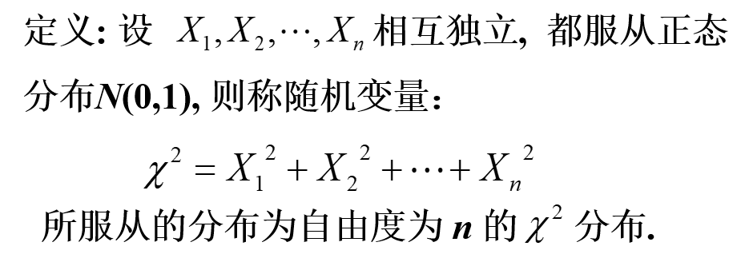
> 性质：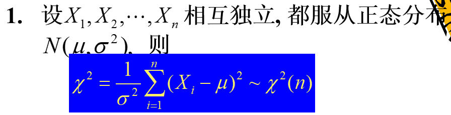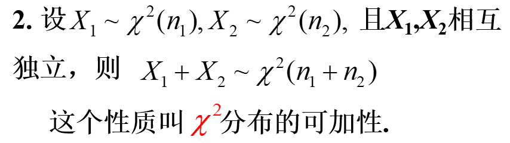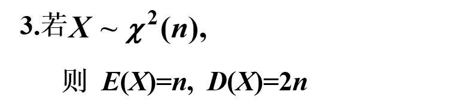分位点：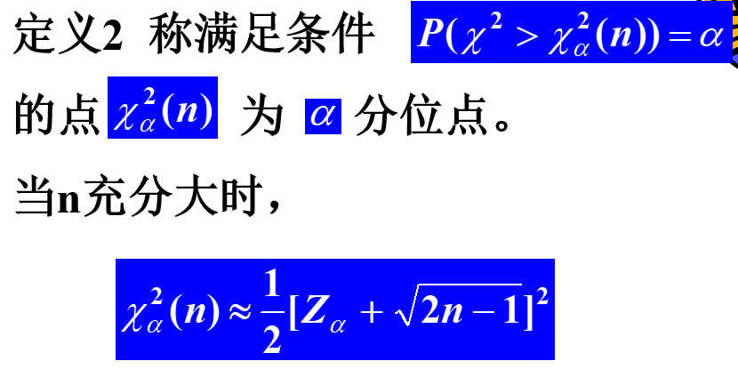
> -**$t$分布：**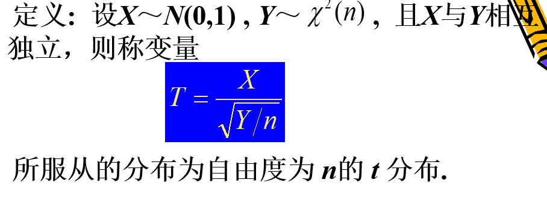性质：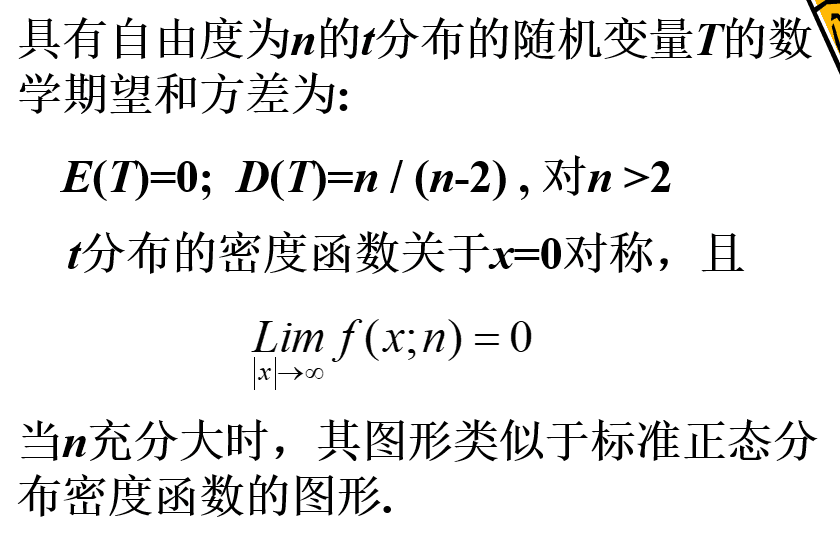补充性质：$t_{1-\alpha}(n)=-t_{\alpha}(n)$，其中$\alpha$为$t$分布的上分位点。
> - **F分布：**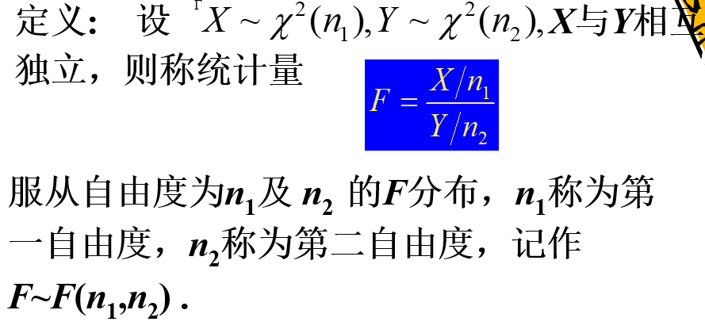性质：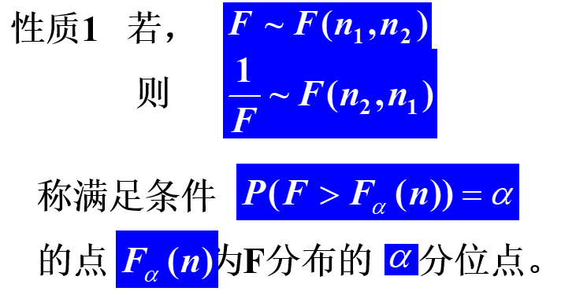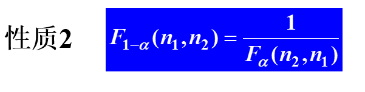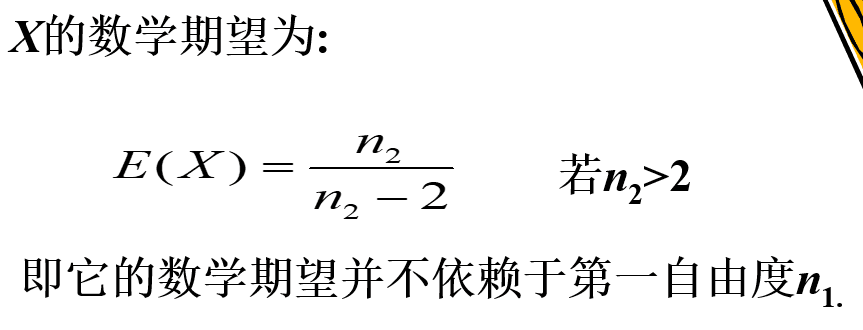

# 3. 正态总体样本均值与样本方差的分布
**样本均值分布：**
> 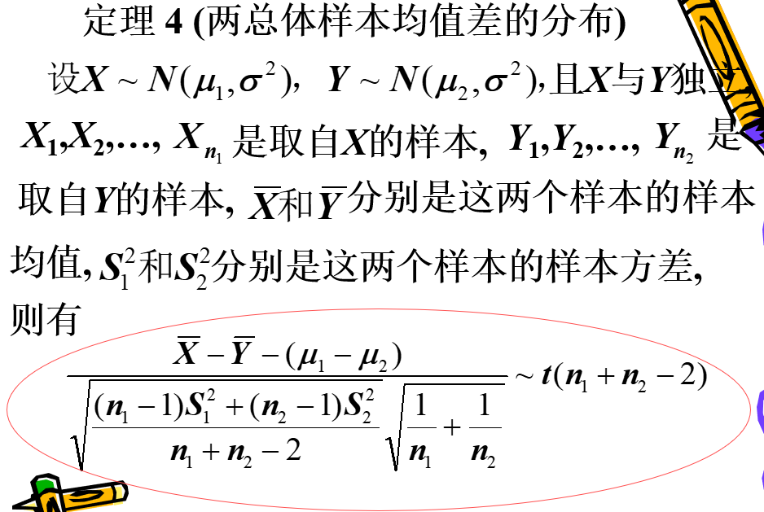

**样本方差的分布：**
> 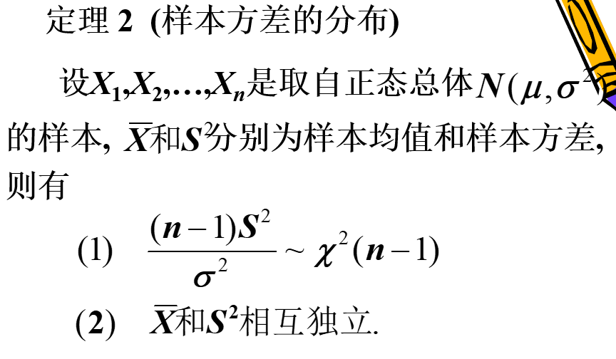

**均值与方差的t分布：**
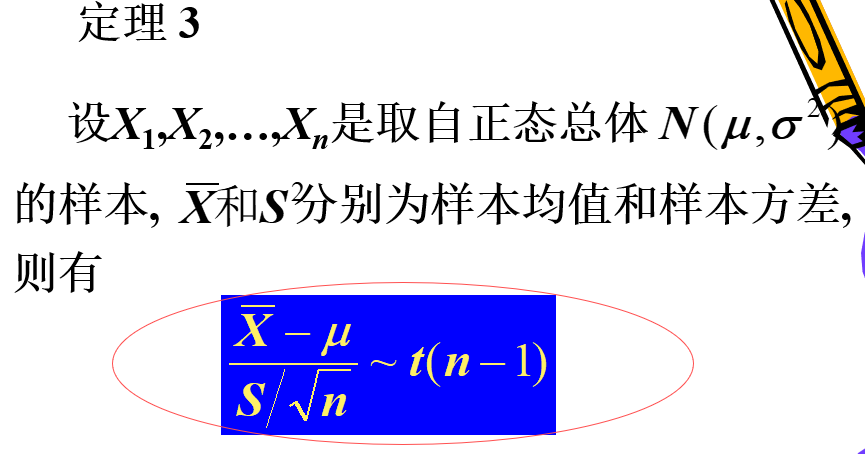

**两正态总体的均值差分布：**
> 

**两正态总体的方差比分布：**

> 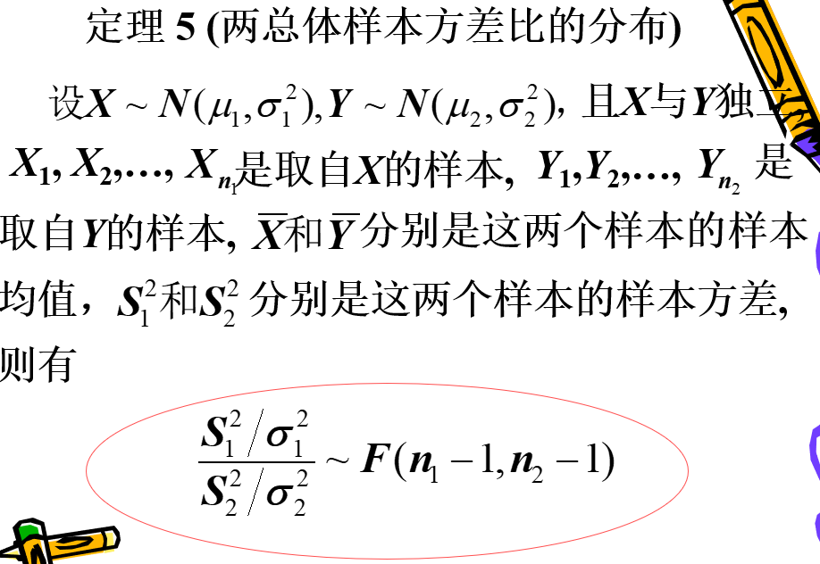