# 1. 全排列与逆序数
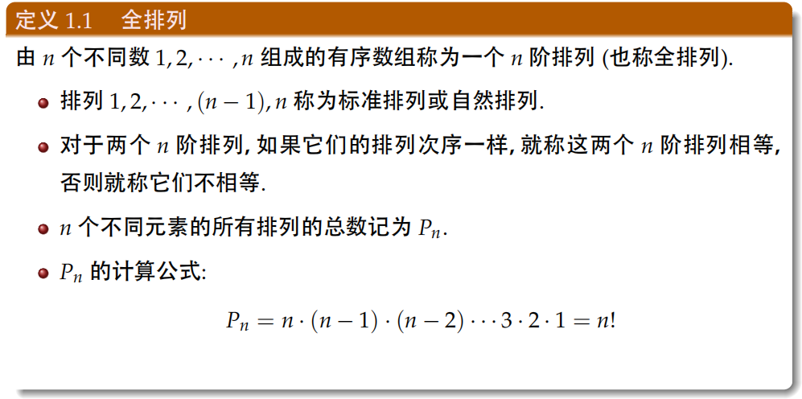
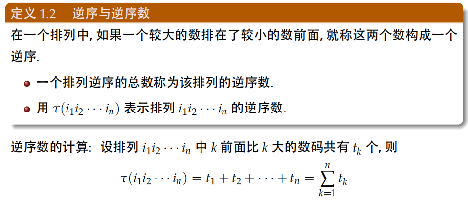
# 2. 行列式
## 2.1 n阶行列式
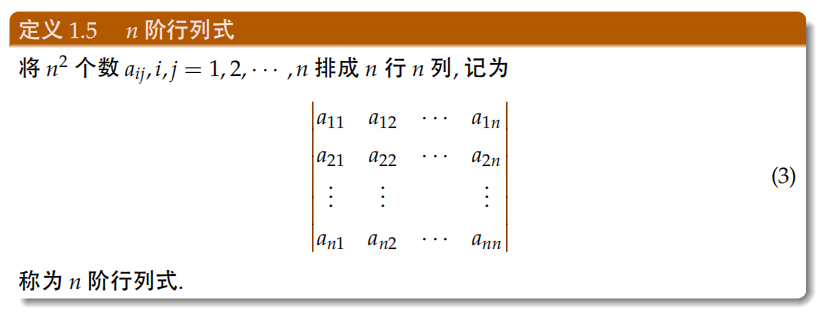
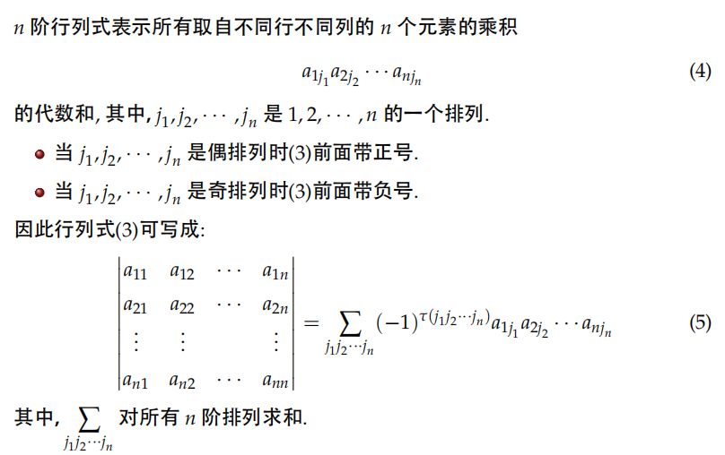
> - 奇排列:$\tau(j_{1}j_{2}\cdots j_{n})$为奇数
> - 偶排列:$\tau(j_{1}j_{2}\cdots j_{n})$为偶数
## 2.2 行列式的性质
**1. 行列互换，其值不变**
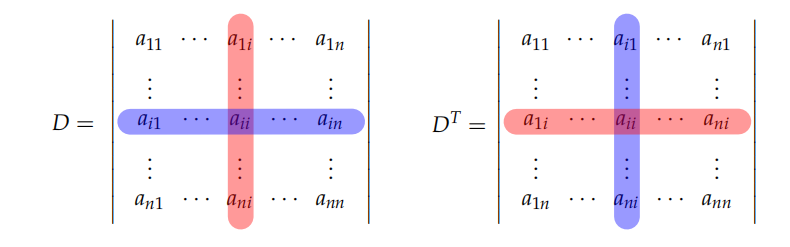即$D=D^{T}$ 

**2. 行列式的任一行或列乘以某常数$k$等于用$k$乘以整个行列式**
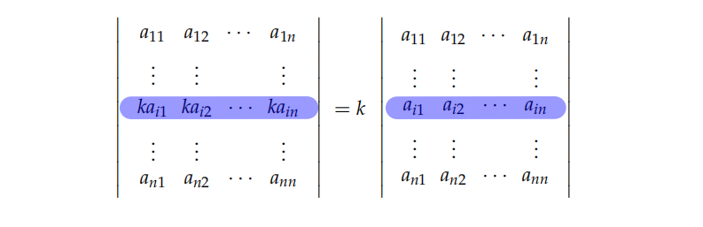
**3. 行列式的某一行或一列为0，其值为0**

**4. 如果行列式的某一行或一列的元素都是两个元素之和，则此行列式等于两个行列式之和。**
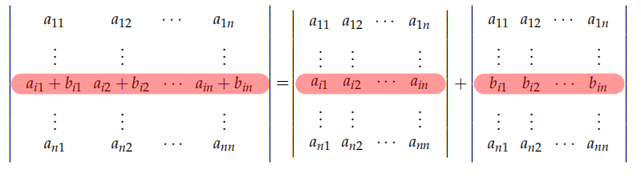

**5. 行列式中某两行或列交换，其值异号。**
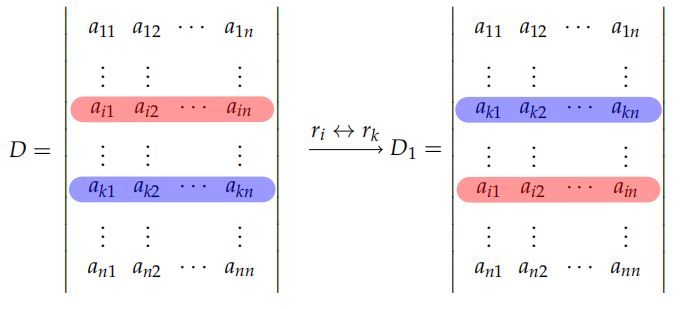

**6. 如果行列式的两行相同，其值为0**
证明：根据性质5，$D=-D\therefore D=0$

**7. 把行列式的某一行(列)的倍数加到另一行(列)上，其值不变。**
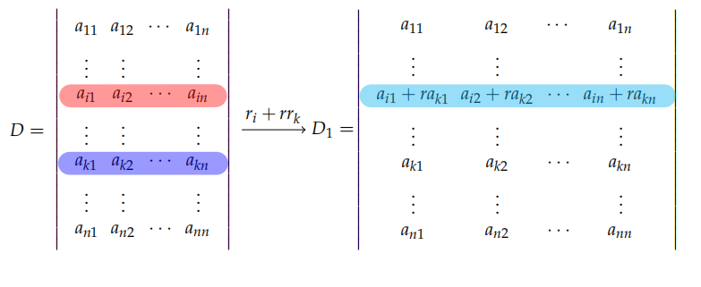
## 2.3 余子式、代数余子式
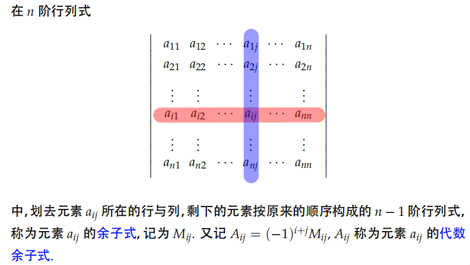

**代数余子式与行列式的关系**：
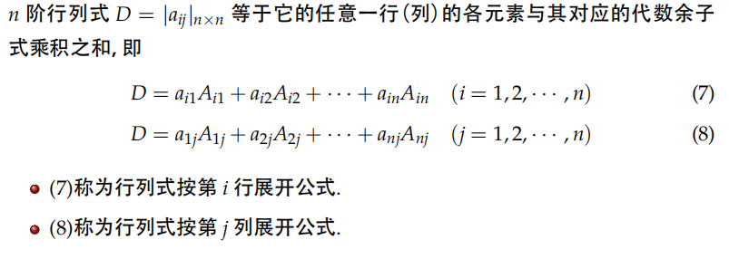

# 3. 克莱姆法则
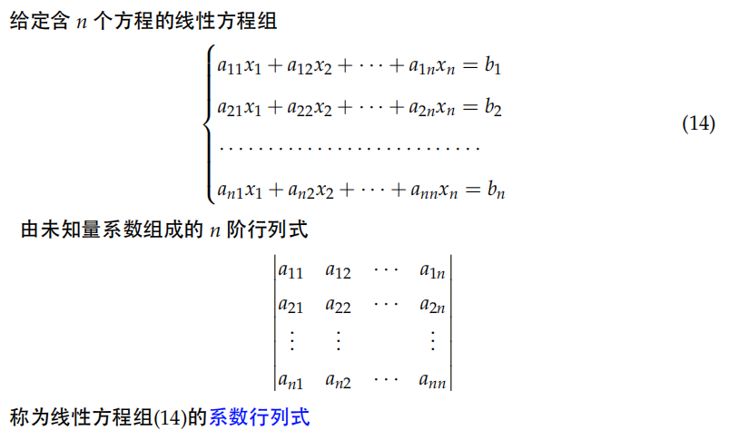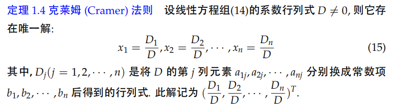
## 3.1 非齐次性线性方程组解的判定
**1. 克莱姆法则**
> - 当系数行列式$D\ne 0$时，有唯一解（克莱姆法则）。
> - 当系数行列式$D=0$时，可能有解，可能无解，此时需要根据矩阵的秩判断。

**2. 矩阵的秩**
> 设系数矩阵$A$的秩为$r(A)$，其增广矩阵$B$的秩为$r(B)$，则
> - 当$r(A) = r(B)$时，方程组有解；
> >  - 当$r(A) = r(B)=n$时，方程有唯一解；
> >  - 当$r(A) = r(B)<n$时，方程有无穷多个解；
>
> - 当$r(A) < r(B)$时，方程组无解。
## 3.2 齐次线性方程组解的判定
>**齐次线性方程组一定有零解，可能有非零解**：
>- 当系数行列式$D\ne 0$时，只有零解；
>- 当系数行列式$D= 0$时，存在非零解。