#1. 矩阵及其运算
## 1.1 矩阵定义
> 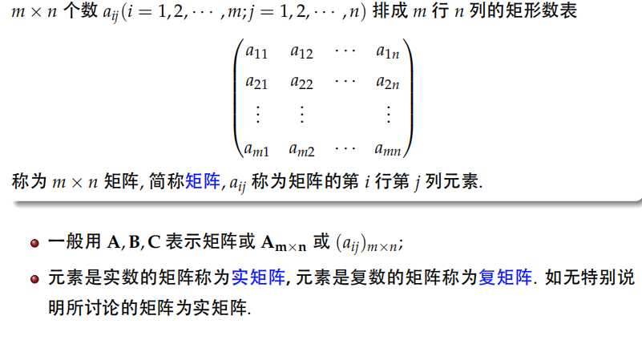

**上三角与下三角矩阵：**
> 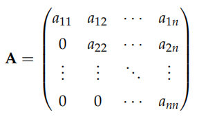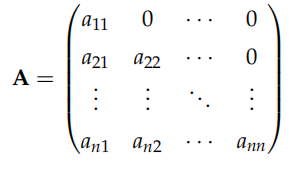

**单位矩阵**：
> 
## 1.2 矩阵的加减乘
加法和减法均是**同型**矩阵对应相加或相减。

**矩阵的乘法**：
> 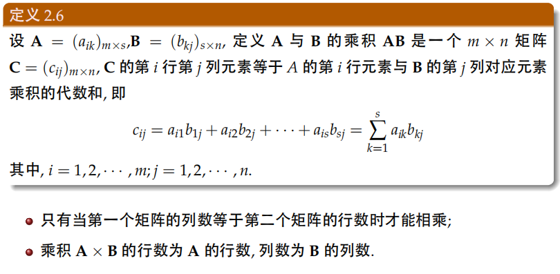
> **注：$AB\space!\equiv BA$**
## 1.3 矩阵的转置
> 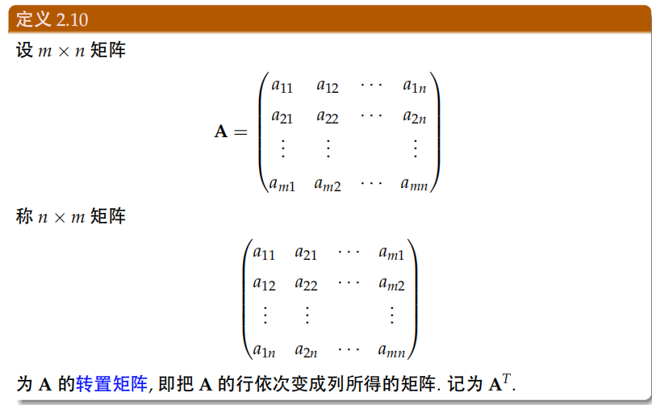

**对称矩阵**：
> 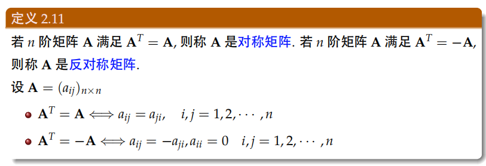
# 2. 矩阵的行列式与逆
## 2.1矩阵的行列式
> 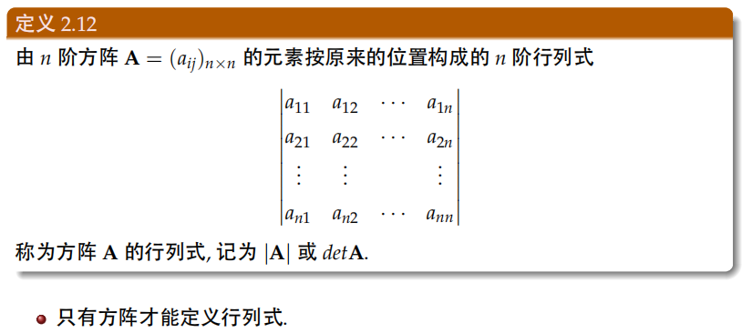

**奇异化矩阵：（使用矩阵的行列式来定义，必须为方阵）**
> 
## 2.2 矩阵的逆
必须为**方阵**，且是**非奇异（退化）矩阵**，矩阵与其逆矩阵的乘积为**单位阵**，并且逆矩阵是**唯一**的！
> 
## 2.3 伴随矩阵求矩阵的逆
**伴随矩阵的定义：**
> 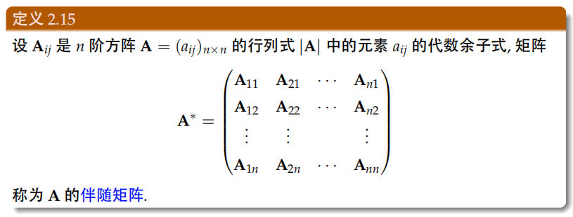

**伴随矩阵求矩阵的逆矩阵：**
> 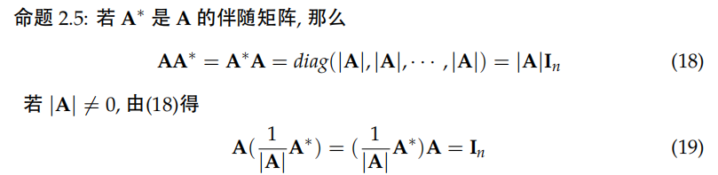式(18)为代数余子式的性质，式(19)根据矩阵的逆矩阵的定义而列出。
> 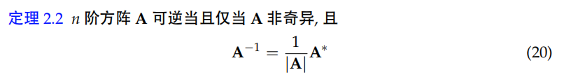
> 矩阵A与逆矩阵行列式的关系：
> 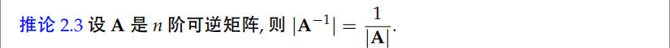
## 2.4 可逆矩阵的性质
> 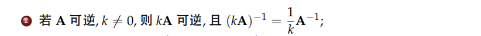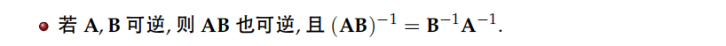

# 3. 矩阵的秩
## 3.1 矩阵的初等变换
> 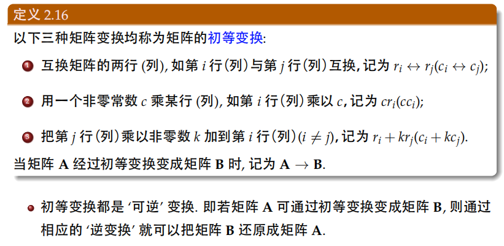
## 3.2 初等矩阵
> 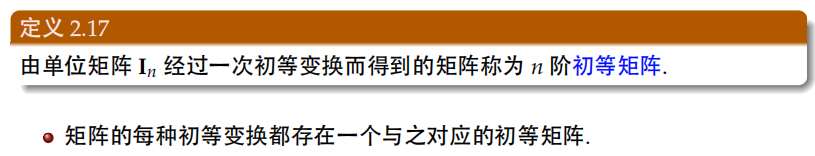

**初等变换的实质：**
> 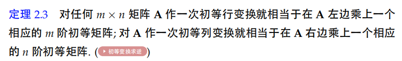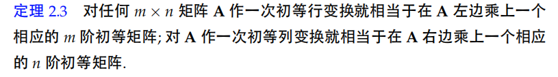
## 3.3 矩阵的等价
> 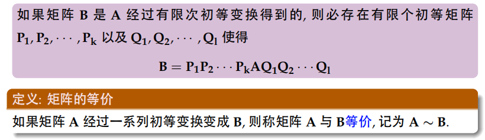
> 如果一个矩阵A通过有限次的初等变换变换称B，则A与B等价。
## 3.4 行阶梯矩阵、行最简矩阵、行阶梯形、标准形
> 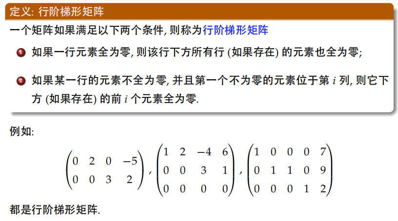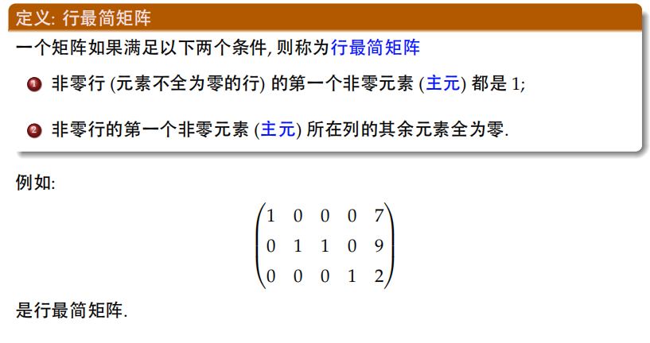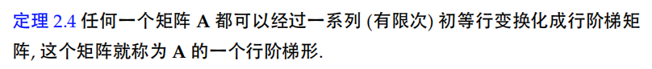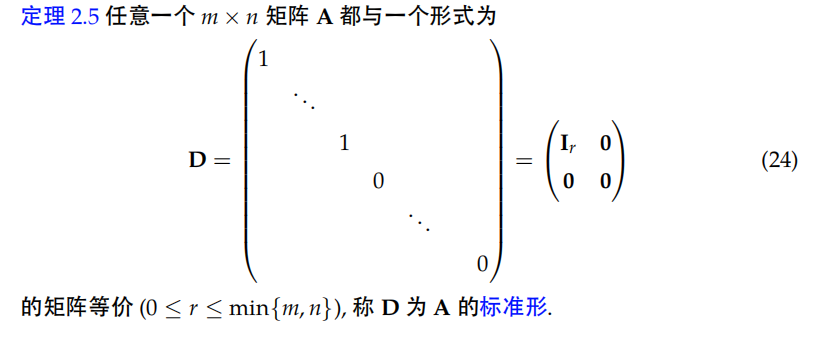
## 3.5 初等变换求逆矩阵
> 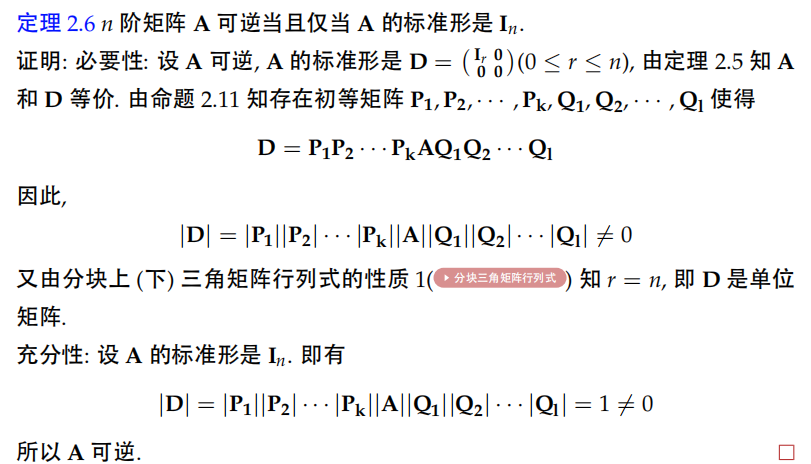
> 

> 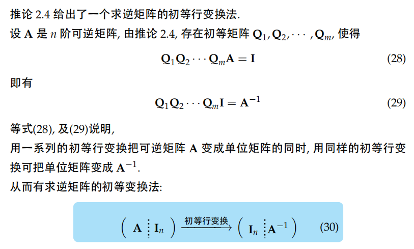
> **证明：**
> 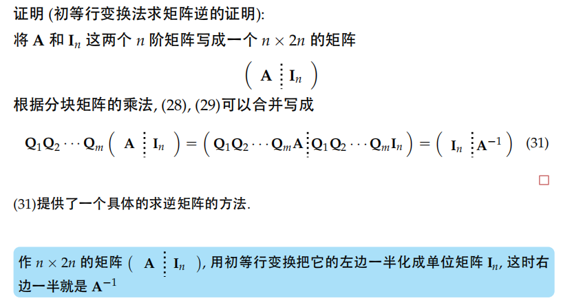
## 3.6 矩阵的秩
**矩阵秩的理解**[http://www.360doc.com/content/18/0208/09/15930282_728535649.shtml](http://www.360doc.com/content/18/0208/09/15930282_728535649.shtml)
- 「秩」是图像经过矩阵变换之后的空间维度（用几维列向量表示空间）
- 「秩」是列空间的维度
- 「秩」是列向量线性无关组的数目

**矩阵秩的原始定义：**
> 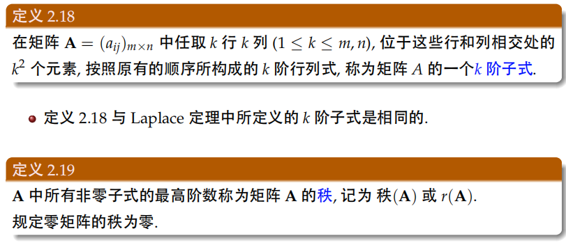

**矩阵秩使用初等变换的求法：**
> 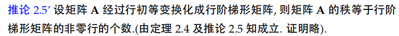

# 4. 线性方程组有解判定
**线性方程组：**
> 

**增广矩阵：**
> 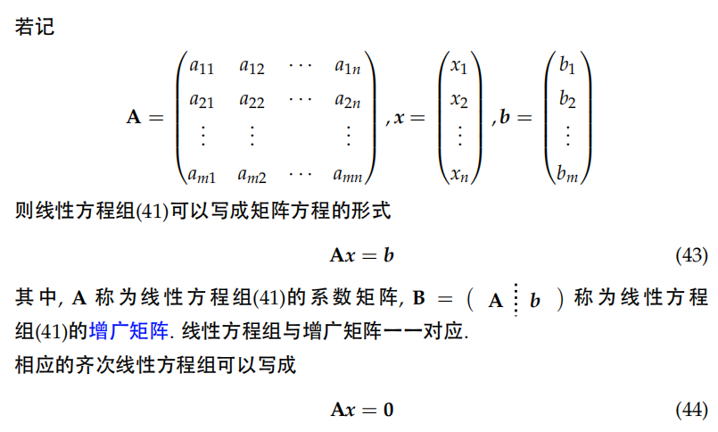

**线性方程组的初等变换（初等变换的实质是高斯消元过程）：**
> 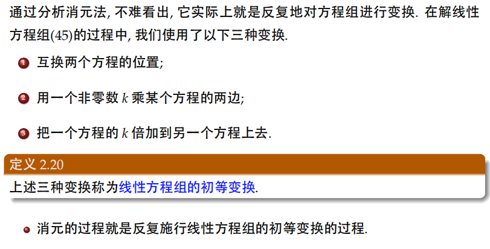
> **例题：**
> 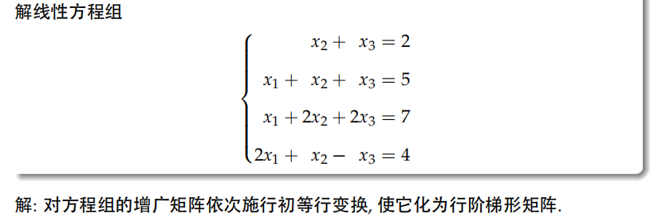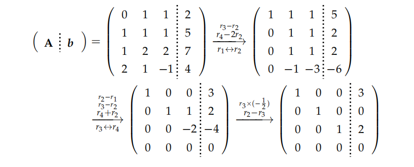

**非齐次线性方程组有解判别法：**
> 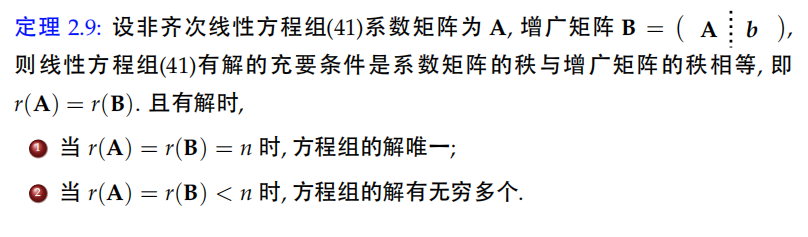

**齐次线性方程组的有解判别法：**

> 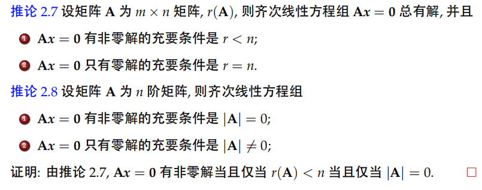可以这样理解：当齐次线性方程组的系数矩阵列满秩，则必有$x_{n}=0$，那么只存在零解。