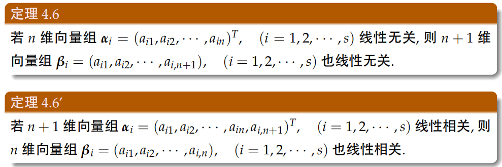

# 1. 向量的数量积（内积）
**定义：**
> 

**性质：**
> 

**坐标表达式：**
> 

# 2. 向量的向量积（外积）
**定义：**
> 

**性质：**
> 

**坐标表达式：**
> 

# 3. 向量的混合积
**定义：**
> 

**性质：**
> 

**坐标表达式：**
> 

# 4. 向量组的线性相关性（重要）
**线性组合：**
> 

**线性表示的充要条件：**
> 

**线性相关：**
> 
> **线性相关的一组向量中：某一向量一定可以被其余的线性无关的量唯一表示：**
> **部分向量线性相关，整体向量必然线性相关；整体向量组线性无关部分向量组必然线性无关：****n维向量组线性无关，n+1维向量必然线性无关；n+1维向量组线性相关，n维向量线性相关**

# 5. 向量组的秩
**向量组的等价：**
> 

**极大线性无关组：**
> 

**向量组的秩：反映向量组线性相关性本质的量**
> 
> **矩阵的行向量秩=矩阵的列向量秩=矩阵的秩，矩阵的秩和向量组的秩是一种等价形式。只不过二者反应的对象不同。**
> - 矩阵的秩反应其k阶子式最高阶数。
> - 向量的秩反应极大线性无关组元素的个数.

# 6. 向量空间的基和维数
> 
> **过渡矩阵和基变换公式：**
> $C=XY^{-1}$

# 7. 向量空间的正交性
**向量正交的定义**
> 向量之间的内积为0，即点积为0，$\alpha \cdot \beta = 0$

**正交基：**
> 设$\alpha_{1},\alpha_{2},\cdots,\alpha_{n}$是$R^{n}$的一个基，如果它们两两正交，则称其为$R^{n}$的一个**正交基**。如果每个向量都是单位向量，则称为**标准正交基**。

**求标准正交基的方法：施密特方法**
> 任意的线性无关向量组都可以找到一个标准正交基，这种方法叫做**施密特正交化方法**。具体而言，根据正交的性质，**向量的内积为0**，以此作为条件，解方程，得到标准正交基。

**正交矩阵：**

> 如果$n$阶矩阵$A$满足$AA^{T}=A^{T}A=I$，则$A$为正交矩阵。$n$阶实矩阵$A$是正交矩阵的充要条件是$A$的**列向量组**是$R^{n}$的一个**标准正交基**。