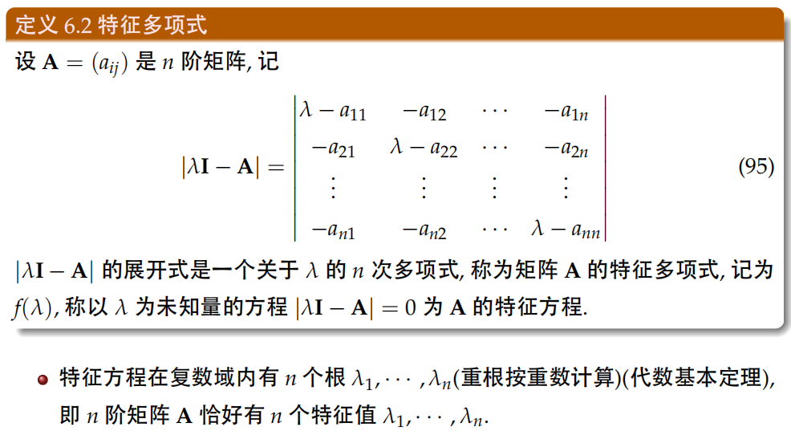

# 1. 特征值与特征向量
**定义：**
> **注意：只有方阵具有特征值与特征向量，不同特征值所对应的特征向量之间线性无关**

**如何理解特征值与特征向量？（重要）**
> **形象的例子：**如果把矩阵看作运动的话，那么
> - 特征值就是运动的速度
> - 特征向量是运动的方向
>
> 对于方阵而言，矩阵不会在维度上进行伸缩，所以矩阵的运动实际上只有两种：**旋转和拉伸**，最后运动的结果（矩阵的运动表现在乘以任意一个向量，列向量的方向和长度是矩阵运动的表现形式）就是这两种的合成。接下来讨论这两种具体的运动方式在矩阵的运算如何体现：
>
> - **旋转与拉伸**：通过矩阵相似对角化分解，可以得到：
> $$A = PBP^{-1}
> $$其中B为对角阵,**$P$的列向量是单位化的特征向量，并且互相正交**。
> 对角阵B决定了各个方向的**拉伸大小**，而P决定了**旋转变化**
> 
> - 特征值指明了拉伸大小；
> - 特征向量指明了拉伸的方向。（特征向量都是一组组**标准正交基**）

 **几何意义：**
> 

**特征多项式：用于求特征值**
> 

**特征向量的求解：**
> 

**方阵的迹与行列式：**
> 

# 2. 相似矩阵
**矩阵相似关系的定义：**
> 

**相似矩阵的性质：拥有相同的特征多项式和特征值**
> 

# 3. 矩阵对角化
**可对角化定义：矩阵可相似于一个对角阵**
> 

**矩阵可对角化充要条件：1. n阶矩阵有n个线性无关的特征向量**
> **矩阵P为特征列向量组，对角阵的迹为n个特征值。**
>
> **推论：若n阶矩阵A具有n个不同的特征值，则A可相似对角化。**

**矩阵可对角化充要条件：2. n阶矩阵每个拥有ni个线性无关的特征向量，其中ni是第i个特征值的重数**
> 

**矩阵相似对角化的重要应用：求矩阵的幂**
> **幂等式：**若$A$可相似对角化，设$A=P \Lambda P^{-1}$，则
> $$A^{n}=(P\Lambda P^{-1})^{n}=(P\Lambda P^{-1})(P\Lambda P^{-1})\cdots (P\Lambda P^{-1})=P\Lambda^{n} P^{-1}
> $$上式可根据矩阵乘法的交换律，让$P$和$P^{-1}$相乘。
>
> **例题**：
> 

# 4. 实对称矩阵的对角化
**共轭矩阵：**
> **易知：实矩阵等于他的共轭$**

**实对称矩阵的特征值和特征向量：对称矩阵$A=A^{T}$**
> 

**实对称矩阵的对角化：**

> 