二次型的研究与解析几何中化二次曲面方程为标准型的问题密切相关。

# 1. 二次型

**定义：**
> 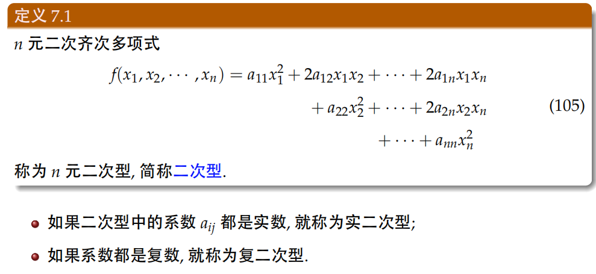

**二次型的矩阵表达式：**
> 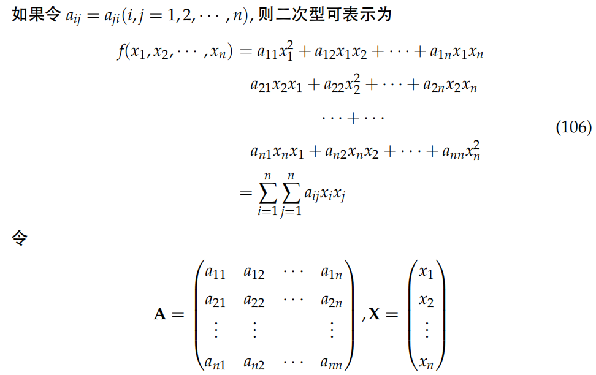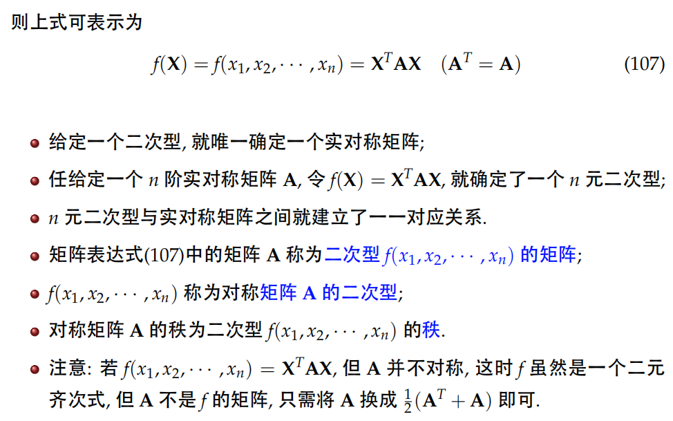

**二次型的可逆线性变换：二次型经过可逆线性变换后仍是二次型**
> 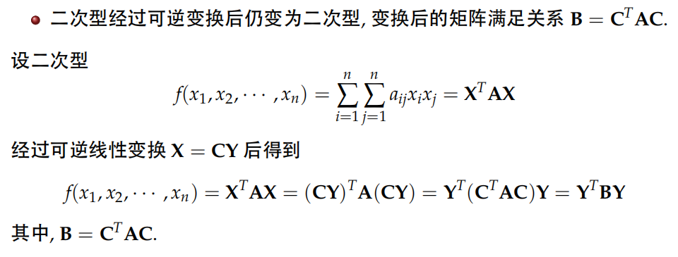

**矩阵的合同关系：$B=C^{T}AC\rightarrow B\simeq A$**
> 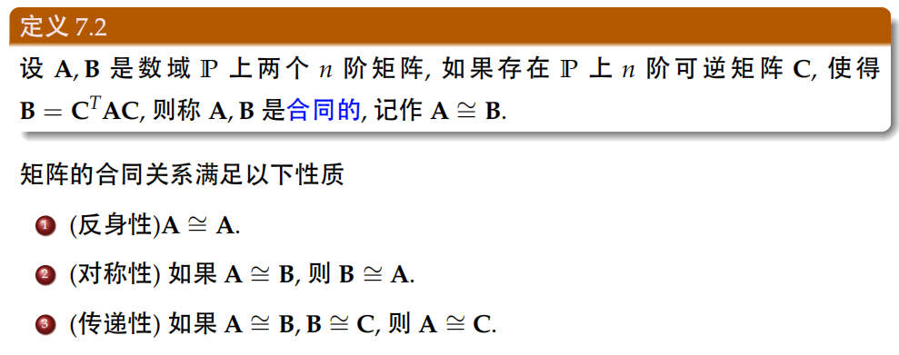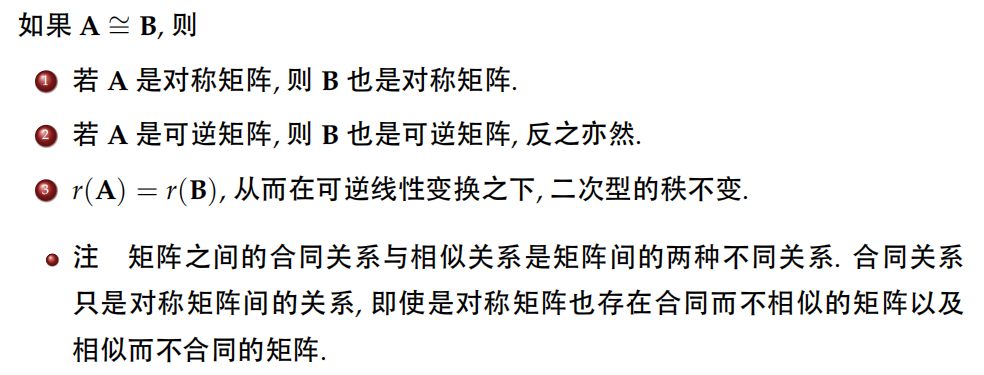

# 2. 二次型的标准型、以及化为标准型的方法
**定义：**
> 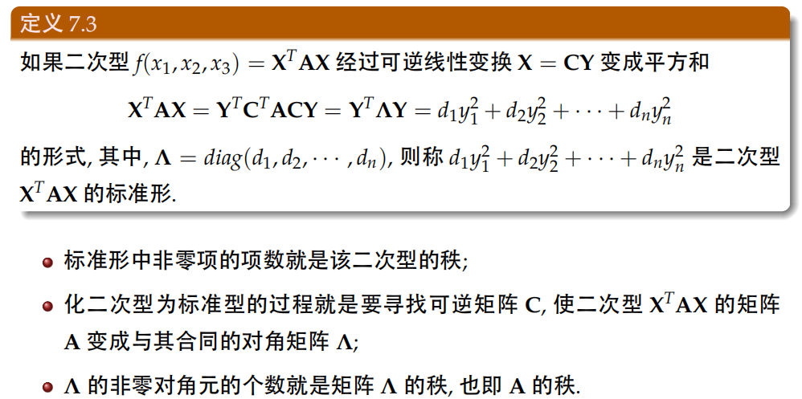

**配方法：将任意的二次型通过可逆线性变换化为标准型**
> **例题：**
> 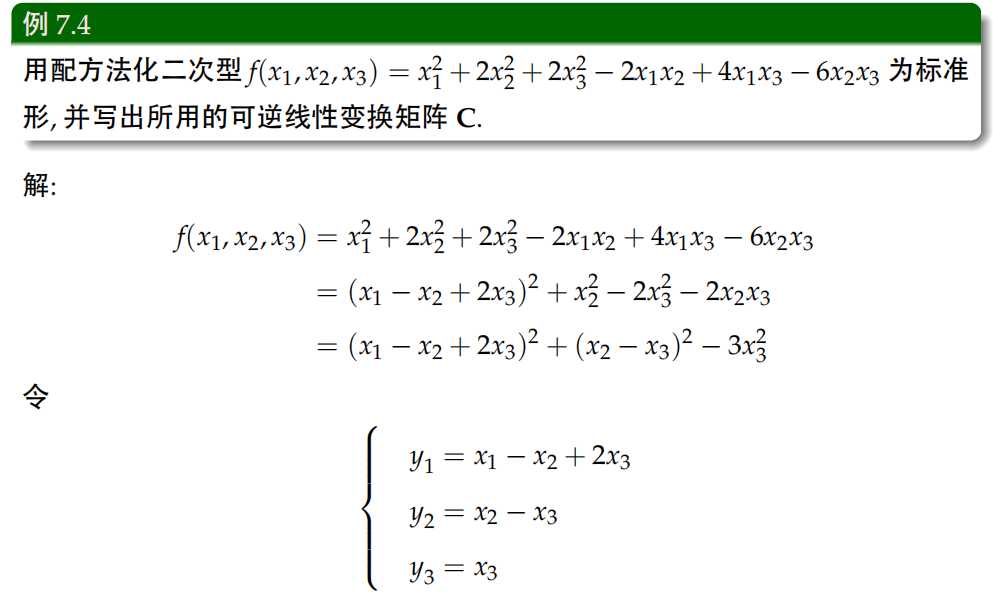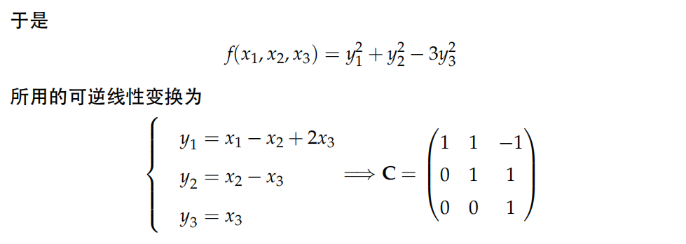

**正交变换法：将任意的二次型通过正交线性变换化为标准型**
> 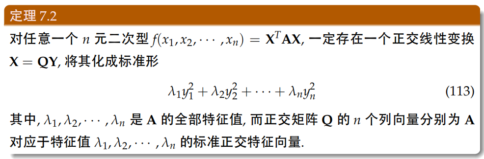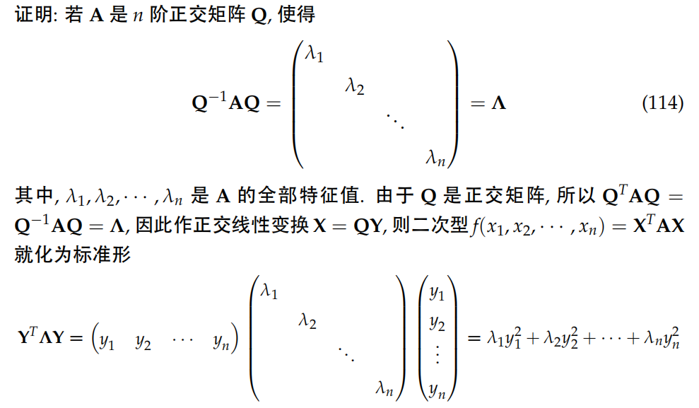**注：标准正交矩阵$A$有如下的性质：$A^{-1}=A^{T}$**

# 3. 二次型的规范性以及正定
**二次型的规范性定义：将二次型的系数全化为1或-1**
> 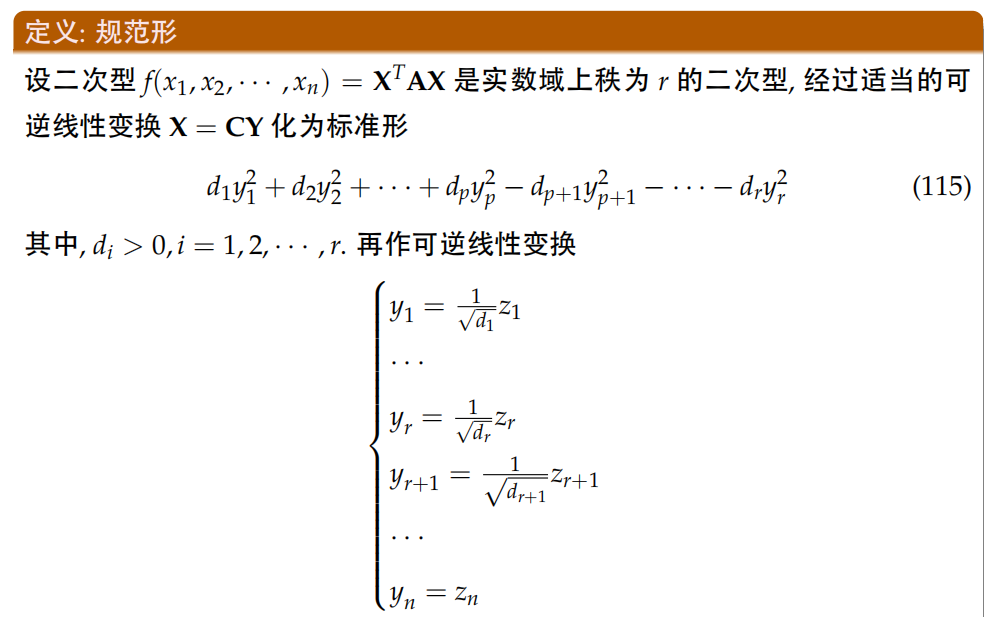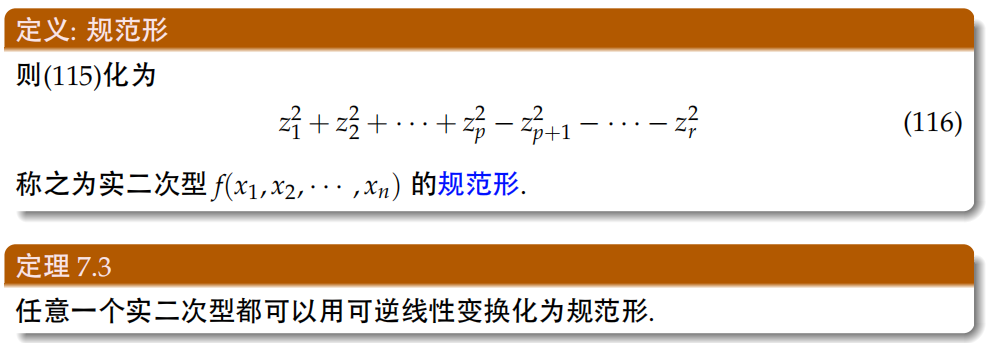

**惯性定理：二次型的规范型唯一**
> 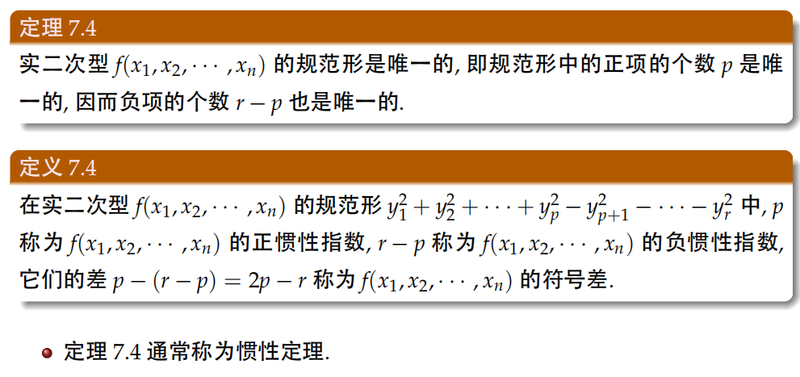

**正定二次型定义：其标准二次型的系数都为正数，或系数矩阵A的特征值都为正数，或其正惯性指数为n**
> 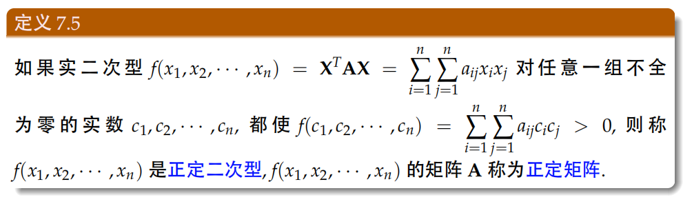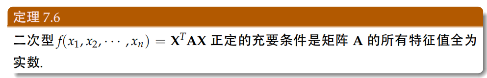

**正定二次型与正定矩阵的判别：**

> 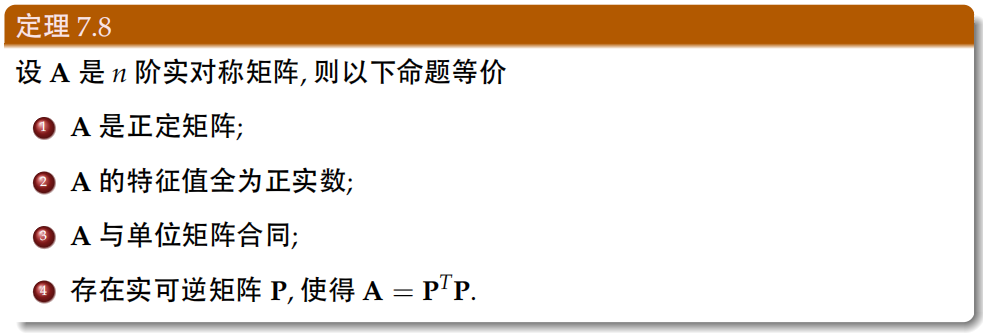