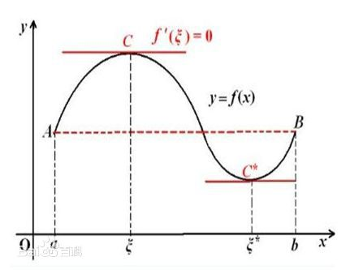
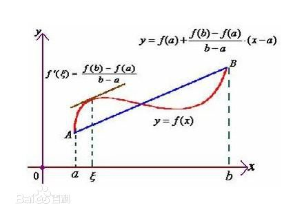
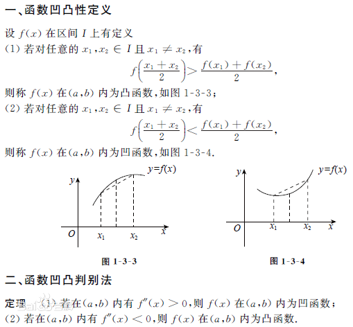

## 1. 微分中值定理
### 1.1 费马定理
### 1.1.1 极值定义
> 设函数$f(x)$在区间$I$上有定义，点$x_{0}\in I$，若存在点$x_{0}$的邻域$(x_{0}-\delta, x_{0}+\delta)$，使得对一切的$x\in(x_{0}-\delta, x_{0}+\delta)$，有
$$
f(x)\le f(x_{0})或f(x)\ge f(x_{0})
$$
称$x_{0}$在区间$I$的极大值或极小值。
### 1.1.2 费马定理定义
>  若函数$f(x)$在点$x_{0}$处取得极值，并且可微，则$f'(x_{0})=0$

**注：该定理只是取得极值的必要条件，而非充分条件，即导数等于0，不一定推出该点就是极值点。**
### 1.2 罗尔定理
> 设函数$f(x)$在$[a,b]$连续，在$(a,b)]$可微，且$f(a) = f(b)$，则$\exists \varepsilon \in (a,b),f'(\varepsilon)=0$。

**注：连续和可微条件不能少**
几何解释：

### 1.3 拉格朗日中值定理
> 若函数$f(x)$在$[a,b]$连续，在$(a,b)]$可微，则
$$
\exists \varepsilon \in (a,b),f'(\varepsilon)=\frac{f(b)-f(a)}{b-a}
$$

几何解释：对于一个在某区间连续可微的函数，一定存在一点的导数与区间端点连线的斜率相等。

### 1.4 柯西中值定理
引例：若曲线$y=f(x)$由参数方程$x=\phi(t),y=\varphi(t),a\le t\le b$，其中曲线的端点$A,B$分别对应于参数$t=a,t=b$即$A(\phi(a),\varphi(a)),B(\phi(b),\varphi(b))$，则根据拉格朗日定理得到
$$
\exists \varepsilon \in (a,b)，\frac{\varphi(b)-\varphi(a)}{\phi(b)-\phi(a)}=\frac{\varphi'(\varepsilon)}{\phi'(\varepsilon)}
$$
> 设函数$f(x)$和$g(x)$在$[a,b]$连续，在$(a,b)]$可微，且$g'(x)\ne 0$，则
> $$\exists \varepsilon \in (a, b),  \frac{ f(b)-f(a) }{ g(b)-g(a)}= \frac{f'( \varepsilon)}{g'(\varepsilon)} $$

## 2. L'Hospital法则
用于求$\frac{0}{0}$和$\frac{\infty}{\infty}$的极限。
> 设函数$f(x)$和$g(x)$满足：
> - $\lim_{x\rightarrow a}f(x)= \lim_{x\rightarrow a}g(x)=0$
> - 在点$a$的某个邻域内，$f'(x)和g'(x)$都存在，且$g'(x)\ne 0$
> - $\lim_{x\rightarrow a} \frac{f'(x)}{g'(x)}=k(有限或无穷)$
> 则
> $$\lim_{x\rightarrow a} \frac{f(x)}{g(x)}= \lim_{x\rightarrow a} \frac{f'(x)}{g'(x)}=k$$
**$0\cdot \infty,\infty - \infty,0^{0},\infty^{0},1^{\infty}$型极限**：
- $0\cdot \infty$：取倒数转为$0\cdot 0$
- $\infty - \infty$：分别取倒数，相加合并分式
- $0^{0},\infty^{0},1^{\infty}$：$y=f(x)^{g(x)}$型转为$y=e^{g(x)\ln f(x)}$

## 3. 泰勒公式
在分析函数的某些局部性质时，通常是在这个局部范围内用一些简单的函数去近似替代较为复杂的函数。而多项式函数是最简单的一种函数，只需要进行加减乘除即可，因此，我们常用多项式函数来近似表达复杂函数。
### 3.1 泰勒多项式
 使用多项式形式近似替代函数$f(x)$
> 设$f(x)$在含有$x_{0}$的开区间内有直到$n+1$的导数，我们使用下面的$n$次多项式来近似表达函数$f(x)$
> $$P_{n}(x)=a_{0}+a_{1}(x-x_{0})+a_{2}(x-x_{0})^{2}+\cdots +a_{n}(x-x_{0})^{n}
> $$要求它们之间的误差是$(x-x_{0})^{n}$的高阶无穷小，即
> $$f(x)-P_{n}(x)=o((x-x_{0})^{n})
> $$其次就要确定合适的系数$a_{0},\cdots,a_{n}$，近似函数应满足以下条件：
> $P_{n}^{(i)}(x_{0})=f^{(i)}(x_{0}),i=0, 1,\cdots,n$，即要求多项式函数的在$x_{0}$的$0\sim n$阶导数都应等于原函数在$x_{0}$的$0\sim n$阶导数。将上述$n$个方程带入原方程得到：
> $$a_{0}=f(x_{0}),a_{1}=f'(x_{0}),a_{2}=\frac{f''(x_{0})}{2},\cdots,a_{n}=\frac{f^{(n)}(x_{0})}{n!}
> $$得到
> $$P_{n}(x)=f(x_{0})+f'(x_{0})(x-x_{0})+\frac{f''(x_{0})}{2}(x-x_{0})^{2}+\cdots +\frac{f^{(n)}(x_{0})}{n!}(x-x_{0})^{n}
> $$上式为$f(x)$在$x_{0}$的$n$阶泰勒多项式。
### 3.2 泰勒中值定理
泰勒中值定理本质上：使用多项式函数加上一个**高阶无穷小项**来近似替代原函数。
> - 设函数$f(x)$在某一区间$I$上有直到$n + 1$阶导数，而$x_{0}\in I$，则对$\forall x\in I$，$f(x)$可按$x-x_{0}$的方幂展开：$$\begin{split}
> f(x)&=f(x_{0})+f'(x_{0})(x-x_{0})+\frac{f''(x_{0})}{2}(x-x_{0})^{2}+\cdots +\\
> &\frac{f^{(n)}(x_{0})}{n!}(x-x_{0})^{n}+\frac{f^{(n+1)}(\varepsilon)}{(n+1)!}(x-x_{0})^{n+1}
> \end{split}
> $$其中$\varepsilon \in [x_{0},x]$，$R_{n}(x)=\frac{f^{(n+1)}(\varepsilon)}{(n+1)!}(x-x_{0})^{n+1}$为$(x-x_{0})^{n}$的高阶无穷小，称为**拉格朗日型余项。**
>
> - 在不需要余项精确展开的情况下，$n$阶泰勒公式也可以写为：
> $$\begin{split}
> f(x)&=f(x_{0})+f'(x_{0})(x-x_{0})+\frac{f''(x_{0})}{2}(x-x_{0})^{2}+\cdots +\\
> &\frac{f^{(n)}(x_{0})}{n!}(x-x_{0})^{n}+o[(x-x_{0})^{n}].
> \end{split}
> $$其中$o[(x-x_{0})^{n}]$为**佩亚诺余项**。
>
> - 当$x_{0}=0$时，带入$n$阶泰勒公式可以得到**麦克劳林**公式：$$f(x)=f(0)+f'(0)x+\frac{f''(0)}{2}x^{2}+\cdots +
>   \frac{f^{(n)}(0)}{n!}x^{n}+o(x^{n})$$

## 3.3 基本初等函数的麦克劳林公式
- $f(x)=e^{x}$
$$e^{x}=1+x+\frac{x^{2}}{2!}+\cdots +\frac{x^{n}}{n!} + o(x^{n+1})$$

- $f(x)=\sin x$
$$\sin x=x-\frac{x^{3}}{3!}+\frac{x^{5}}{5!}-\cdots+(-1)^{m-1}\frac{x^{2m-1}}{(2m-1)!}+o(x^{2m})$$
- $f(x)=\cos x$
$$\cos x=1-\frac{x^{2}}{2!}+\frac{x^{4}}{4!}-\cdots+(-1)^{m-1}\frac{x^{2m-2}}{(2m-2)!}+o(x^{2m})$$

- $f(x)=(1+x)^{\alpha}$
$$(1+x)^{\alpha}=1+\alpha x+\frac{\alpha(\alpha -1)}{2!}x^{2}+\cdots +\frac{\alpha(\alpha -1)\cdots (\alpha -n+1)}{n!}x^{n}+o(x^{n+1})
$$

## 4. 函数的单调性和极值
### 4.1 单调性
> 设函数在$[a,b]$上连续， 在$(a,b)$上可导。
> (1). 如果在$(a,b)$内$f'(x)>0$，那么函数在$[a,b]$上单调增加。
> (2). 如果在$(a,b)$内$f'(x)<0$，那么函数在$[a,b]$上单调减少。
### 4.2 驻点
> 设函数$y=f(x)$在$x_{0}$可微且有$f'(x_{0})=0$，则称点$x_{0}$为函数$y=f(x)$的驻点。
### 4.3 函数的极值判断
> **第一充分条件：**设函数 $y=f(x)$在点$x_{0}$连续，且在$x_{0}$的某个去心邻域内可导，
> - 若 $x\in (x_{0}-\delta, x_{0})$时，$f'(x)>0$，而$x\in (x_{0}, x_{0}+\delta)$时，$f'(x)<0$，则$f(x)$在点$x_{0}$取得极大值。
> - 若 $x\in (x_{0}-\delta, x_{0})$时，$f'(x)<0$，而$x\in (x_{0}, x_{0}+\delta)$时，$f'(x)>0$，则$f(x)$在点$x_{0}$取得极小值。
> - 若$x\in U^{*}(x_{0},\delta)$ ，$f'(x)$的符号不变 ，则$f(x)$在点$x_{0}$无极值。

> **第二充分条件：**设函数$y=f(x)$在点$x_{0}$处有二阶导数且，$f'(x_{0})=0,f''(x_{0})\ne 0$，那么
> - 当$f''(x)<0$(导函数单调递减，函数图形的切线斜率单调递减)，函数$f(x)$在点$x_{0}$取得极大值。
> - 当$f''(x)>0$(导函数单调递增，函数图形的切线斜率单调增加)，函数$f(x)$在点$x_{0}$取得极小值。

**第一充分条件和第二充分条件结合函数图形理解**
## 5. 函数图像的描述
### 5.1 凹凸性

### 5.2 拐点
> 函数图像凹凸性发生变化的点。
> **如何求拐点呢？**：
> - 若拐点处导数存在，则拐点处必有函数的二阶导数为0。
> (1). 求$f''(x)$
> (2). 令$f''(x)=0$，解出其实根，并求出$f''(x)$不存在的点
> (3). 对于(2)中两种类型的点，检验两侧的二阶导数值是否异号，若异号，则是拐点，否则不是。
## 5.3 渐近线
> - 水平间渐近线：若$\lim_{x\rightarrow \infty}f(x)=C$，则$y=C$为$f(x)$的水平渐近线。
> - 垂直渐近线：若$\lim_{x\rightarrow a}f(x)= \infty$，则$x=a$为$f(x)$的垂直渐近线。
> - 斜渐近线：若$\lim_{x\rightarrow \infty}\frac{f(x)}{x}= k,\lim_{x\rightarrow \infty}(f(x)-kx) = b$，则$y=kx+b$为$f(x)$的斜渐近线。