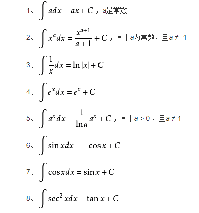
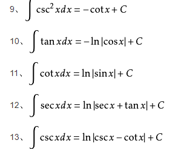

## 1. 原函数的概念
> 在区间$I$上，可导函数$F(x)$的导函数位$f(x)$，即在区间I上满足：
> $$F'(x)=f(x)或 dF(x)=f(x)dx
> $$则称函数$F(x)$为函数$f(x)$上的原函数

**如果函数 $f(x)$在区间$I$上连续，那么在区间$I$必存在原函数**
## 2. 不定积分的概念
> 在区间$I$上，函数$f(x)$所有的原函数集合称为该函数在区间$I$上的不定积分，记作$\int f(x)dx$
## 3. 基本积分公式

