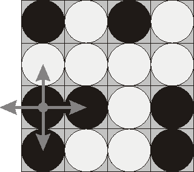
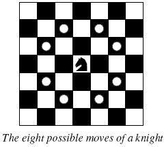
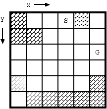
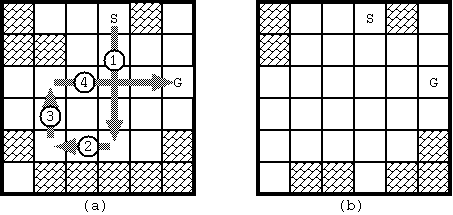

#### 1. 题目列表

- POJ1753（
- 状态空间思想，简单深搜）
- POJ2965（同1753）
- POJ1573（深搜遍历 二维网格）
- POJ2488（深搜遍历+路径打印，注意设置深搜深度） **重要**
- POJ3083（拐弯DFS + BFS）
- POJ3009（直线DFS、当map可能修改时，如何DFS）
- POJ1321
- POJ2251

#### 2. 深搜问题思路
深搜问题一般可以描述为从问题的初始状态到目标状态找到一个可行解（最优解），如寻找方案个数，最优的方案等，有以下几个点需要关注
- 问题的初始状态和目标状态
- 状态转移的操作
- 如何高效的进行搜索（剪枝）
- 如何记录搜索路径
- 搜索空间的大小，是否会超时
####3. POJ1753——Flip Game
Description

Flip game is played on a rectangular 4x4 field with two-sided pieces placed on each of its 16 squares. One side of each piece is white and the other one is black and each piece is lying either it's black or white side up. Each round you flip 3 to 5 pieces, thus changing the color of their upper side from black to white and vice versa. The pieces to be flipped are chosen every round according to the following rules: 

1.  Choose any one of the 16 pieces. 

2.  Flip the chosen piece and also all adjacent pieces to the left, to the right, to the top, and to the bottom of the chosen piece (if there are any).



Consider the following position as an example: 

bwbw 
wwww 
bbwb 
bwwb 
Here "b" denotes pieces lying their black side up and "w" denotes pieces lying their white side up. If we choose to flip the 1st piece from the 3rd row (this choice is shown at the picture), then the field will become: 

bwbw 
bwww 
wwwb 
wwwb 
The goal of the game is to flip either all pieces white side up or all pieces black side up. You are to write a program that will search for the minimum number of rounds needed to achieve this goal. 

Input

The input consists of 4 lines with 4 characters "w" or "b" each that denote game field position.

Output

Write to the output file a single integer number - the minimum number of rounds needed to achieve the goal of the game from the given position. If the goal is initially achieved, then write 0\. If it's impossible to achieve the goal, then write the word "Impossible" (without quotes).

Sample Input
```
bbwb
bwwb
bwww
```
Sample Output
```
4
```
#####3.1 思路
该题目已经固定了棋盘的大小，因此每一种棋子有两种状态分别是翻转或不翻转，显然易见的思路是使用深搜，搜索每一个棋子的状态，直到找到可行解
#####3.2 代码
```
#include <cstdio>
#include <cmath>
#include <cstring>
#include <algorithm>
#include <vector>
#include <queue>

using namespace std;

char chess[10][10];
int status[2] = {1, 0};
int MIN = 100; 
vector<int> res; 

int X[4] = {-1, 1, 0, 0};
int Y[4] = {0, 0, -1, 1};

bool judge(){
	int sum1 = 0, sum2 = 0;
	for (int i = 1; i <= 4 ;i++)
		for (int j = 1; j <= 4; j++){
			if (chess[i][j] == 'w')
				sum1 ++;
			else sum2++;
		}
	if (sum1 == 16 || sum2 == 16)
		return true;
	else
		return false;
}

void flip(int k){
	// 翻转第k个棋子
	int x = (int)ceil(k / 4.0); // 注意加强制类型转换和小数除法 
	int y = k - (x - 1) * 4;
	
//	printf("第%d个棋子位置(%d,%d)\n", k, x, y);
	chess[x][y] = (chess[x][y] == 'w' ) ? 'b' : 'w';
	for(int i = 0; i < 4; i++){
		int newX = x + X[i];
		int newY = y + Y[i];
		if (newX >= 1 && newX <= 4 && newY >=1 && newY <= 4){
			chess[newX][newY] = (chess[newX][newY] == 'w') ? 'b' : 'w';
		}
	}
}
void DFS(int k, int step){ // 16个棋子，每个棋子2种状态 
	if (judge()){ //是否达到目标状态 
		if (step < MIN)
			MIN = step;
		return;
	}
	if (k > 16) return;
	flip(k); // 翻转 
	DFS(k + 1, step + 1); // 深搜 
	flip(k); //恢复
	DFS(k + 1, step); 
}

void output(){
	for(int i = 1; i <= 4 ;i++){
		for(int j = 1; j <= 4; j++)
			printf("%c",chess[i][j]);
		printf("\n");
	}
}
int main(){
	
	for (int i = 1; i <= 4; i++){ 
		for(int j = 1; j <= 4; j++){
			// 或者使用 scanf("%s", chess[i]) 
			scanf("%c",&chess[i][j]); // %c输入不能输入换行的数据 
		}
		// 跳过\n输入
		getchar(); 
	} 
//	flip(6);
//	printf("after:\n");
//	output();
//	flip(6);
//	printf("restore:\n");
//	output();
	if (judge()){
		printf("%d\n",0);
		return 0;
	}
	DFS(1, 0);
	if (MIN > 16)
		printf("Impossible\n");
	else{
		printf("%d\n",MIN);
	}
	return 0;
}
```
**注意：**
- 在使用scanf("%c")输入的时候会把\n也作为输入，可以使用getchar()来跳过\n
- 在使用数学函数时，应注意参数是double类型，返回值也是double类型，若要返回int，则需要强制转换。如(int)ceil(1 / 4.0)若不强制转换，则输出0
- 记住深搜的常见模板

#### 4. POJ2965——The Pilots Brothers' refrigerator
##### 4.1 题目描述
Description

The game “The Pilots Brothers: following the stripy elephant” has a quest where a player needs to open a refrigerator.

There are 16 handles on the refrigerator door. Every handle can be in one of two states: open or closed. The refrigerator is open only when all handles are open. The handles are represented as a matrix 4х4. You can change the state of a handle in any location [i, j] (1 ≤ i, j ≤ 4). However, this also changes states of all handles in row i and all handles in column j.

The task is to determine the minimum number of handle switching necessary to open the refrigerator.

Input

The input contains four lines. Each of the four lines contains four characters describing the initial state of appropriate handles. A symbol “+” means that the handle is in closed state, whereas the symbol “−” means “open”. At least one of the handles is initially closed.

Output

The first line of the input contains N – the minimum number of switching. The rest N lines describe switching sequence. Each of the lines contains a row number and a column number of the matrix separated by one or more spaces. If there are several solutions, you may give any one of them.

Sample Input
```
-+--
----
----
-+--
```
Sample Output
```
6
1 1
1 3
1 4
4 1
4 3
4 4
```
##### 4.2 思路
典型的搜索问题，每个handle有两种状态：open 和 closed，深度优先搜索每个handle的每个状态找到可行解。**可以使用vector来记录每个搜索点。**
##### 4.3 代码
```
#include <cstdio>
#include <cmath>
#include <vector>
#include <cstring>
#include <algorithm>

using namespace std;

struct Coor{
	int x;
	int y;
	Coor(int _x, int _y):x(_x), y(_y){
	}
};
char refre[10][10];
int MIN = 1e6;
vector<Coor> record;
vector<Coor> temp;

int cmp(Coor c1, Coor c2){
	if (c1.x == c2.x)
		return c1.y < c2.y;
	return c1.x < c2.x;
}


bool judge(){
	for (int i = 1; i <= 4; i++)
		for (int j = 1; j <= 4; j++)
			if (refre[i][j] != '-')
				return false;
	return true;
}

void change(int x, int y){
	refre[x][y] = (refre[x][y] == '+') ? '-' : '+';
	for (int i = 1; i <= 4; i++){
		// x这一行
		if (i == y) continue;
		refre[x][i] = (refre[x][i] == '+') ? '-' : '+';
	}
	for (int i = 1; i <= 4; i++){
		// y这一列
		if (i == x) continue;
		refre[i][y] = (refre[i][y] == '+') ? '-' : '+'; 
	}
}

void DFS(int x, int y, int step){
	if (judge()){
		// 如果当前成功了,并且更优
		if (step < MIN){
			MIN = step;
			record = temp;
			temp.pop_back();
		}
		return; 
	}
	if (x > 4 || y > 4) return;
	// 打开(x,y)
	change(x, y);
	temp.push_back(Coor(x,y));
	if (x != 4){
		DFS(x + 1, y, step + 1);  
	}else{
		DFS(1, y + 1, step + 1);	
	}
	// 还原(x,y)
	change(x, y);
	temp.pop_back();
	if (x != 4){
		DFS(x + 1, y, step);
	} else{
		DFS(1, y + 1, step);
	}
}

void output(){
	for (int i = 1; i <= 4; i++){
		for (int j = 1; j <= 4; j ++)
			printf("%c",refre[i][j]);
		printf("\n");
	}
} 

int main(){
	for (int i = 1; i <= 4; i++){
		for (int j = 1; j <=4 ;j++)
			scanf("%c", &refre[i][j]);
		getchar();
	}
	DFS(1, 1, 0);
//	printf("origin:\n");
//	output();
//	printf("after: \n");
//	change(1,1);
//	output();
//	printf("resfore: \n");
//	change(1,1);
//	output();
	printf("%d\n",MIN);
	sort(record.begin(), record.end(), cmp);
	for (int i = 0; i < record.size(); i++){
		printf("%d %d\n", record[i].x, record[i].y);
	}
	return 0;
} 
```
#### 5. POJ1573——Robot Motion
##### 5.1 题目描述
Description

<center>

</center>

A robot has been programmed to follow the instructions in its path. Instructions for the next direction the robot is to move are laid down in a grid. The possible instructions are 

N north (up the page) 
S south (down the page) 
E east (to the right on the page) 
W west (to the left on the page) 

For example, suppose the robot starts on the north (top) side of Grid 1 and starts south (down). The path the robot follows is shown. The robot goes through 10 instructions in the grid before leaving the grid. 

Compare what happens in Grid 2: the robot goes through 3 instructions only once, and then starts a loop through 8 instructions, and never exits. 

You are to write a program that determines how long it takes a robot to get out of the grid or how the robot loops around. 

Input

There will be one or more grids for robots to navigate. The data for each is in the following form. On the first line are three integers separated by blanks: the number of rows in the grid, the number of columns in the grid, and the number of the column in which the robot enters from the north. The possible entry columns are numbered starting with one at the left. Then come the rows of the direction instructions. Each grid will have at least one and at most 10 rows and columns of instructions. The lines of instructions contain only the characters N, S, E, or W with no blanks. The end of input is indicated by a row containing 0 0 0.

Output

For each grid in the input there is one line of output. Either the robot follows a certain number of instructions and exits the grid on any one the four sides or else the robot follows the instructions on a certain number of locations once, and then the instructions on some number of locations repeatedly. The sample input below corresponds to the two grids above and illustrates the two forms of output. The word "step" is always immediately followed by "(s)" whether or not the number before it is 1.
```
Sample Input
3 6 5
NEESWE
WWWESS
SNWWWW
4 5 1
SESWE
EESNW
NWEEN
EWSEN
0 0 0

Sample Output

10 step(s) to exit
3 step(s) before a loop of 8 step(s)
```
##### 5.2 解决思路
该问题的二维网格中定义了机器人前进的方向，它是一种典型的类似于走迷宫的问题，因此思路很直接，使用深度优先遍历，每次遍历计算当前的步数，并引入额外的数组存储当前位置的步数，出现循环的判断条件是当前步数不为0.
##### 5.3 代码
```
#include <cstdio>
#include <vector>
#include <algorithm>
#include <cstring>

using namespace std;
/*
	二维数组行走问题的常用方法DFS，
	递归的边界是判断是否越界，
	如果存在循环，则使用一个额外数组判断  
*/

const int maxn = 10010;
char g[maxn][maxn];
int steps[maxn][maxn], step, bstep, cstep, m, n, start;  
bool flag;

void DFS(int x, int y, int s){
	if(x < 1 || x > m || y < 1 || y > n){ // 递归边界 
		flag = true;
		return ;
	}
	step = s;
//	printf("step:%d\n", s);
	// 如果未进入循环
	if (steps[x][y] == 0){
		steps[x][y] = s; //更新当前步数
		switch(g[x][y]){ // 深度遍历 
			case 'N': DFS(x - 1, y, s + 1); break;
			case 'S': DFS(x + 1, y, s + 1); break;
			case 'W': DFS(x, y - 1, s + 1); break;
			case 'E': DFS(x, y + 1, s + 1); break;
		} 
	}else{
		// 进入循环
		bstep = steps[x][y] - 1;
		cstep = s - steps[x][y]; 
	}
}

void output(int m, int n){
	for (int i = 1; i <= m; i++)
	{
		for(int j = 1;j <= n;j++){
			printf("%c", g[i][j]);
		}
		printf("\n");
	 } 
}

int main(){
	while (~scanf("%d%d%d",&m, &n, &start) && m && n && start){
		flag = false;
		for(int i = 1; i <= m; i++){
			scanf("%s", g[i] + 1); // 注意从1下标开始存储
			fill(steps[i] + 1, steps[i] + 1 + n, 0); 
		}
//		output(m, n);
		DFS(1, start, 1);
		if (flag){
			printf("%d step(s) to exit\n", step);
		}else{
			printf("%d step(s) before a loop of %d step(s)\n", bstep, cstep);
		}
	}
} 
```
**注意：**
- 题目中的网格下标是从1开始，因此在初始化网格和步数数组时，需要从1开始初始化。
- 由于是一个cpp同时运行多个测试用例，在运行下一个测试用例时，所有定义的数据需要初始化，避免出现脏用。
- 进行DFS遍历时，如果记录DFS的中间结果，可添加全局变量。

#### 6. POJ 2488——A Knight's Journey
##### 6.1 题目描述
Description



**Background** 
The knight is getting bored of seeing the same black and white squares again and again and has decided to make a journey 
around the world. Whenever a knight moves, it is two squares in one direction and one square perpendicular to this. The world of a knight is the chessboard he is living on. Our knight lives on a chessboard that has a smaller area than a regular 8 * 8 board, but it is still rectangular. Can you help this adventurous knight to make travel plans? 

**Problem** 
Find a path such that the knight visits every square once. The knight can start and end on any square of the board.

Input

The input begins with a positive integer n in the first line. The following lines contain n test cases. Each test case consists of a single line with two positive integers p and q, such that 1 <= p * q <= 26\. This represents a p * q chessboard, where p describes how many different square numbers 1, . . . , p exist, q describes how many different square letters exist. These are the first q letters of the Latin alphabet: A, . . .

Output

The output for every scenario begins with a line containing "Scenario #i:", where i is the number of the scenario starting at 1\. Then print a single line containing the lexicographically first path that visits all squares of the chessboard with knight moves followed by an empty line. The path should be given on a single line by concatenating the names of the visited squares. Each square name consists of a capital letter followed by a number. 
If no such path exist, you should output impossible on a single line.

```
Sample Input

3
1 1
2 3
4 3

Sample Output

Scenario #1:
A1

Scenario #2:
impossible

Scenario #3:
A1B3C1A2B4C2A3B1C3A4B2C4
```
##### 6.2 解决思路
	   题意：一个骑士在棋盘中的移动操作定义为：向某个方向移动两格，
	然后拐个弯（日字形跳马）。给定一个棋盘，判断骑士是否可以遍历该棋盘中所有的格子，
	如果能，则按字典顺序输出路径，如果不能输出Impossible，骑士可以在任意一点开始。
	   思路：定义全局flag变量，在8个移动操作上进行深搜，当搜索的步数达到p * q，则成功。
	每次搜索的点保证未访问过且不越界。此外，可能包含多条路径，我们选择起点为A1，搜索8个移动
	的顺序也按字典排列。路径的记录使用一个path数组，每次记录搜索的点。
##### 6.3 代码
```
#include <cstdio>
#include <vector>
#include <cstring>
#include <algorithm>
using namespace std;

struct coor{
	int x, y;
}path[30 * 30]; // 记录路径 
bool visited[30][30]; // 记录访问点(x,y)的访问次数 
int p, q; // p * q
int X[8] = {-1, 1, -2, 2, -2, 2, -1, 1}; // 字典优先 
int Y[8] = {-2, -2, -1, -1, 1, 1, 2, 2}; 
bool flag;

void DFS(int x, int y, int step){
//	printf("当前访问：(%d,%d), step = %d\n", x, y, step);
	path[step].x = x, path[step].y = y; 
	if (step == p * q){
		flag = true;
		return;
	}
	
	// 移动操作
	for (int i = 0; i < 8; i++){
		int newX = x + X[i];
		int newY = y + Y[i];
		if (newX >= 1 && newX <=p && newY >= 1 && newY <= q && !visited[newX][newY] && !flag){ // 注意这里的条件，保证未被访问，且flag = false 
			visited[newX][newY] = true;
			DFS(newX, newY, step + 1);
			visited[newX][newY] = false; // 撤销 
		}
	} 
}

int main(){
	int T;
	scanf("%d",&T);
	for (int t = 1; t <= T; t++){
		flag = false;
		scanf("%d%d", &p, &q);
		// 字典顺序访问A1 
		memset(visited, false, sizeof(visited));
		visited[1][1] = true;
		DFS(1, 1, 1);
		printf("Scenario #%d:\n", t);
		if (flag){
			for (int i = 1; i <= p * q; i++){
				int x = path[i].x;
				char y = path[i].y + 'A' - 1;
				printf("%c%d", y, x);
			}
			if (t != T) 
				printf("\n");
		}else{
			printf("impossible\n");
		}
		printf("\n");
	}	
	return 0;
}
```
#### 7. POJ3083——Children of the Candy Corn
##### 7.1 问题描述
Description

The cornfield maze is a popular Halloween treat. Visitors are shown the entrance and must wander through the maze facing zombies, chainsaw-wielding psychopaths, hippies, and other terrors on their quest to find the exit. 

One popular maze-walking strategy guarantees that the visitor will eventually find the exit. Simply choose either the right or left wall, and follow it. Of course, there's no guarantee which strategy (left or right) will be better, and the path taken is seldom the most efficient. (It also doesn't work on mazes with exits that are not on the edge; those types of mazes are not represented in this problem.) 

As the proprieter of a cornfield that is about to be converted into a maze, you'd like to have a computer program that can determine the left and right-hand paths along with the shortest path so that you can figure out which layout has the best chance of confounding visitors.
Input

Input to this problem will begin with a line containing a single integer n indicating the number of mazes. Each maze will consist of one line with a width, w, and height, h (3 <= w, h <= 40), followed by h lines of w characters each that represent the maze layout. Walls are represented by hash marks ('#'), empty space by periods ('.'), the start by an 'S' and the exit by an 'E'. 

Exactly one 'S' and one 'E' will be present in the maze, and they will always be located along one of the maze edges and never in a corner. The maze will be fully enclosed by walls ('#'), with the only openings being the 'S' and 'E'. The 'S' and 'E' will also be separated by at least one wall ('#'). 

You may assume that the maze exit is always reachable from the start point.
Output

For each maze in the input, output on a single line the number of (not necessarily unique) squares that a person would visit (including the 'S' and 'E') for (in order) the left, right, and shortest paths, separated by a single space each. Movement from one square to another is only allowed in the horizontal or vertical direction; movement along the diagonals is not allowed.
```
Sample Input

2
8 8
########
#......#
#.####.#
#.####.#
#.####.#
#.####.#
#...#..#
#S#E####
9 5
#########
#.#.#.#.#
S.......E
#.#.#.#.#
#########
Sample Output

37 5 5
17 17 9
```
##### 7.2 解决思路
    题意: 在一个迷宫里，计算从出发点到终止点，分别以下面三种行走策略所需要的步数：
    1. 左转优先。可以回头。 DFS
    2. 右转优先。可以回头。	DFS
    3. 从起点到终点的最短路径。BFS（求到的第一个可行解即为最优解）
     在DFS时，注意设置标志，如果达到目标状态，则判断 flag，提前结束DFS
##### 7.3 代码
```
#include <cstdio>
#include <cstring>
#include <algorithm>
#include <vector>
#include <queue>
using namespace std;
/*
		题意: 在一个迷宫里，计算从出发点到终止点，分别以下面三种行走策略所需要的步数：
	1. 左转优先。可以回头。 DFS
	2. 右转优先。可以回头。	DFS
	3. 从起点到终点的最短路径。BFS（适合求最短路径） 
*/ 
const int maxn = 45;
struct Node{
	int x, y, step;
	Node(int _x, int _y, int _step): x(_x), y(_y), step(_step){
	}
};
int left = 0, right = 0, shortest = 0;
char g[maxn][maxn];
int m, n, sx, sy, direct, ex, ey;
bool lflag, rflag, flag, visited[maxn][maxn];

void LDFS(int x, int y, int d){ 
	/*
		d代表当前方向，0-上，1-左，2-下，3-右，
		左转优先的运动方向按朝向的左边顺时针旋转 
	*/ 
	if (x < 1 || x > m || y < 1 || y > n || g[x][y] == '#'){
		
		return;
	} 
	left ++;
//	printf("当前访问:(%d,%d),direct=%d,left=%d,\n",x,y,d,left);
	if (x == ex && y == ey){
		lflag = true;
		return;
	}
	if (d == 0){ // 朝上。按左、上、右下顺序，1，0，3，2 
		if (!lflag)
			LDFS(x, y - 1, 1); 
		if (!lflag)
			LDFS(x - 1, y, 0);
		if (!lflag)
			LDFS(x, y + 1, 3);
		if (!lflag)
			LDFS(x + 1, y, 2);
	}else if (d == 1){ // 朝左。按下、左、上右顺序，2，1，0，3 
		if (!lflag)
			LDFS(x + 1, y, 2);
		if (!lflag)
			LDFS(x, y - 1, 1);
		if (!lflag)
			LDFS(x - 1, y, 0);
		if (!lflag)
			LDFS(x, y + 1, 3);
	}else if (d == 2){ // 朝下。按右、下、左、上顺序，3，2，1，0 
		if (!lflag)
			LDFS(x, y + 1, 3);
		if (!lflag)
			LDFS(x + 1, y, 2);
		if (!lflag)
			LDFS(x, y - 1, 1);
		if (!lflag)
			LDFS(x - 1, y, 0);
	}else if (d == 3){ // 朝右。按上、右、下、左顺序，0，3，2，1 
		if (!lflag)
			LDFS(x - 1, y, 0);
		if (!lflag)	
			LDFS(x, y + 1, 3);
		if (!lflag)
			LDFS(x + 1, y, 2);
		if (!lflag)
			LDFS(x, y - 1, 1);
	}
}

void RDFS(int x, int y, int d){
	/*
		d代表当前方向，0-上，1-左，2-下，3-右，
		右转优先的运动方向按朝向的邮编逆时针旋转 
	*/ 
	if (x < 1 || x > m || y < 1 || y > n || g[x][y] == '#')
		return;
	right++;
	if (x == ex && y == ey){
		rflag = true;
		return;
	}
	if (d == 0){ //朝上。按3，0，1，2 
		if (!rflag)
			RDFS(x, y + 1, 3);
		if (!rflag)
			RDFS(x - 1, y, 0);
		if (!rflag)
			RDFS(x, y - 1, 1);
		if (!rflag)
			RDFS(x + 1, y, 2);
	}else if (d == 1){ // 朝左。按0，1，2，3 
		if (!rflag)
			RDFS(x - 1, y, 0);
		if (!rflag)
			RDFS(x, y - 1, 1);
		if (!rflag)
			RDFS(x + 1, y, 2);
		if (!rflag)
			RDFS(x, y + 1, 3);
	}else if (d == 2){ // 朝下。按1，2，3，0 
		if (!rflag)
			RDFS(x, y - 1, 1);
		if (!rflag)
			RDFS(x + 1, y, 2);
		if (!rflag)
			RDFS(x, y + 1, 3);
		if (!rflag)
			RDFS(x - 1, y, 0);
	}else if (d == 3){ // 朝右。按2，3，0，1 
		if (!rflag)
			RDFS(x + 1, y, 2);
		if (!rflag)
			RDFS(x, y + 1, 3);
		if (!rflag)
			RDFS(x - 1, y, 0);
		if (!rflag)
			RDFS(x, y - 1, 1);
	}
}

void BFS(){
	int X[4] = {-1, 1, 0, 0};
	int Y[4] = {0, 0, -1, 1};
 	memset(visited, false, sizeof(visited));
	queue<Node> q;
	q.push(Node(sx, sy, 1));
	visited[sx][sy] = true;
	while (!q.empty()){
		Node node = q.front();
		q.pop();
		if (node.x == ex && node.y == ey){
			shortest = node.step;
			return;
		}
		for (int i = 0; i < 4; i++){
			int newX = node.x + X[i];
			int newY = node.y + Y[i];
			if (newX >= 1 && newX <= m && newY >= 1 && newY <= n && g[newX][newY] != '#' && !visited[newX][newY]){
				q.push(Node(newX, newY, node.step + 1));
				visited[newX][newY] = true;
			}
		}
	}
}

void output(){
	for (int i = 1; i <= m; i++){
		printf("%s\n", g[i] + 1);
	}
}

int main(){
	int T;
	scanf("%d", &T);
	while (T--){
		scanf("%d%d", &n, &m);
		getchar();
		for (int i = 1; i <= m; i++){
			for (int j = 1; j <= n; j++){
				scanf("%c", &g[i][j]);
				if (g[i][j] == 'E'){
					ex = i, ey = j;
				}else if (g[i][j] == 'S'){
					// 初始方向 
					sx = i, sy = j;
					if (i == m) direct = 0;
					else if (i == 1) direct = 2;
					else if (j == 1) direct = 3;
					else if (j == n) direct = 1;
				}
			}
			getchar();
		}
//		output();
		left = 0, right = 0, shortest = 0, lflag = false, rflag = false;
		LDFS(sx, sy, direct);
		RDFS(sx, sy, direct);
		BFS();
		printf("%d %d %d\n", left, right, shortest);
	}
}
```
#### 8. POJ3009——Curling 2.0
##### 8.1 题目描述
Description

On Planet MM-21, after their Olympic games this year, curling is getting popular. But the rules are somewhat different from ours. The game is played on an ice game board on which a square mesh is marked. They use only a single stone. The purpose of the game is to lead the stone from the start to the goal with the minimum number of moves.

Fig. 1 shows an example of a game board. Some squares may be occupied with blocks. There are two special squares namely the start and the goal, which are not occupied with blocks. (These two squares are distinct.) Once the stone begins to move, it will proceed until it hits a block. In order to bring the stone to the goal, you may have to stop the stone by hitting it against a block, and throw again.



Fig. 1: Example of board (S: start, G: goal)

The movement of the stone obeys the following rules:

*   At the beginning, the stone stands still at the start square.
*   The movements of the stone are restricted to x and y directions. Diagonal moves are prohibited.
*   When the stone stands still, you can make it moving by throwing it. You may throw it to any direction unless it is blocked immediately(Fig. 2(a)).
*   Once thrown, the stone keeps moving to the same direction until one of the following occurs:
    *   The stone hits a block (Fig. 2(b), (c)).
        *   The stone stops at the square next to the block it hit.
        *   The block disappears.
    *   The stone gets out of the board.
        *   The game ends in failure.
    *   The stone reaches the goal square.
        *   The stone stops there and the game ends in success.
*   You cannot throw the stone more than 10 times in a game. If the stone does not reach the goal in 10 moves, the game ends in failure.

[图片上传失败...(image-875663-1565422235157)]

Fig. 2: Stone movements

Under the rules, we would like to know whether the stone at the start can reach the goal and, if yes, the minimum number of moves required.

With the initial configuration shown in Fig. 1, 4 moves are required to bring the stone from the start to the goal. The route is shown in Fig. 3(a). Notice when the stone reaches the goal, the board configuration has changed as in Fig. 3(b).



Fig. 3: The solution for Fig. D-1 and the final board configuration

Input

The input is a sequence of datasets. The end of the input is indicated by a line containing two zeros separated by a space. The number of datasets never exceeds 100.

Each dataset is formatted as follows.

> *the width(=w) and the height(=h) of the board* 
> *First row of the board* 
> ... 
> *h-th row of the board*

The width and the height of the board satisfy: 2 <= *w* <= 20, 1 <= *h* <= 20.

Each line consists of *w* decimal numbers delimited by a space. The number describes the status of the corresponding square.

> | 0 | vacant square |
> | 1 | block |
> | 2 | start position |
> | 3 | goal position |

The dataset for Fig. D-1 is as follows:

> 6 6 
> 1 0 0 2 1 0 
> 1 1 0 0 0 0 
> 0 0 0 0 0 3 
> 0 0 0 0 0 0 
> 1 0 0 0 0 1 
> 0 1 1 1 1 1

Output

For each dataset, print a line having a decimal integer indicating the minimum number of moves along a route from the start to the goal. If there are no such routes, print -1 instead. Each line should not have any character other than this number.

```
Sample Input

2 1
3 2
6 6
1 0 0 2 1 0
1 1 0 0 0 0
0 0 0 0 0 3
0 0 0 0 0 0
1 0 0 0 0 1
0 1 1 1 1 1
6 1
1 1 2 1 1 3
6 1
1 0 2 1 1 3
12 1
2 0 1 1 1 1 1 1 1 1 1 3
13 1
2 0 1 1 1 1 1 1 1 1 1 1 3
0 0

Sample Output

1
4
-1
4
10
-1
```
##### 8.2 解决思路
        题意：给定一个m*n的棋盘，a square 可以沿着水平或垂直方向移动，直到碰到blocks，
 	并且碰到block后，block消失，问是否可以在某个最小的步数将Square从S移动到G位置，
	如果可以，输出最小步数，如果不能，输出-1

		思路：深搜。初始状态(sx,sy)，目标状态(ex,ey)，操作：沿着上下左右一条直线运动
	直到遇到block或出界或到达目标位置G。
	
		注意：square移动的过程中，如果出界，即无任何block阻挡，则失败。如果从某一个点
	遇到下一个block停止返回的点 位置不变，则无效。在深搜时，如果对墙进行改变，深搜返回
	时一定记住还原。 
##### 8.3 代码
```
#include <cstdio>
#include <cstring>
#include <algorithm>
#include <vector>
using namespace std;

const int maxn = 100;
struct Node{
	int x, y, step;
	Node(int _x, int _y, int _step): x(_x), y(_y), step(_step){
	}
};
int m, n;
int g[maxn][maxn], MIN, sx, sy, ex, ey;

void DFS(int x, int y, int step){
	if (step > 10) return;
	if (x == ex && y == ey){
		if (step < MIN){
			MIN = step;
		}
		return;
	}
//	printf("当前访问:(%d,%d),step=%d\n", x, y, step);
	// 四个方向直线移动。
	// 上
	int nx, ny;
	bool flag = false;
	int i;
	for (i = x; i >= 1; i--){
		if (g[i][y] == 1){
			nx =  i + 1, ny = y;
			flag = true;
			break;
		}else if (g[i][y] == 3){
			nx = i, ny = y;
			break;
		}
	}
	if (i && !(nx == x && ny == y)){ // 如果不越界，且不返回 
		if (flag){
			g[nx - 1][y] = 0;
			DFS(nx, ny, step + 1);
			g[nx - 1][y] = 1; // 撤销 
		}else {
			DFS(nx, ny, step + 1);
		}
	}
	// 下
	flag = false;	
	for (i = x; i <= m; i++){
		if (g[i][y] == 1){
			nx = i - 1, ny = y;
			flag = true;
			break;
		} else if (g[i][y] == 3){
			nx = i, ny = y;
			break;
		}
	}
	if (i <= m && !(nx == x && ny == y)){
		if (flag){
			g[nx + 1][y] = 0;
			DFS(nx, ny, step + 1);
			g[nx + 1][y] = 1;
		}else{
			DFS(nx, ny, step + 1);
		}
	} 
	//左
	flag = false;
	for (i = y; i >= 1; i--){
		if (g[x][i] == 1){
			nx = x, ny = i + 1;
			flag = true;
			break;
		}else if (g[x][i] == 3){
			nx = x, ny = i;
			break;
		}
	} 
	if (i && !(nx == x && ny == y)){
		if (flag){
			g[x][ny - 1] = 0;
			DFS(nx, ny, step + 1);
			g[x][ny - 1] = 1;
		}else{
			DFS(nx, ny, step + 1);
		}
	}
	//右
	flag = false;
	for (i = y; i <= n; i++){
		if (g[x][i] == 1){
			nx = x, ny = i - 1;
			flag = true;
			break;
		}else if (g[x][i] == 3){
			nx = x, ny = i;
			break;
		}
	} 
	if (i <= n && !(x == nx && y == ny)){
		if (flag){
			g[x][ny + 1] = 0;
			DFS(nx, ny, step + 1);
			g[x][ny + 1] = 1;
		}else{
			DFS(nx, ny, step + 1);
		}
	}
}


int main(){
	
	while (~scanf("%d%d", &n, &m) && m && n){
		for (int i = 1; i <= m; i++)
			for (int j = 1; j <= n ; j++){
				scanf("%d", &g[i][j]);
				if (g[i][j] == 2)	sx = i, sy = j;
				else if (g[i][j] == 3) ex = i, ey = j;
			}
		MIN = 1e6;
		DFS(sx, sy, 0);
		if (MIN <= 10){
			printf("%d\n", MIN);
		}else{
			printf("-1\n");
		}
	}	
	return 0;
}
```