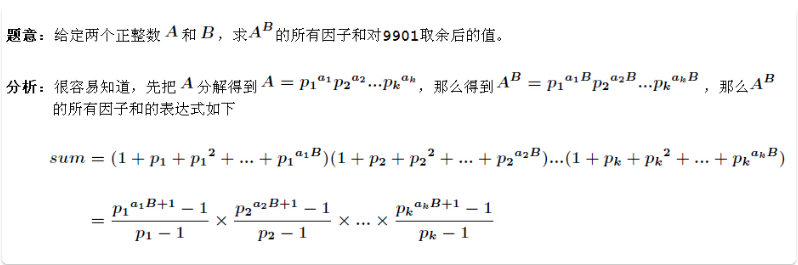
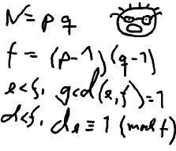

# 1. 题目列表
- POJ2635（高精度求模：同余模运算、Java大数）
- POJ3292（数筛 + 和的打表：树状数组）
- POJ1845（幂的因子和问题，质因子分解+快速幂+等比数列递归求和+同余）
- POJ2115（求解ax + by = c线性方程的整数解：扩展欧几里得算法）

# 2. 数论中三个算法
## 2.1 扩展欧几里得算法
**问题1：**求 $ax+by=gcd(a,b)$的所有整数解。

**扩展欧几里得算法：**当计算$gcd(a,b)$时，有$ax_{1} + by_{1} = gcd$成立，而在计算$gcd(b, a \% b)$时，有$bx_{2} + (a\%b)y_{2} = gcd$成立。因此$ax_{1} + by_{1} = bx_{2} + (a\%b)y_{2}$成立，而$a \% b = a - (a/b) * b$，则有$ax_{1} + by_{1} = ay_{2} + b(x_{2} - (a/b)y_{2})$成立，对比等号左右边有以下的递推公式
$$\begin{cases} x_{1}=y_{2}\\ y_{1}=x_{2}-(a/b)y_{2} \end{cases}
$$递归边界：当$b =0$时，$a$即为$gcd$，$x = 1, y = 0$是 $ax + by = gcd$的一组解。代码模板如下：
```
int exGcd(int a, int b, int& x, int& y){
	if (b == 0){ // 当 gcd(a, b) 当b=0，返回a 
		x = 1;
		y = 0;
		return a;
	}
	int g = exGcd(b, a % b, x, y); // 递归求gcd
	int temp = x; // 更新x和y 
	x = y;
	y = temp - (a / b) * y;
	return g; 
}
```
在得到这样的一组解之后，就可以通过下面的式子得到全部解：
$$\begin{split}x'=x+\frac{b}{gcd}*K \\ y'=y-\frac{a}{gcd}*K \end{split}(K为任意正整数)
$$也就是说，**$x$和$y$的所有解分别以$\frac{b}{gcd}$与$\frac{a}{gcd}$为周期**。此外，上述方程的**最小非负整数解**为
$$x_{min}^{+}=(x\%\frac{b}{gcd} + \frac{b}{gcd})\%\frac{b}{gcd}
$$
--- 
**问题2：**求解方程$ax+by=c$的所有整数解。

方程**$ax+by=c$存在解的充要条件是$c\%gcd =0$**，且一组解为$$
\begin{split} x=\frac{cx_{0}}{gcd},y=\frac{c y_{0}}{gcd} \end{split}
$$其中$x_{0}$和 $y_{0}$是方程$ax+by=gcd(a,b)$的一组解。因此$ax+by=c$的全部解的公式为
$$\begin{split} x'=x+\frac{b}{gcd}*K=\frac{cx_{0}}{gcd}+\frac{b}{gcd}*K ,\\ y'=y - \frac{a}{gcd}*K=\frac{cy_{0}}{gcd}-\frac{a}{gcd}*K \end{split} (K为正整数)
$$同样，**$x$和$y$的所有解分别以$\frac{b}{gcd}$与$\frac{a}{gcd}$为周期**。此外，上述方程的**最小非负整数解**为
$$x_{min}^{+}=(x\%\frac{b}{gcd} + \frac{b}{gcd})\%\frac{b}{gcd}
$$

## 2.2 同于模运算
**问题：**求解同余式$ax\equiv c(mod \space m)$所有的解。

同余式的意义：若$(ax - c)\% m =0 $，则称$x$为上述同余式的一个解。问题可转化为：存在整数$y$使得$ax-c=my$成立，即$ax+my=c$成立。上式可以通过扩展欧几里得算法求解，于是我们可以得到以下的结论：
> 设$a,c,m$是整数，其中$m\ge 1$，则
> (1). 若$c\% gcd(a,m)\ne 0$，则同余方程式$ax\equiv c(mod\space m)$无解。
> (2). 若$c\% gcd(a,m)= 0$，则同余方程式$ax\equiv c(mod\space m)$恰好有$gcd(a,m)$个模$m$意义夏不同的解，且解的形式为$$x' = x+\frac{m}{gcd(a,m)}*K
> $$其中$K=0,1,\cdots,gcd(a,m)-1$,$x$是$ax+my=c$的一个解。

## 2.3 同余模定理（大数求模）
来源[https://blog.csdn.net/lyy289065406/article/details/6648530](https://blog.csdn.net/lyy289065406/article/details/6648530)

当123是一个大数时，就不能直接求，只能通过同余模定理对大数“分块”间接求模

具体做法是：

先求1%3 = 1

再求（1*10+2）%3 = 0

再求 （0*10+4）% 3 = 1

那么就间接得到124%3=1，这是显然正确的

而且不难发现， （1*10+2）*10+4 = 124

这是在10进制下的做法，千进制也同理，\*10改为\*1000就可以了，下面是代码模板：
```
/*高精度K对p求模，因数检查(整除)*/
bool mod(const int* K,const int p,const int len)
{
	int sq=0;
	for(int i=len-1;i>=0;i--)  //千进制K是逆序存放
		sq=(sq*1000+K[i])%p;  //同余模定理
 
	if(!sq)   //K被整除
		return false;
	return true;
}
```


# 3. POJ1845——Sumdiv
## 3.1 题目描述
Description

Consider two natural numbers A and B. Let S be the sum of all natural divisors of A^B. Determine S modulo 9901 (the rest of the division of S by 9901).
Input

The only line contains the two natural numbers A and B, (0 <= A,B <= 50000000)separated by blanks.
Output

The only line of the output will contain S modulo 9901.
```
Sample Input

2 3

Sample Output

15
Hint

2^3 = 8. 
The natural divisors of 8 are: 1,2,4,8. Their sum is 15. 
15 modulo 9901 is 15 (that should be output). 
```
## 3.2 解决思路
> (来自[https://www.cnblogs.com/shenben/p/6264322.html](https://www.cnblogs.com/shenben/p/6264322.html))

本题的要点是：质因子分解 + 快速幂 + 等比数列递归求和 + 同余，重点理解代码中各要点的实现。
注意：在容易超出int范围的题目，数据类型最好设置为long long 或_int64
## 3.3 代码
```
#include <cstdio>
#include <cmath>
using namespace std;
typedef long long ll;
/*
	题意：
		求A^{B}的所有因子和，结果MOD 9901 
	思路：
		快速幂 + 幂的因子和(质因子分解) + 等比数列求和
		 
	注意：直接将快速mod幂的结果拿出来求因子和是错的，因为不满足同余 
*/
const int MOD  = 9901;
const int maxPrime = 1000;
struct Factor{
	ll f, num;
}factors[maxPrime];

ll quickPow(ll a, ll b){
	ll res = 1;
	while (b){
		if (b % 2)
			res = (res * a) % MOD;
		a = (a * a) % MOD;
		b /= 2;
	}
	return res;
}

int findFactors(ll a){
	int index = 0;
	// 奇偶法寻找质因子
	for (int i = 2; i * i <= a; ){
		if (a % i == 0){
			factors[index].f = i;
			factors[index].num = 0;
			while (a % i == 0){
				factors[index].num ++;
				a /= i;
			}
			index ++;
		}
		if (i == 2)
			i++;
		else i += 2;
	}
	if (a != 1){ // 如果A本身是素数 
		factors[index].f = a;
		factors[index++].num = 1;
	} 
	return index;
}

ll multipleSum(ll p, ll n){ // 二分递归求等比数列的和 sum=1+p+p^2+...+p^n 
	if (n == 0){
		return 1;
	}
	if (n % 2){
		return ((1 + quickPow(p, n / 2 + 1)) * multipleSum(p, n / 2)) % MOD;
	}else{
		return ((1 + quickPow(p, n / 2 + 1)) * multipleSum(p, n / 2 - 1) + quickPow(p, n / 2)) % MOD;
	}
} 

int main(){
	ll a, b;
//	while (~scanf("%lld%lld", &a, &b)){
	scanf("%lld%lld", &a, &b);
		int len = findFactors(a); // 找到a的factors 
		int sum = 1;
		for (int i = 0; i < len; i++){
		 	// 注意：这里的factors[i].num * b 可能超出int，因此全部设为ll 
			sum = (sum * (multipleSum(factors[i].f, factors[i].num * b)) % MOD) % MOD; 
		}
		printf("%lld\n", sum);	
//	}
	return 0;
}
```

# 4. POJ2635——The Embarrassed Cryptographer
## 4.1 题目描述

Description



The young and very promising cryptographer Odd Even has implemented the security module of a large system with thousands of users, which is now in use in his company. The cryptographic keys are created from the product of two primes, and are believed to be secure because there is no known method for factoring such a product effectively. 
What Odd Even did not think of, was that both factors in a key should be large, not just their product. It is now possible that some of the users of the system have weak keys. In a desperate attempt not to be fired, Odd Even secretly goes through all the users keys, to check if they are strong enough. He uses his very poweful Atari, and is especially careful when checking his boss' key.

Input

The input consists of no more than 20 test cases. Each test case is a line with the integers 4 <= K <= 10<sup>100</sup> and 2 <= L <= 10<sup>6</sup>. K is the key itself, a product of two primes. L is the wanted minimum size of the factors in the key. The input set is terminated by a case where K = 0 and L = 0.

Output

For each number K, if one of its factors are strictly less than the required L, your program should output "BAD p", where p is the smallest factor in K. Otherwise, it should output "GOOD". Cases should be separated by a line-break.
```
Sample Input

143 10
143 20
667 20
667 30
2573 30
2573 40
0 0

Sample Output

GOOD
BAD 11
GOOD
BAD 23
GOOD
BAD 31
```
## 4.2 解决思路
题意：对于大素数k=p*q，给定数L，判断K是否有小于L的质因子，如果有，则输出bad p，其中p是较小的一个质因子，否则，输出good 。
Java大数呈上。
## 4.3 代码
```
package 数学;

import java.io.BufferedInputStream;
import java.math.BigInteger;
import java.util.ArrayList;
import java.util.Arrays;
import java.util.List;
import java.util.Scanner;

public class POJ2635 {
	/*
	 * 	题意：对于大素数k=p*q，给定数L，判断K是否有L的质因子，如果有，则输出bad p，其中
	 * p是较小的一个质因子，否则，输出good。
	 * 	思路：素数打表+大数整除，大数整除可使用同余模定理，但使用java大数，也能过
	 * 
	 */
	public static void main(String[] args){
		Scanner sc = new Scanner(new BufferedInputStream(System.in));
		while (true){
			BigInteger K = sc.nextBigInteger();
			int L = sc.nextInt();
			if (K.equals(BigInteger.ZERO) && L == 0) break;
			List<Integer> primes = findPrime(L);
			boolean flag = false;
			int res = 0;
			for (int prime : primes){
//				System.out.println("prime:" + prime);
				if (K.mod(new BigInteger(String.valueOf(prime))).equals(BigInteger.ZERO)){
					flag = true;
					res = prime;
					break;
				}
			}
			if (flag) System.out.println("BAD " + res);
			else System.out.println("GOOD");
		}
	}
	
	public static List<Integer> findPrime(int L){
		boolean[] prime = new boolean[L + 1];
		Arrays.fill(prime, true);
		// 素数筛
		List<Integer> list = new ArrayList<Integer>();
		for (int i = 2; i < L; i++){
			if (prime[i]){
				// 如果i是素数，则其倍数不是
				for (int j = i + i; j < L; j += i)
					prime[j] = false;
				list.add(i);
			}
		}
		return list;
	}
}
```
# 5. POJ3292—Semi-prime H-numbers
## 5.1 题目描述
Description

This problem is based on an exercise of David Hilbert, who pedagogically suggested that one study the theory of 4n+1 numbers. Here, we do only a bit of that.

An H-number is a positive number which is one more than a multiple of four: 1, 5, 9, 13, 17, 21,... are the H-numbers. For this problem we pretend that these are the only numbers. The H-numbers are closed under multiplication.

As with regular integers, we partition the H-numbers into units, H-primes, and H-composites. 1 is the only unit. An H-number h is H-prime if it is not the unit, and is the product of two H-numbers in only one way: 1 × h. The rest of the numbers are H-composite.

For examples, the first few H-composites are: 5 × 5 = 25, 5 × 9 = 45, 5 × 13 = 65, 9 × 9 = 81, 5 × 17 = 85.

Your task is to count the number of H-semi-primes. An H-semi-prime is an H-number which is the product of exactly two H-primes. The two H-primes may be equal or different. In the example above, all five numbers are H-semi-primes. 125 = 5 × 5 × 5 is not an H-semi-prime, because it's the product of three H-primes.

Input

Each line of input contains an H-number ≤ 1,000,001. The last line of input contains 0 and this line should not be processed.

Output

For each inputted H-number h, print a line stating h and the number of H-semi-primes between 1 and h inclusive, separated by one space in the format shown in the sample.
```
Sample Input

21 
85
789
0
Sample Output

21 0
85 5
789 62
```
## 5.2 解决思路
    定义:
    	H-Number = 4n+1, n=0,1,2,...
     	H-Primes = p*q,其中p和q分别是H-Number中的素数。
    问题：求1~h的所有符合条件的H-Primes的个数，h<=1000,001。
    
    思路：
    	数筛 + 结果打表(树状数组求1~n的和)，注意：当一个问题
    的所有测试用例都能在一次性求出时，则一次性求出。 

## 5.3 代码
```
#include <cstdio>
#include <cstring>
#include <algorithm>
#include <vector>
#define lowbit(x) ((x) & (-x)) 
using namespace std;
/*
	定义:
		H-Number = 4n+1, n=0,1,2,...
	 	H-Primes = p*q,其中p和q分别是H-Number中的素数。
	问题：求1~h的所有符合条件的H-Primes的个数，h<=1000,001。
	
	思路：
		素数筛 + 结果打表(树状数组求1~n的和)，注意当一个问题
	的所有测试用例都能在一次性求出时，则一次性求出。 
*/
vector<int> primes;
const int maxn = 1000001;
bool isPrime[maxn + 10];
bool visited[maxn + 10];
int c[maxn]; // 树状数组适合求动态更新的前i项和 

int getSum(int x){
	// 获取前x的sum和
	int sum = 0;
	for (int i = x; i >= 1; i -= lowbit(i)) 
		sum += c[i];
	return sum;	
}

void update(int v, int x){
	for (int i = v; i <= maxn; i += lowbit(i))
		c[i] += x;
}

void findPrimes(){
	for (int i = 5; i <= maxn; i += 4){
		if (isPrime[i]){
			for (int j = i + i; j <= maxn; j += i)
				isPrime[j] = false;
			primes.push_back(i);
			for (int j = 0; j < primes.size(); j++){
				if (maxn / i >= primes[j]){
					if (!visited[i * primes[j]]){
						visited[i * primes[j]] = true;
						update(i * primes[j], 1); // 树状数组更新 
					}
				}else{
					break;
				}
			} 
		}
	}
}

int main(){
	int n;
	primes.clear();
	memset(isPrime, true, sizeof(isPrime));
	memset(visited, false, sizeof(visited));
	memset(c, 0, sizeof(c));
	findPrimes(); // 求出所有的H-semi-number个数 
	while (~scanf("%d", &n) && n){
		printf("%d %d\n", n, getSum(n));
	}
	return 0;
}
```

# 6. POJ2115——C Looooops
## 6.1 题目描述
Description

A Compiler Mystery: We are given a C-language style for loop of type 
for (variable = A; variable != B; variable += C)

  statement;

I.e., a loop which starts by setting variable to value A and while variable is not equal to B, repeats statement followed by increasing the variable by C. We want to know how many times does the statement get executed for particular values of A, B and C, assuming that all arithmetics is calculated in a k-bit unsigned integer type (with values 0 <= x < 2k) modulo 2k. 

Input

The input consists of several instances. Each instance is described by a single line with four integers A, B, C, k separated by a single space. The integer k (1 <= k <= 32) is the number of bits of the control variable of the loop and A, B, C (0 <= A, B, C < 2k) are the parameters of the loop. 

The input is finished by a line containing four zeros. 
Output

The output consists of several lines corresponding to the instances on the input. The i-th line contains either the number of executions of the statement in the i-th instance (a single integer number) or the word FOREVER if the loop does not terminate. 
```
Sample Input

3 3 2 16
3 7 2 16
7 3 2 16
3 4 2 16
0 0 0 0
Sample Output

0
2
32766
FOREVER
```
## 6.2 解决思路
问题转化为：求$(A+xC)\% 2^{k}=B$，是否存在整数解$x$，问题转换为求解方程$A+Cx=B+2^{k}y$，移项得到$Cx+2^{k}y=B-A$，因此问题就转换为求解上述方程的整数解，若无解输出"FOREVER"，若有解，输出最小非负整数解$x$，使用**扩展欧几里得算法**易求解。
## 6.3 代码
```
#include <cstdio>
#include <cmath>
using namespace std;
typedef long long ll;

ll exGcd(ll a, ll b, ll& x, ll& y){
	if (b == 0){ // 当 gcd(a, b) 当b=0，返回a 
		x = 1;
		y = 0;
		return a;
	}
	ll g = exGcd(b, a % b, x, y); // 递归求gcd
	ll temp = x; // 更新x和y 
	x = y;
	y = temp - (a / b) * y;
	return g; 
}

int main(){
	ll k, A, B, C;
	while (~scanf("%lld%lld%lld%lld", &A, &B, &C, &k)){
		if (!A && !B && !C && !k) break;
		// Cx -	 2^k * y = B - A问题转换求解ax + by = c最小的非负整数x
		ll a = C, b = (ll)1<<k, c = B - A;  // 1注意左移之前强转位64位，否则32位时，会溢出 
		ll x0, y0;
		ll gcd = exGcd(a, b, x0, y0); // 求 ax + by = gcd的初始解
		if (c % gcd != 0){ // ax + by = c 无整数解 
			printf("FOREVER\n");
			continue; 
		}
		ll x = c * x0 / gcd; // 求ax + by = c的一个解
		printf("%lld\n", (x % (b / gcd) + b / gcd) % (b / gcd)); // 求ax + by = c的最小非负整数解  
	}
	return 0;
}
```