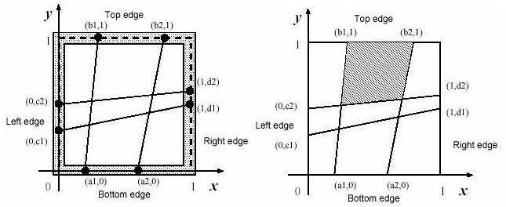
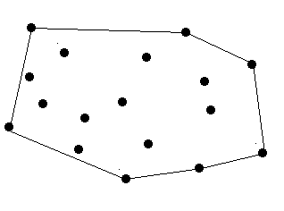

# 1. 题目列表
- POJ2031（点与点的距离 + 最小生成树）
- **POJ1039（线段相交判断，交点的计算）**
- POJ1408（相交线段形成的四边形面积求解）
- HDU1392（求凸包周长）
- **POJ2187（求任意离散点集中相距最远点的距离，凸包 + 旋转卡壳法）**
- POJ1113（凸包周长+定间隔最小包围周长）

# 2. 计算几何学的模板
**线段相交：**
```
#include <stdio.h>
#include <math.h>
const int N = 100010;
int mark[N];
struct Point
{
    double x,y;
};
struct stline
{
    Point a,b;
} line1,line2, p[N];

int dblcmp(double a,double b)
{
    if (fabs(a-b)<=1E-6) return 0;
    if (a>b) return 1;
    else return -1;
}
//***************点积判点是否在线段上***************
double dot(double x1,double y1,double x2,double y2) //点积
{
    return x1*x2+y1*y2;
}

int point_on_line(Point a,Point b,Point c) //求a点是不是在线段bc上，>0不在，=0与端点重合，<0在。
{
    return dblcmp(dot(b.x-a.x,b.y-a.y,c.x-a.x,c.y-a.y),0);
}
//**************************************************
double cross(double x1,double y1,double x2,double y2)
{
    return x1*y2-x2*y1;
}
double ab_cross_ac(Point a,Point b,Point c) //ab与ac的叉积
{
    return cross(b.x-a.x,b.y-a.y,c.x-a.x,c.y-a.y);
}
int ab_cross_cd (Point a,Point b,Point c,Point d) //求ab是否与cd相交，交点为p。1规范相交，0交点是一线段的端点，-1不相交。
{
    double s1,s2,s3,s4;
    int d1,d2,d3,d4;
    Point p;
    d1=dblcmp(s1=ab_cross_ac(a,b,c),0);
    d2=dblcmp(s2=ab_cross_ac(a,b,d),0);
    d3=dblcmp(s3=ab_cross_ac(c,d,a),0);
    d4=dblcmp(s4=ab_cross_ac(c,d,b),0);

//如果规范相交则求交点
    if ((d1^d2)==-2 && (d3^d4)==-2)
    {
        p.x=(c.x*s2-d.x*s1)/(s2-s1);
        p.y=(c.y*s2-d.y*s1)/(s2-s1);
        return 1;
    }

//如果不规范相交
    if (d1==0 && point_on_line(c,a,b)<=0)
    {
        p=c;
        return 0;
    }
    if (d2==0 && point_on_line(d,a,b)<=0)
    {
        p=d;
        return 0;
    }
    if (d3==0 && point_on_line(a,c,d)<=0)
    {
        p=a;
        return 0;
    }
    if (d4==0 && point_on_line(b,c,d)<=0)
    {
        p=b;
        return 0;
    }
//如果不相交
    return -1;
}
```
其他：见[https://blog.csdn.net/linxilinxilinxi/article/details/82624098](https://blog.csdn.net/linxilinxilinxi/article/details/82624098)

# 3. POJ1039—Pipe
# 3.1 题目描述
Description

The GX Light Pipeline Company started to prepare bent pipes for the new transgalactic light pipeline. During the design phase of the new pipe shape the company ran into the problem of determining how far the light can reach inside each component of the pipe. Note that the material which the pipe is made from is not transparent and not light reflecting. 

<center>

</center>

Each pipe component consists of many straight pipes connected tightly together. For the programming purposes, the company developed the description of each component as a sequence of points [x1; y1], [x2; y2], . . ., [xn; yn], where x1 < x2 < . . . xn . These are the upper points of the pipe contour. The bottom points of the pipe contour consist of points with y-coordinate decreased by 1\. To each upper point [xi; yi] there is a corresponding bottom point [xi; (yi)-1] (see picture above). The company wants to find, for each pipe component, the point with maximal x-coordinate that the light will reach. The light is emitted by a segment source with endpoints [x1; (y1)-1] and [x1; y1] (endpoints are emitting light too). Assume that the light is not bent at the pipe bent points and the bent points do not stop the light beam.

Input

The input file contains several blocks each describing one pipe component. Each block starts with the number of bent points 2 <= n <= 20 on separate line. Each of the next n lines contains a pair of real values xi, yi separated by space. The last block is denoted with n = 0.

Output

The output file contains lines corresponding to blocks in input file. To each block in the input file there is one line in the output file. Each such line contains either a real value, written with precision of two decimal places, or the message Through all the pipe.. The real value is the desired maximal x-coordinate of the point where the light can reach from the source for corresponding pipe component. If this value equals to xn, then the message Through all the pipe. will appear in the output file.

```
Sample Input

4
0 1
2 2
4 1
6 4
6
0 1
2 -0.6
5 -4.45
7 -5.57
12 -10.8
17 -16.55
0

Sample Output

4.67
Through all the pipe.
```
## 3.2解决思路
    题意:
    	在一个弯曲的宽度为1的管子中，光从左端射出，求光所能达到的最大水平距离
    长度。
    
    思路：
    	最大水平距离的光一定过某上端点和某下断点，穷举所有的上端点和下断点对，
    即穷举所有的直线，首先判断该直线所能到达的最大管子，然后计算该直线与该管子
    的上壁和下壁的交点，横坐标最大的交点即为光传播的最大水平距离。 
    
    知识点：
    	这里涉及到计算几何中的利用叉乘计算线段交点问题，应熟练的套用模板。

## 3.3 代码
```
#include <cstdio>
#include <cmath>
#include <algorithm>
#include <cstring>
#include <vector>
using namespace std;
/*	
	题意:
		在一个弯曲的宽度为1的管子中，光从左端射出，求光所能达到的最大水平距离
	长度。
	
	思路：
		最大水平距离的光一定过某上端点和某下断点，穷举所有的上端点和下断点对，
	即穷举所有的直线，首先判断该直线所能到达的最大管子，然后计算该直线与该管子
	的上壁和下壁的交点，横坐标最大的交点即为光传播的最大水平距离。 
	
	知识点：
		这里涉及到计算几何中的利用差集计算线段交点问题，应熟练的套用模板。 
*/
const double eps = 0.001;
const int maxn = 100;
struct Point{
	double x, y;
}ups[maxn], downs[maxn];

int dcmp(double d){ // 精度比较 
	if (fabs(d) < eps)
		return 0;
	if (d > 0) return 1;
	else return -1;
}

double cross(Point a, Point b, Point c){ // 叉乘，计算ab ×ac 
	/*
		当ab ×ac>0时，说明ac在ab的左侧，即点C在ab的左侧 
		当ab ×ac<0时，说明ac在ab的右侧，即C在ab的右侧
		当ab ×ac=0时，说明点c在线段ab上，即端点相交 
	*/ 
	return (b.x - a.x) * (c.y - a.y) - (b.y - a.y) * (c.x - a.x);
}

bool isIntersect(Point a, Point b, Point c, Point d){ // 判断直线ab与线段cd是否相交 
	/*
		 若点c、d分别在线段ab的两侧，则一定相交，否则一定不相交 
	*/
	return (dcmp(cross(a, b, c)) * dcmp(cross(a, b, d))) <= 0;
}

double intersection(Point a, Point b, Point c, Point d){
	/*
		求ab与cd的交点的横坐标 
	*/ 
	double s1 = cross(a, b, c);
	double s2 = cross(a, b, d);
	int cc = dcmp(s1);
	int dd = dcmp(s2);
	if (cc * dd < 0) // 规范相交
		return (s2 * c.x - s1 * d.x) / (s2 - s1); // 交点计算公式
	if (cc * dd == 0){
		if (cc == 0) return c.x;
		else return d.x;
	} 
	return -1.0;
} 

int main(){
	int n;
	while (~scanf("%d", &n) && n){
		for (int i = 1; i <= n; i++){
			scanf("%lf%lf", &ups[i].x, &ups[i].y);
			downs[i].x = ups[i].x;
			downs[i].y = ups[i].y - 1; 
		}
		bool flag = false; // 是否能穿越全部的管子 
		double MAX = -1;
		for (int i = 1; i <= n; i++){
			for (int j = 1; j <= n; j++){
				if (i == j) continue;
				int k;
				for (k = 1; k <= n; k++){
					// 判断所能到达的最大的管子
					if (!isIntersect(ups[i], downs[j], ups[k], downs[k])){
						break;
					} 
				}
				if (k > n){
					flag = true;
					break;
				}
				// 计算上下端点的直线与第maxk-1和maxk个管子的上交点和下交点的横坐标，取最大值
				if (k < max(i, j)) continue; // 如果k比i,j小，则不符合要求 
				double upx = intersection(ups[i], downs[j], ups[k - 1], ups[k]);
				double downx = intersection(ups[i], downs[j], downs[k - 1], downs[k]);
				if (upx > MAX) MAX = upx;
				if (downx > MAX) MAX = downx;
			}
			if (flag) break;
		}
		if (flag) printf("Through all the pipe.\n");
		else printf("%.2f\n", MAX);
	} 
}
```

# 4. POJ2031——Building a Space Station
## 4.1 题目描述
Description

You are a member of the space station engineering team, and are assigned a task in the construction process of the station. You are expected to write a computer program to complete the task. 
The space station is made up with a number of units, called cells. All cells are sphere-shaped, but their sizes are not necessarily uniform. Each cell is fixed at its predetermined position shortly after the station is successfully put into its orbit. It is quite strange that two cells may be touching each other, or even may be overlapping. In an extreme case, a cell may be totally enclosing another one. I do not know how such arrangements are possible. 

All the cells must be connected, since crew members should be able to walk from any cell to any other cell. They can walk from a cell A to another cell B, if, (1) A and B are touching each other or overlapping, (2) A and B are connected by a `corridor', or (3) there is a cell C such that walking from A to C, and also from B to C are both possible. Note that the condition (3) should be interpreted transitively. 

You are expected to design a configuration, namely, which pairs of cells are to be connected with corridors. There is some freedom in the corridor configuration. For example, if there are three cells A, B and C, not touching nor overlapping each other, at least three plans are possible in order to connect all three cells. The first is to build corridors A-B and A-C, the second B-C and B-A, the third C-A and C-B. The cost of building a corridor is proportional to its length. Therefore, you should choose a plan with the shortest total length of the corridors. 

You can ignore the width of a corridor. A corridor is built between points on two cells' surfaces. It can be made arbitrarily long, but of course the shortest one is chosen. Even if two corridors A-B and C-D intersect in space, they are not considered to form a connection path between (for example) A and C. In other words, you may consider that two corridors never intersect. 
Input

The input consists of multiple data sets. Each data set is given in the following format. 

n 
x1 y1 z1 r1 
x2 y2 z2 r2 
... 
xn yn zn rn 

The first line of a data set contains an integer n, which is the number of cells. n is positive, and does not exceed 100. 

The following n lines are descriptions of cells. Four values in a line are x-, y- and z-coordinates of the center, and radius (called r in the rest of the problem) of the sphere, in this order. Each value is given by a decimal fraction, with 3 digits after the decimal point. Values are separated by a space character. 

Each of x, y, z and r is positive and is less than 100.0. 

The end of the input is indicated by a line containing a zero. 
Output

For each data set, the shortest total length of the corridors should be printed, each in a separate line. The printed values should have 3 digits after the decimal point. They may not have an error greater than 0.001. 

Note that if no corridors are necessary, that is, if all the cells are connected without corridors, the shortest total length of the corridors is 0.000. 
```
Sample Input

3
10.000 10.000 50.000 10.000
40.000 10.000 50.000 10.000
40.000 40.000 50.000 10.000
2
30.000 30.000 30.000 20.000
40.000 40.000 40.000 20.000
5
5.729 15.143 3.996 25.837
6.013 14.372 4.818 10.671
80.115 63.292 84.477 15.120
64.095 80.924 70.029 14.881
39.472 85.116 71.369 5.553
0
Sample Output

20.000
0.000
73.834
```
## 4.2 解决思路
    题意：
    	给定n个球体，求使其连接的最小连接路径长度。
    思路：
    	坐标距离计算 + 最小生成树，由于是边密集问题，所以使用Prim算法，
    Prim算法与Djkstra算法的唯一区别是，Prim算法计算的是点到生成树集合
    的最短路径，而Djkstra算法是计算点到点的最短路径，因此，在路径更新时
    Prim算法更新节点u到集合S的直连距离，而Djkstra算法更新节点u到源点S的中介距离。

## 4.3 代码
```
#include <cstdio>
#include <cmath>
#include <cstring>
#include <algorithm>
using namespace std;

const int maxn = 110;
const double INF = 1e9;
double g[maxn][maxn], x[maxn], y[maxn], z[maxn], r[maxn], d[maxn];
bool visited[maxn];

double Prim(int n){
	fill(d, d + maxn, INF);
	memset(visited, false, sizeof(visited));
	d[1] = 0.0;
	double sum = 0.0;
	for (int i = 1; i <= n; i++){
		int u = -1;
		double MIN = INF;
		for (int j = 1; j <= n; j++){
			if (!visited[j] && d[j] < MIN){
				MIN = d[j];
				u = j;
			}
		}
		if (u == -1) break;
		sum += MIN;
		visited[u] = true;
		for (int v = 1; v <=n; v++){ // 更新v的直连点到集合S的距离 
			if (g[u][v] < d[v]) d[v] = g[u][v]; 
		}
	}
	return sum;
}

int main(){
	int n;
	while (~scanf("%d", &n) && n){
		for (int i = 1; i <= n; i++)
			scanf("%lf%lf%lf%lf", &x[i], &y[i], &z[i], &r[i]);
		for (int i = 1; i <= n; i++)
			for (int j = 1; j <= n; j++){
				if (i == j) g[i][j] = INF;
				else{
					double d = sqrt((x[i] - x[j]) * (x[i] - x[j]) + 
					(y[i] - y[j]) * (y[i] - y[j]) + 
					(z[i] - z[j]) * (z[i] - z[j])
					);
					g[i][j] = d > (r[i] + r[j]) ? d - (r[i] + r[j]) : 0;
				}
			}
		double res = Prim(n);
		printf("%.3f\n", res);
	}
} 
```

# 5. POJ1408——Fishnet
## 5.1 题目描述
Description

A fisherman named Etadokah awoke in a very small island. He could see calm, beautiful and blue sea around the island. The previous night he had encountered a terrible storm and had reached this uninhabited island. Some wrecks of his ship were spread around him. He found a square wood-frame and a long thread among the wrecks. He had to survive in this island until someone came and saved him. 

In order to catch fish, he began to make a kind of fishnet by cutting the long thread into short threads and fixing them at pegs on the square wood-frame. He wanted to know the sizes of the meshes of the fishnet to see whether he could catch small fish as well as large ones. 

The wood frame is perfectly square with four thin edges on meter long: a bottom edge, a top edge, a left edge, and a right edge. There are n pegs on each edge, and thus there are 4n pegs in total. The positions of pegs are represented by their (x,y)-coordinates. Those of an example case with n=2 are depicted in figures below. The position of the ith peg on the bottom edge is represented by (ai,0). That on the top edge, on the left edge and on the right edge are represented by (bi,1), (0,ci) and (1,di), respectively. The long thread is cut into 2n threads with appropriate lengths. The threads are strained between (ai,0) and (bi,1),and between (0,ci) and (1,di) (i=1,...,n). 

You should write a program that reports the size of the largest mesh among the (n+1)2 meshes of the fishnet made by fixing the threads at the pegs. You may assume that the thread he found is long enough to make the fishnet and the wood-frame is thin enough for neglecting its thickness. 


Input

The input consists of multiple sub-problems followed by a line containing a zero that indicates the end of input. Each sub-problem is given in the following format. 
n 
a1 a2 ... an 
b1 b2 ... bn 
c1 c2 ... cn 
d1 d2 ... dn 
you may assume 0 < n <= 30, 0 < ai,bi,ci,di < 1

Output

For each sub-problem, the size of the largest mesh should be printed followed by a new line. Each value should be represented by 6 digits after the decimal point, and it may not have an error greater than 0.000001.

```
Sample Input

2
0.2000000 0.6000000
0.3000000 0.8000000
0.1000000 0.5000000
0.5000000 0.6000000
2
0.3333330 0.6666670
0.3333330 0.6666670
0.3333330 0.6666670
0.3333330 0.6666670
4
0.2000000 0.4000000 0.6000000 0.8000000
0.1000000 0.5000000 0.6000000 0.9000000
0.2000000 0.4000000 0.6000000 0.8000000
0.1000000 0.5000000 0.6000000 0.9000000
2
0.5138701 0.9476283
0.1717362 0.1757412
0.3086521 0.7022313
0.2264312 0.5345343
1
0.4000000
0.6000000
0.3000000
0.5000000
0

Sample Output

0.215657
0.111112
0.078923
0.279223
0.348958
```
## 5.2 解决思路
    题意：
    	在1 ×1正方形中，求由n对顶点的左右和上下连线所构成最大四边形面积。
    思路：
    	求左右直线和上下直线两两的交点，利用叉积计算四边形的面积。 
## 5.3 代码
```
#include <cstdio>
#include <algorithm>
#include <cstring>
#include <cmath>
using namespace std;
/*
	题意：
		在1 ×1正方形中，求由n对顶点的左右和上下连线所构成最大四边形面积。
	思路：
		求左右直线和上下直线两两的交点，利用叉积计算四边形的面积。 
*/
const int maxn = 35;
const double eps = 0.000001;
double s[maxn][maxn]; // 定义每一块四边形的面积 
struct Point{
	double x, y;
}a[maxn], b[maxn], c[maxn], d[maxn], P, O; // 下上左右顶点的坐标，交点和原点坐标 

int dcmp(double d){
	if (fabs(d) < eps) return 0;
	if (d > 0) return 1;
	else return -1;
} 

double cross(Point a, Point b, Point c){ // 叉乘，计算ab ×ac 
	/*
		当ab ×ac>0时，说明ac在ab的左侧，即点C在ab的左侧 
		当ab ×ac<0时，说明ac在ab的右侧，即C在ab的右侧
		当ab ×ac=0时，说明点c在线段ab上，即端点相交 
	*/ 
	return (b.x - a.x) * (c.y - a.y) - (b.y - a.y) * (c.x - a.x);
}

void intersection(Point A, Point B, Point C, Point D, double& x, double& y){
	double s1 = cross(A, B, C);
	double s2 = cross(A, B, D);
	int cc = dcmp(s1);
	int dd = dcmp(s2);
	if (cc * dd < 0) { // 规范相交 
		x = (s2 * C.x - s1 * D.x) / (s2 - s1);
		y = (s2 * C.y - s1 * D.y) / (s2 - s1);
	}else {
		if (cc == 0){
			x = C.x;
			y = C.y;
		}else {
			x = D.x;
			y=  D.y;
		}
	}
}

int main(){
	int n;
	while (~scanf("%d", &n) && n){
		O.x = O.y = 0;
		for (int i = 1; i <= n; i++){
			scanf("%lf", &a[i].x);
			a[i].y = 0;
		}
		a[n + 1].x = 1, a[n + 1].y = 0;
		for (int i = 1; i <= n; i++){
			scanf("%lf", &b[i].x);
			b[i].y = 1;
		}
		b[n + 1].x = 1, b[n + 1].y = 1;
		for (int i = 1; i <= n; i++){
			scanf("%lf", &c[i].y);
			c[i].x = 0;
		}
		c[n + 1].x = 0, c[n + 1].y = 1;
		for (int i = 1; i <= n; i++){
			scanf("%lf", &d[i].y);
			d[i].x = 1;
		}
		d[n + 1].x = 1, d[n + 1].y = 1;
		double x, y, area, MAX = -1.0; // 交点坐标，与坐标原点围成的四边形面积 
		fill(s[0], s[0] + maxn * maxn, 0.0);
		for (int i = 1; i <= n + 1; i++){
			for (int j = 1; j <= n + 1; j++){
				intersection(c[i], d[i], a[j], b[j], x, y);
//				printf("线段(%lf,%lf)(%lf,%lf)与线段(%lf,%lf)(%lf,%lf)的交点为(%lf,%lf)\n", a[j].x, a[j].y, b[j].x, b[j].y, c[i].x, c[i].y, d[i].x, d[i].y, x, y); 
				P.x = x, P.y = y;
				area = 0.5 * fabs(cross(O, P, a[j])) + 0.5 * fabs(cross(O, P, c[i]));
				for (int u = 1; u < i; u++){
					for (int v = 1; v <= j; v++)
						area -= s[u][v];
				}
				for (int v = 1; v < j; v++)
					area -= s[i][v];
				s[i][j] = area;
//				printf("第(%d,%d)块四边形面积=%lf\n", i, j, area);
				if (s[i][j] > MAX) MAX = s[i][j];
			}
		}
		printf("%.6f\n", MAX);
	}
	
}
```

# 6. HDU1392——Surround the Trees
# 6.1 题目描述
## Description:

There are a lot of trees in an area. A peasant wants to buy a rope to surround all these trees. So at first he must know the minimal required length of the rope. However, he does not know how to calculate it. Can you help him? 
The diameter and length of the trees are omitted, which means a tree can be seen as a point. The thickness of the rope is also omitted which means a rope can be seen as a line.




There are no more than 100 trees.


 Input:

The input contains one or more data sets. At first line of each input data set is number of trees in this data set, it is followed by series of coordinates of the trees. Each coordinate is a positive integer pair, and each integer is less than 32767\. Each pair is separated by blank.

Zero at line for number of trees terminates the input for your program.

Output:

The minimal length of the rope. The precision should be 10^-2.

```
Sample Input:

9 
12 7 
24 9 
30 5 
41 9 
80 7 
50 87 
22 9 
45 1 
50 7 
0 

Sample Output:

243.06
```
## 6.2 解决思路
	凸包的求解，具体步骤：
	1. 求所有点中位于最下方最左的点O； 
	2. 将所有的点Pi按极角的顺序排序，极角为OPi坐标的反正切；
	3. 利用堆栈数据结构，通过叉乘求解所有在凸包上的点。(画图) 
## 6.3 代码
```
#include <cstdio>
#include <cmath>
#include <cstring>
#include <algorithm>
using namespace std;
/*
	凸包的求解，具体步骤：
	1. 求所有点中位于最下方最左的点O； 
	2. 将所有的点Pi按极角的顺序排序，极角为OPi坐标的反正切；
	3. 利用堆栈数据结构，通过叉乘求解所有在凸包上的点。(画图) 
*/

const int maxn = 110;
const int INF = 1e6;
const double eps = 0.01;
struct Point{
	int x, y;
}ps[maxn], s[maxn]; // ps[1]存储最左下角的点，s为栈 


int cross(Point A, Point B, Point C){
	return (B.x - A.x) * (C.y - A.y) - (B.y - A.y) * (C.x - A.x);
}

int cmp(Point A, Point B){
	// 按极角大小排序，其中ps[1]为左下角的点
	// atan2(y,x)函数求得是 y/x的反正切 
	double a = atan2(A.y - ps[1].y, A.x - ps[1].x);
	double b = atan2(B.y - ps[1].y, B.x - ps[1].x);
	if (a != b) return a < b;
	else return A.x < B.x; // 如果极角相同，按横坐标由小到大排序 
}

double solve(int n){
	// 找到最左下角的点，即最下面的偏左的点 
	Point min;
	min.x = INF, min.y = INF;
	int k;
	for (int i = 1; i <= n; i++){
		if (ps[i].y < min.y || (ps[i].y == min.y) && ps[i].x < min.x){
			min = ps[i];
			k = i;
		} 
	}
	// 将最左下角的点与ps[1]交换
	swap(ps[1], ps[k]);
	sort(ps + 2, ps + n + 1, cmp); // ps[2]~ps[n]按极角排序
	s[0] = ps[1], s[1] = ps[2]; // 初始化栈
	int top = 1; // 栈的top指针 
	for (int i = 3; i <= n;){
		if (top && cross(s[top- 1], s[top], ps[i]) <= 0){ // 当前栈顶的节点不是凸包的节点，则弹出 
			top--;  
		}else{
			s[++top] = ps[i++]; // 将p[i]加入凸包中 
		} 
	} 
	double c = 0.0;
	for (int i = 0; i < top; i++){
		c = c + sqrt((s[i].x - s[i + 1].x) * (s[i].x - s[i + 1].x) + (s[i].y - s[i + 1].y) * (s[i].y - s[i + 1].y));
	}
	// 首尾相连 
	c += sqrt((s[top].x - s[0].x) * (s[top].x - s[0].x) + (s[top].y - s[0].y) * (s[top].y - s[0].y)); 
	return c;
}

int main(){
	int n;
	while (~scanf("%d", &n) && n){
		for (int i = 1; i <= n; i++)
			scanf("%d%d", &ps[i].x, &ps[i].y);
		if (n == 1){
			printf("0.00\n");
			continue;
		}
		if (n == 2){
			printf("%.2f\n", sqrt((ps[1].x - ps[2].x) * (ps[1].x - ps[2].x) + (ps[1].y - ps[2].y) * (ps[1].y - ps[2].y)));
			continue;
		} 
		printf("%.2f\n", solve(n));
	}
	return 0;
}
```
# 7. POJ1584——Beauty Contest
## 7.1 题目描述
Description

Bessie, Farmer John's prize cow, has just won first place in a bovine beauty contest, earning the title 'Miss Cow World'. As a result, Bessie will make a tour of N (2 <= N <= 50,000) farms around the world in order to spread goodwill between farmers and their cows. For simplicity, the world will be represented as a two-dimensional plane, where each farm is located at a pair of integer coordinates (x,y), each having a value in the range -10,000 ... 10,000. No two farms share the same pair of coordinates. 

Even though Bessie travels directly in a straight line between pairs of farms, the distance between some farms can be quite large, so she wants to bring a suitcase full of hay with her so she has enough food to eat on each leg of her journey. Since Bessie refills her suitcase at every farm she visits, she wants to determine the maximum possible distance she might need to travel so she knows the size of suitcase she must bring.Help Bessie by computing the maximum distance among all pairs of farms. 

Input

* Line 1: A single integer, N 

* Lines 2..N+1: Two space-separated integers x and y specifying coordinate of each farm 
Output

* Line 1: A single integer that is the squared distance between the pair of farms that are farthest apart from each other. 
```
Sample Input

4
0 0
0 1
1 1
1 0
Sample Output

2
Hint

Farm 1 (0, 0) and farm 3 (1, 1) have the longest distance (square root of 2) 
```
## 7.2 解决思路
	旋转卡壳法裸题：
		旋转卡壳法的基本原理：对于凸包上的所有边，按逆时针顺序枚举，到边最远的点也是按逆时针出现，
	这样的话，只需要枚举完所有的边，并求最远的顶点与边的两端点之间的最大距离即可。
	
	时间复杂度：
		求凸包O(nlogn)，旋转卡壳O(n)，T(n)=O(nlogn) 

## 7.3 代码
```
#include <cstdio>
#include <cmath>
#include <cstring>
#include <algorithm>
using namespace std;
/*
	旋转卡壳法裸题：
		旋转卡壳法的基本原理：对于凸包上的所有边，按逆时针顺序枚举，到边最远的点也是按逆时针出现，
	这样的话，只需要枚举完所有的边，并求最远的顶点与边的两端点之间的最大距离即可。
	
	时间复杂度：
		求凸包O(nlogn)，旋转卡壳O(n)，T(n)=O(nlogn) 
*/ 
const int maxn = 50010;
const int INF = 1000000000;
struct Point {
	int x, y;
}p[maxn], s[maxn];
int top; // 栈首 

int cross(Point A, Point B, Point C){
	return (B.x - A.x) * (C.y - A.y) - (B.y - A.y) * (C.x - A.x);
}

int cmp (Point A, Point B){
	double a = atan2(1.0 * (A.y - p[1].y), 1.0 * (A.x - p[1].x));
	double b = atan2(1.0 * (B.y - p[1].y), 1.0 * (B.x - p[1].x));
	if (a != b) return a < b;
	else return A.x < B.x;
}

int getDist(Point A, Point B){
	return (A.x - B.x) * (A.x - B.x) + (A.y - B.y) * (A.y - B.y);
}

void getConvex(int n){
	// 找到左下角的点 
	Point min;
	min.x = min.y = INF;
	int k;
	for (int i = 1; i <= n; i++){
		if (p[i].y < min.y || (p[i].y == min.y) && p[i].x < min.x){
			min = p[i];
			k = i;
		}
	}
	swap(p[1], p[k]);
	sort(p + 2, p + n + 1, cmp);
	s[0] = p[1], s[1] = p[2], top = 1;
	for (int i = 3; i <= n;){
		if (top && cross(s[top - 1], s[top], p[i]) <= 0)
			top--; // 栈顶的点不是凸包的点
		else
			s[++top] = p[i++]; 
	}
}

int getMaxDist(){
	s[++top] = s[0]; // 首尾相连
	int MAX = -1;
	if (top < 2) return  getDist(s[0], s[1]);
	// 逆时针枚举凸包的所有的边
	int j = 2;
	for (int i = 0; i < top; i++){
		// 寻找距离边s[i]s[i+1]最远的凸包上的点，根据叉乘的面积大小判断
		while (cross(s[i], s[i + 1], s[j]) < cross(s[i], s[i + 1], s[j + 1]))
			j = (j + 1) % top;
		MAX = max(MAX, max(getDist(s[j], s[i]), getDist(s[j], s[i + 1]))); // 取边的两个端点距离最大值 
	} 
	return MAX;
}

int main(){
	int n;
	scanf("%d", &n);
	int MAX = -1;
	for (int i = 1; i <= n; i++){
		scanf("%d%d", &p[i].x, &p[i].y);
	}
	if (n == 2){
		printf("%d\n", getDist(p[1], p[2]));
	}else {
		getConvex(n);
		printf("%d\n", getMaxDist());
	}
	return 0;
} 
```

# 8. POJ1113——Wall
## 7.1 题目描述
Description

Once upon a time there was a greedy King who ordered his chief Architect to build a wall around the King's castle. The King was so greedy, that he would not listen to his Architect's proposals to build a beautiful brick wall with a perfect shape and nice tall towers. Instead, he ordered to build the wall around the whole castle using the least amount of stone and labor, but demanded that the wall should not come closer to the castle than a certain distance. If the King finds that the Architect has used more resources to build the wall than it was absolutely necessary to satisfy those requirements, then the Architect will loose his head. Moreover, he demanded Architect to introduce at once a plan of the wall listing the exact amount of resources that are needed to build the wall. 

<center>

</center>

Your task is to help poor Architect to save his head, by writing a program that will find the minimum possible length of the wall that he could build around the castle to satisfy King's requirements. 

The task is somewhat simplified by the fact, that the King's castle has a polygonal shape and is situated on a flat ground. The Architect has already established a Cartesian coordinate system and has precisely measured the coordinates of all castle's vertices in feet.

Input

The first line of the input file contains two integer numbers N and L separated by a space. N (3 <= N <= 1000) is the number of vertices in the King's castle, and L (1 <= L <= 1000) is the minimal number of feet that King allows for the wall to come close to the castle. 

Next N lines describe coordinates of castle's vertices in a clockwise order. Each line contains two integer numbers Xi and Yi separated by a space (-10000 <= Xi, Yi <= 10000) that represent the coordinates of ith vertex. All vertices are different and the sides of the castle do not intersect anywhere except for vertices.

Output

Write to the output file the single number that represents the minimal possible length of the wall in feet that could be built around the castle to satisfy King's requirements. You must present the integer number of feet to the King, because the floating numbers are not invented yet. However, you must round the result in such a way, that it is accurate to 8 inches (1 foot is equal to 12 inches), since the King will not tolerate larger error in the estimates.

```
Sample Input

9 100
200 400
300 400
300 300
400 300
400 400
500 400
500 200
350 200
200 200

Sample Output

1628

Hint

结果四舍五入就可以了
```
## 8.2 思路
    题意：
    	给定N个点，求用一个周长最小的多边形把这些点包进去，且每个点到多边形的距离都大于等于L。
    思路：
    	先求凸包，对于每个顶点X，X的附近需要增加一定的圆弧保证顶点到圆弧的
    距离大于等于L，而所有X的圆弧角度之和为PI，将凸包平移与圆弧连接成封闭
    图案，最终ans=凸包周长+2*PI*L

## 8.3 代码
```
#include <cstdio>
#include <cstring>
#include <cmath>
#include <algorithm>
using namespace std;

const int maxn = 1010;
const int INF = 0x7fffffff;
const double eps = 0.75;
const double pi = acos(-1.0);
struct Point {
	int x, y;
}p[maxn], s[maxn];
int top;

int dcmp(double a, double b){
	if (fabs(a - b) < eps) return 0;
	if (a > b) return 1;
	else return -1;
}

int cmp(Point A, Point B){
	double a = atan2(1.0 * (A.y - p[1].y), 1.0 * (A.x - p[1].x));
	double b = atan2(1.0 * (B.y - p[1].y), 1.0 * (B.x - p[1].x));
	if (a != b) return a < b;
	else return A.x < B.x;
}

int cross(Point A, Point B, Point C){
	return (B.x - A.x) * (C.y - A.y) - (B.y - A.y) * (C.x - A.x);
}

double dot(Point A, Point B, Point C, Point D){ // AB ·CD 
	return (B.x - A.x) * (D.x - C.x) + (B.y - A.y) * (D.y - C.y);
}

void getConvex(int n){
	Point min;
	min.x = min.y = INF;
	int k;
	for (int i = 1; i <= n; i++)
		if (p[i].y  < min.y || (p[i].y == min.y) && p[i].x < min.x){
			min = p[i];
			k = i;	
		}
	swap(p[1], p[k]);
	sort(p + 2, p + n + 1, cmp);
	s[0] = p[1], s[1] = p[2], top = 1;
	for (int i = 3; i <= n;){
		if (top && cross(s[top - 1], s[top], p[i]) <= 0)
			top--;
		else
			s[++top] = p[i++];
	}
}

double getDist(Point A, Point B){
	return sqrt(1.0 * (A.x - B.x) * (A.x - B.x) + 1.0 * (A.y - B.y) * (A.y - B.y));
}

double getAngle(Point A, Point B, Point C, Point D){
	// 返回AB与CD向量夹角的弧度
	return fabs(acos(dot(A, B, C, D) / (getDist(A, B) * getDist(C, D)))); 
}

double solve(int L){
	if (top == 1) return (getDist(s[0], s[1]));
	s[++top] = s[0];
	double c = 0.0;
	// 枚举所有的边
//	c += getDist(s[0], s[1]);
//	if (cross(s[top - 1], s[0], s[1]) != 0){
//		double theta = getAngle(s[top - 1], s[0], s[0], s[1]);
//		c += theta * L;
//	}
	for (int i = 0; i < top; i++){
		c += getDist(s[i], s[i + 1]);
//		if (cross(s[i - 1], s[i], s[i + 1]) != 0){ // 不在一条直线上 
//			
//			double theta = getAngle(s[i - 1], s[i], s[i], s[i + 1]);
//			c += (theta * L);
//		}
	}
	c += 2 * pi * L; 
	return c;
}

int Round(double d){
	return floor(d + 0.5);
}

int main(){
	int n, L;
	scanf("%d%d", &n, &L);
	for (int i = 1; i <= n; i++)
		scanf("%d%d", &p[i].x, &p[i].y);
	getConvex(n);
	double res = solve(L);
//	printf("%lf\n", res);
	printf("%d\n", Round(res));
	return 0;
}
```