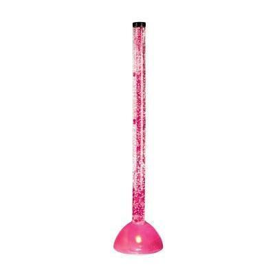

## 1. 题目列表
- POJ2388（排序，水题）
- POJ2299（求逆序对，归并排序、树状数组、线段树）

## 2.  POJ2299——Ultra-QuickSort
### 2.1 题目描述
Description



In this problem, you have to analyze a particular sorting algorithm. The algorithm processes a sequence of n distinct integers by swapping two adjacent sequence elements until the sequence is sorted in ascending order. For the input sequence 

<center>9 1 0 5 4 ,</center>

Ultra-QuickSort produces the output 

<center>0 1 4 5 9 .</center>

Your task is to determine how many swap operations Ultra-QuickSort needs to perform in order to sort a given input sequence.

Input

The input contains several test cases. Every test case begins with a line that contains a single integer n < 500,000 -- the length of the input sequence. Each of the the following n lines contains a single integer 0 ≤ a[i] ≤ 999,999,999, the i-th input sequence element. Input is terminated by a sequence of length n = 0\. This sequence must not be processed.

Output

For every input sequence, your program prints a single line containing an integer number op, the minimum number of swap operations necessary to sort the given input sequence.
```
Sample Input
5
9
1
0
5
4
3
1
2
3
0

Sample Output

6
0
```
### 2.2 解决思路
数组的长度达到500,000，使用冒泡排序记录交换次数明显超时。

这里参考三种解法：

**a. 归并排序**
归并排序的思路：
```
	给出一个无序数组，要求求出冒泡排序的交换次数，
	时间复杂度为O(n^{2})的原始冒泡排序会超时。
	 
	该题目的本质是求数组的逆序对个数，
	如在9 1 0 5 4数组中，逆序对(9,1),(9,0),(9,5),(9,4),(1,0),(5,4)共6个，
	所以共需交换6次。
	 
	解法1：归并排序。
		对于原始数组：2 3 5 9 1 4 6 8
		两两分组在某一次归并过程中：
		a1: 2 3 5 9
		a2: 1 4 6 8
	    由于a2一定在a1的后面，所以在分别比较a1和a2的数的顺序时，如果出现逆序，
		则记录结果为：ans += l2 - i。如比较2和1时，由于2>1，所以为逆序，此时冒泡交换的次数
  为a1中2后面的个数（包括2本身） 
```
b. 线段树

c. 树状数组