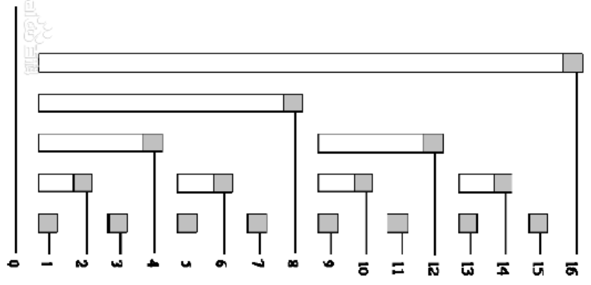

## 1. lowbit运算
$$
lowbit(x)=x\&(-x)
$$
就是取x的二进制最右边的1和它右边所有的0组成的二进制数。
## 2. 树状数组
应用于**区间求和、求数组的中位数、第k大、第k小、求逆序对**等问题。

**树状数组**是用来记录和的数组，只不过它存放的不是前i个整数的和，而是在i号位之前（含i号位）**lowbit(i)**个整数的和。


使用树状数组可以在$O(\log n)$时间复杂度实现**动态更新**和**求和操作**
```
const int maxk = 100010; // hash key 的最大值
int c[maxk]; // 树状数组，从下标1开始存储
void update(int x, int v){ // 将第x个整数加上v
	for (int i = x; i <= maxk; i += lowbit(i))
		c[i] += v;
}

int getSum(int x){ // 返回前x个整数和
	int sum = 0;
	for (int i =x; i > 0; i -= lowbit(i))
		sum += c[i];
	return sum;
}
```
## 3. 例子
### 3.1 求序列第$k$小的数
给定一个N个正整数的序列A($N \le 10^{5} ,A[i] \le 10^{5}$)，求A中第k小的数。
```
#include <cstdio>
#include <vector>
#include <cstring>
#include <algorithm>
#define lowbit(x) ((x)&(-x))
using namespace std;
/*
	树状数组应用于求前i个元素的和，并且适用于动态更新
	查询和更新的时间复杂度均为O(logn)
	
	本例是求数组中每个元素的左边比他小的元素个数
	如{1,5,3,2,6}，元素个数{0,1,1,1,4}
	
	使用hash存储每个数的个数，对于5来说，只要求
	hash[1] + hash[2] + ... + hash[4]的和，
	求和使用树状数组 
*/
const int maxn = 100010;
int c[maxn];

void update(int x, int v){ 
	// 覆盖x的树状数组加上v
	for (int i = x; i <= maxn; i += lowbit(i)){
		c[i] += v;
	} 
}

int getSum(int x){
	// 获取前x的序列和
	// 树状数组从1开始 
	int sum = 0;
	for (int i = x; i > 0; i -= lowbit(i)){
		sum += c[i];
	} 
	return sum;
}

int binarySearch(int l, int r, int x){
	while (l < x){
		int mid = (l + r) / 2;
		if (x <= getSum(mid)) // getSum(i)返回比i小的序列个数 
			r = mid;
		else l = mid + 1;
	}
	return l;
} 

int main(){
	int n, k;
	scanf("%d%d", &n, &k);
	memset(c, 0, sizeof(c));
	int x;
	for (int i = 0; i < n; i++){
		scanf("%d", &x);
		update(x, 1); // 更新覆盖v的所有树状数组 
	} 
	// 找到第k小 
	printf("%d\n", binarySearch(1, maxn, k));
	return 0; 
}
```
### 3.2 离散化过大的key
现给定一个序列A位[520, 99999999, 18, 666, 8888]，那么树状数组会开到999999999的大小，显然超内存。那么这时如何找到数组A的第k小的数呢？ 由于只需要考虑**相对大小**，那么可以设置一个临时的结构体数组，用以存放输入的序列元素的值和原始序号，输入完成后将数组按val从小到大排序，排序完再按照“计算排名的方式”将排名根据原始序号存入到一个新的数组即可。
**从而将原始的高值数组映射位低值的排名数组**
```
#include <cstdio>
#include <cstring>
#include <algorithm>
#define lowbit(i) ((i) & (-i))
using namespace std;
/*
	当使用树状数组时，遇到hash的key过大，超出内存空间，
	怎么办？
	
	如果问题只关心大小的关系（排名）的话，而不关心具体
	数值，那么可以把hash的key进行排名，将原始数值key映射
	为rank排名，再利用树状数组求和操作。
	
	紧接leftSum.cpp的例子，若输入数组：
	{999999999, 18, 18, 66, 55}
*/
const int maxn = 100010;
struct Node{
	int val;
	int pos;
} temp[maxn], origin[maxn]; // 记录第i个数的数值和下标对应关系 
int c[maxn]; //树状数组
int a[maxn]; //排名数组 a[i]= rank(i)，记录第i个数的排名，排名从1开始 

int cmp(Node n1, Node n2){
	return n1.val < n2.val;
}

void update(int x, int v){
	for (int i = x; i <= maxn; i += lowbit(i))
		c[i] += v;	
}

int getSum(int x){
	int sum = 0;
	for (int i = x; i > 0; i -= lowbit(i)) // 从1开始的lowbit 
		sum += c[i];
	return sum;
}

int binarySearch(int l, int r, int x){
	while (l < x){
		int mid = (l + r) / 2;
		if (x <= getSum(mid)) // getSum(i)返回比i小的序列个数 
			r = mid;
		else l = mid + 1;
	}
	return l;
} 

int main(){
	int n, k;
	scanf("%d%d", &n, &k);
	for (int i = 0; i < n; i++){
		scanf("%d", &temp[i].val);
		temp[i].pos = i;
		origin[i] = temp[i];
	}
	sort(temp, temp + n, cmp);
	for (int i = 0; i < n; i++){
		if (i == 0 || temp[i].val != temp[i - 1].val )
			a[temp[i].pos] = i + 1; //排名从1开始 
		else
			a[temp[i].pos] = a[temp[i - 1].pos]; // 排名与前一名一样 
	}
	for (int i = 0; i < n; i++){
		update(a[i], 1); // 更新覆盖v的所有树状数组 
	}
	int rank = binarySearch(1, maxn, k);
	for (int i = 0; i < n; i++)
		if (a[i] == rank){ // i是数的下标 
			printf("%d\n", origin[i].val);
			break;
		}
	return 0;
} 
```
### 3.3 寻找中位数 ——PAT1057 Stack
#### 3.3.1 题目描述
Stack is one of the most fundamental data structures, which is based on the principle of Last In First Out (LIFO). The basic operations include Push (inserting an element onto the top position) and Pop (deleting the top element). Now you are supposed to implement a stack with an extra operation: PeekMedian -- return the median value of all the elements in the stack. With N elements, the median value is defined to be the (N/2)-th smallest element if N is even, or ((N+1)/2)-th if N is odd.

Input Specification:
Each input file contains one test case. For each case, the first line contains a positive integer N (≤10
5
 ). Then N lines follow, each contains a command in one of the following 3 formats:

Push key
Pop
PeekMedian
where key is a positive integer no more than 10
5
 .

Output Specification:
For each Push command, insert key into the stack and output nothing. For each Pop or PeekMedian command, print in a line the corresponding returned value. If the command is invalid, print Invalid instead.
```
Sample Input:
17
Pop
PeekMedian
Push 3
PeekMedian
Push 2
PeekMedian
Push 1
PeekMedian
Pop
Pop
Push 5
Push 4
PeekMedian
Pop
Pop
Pop
Pop
Sample Output:
Invalid
Invalid
3
2
2
1
2
4
4
5
3
Invalid
```
#### 3.3.2 解决思路
求动态变化的数组中位数，使用树状数组求解，包含以下三个树状数组的核心操作
- Push x：update(x, 1)
- Pop: update(top, -1)
- PeekMedian：binarySearch(0, maxk, (N + 1) / 2)
#### 3.3.3 代码
```
#include <cstdio>
#include <algorithm>
#include <cstring>
#include <vector>
#include <stack>
#define lowbit(i) ((i) &(-i))
using namespace std;

const int maxn = 100010;
const int maxk = 100010;
int c[maxk];
char op[15];
stack<int> sk;

void update(int x, int v){
	for (int i = x; i <= maxk; i += lowbit(i))
		c[i] += v;
}

int getSum(int x){
	int sum = 0;
	for (int i =x; i > 0; i -= lowbit(i))
		sum += c[i];
	return sum;
}

int binarySearch(int l, int r, int x){ // 二分搜索x 
	while (l < r){
		int mid = (l + r) / 2; 
		if (getSum(mid) >= x) r = mid; 
		else l = mid + 1;
	}
	return l;
}

int main(){
	int n;
	scanf("%d", &n);
	memset(c, 0, sizeof(c));
	for (int i = 0; i < n; i++){
		scanf("%s", op);
		if (strcmp(op, "Pop") == 0){
			if (sk.empty())
				printf("Invalid\n");
			else{
				int top = sk.top();
				printf("%d\n", top);
				update(top, -1);
				sk.pop();
			}
		}else if (strcmp(op, "Push") == 0){
			int e;
			scanf("%d", &e);
			update(e, 1);
			sk.push(e);
		} else if (strcmp(op, "PeekMedian") == 0){
			if (sk.empty()){
				printf("Invalid\n");
			}else{
				// 如果栈内元素个数为奇数
				int size = sk.size();
				int index; // 排过序后的Median元素下标 
				if (size % 2)
					index = (size + 1) / 2;
				else 
					index = size / 2;
				// 由于getSum(i)是递增的，所以使用二分搜索Median值
				int median = binarySearch(1, maxn, index); 
				printf("%d\n", median);
			}
		}
	}
} 
```
### 3.4 二维树状数组——POJ2155 Matrix