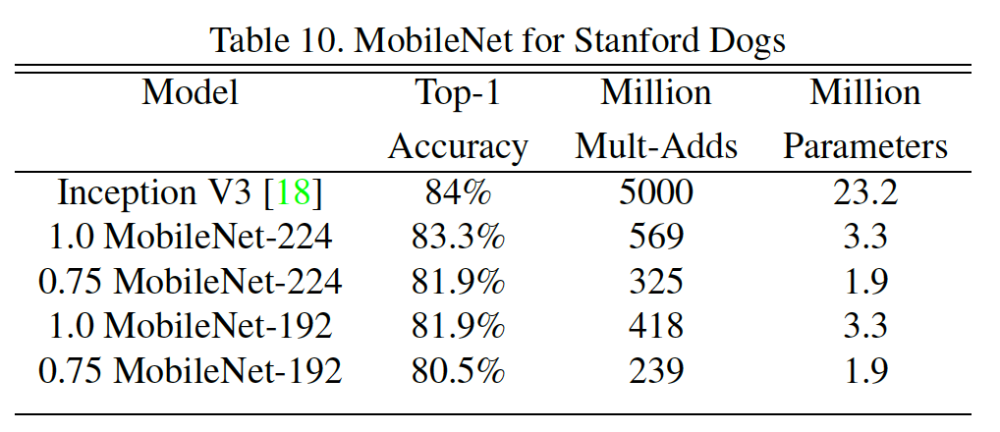
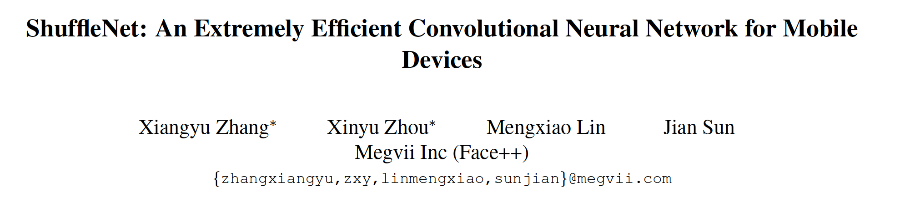
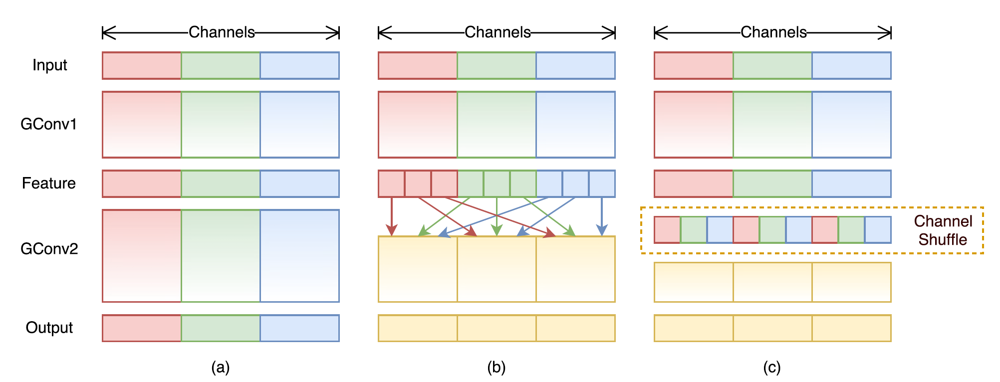
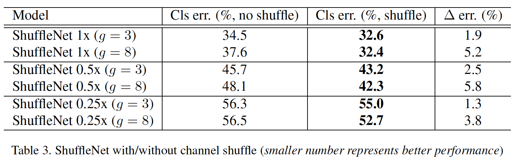

**研究问题：**

   轻量化网络结构设计。

**提出方法：**

   使用深度可分离卷积+1x1 conv替代标准conv，减少计算量和参数。深度可分离卷积每个卷积只针对输入图片单个通道进行卷积，而未融合通道之间的关系。1x1卷积用于将上述卷积结果进行融合。

**思考：**

与传统卷积相比，深度可分离卷积+1x1 conv减少了冗余计算，传统卷积需要图片的所有输入通道上进行计算，深度可分离针只对单一通道，大量减少了参数。但会减少模型的容量，因为减少了卷积融合部分的计算。

**问题：**

1. 深度可分离卷积用到其他网络架构是否work？比如SR网络

2. 深度可分离卷积在第一阶段完全忽略了不同channel之间的关系，是否有一种折中方法来该阶段能融合部分channel关系，参考ShuffleNet。

### 1. 深度可分离卷积

 

传统卷积运算和参数量：Dk卷积核大小，M和N未输入输出通道，DF为feature map大小

深度可分离卷积运算和参数量：其将传统卷积运算的卷积核大小DK和输出通道N分离开

总conv运算量：

压缩率：

3x3深度卷积结构：

 

### 2. 总体网络结构

 

### 3. 网络瘦身和小分辨率瘦身

引入宽度reduce参数alpha，减小卷积核通道数。引入分辨率reduce参数beta，减小中间feature map的分辨率。

 

### 4. 实验

ImageNet：

地图定位：

细粒度识别：

目标检测：

 

**研究问题：**在极端小网络，ResNeXt和MobileNet由于大量的1x1 conv变得不太高效。

 

**提出方法：**提出一种点级别的组卷积来减少1x1卷积的计算量，为了克服组卷积的信息不流通的缺点，ShuffleNet使用channel shuffle操作来加强feature不同channel之间的信息流通。

 

**缺陷：**

**1.** GCONV会频繁的访问与交换内存，实际在gpu测的时候4倍的理论加速智能达到2.5倍的实际加速。ShuffleNetV2 设计了四个网络高效设计的基本原则，值得一读。

\2. ShuffleNet的分组数设计退化到人工设计神经网络，违背了DNN自动学习特征。

 

**思考：**

1. Channel Shuffle操作加强了不同channel之间的信息流通，可作为一种trick用到其他模型中。

2. Shuffle操作在这种GCONV组与组独立的场景下可加强数据的流通性，是否有其他类似的场景？

 

### 1.  GCOV和channel shuffle

### 2. ShuffleNet基本Unit

对于输入HxWxC的feature map，卷积核数为k，分组数为g，

a的计算量 = HW(2CK+9k)；

b的计算量 = HW(2CK/g +9k) + shuffle操作

（推导：1x1 GCONV = HxWxCxk/g，3x3 DWConv=HxWx3x3xK, 

1x1 GCONV=HxWxCxk/g）

 

### 3. 网络结构

ShuffleNet过度依赖GCONV的组数g的选择，退化到人工设计神经网络。

 

### 4.  实验

分组数g的消融实验：

shuffle的消融：

SOTA对比：

 