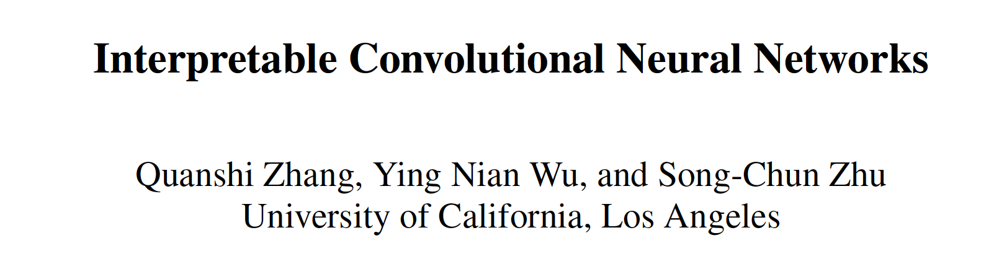

github：https://github.com/zqs1022/interpretableCNN

作者张拳石为上交大副教授，专攻可解释性AI。

 

**highlight**：

本文通过添加新的loss，使得高层conv的filter可解释性更强，更加关注于某一object的单个part。传统的CNN的filter会综合一张图片不同parts，本文提出的可解释性CNN通过降低不同类别的信息熵和空间激活图的信息熵，来使的CNN更加关注于某一个part，下表中logits和softmax score明显更hard了。

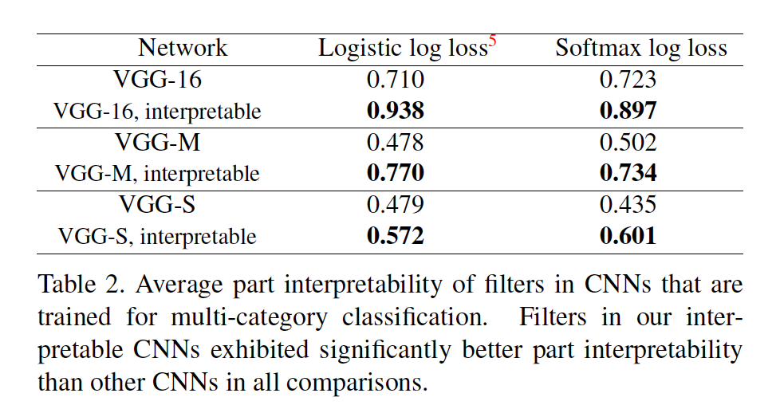

**可研究的点：**

1. 本文通过降低信息熵，来得到attention更强的可解释性filter，而这些信息熵对于分类任务却是有用的，可以换位思考：如何来增强这些信息熵来提高模型性能？

2. 可以参考可视化工具，用于以后的实验分析，如果filter或activation的信息更加soft，分类的监督信息也就越多。

3. 分类任务的本质是一个熵减的过程，将一个冗余的高熵图片输出为一个低熵概率分布

 

 

 

### 1.  Abstract

​    研究问题：CNN中，每一个高层conv层的filter都代表一个特定物体部分，在学习过程中，CNN自动为高层conv层每个filter分配一个object part。在不添加额外的人为监督时，我们是否可以获得CNN可解释的表征？

​    CNN中存在6种语义信息：物体、部件、场景、纹理、材质、颜色。低层conv往往描述了简单的纹理特征，高层conv更有可能代表物体部件。

​    Contribution：

1. 引入一个loss来迫使降低类间激活熵，和神经元激活的空间分布熵，使得激活图更加关注于某一部分（降低激活图的熵），而不是整体，来提高可解释性；

2. 未添加人工的监督；

3. 未改变任务的loss function和training方式；

4. 可能会带来性能的降低

 

### 2.  Method

2.1 信息瓶颈理论（Information bottleneck）

N.Wolchover. New theory cracks open the black box of deep learning. In Quanta Magazine, 2017. 2。

1.） 我们的可解释filters穷举选出每一类最显著的部分，来最小化条件熵（分类是一个熵减的过程，将一个冗余的高熵图片输出为一个低熵概率分布）；

2）. 每一个高层conv代表一个物体的部件，这个部件对应于最大化输入图片和中间层feature map的互信息。

 

2.2 可解释性CNN

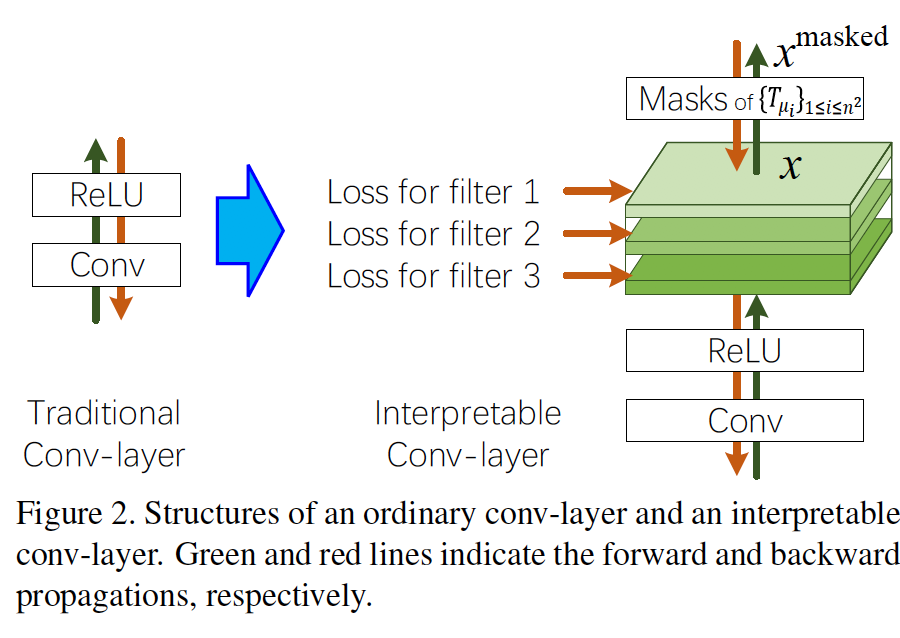

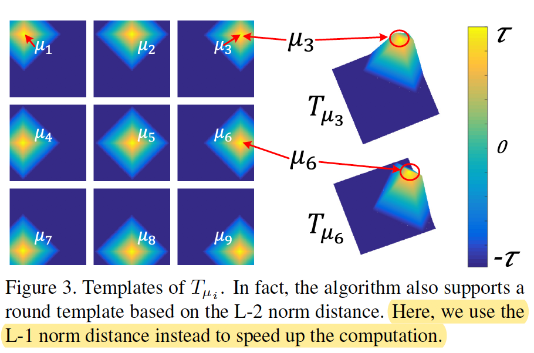

**前馈过程：**

对于一个nxn的feature map，设置n^2个模板，每个模板也是nxn，代表激活图的理想分布（激活图中object part的位置），计算特征图x的最大激活模板，计算x^masked为x与此激活模板的点积，x^masked即为关键part。

 

**反馈过程：**

​    可解释性信息损失：使得feature map x与模板T的互信息最大

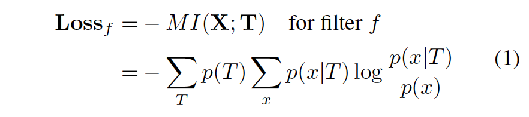

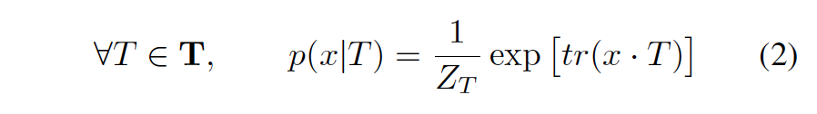

**loss**损失剖析：

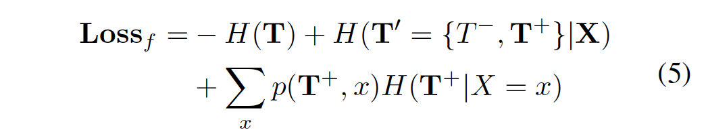

​    **1.** **降低类间信息熵**：（没看懂）

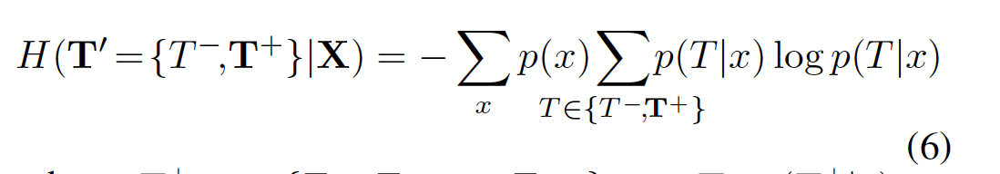

​    **2.** **降低空间激活熵**

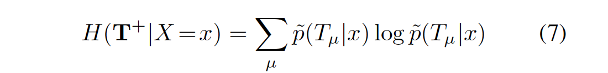

### 3. Experiments

3.1 评价指标

1) **Part interpretability**

将激活区域xij大于某一阈值作为valid activation，然后根据感受野变换到原图，计算与gt mask的IOU，IOU越大说明可解释性越高。

2）**Location stability**

使用 object part与gt landmarks的距离和方差衡量可解释性filter的稳定性。

3.2 **Results**

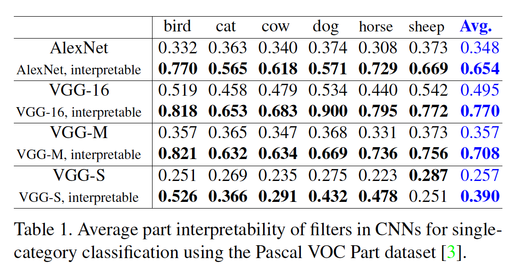

注意：本文未使用Resnet结构，因为跳连会使得单个feature map编码不同的filters。

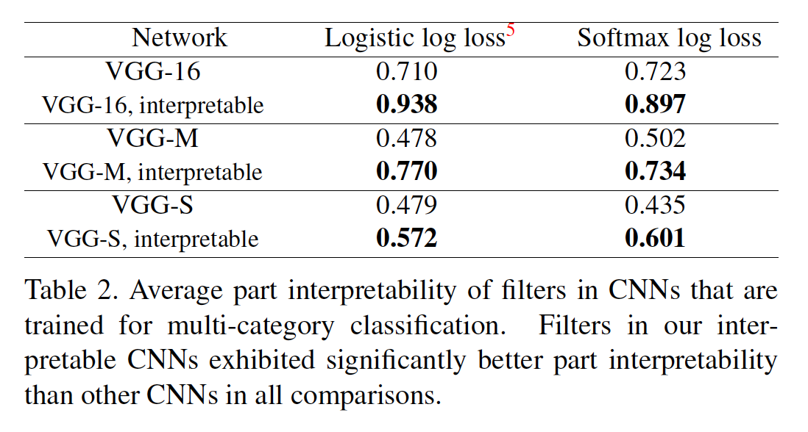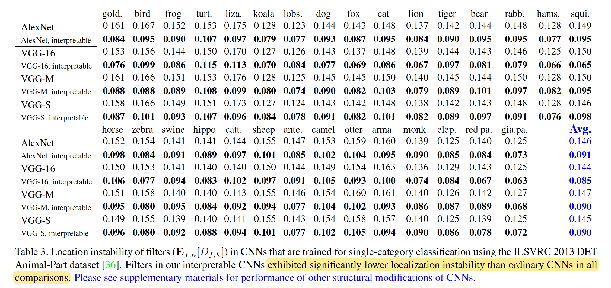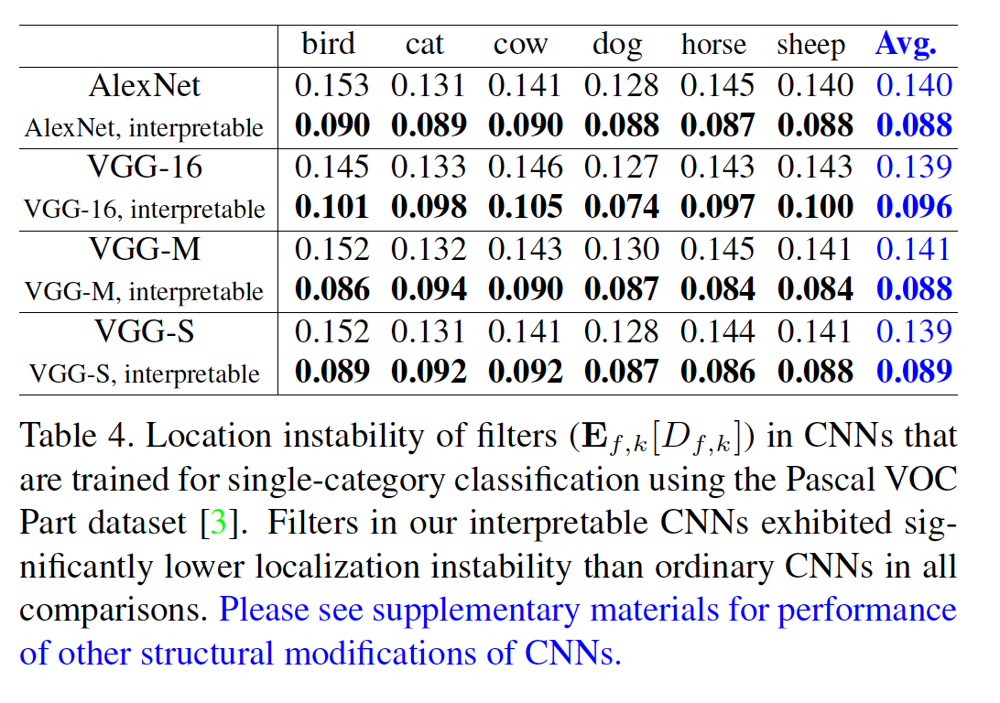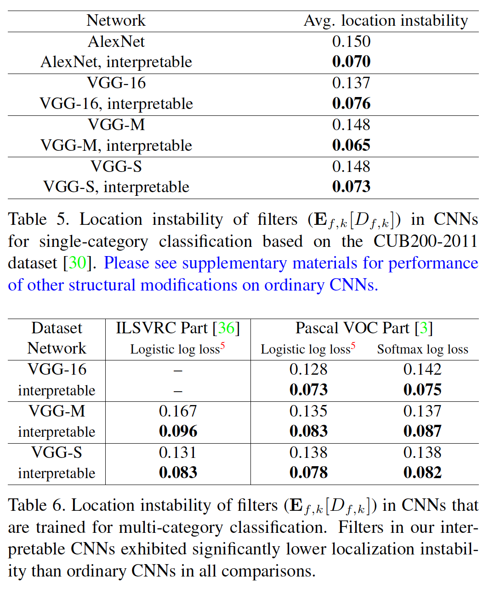

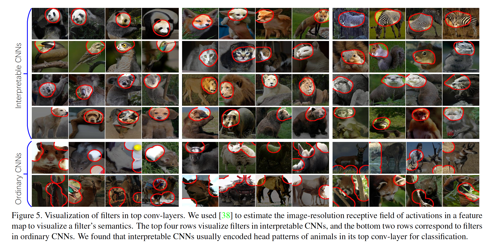 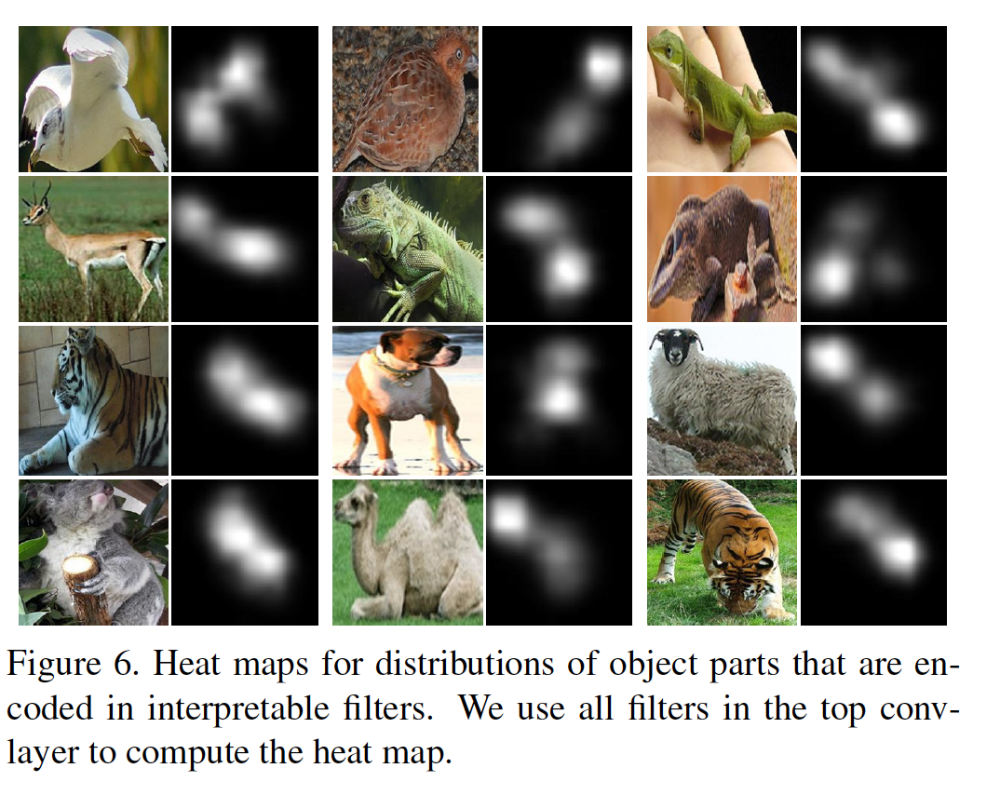