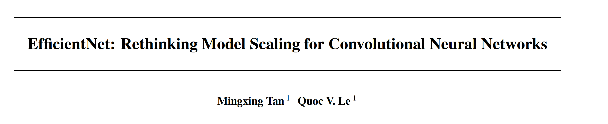
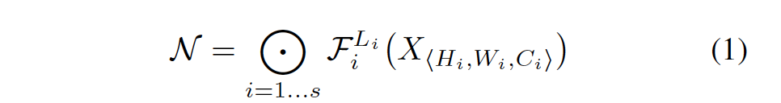
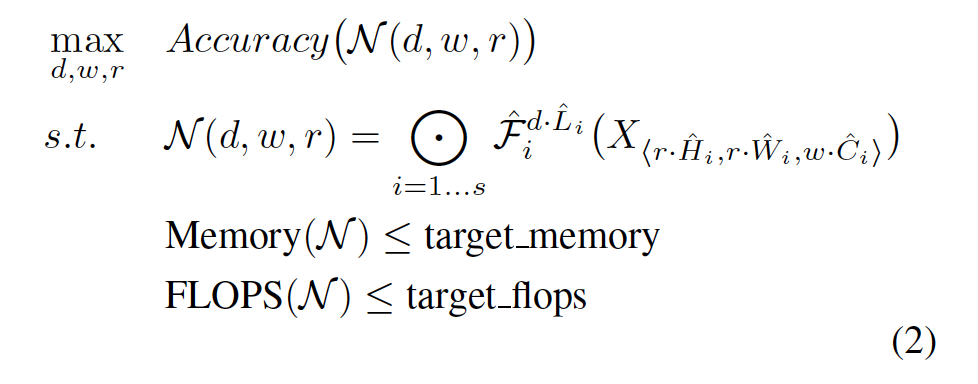
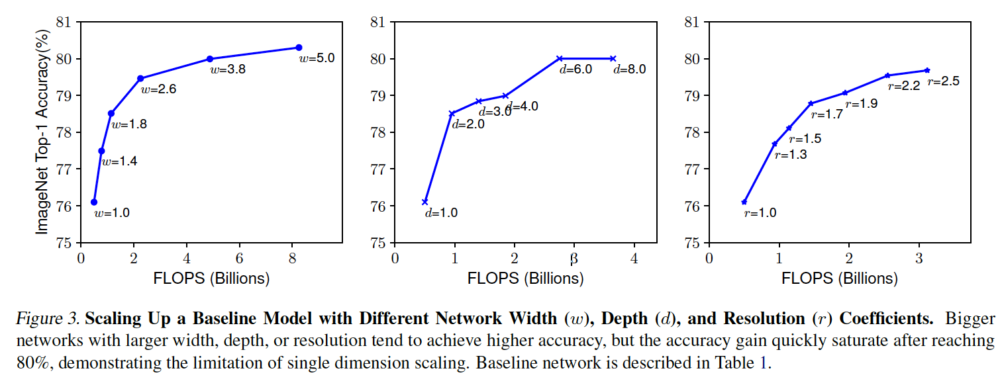
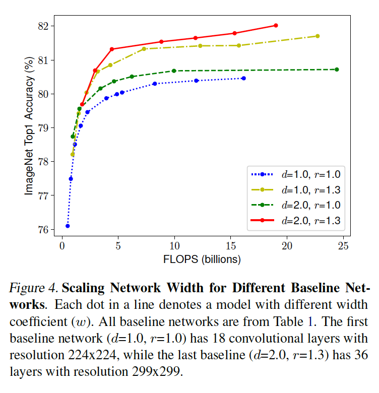
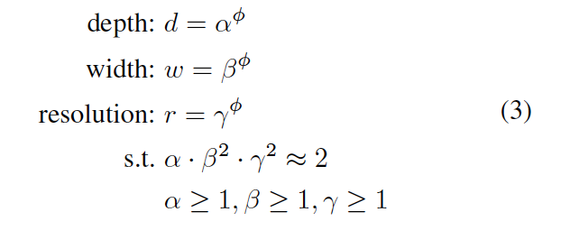
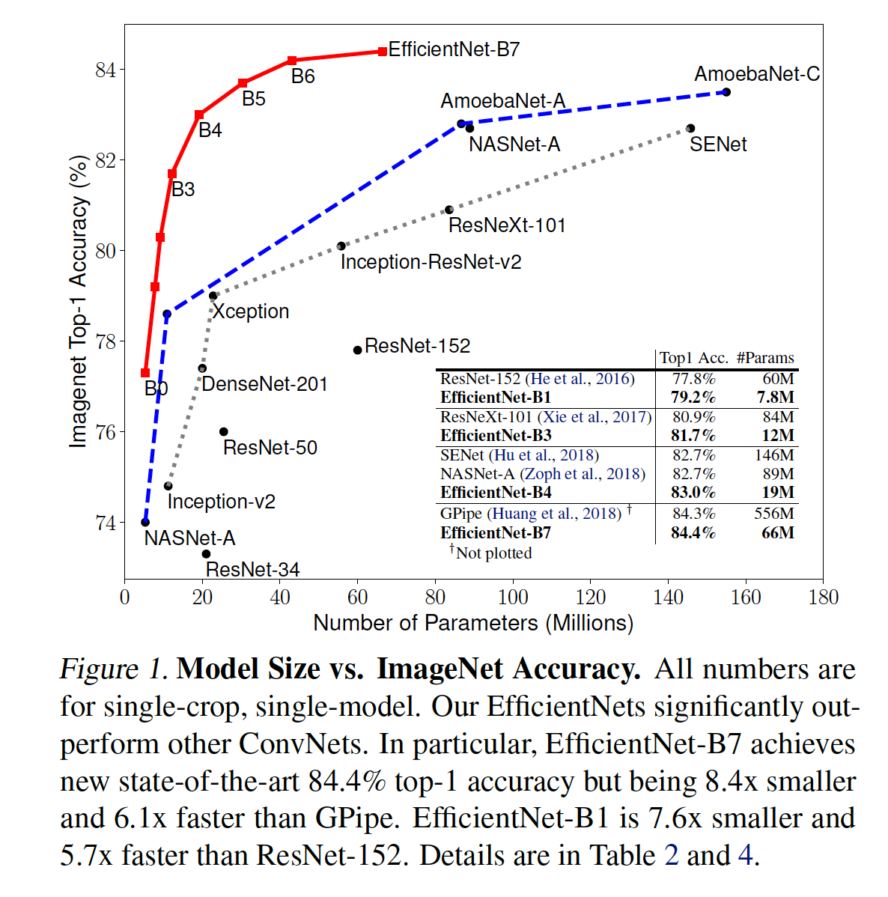
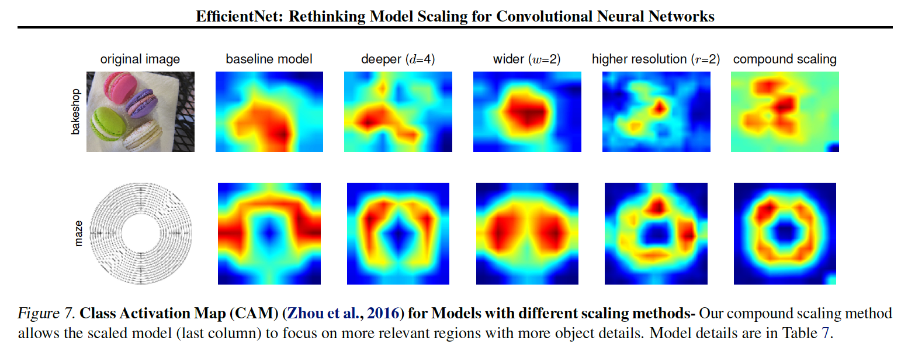

google brain 团队

github：https://github.com/tensorflow/tpu/tree/master/models/official/efficientnet

 

**highlight**：

1. 本文的novelty并不是很强，直观的将depth、width、resolution三者协同scale，通过NAS、grid search这些烧资源的方法来做。不过看来目前NAS搜了最强ImageNet网络。

2. 其实与模型蒸馏相对比，model scaling 还是建立在“要提高模型精度，那就加深、加宽、加厚等操作”，模型蒸馏的出发点用小网络的精度逼近大网络，做出来还是比较有意义的。

3. 本文的论文写作结构可以很好的借鉴，语音简洁易懂。要说明问题，首先欲扬先抑，说scale宽度、深度、分辨率确实有用，但独立sclae就有明显缺陷，随后抛出了协同scale。

 

**1. Abstract**

​    研究问题：独立sclae性能不行，如何协同平衡depth、width、resolution来scale。

​    contribution：

​    a）提出一种协同scale的方法，比独立scale，能够提高模型涨点的效率；

​    b）通过NAS和调参、烧显卡等方法，搜出了目前最强CNN。

 

**2. Method**

**2.1** **问题定义**

conv net如上所示 Li为stage i（base block）的长度，(Hi, Wi)为大小，Ci为宽度。

搜索Li, Wi, Hi, Ci的目标函数，即在给定参数量、FLOPS的计算资源的限制下，最优ACC。

2.2 独立Scaling

Observation1: 更深、更宽、分辨率更高的网络能提升性能。

**2.3** **复合****Scaling**

Observation2: 在scaling时，为了提高涨点的效率，需要平衡宽度、深度和分辨率三个要素。例如，当网络分辨率越高时，需要更宽和更深的网络来提取特征。

复合sclaing的参数限制。通过添加指数幂，来平衡三者关系，保证指数协同变化。即当分辨率提高时，宽度和深度也能以指数方式提高。这样的scaling会增加(dxw^2xr^2)^phi倍的FLOPs，因为宽度和分辨率是double增加的（前后连接）。

**2.4 Baseline model**

​    scaling方式的性能非常依靠baseline model的结构，本文使用MNAS（MnasNet: Platform-aware

neural architecture search for mobile）来搜索baseline。

**2.5 Scaling** **策略**

搜索策略：

STEP1: 先在phi=1 搜索最优的apha、beta、gamma。在alpha * beta^2 * gamma*2 ~2的条件下；

STEP2: 固定apha、beta、gamma，变化phi来得到更大的模型。（可能不是最优，但大模型上搜索怎么搜的动？？）

 

**3. Experiments**

 

**可视化：**

类激活图对比，compound scaling更能恢复原图特征。