 

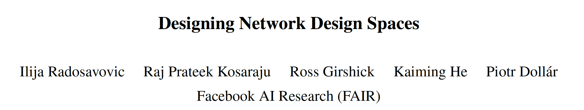

github：https://github.com/facebookresearch/pycls

关于精简化网络搜索的设计空间。

 

**研究问题：**

​    网络设计空间设计+NAS。

 

**提出方法：**

1. 以设计空间为研究对象，提出低维网络设计空间的RegNet，比EfficientNet性能好，并且在GPU上快5倍。

2. 通过统计学的实验，本文发现几个重要结论：

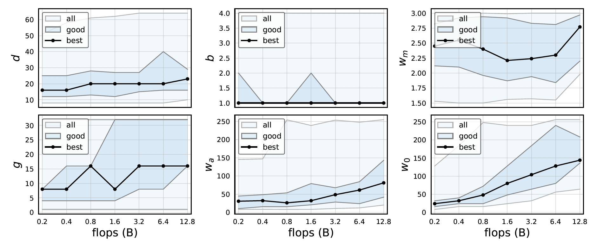

1）无论模型多大，**20**个block的深度是最合适的，并不是网络越深越好；

2）bottleneck ratio设为1是最好的；

3）网络宽度扩张系数设为2.5是合适的；

4）剩下的初始网络宽度，group数量随着模型增大而增大。

5）FLOPS跟推理速度关系不如**activations**好**，而activations用于速度建模更好，**activations**定义为所有卷积层输出**tensor的大小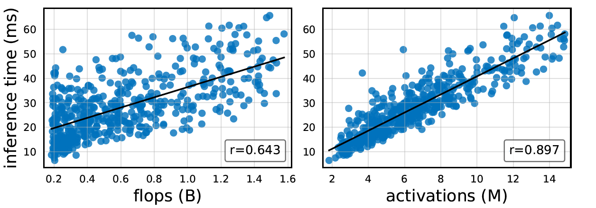

 

**思考：**

1. 本文提出的网络设计准则是值得参考的：

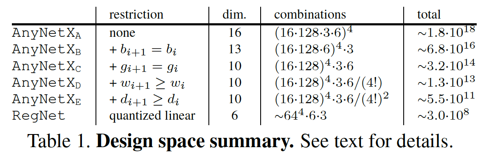

1）**CNN**的结构：一般的CNN由stem、body和head组成，影响网络性能和速度主要是body，body一般由4个stage组成，每个stage包含深度为di的block，本文的block是基于gropu conv的residual bottleneck结构；

2）一般4个stage的bottleneck ratio和group数是保持一致的；

3）宽度和深度一般随着stage增大而增大；

4）宽度和深度可以用线性拟合来估计。

2. NAS的两大核心问题为**如何设计网络设计（搜索）空间**和**搜索算法（本文使用****empirical bootsrap****方法）**，本文旨在设计精简的搜索空间；

3. 这些网络设计原则是基于图像分类问题，也可拓展到其他基于ImageNet backbone的其他任务，比如检测和分割等，**但对于****low-level cv****是不是也有以上的原则？**比如超分网络block结构会与分类有很大区别。

4. **在极低的****FLOPS****下，这些准则还使用吗**？还是说要用到低比特量化那一套？

 

**1.** **介绍**

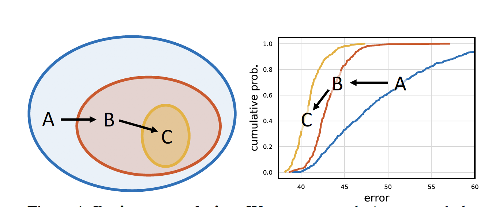

传统的NAS只能针对特定限制（如硬件平台）搜索，而无法提供网络的设计原则信息（如可解释、可泛华等）

本文结合了NAS和人工设计网络的优点，关注于设计网络空间，而不是某一网络。这样既有人工设计的可解释性优点，又有NAS的自动化搜索的优点。

 

**2.** **评价设计空间的指标**

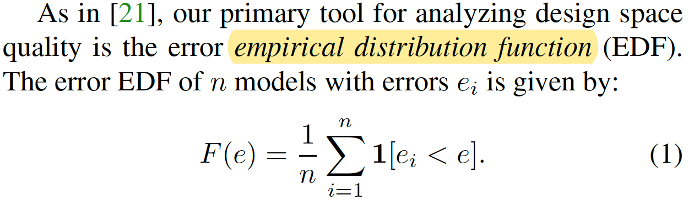

比较不同设计空间的models的error distributions，而不是比较best model；使用EDF函数作为结果量化工具。

design space design的流程：

1） 从某初始的设计空间生成n个模型分布；

2）绘制EDF曲线作为design space质量评价；

3） 可视化design space的不同属性，**并且使用****empirical bootstrap****方法来搜索参数（搜索方法）**；

4根据3中的评估结果来修正design space。

**3. AnyNet的Design Space**

AnyNet的structure：

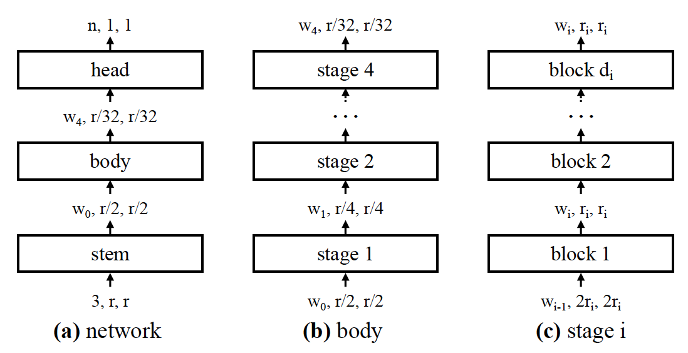

AnyNet的basic block：

**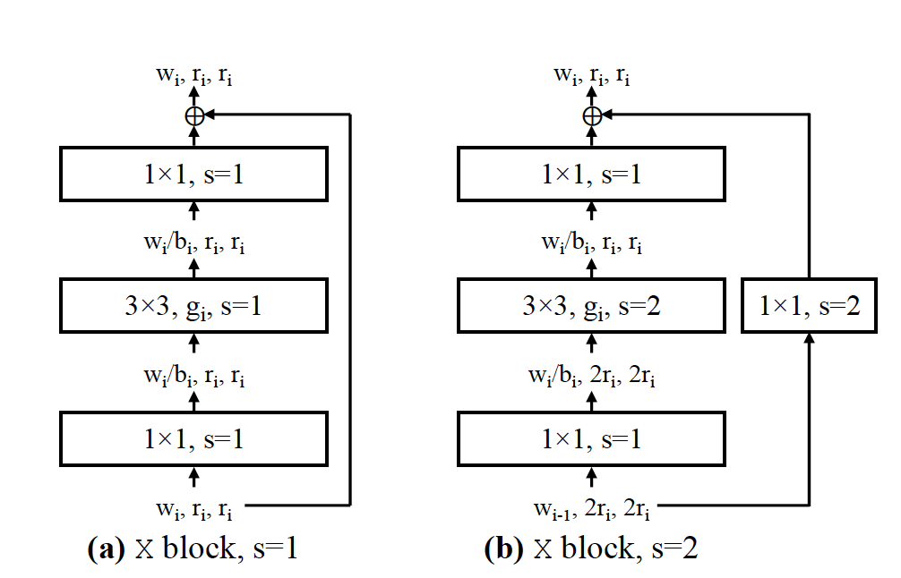**

AnyNet主要包含三个主要参数：宽度wi、bottleneck系数bi、grouo conv的宽度gi，那么由该base block组成的AnyNet有4个阶段的16个自由度。

​    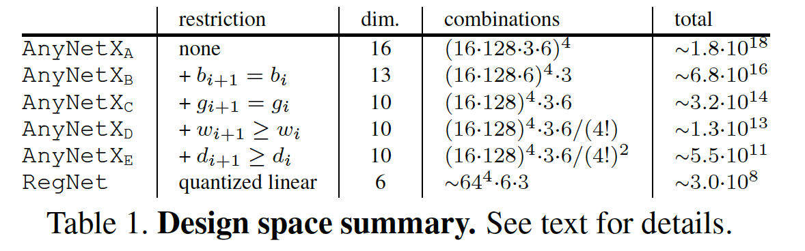

​    不同版本的AnyNet设计结构，中间证明restriction的过程的统计实验就跳过了。

 

**4. RegNet的Design Space**

​    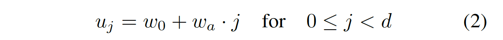

其中w0是初始化宽度，wa是宽度系数，j是深度。

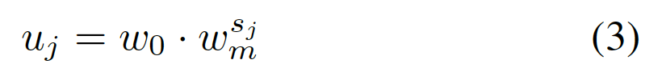

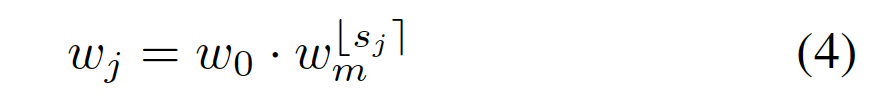

wm是宽度扩张系数，sj是量化因子是一个整数，通过公式4可以得到深度为j时所估计的宽度wj。以EDF为搜索目标，于是搜索每层的宽度的空间等价于搜索w0、wa、wm，大大降低搜索复杂度，文中直接用网格搜索即可获得w0、wa和wm的估计值，本质上是一种线性拟合。

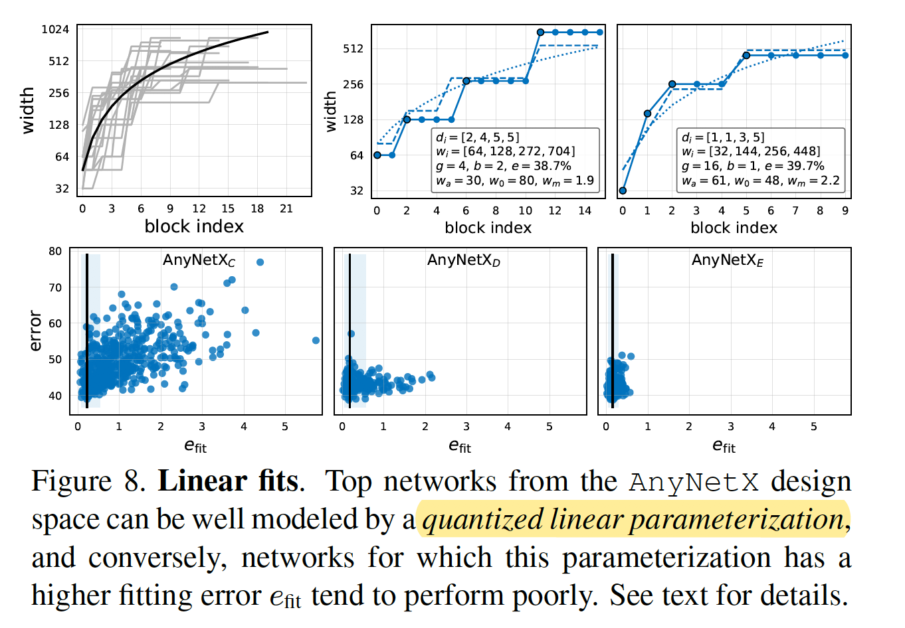

提出了一种线性参数化的宽度计算方式，进一步修正设计空间，并与top model进行对比拟合验证。

​    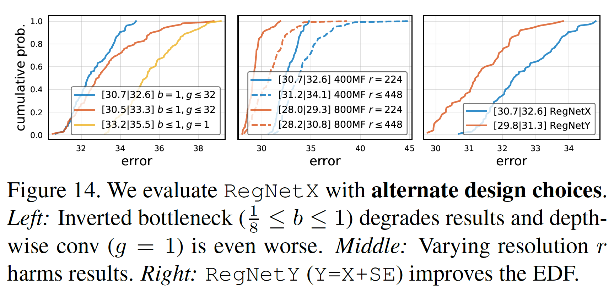

使用倒置bottleneck降低性能，使用变化的分辨率r降低性能，加上SE op能提高性能。

 

**5. Experiments**

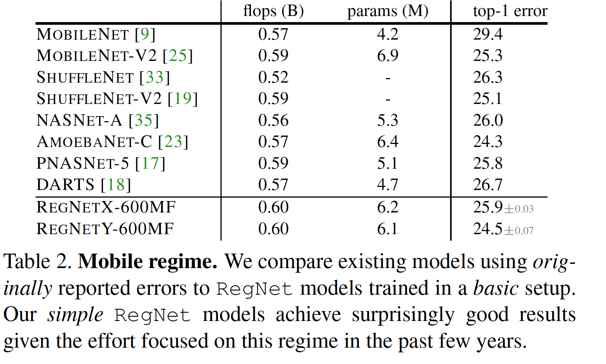

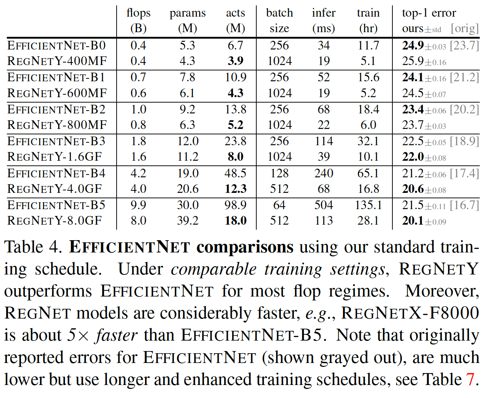

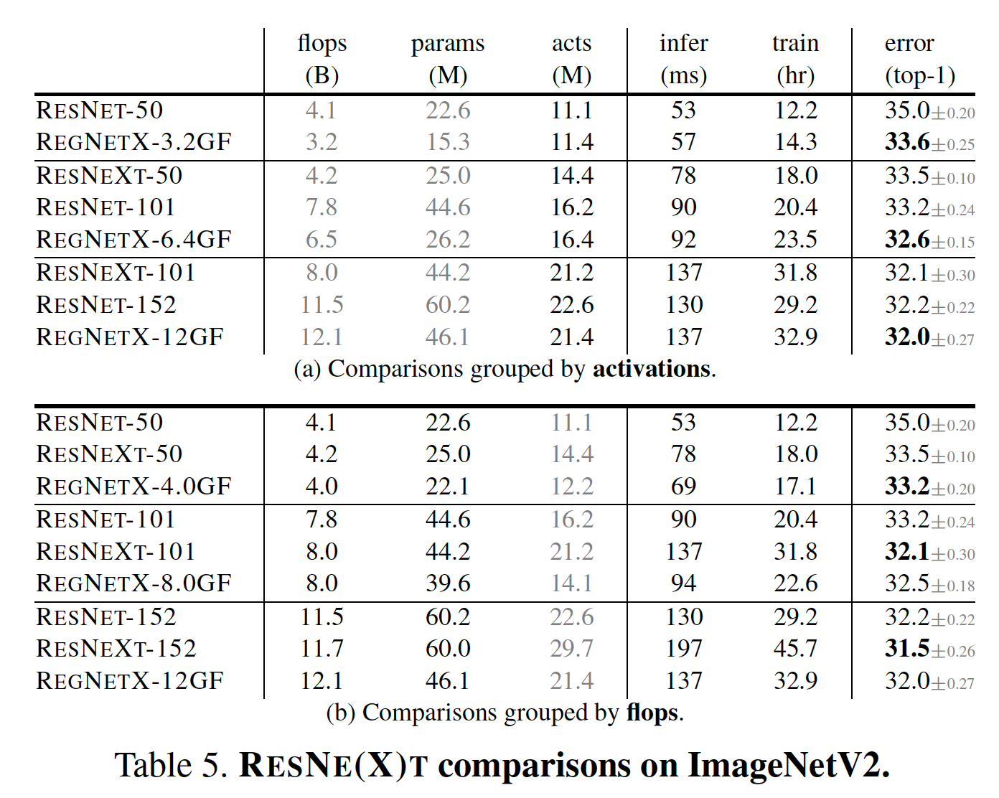

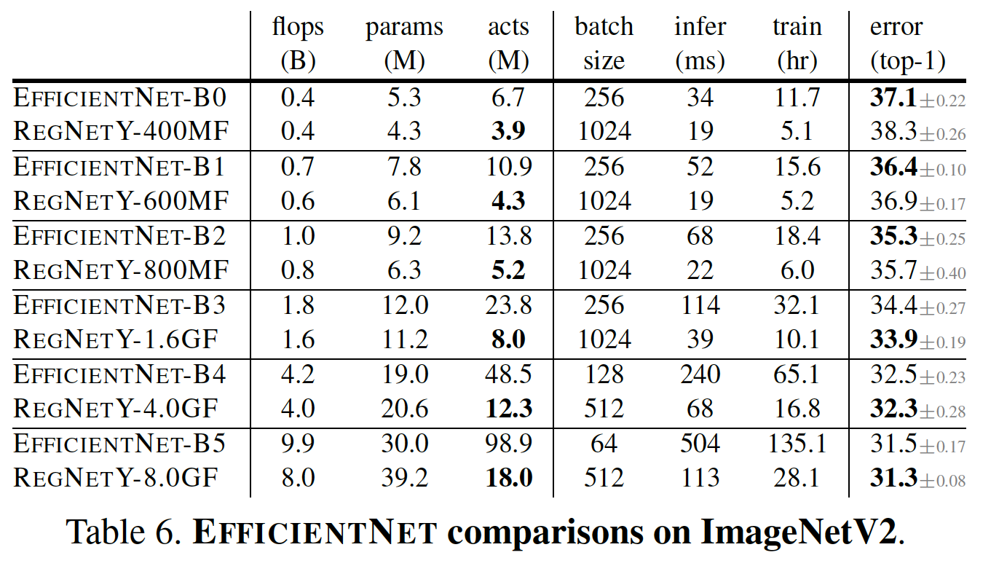