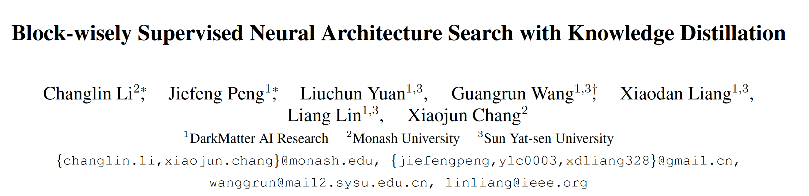

github：https://github.com/changlin31/DNA

搜索部分的代码暂未公布，只公布了模型训练和测试的代码

 

**研究问题：**

现有的NAS方法较为低效，最近工作提出了**不同搜索模型共享参数**的方法，可以大大减少搜索时间，然而有研究表明此类方法的评价指标不合适，往往与train from scratch的模型相比不是最优。

 

**提出方法：**

本文提出一种**基于**block的NAS**方法**，用于保证共享参数的NAS搜索过程模型的公平性和完整性，减少**表征偏移**，并且通过蒸馏teacher的feature map指导NAS搜索，得到的student性能高于teacher，在imagenet中达到SOTA，优于同参数下的EfficientNet。

 

**思考：**

1. 将KD作为损失函数指导NAS搜索，**使得**NAS**搜索的**student**能够模仿**teacher的结构，从而产生更好的搜索结果，这是一个新坑。

2. 本文直接使用L2 loss对齐，其他KD方法是否work？比如CRD、相关性？

3. 评价和选择模型一部分还未完全理解。

 

**1. Block-wise的NAS**

​    大N为supernet，将大N分为N个blocks：

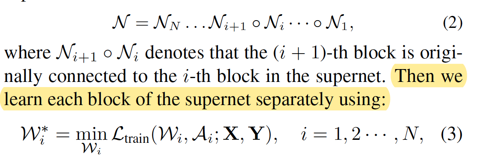

​    通过共享参数搜索每个Block的参数，具体而言：搜索第i个block时，共享其他block的参数，这样对于block搜索空间，不用每次重新训练整个模型。模块化操作能够确保模型训练的公平性和完整性，可以减少共享参数所带来的表征偏移。

​    为了确保每个block权重共享的公平性，不同层的独立训练引入了对应的reduction rate：

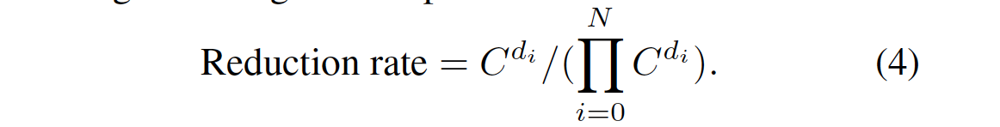

​    搜索的损失函数：

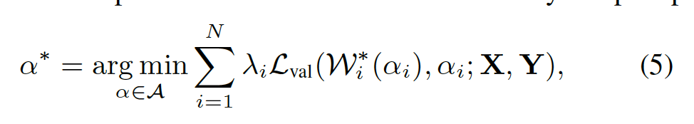

**2. Block-wise的KD**

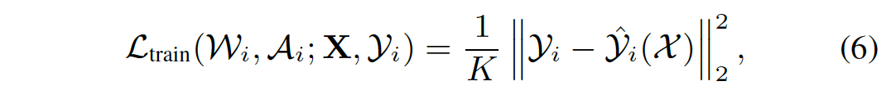

​    用L2损失对齐teacher与student对应block输出的feature map，迁移teacher的结构知识，以最小化teacher的结构知识为目标训练一个block。

​    借鉴于RNN结构，为了训练的并行性，将teacher的output y(i-1)输入到student的第i个block得到输出y’(i)，并与teacher的第i个block的输出y(i)计算KD loss：

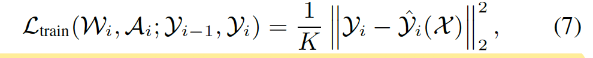

 

**3. Evaluation**

​    每个cell大约有1000个待评价的模型，为了保证评价的高效性，在一次forward过程中，保存并复用中间结果来提高效率，提出了一种feature sharing的评价方法，类似于DFS：

**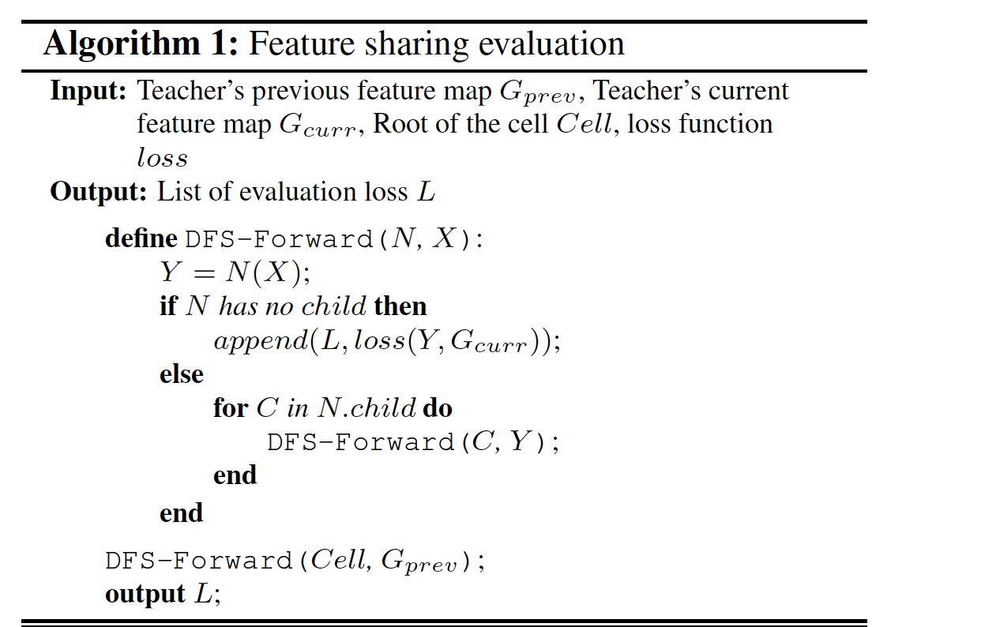**

   在完成评价和对candidates的排序后，根据评价损失值选出最好的model，评价函数为相对l1 loss：

**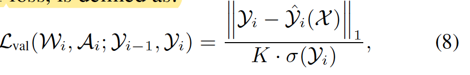**

   模型搜索的算法：

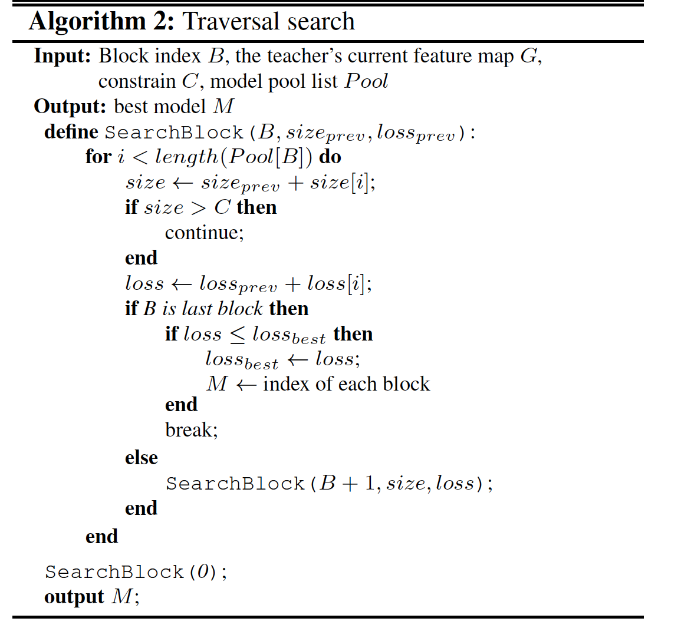

 

**4. Experiments**

​    teacher模型选用EfficientNet-B7，数据集选择ImageNet，基本block选择基于SE的倒置Residual block，搜索空间参考[28, 29, 8, 9]的搜索空间等，6cells的supernet大概8块GPU 2080Ti要搜1天，16个cells要3天，batch_size开到4096。

 

ImageNet的结果：

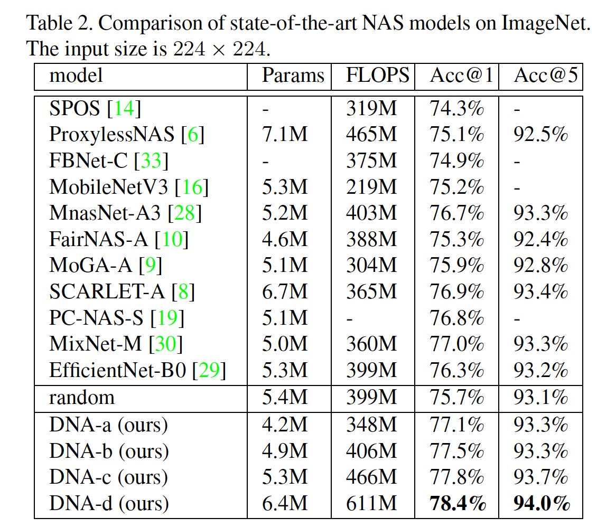

 

Accuray和FLOPS的tradeoff：

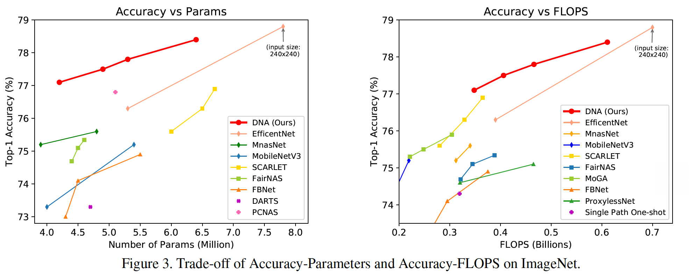

 