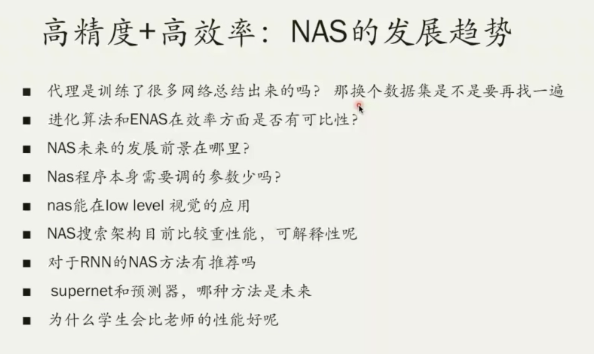
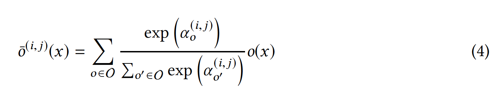
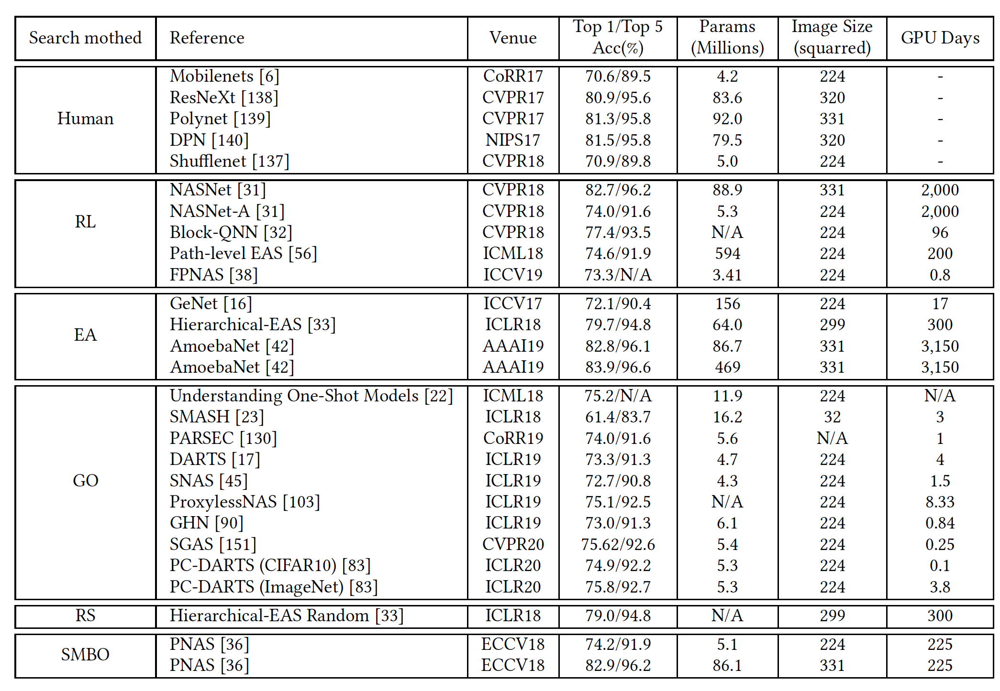

2020，NAS综述

 

NAS架构

 

**一. 早期的NAS**

早期的NAS方法：

1. NAS-RL将网络描述成**变长的字符串**，使用RNN作为controller来进行架构搜索；

2. MetaQNN将搜索过程看作是**马尔科夫决策过程**，并使用Q-learning来记录rewards来搜索最优的网络；

3. EA基于**进化算法**来搜索，通过初始化大种群，结合交配、变异、选择过程来搜索最优的网络；

4. GeNet基于EA算法，将网络结构表征为**固定长的二进制串**，通过预定义的基因操作来修改二进制串，从而生成新的个体。

 

早期的NAS几大特点：

1. 采用**全局搜索空间**：搜索空间过大，并且穷举完搜索空间；

2. **离散的搜索空间**：搜索空间由离散的op构成，无法使用梯度来指导搜索；

3. **search from scratch**：搜索过程完全不依赖于先验，未参考已有的网络结构；

4. **fully trained**：candidate都是被完全训练至手链，需要耗费大量时间，并且不同无法表征不同网络结构之间的关系。

 

两种典型的NAS搜索空间：一种是链式的、一种是有跳连的

 

**二、搜索策略**

**模块化搜索：**

模块化搜索化繁为简，借鉴CNN网络设计经验，将搜索空间限定到cell，然后将cell进行重复堆叠形成最终网络。

**基于cell的搜索空间：**

1. NASNet提出两种典型的cells：normal cell：保持数据的分辨率不变，用于提取特征；reduction cell: 减少图像的空间分辨率；

2. ENAS将reduction cell用unit op替代，如各种pooling操作；

3. DppNet使用avg pool来降采样，并且使用dense connection来建立网络结构；

4. AutoDispNet研究NAS在U-Net这种encoder-decoder架构上的应用，搜索三种典型的cell：normal、reduction、upsampling；

5. [18]研究了cell的结构特性，发现浅宽的cell更容易训练，但泛化性能更差。

ENAS的架构图。

Dpp-net架构图。

 

**连续搜索空间：**

主流的搜索方法，包括基于RL、EA、BO、SMBO和MCTS将搜索过程看做是离散空间的黑盒优化问题，效率过低。

**基于连续搜索空间的NAS：**

1. DAS将离散的搜索空间映射到连续可微的形式，并且使用梯度优化技术来加速搜索；

2. **DARTS**将离散空间使用softmax函数将所有op进行松弛映射到连续空间，并基于DAG图方法来构造连续空间，大大降低搜索cost；（重点阅读）

DARTS构建了搜索空间的DAG图，每个中间节点可以表示为以下公式：

其中o(i,j)是i->j节点的op，比如conv、relu、pool。

DARTS通过将一些op通过softmax函数进行混合，从而得到连续的mixed op:

O是所有的候选op，α是i->j 的op o的权重。

通过最大化权重，可以得到i->j最可能的op：

通过求解联合优化问题，解决NAS问题（先优化网络参数，再优化网络结构）

 

3. NAO将整个离散的网络结构encode到连续的embedding空间，使用梯度优化方法来获得最优的embedding，最后构建一个decoder将embedding映射到网络结构；
4. 由于非线性的op操作会对损失函数带来bias，这个bias会加大收敛的parent网络和衍生的child网络的偏差，SNAS研究delayed reward，有效解决了上述联合优化问题；

**DARTS的改进：**

1. I-DARTS指出DARTS中的softmax仅仅是针对单一node的输出进行，太过局部，I-DARTS将所有输入边进行softmax映射，从而搜索全局的结构。

2. 由于计算资源的限制，DARTS在搜索过程中使用很浅的cell堆叠架构，而在评估时堆叠更多的cell，这样会带来搜索和eval时的gap。P-DARTS提出使用渐进搜索，在搜索过程中逐步增加网络深度，从而减小搜索和eval的gap，同时P-DARTS提出一种正则化方法来解决深度网络搜索过程中的不稳定性（总是偏向于条跳连）。

3. DARTS虽然能极大的提高搜索效率，但由于优化DAG中所有的参数，导致DARTS占用了太多的内存，并且搜索速度过慢。GDAS通过采样DAG中的一个子图来梯度训练，显著的提升了搜索效率。

4. PC-DARTS通过采样通道的方法来降低搜索时的内存消耗，并且使用边正则化方法来解决由于通道采样产生的信息不一致问题。

 

**网络架构再生：**

神经网络再利用指使用先验的人工网络设计经验，或者预训练好的高性能网络来指导NAS。有点蒸馏的味道。

1. Net2Net提出一种网络变换技术，在变换后能够重新利用网络参数，从而加速训练**新的大网络**；

2. EAS借鉴网络变换的idea，使用Bi-LSTM来获得网络的低维特征表征，并基于RL，设置一个meta-controller，两个Actor，更新Bi-LSTM网络；

3. N2N learning通过压缩teacher，并使用KD来训练每个生成的网络结构能得到一个局部最优的学生网络。

4. FNA提出了一种目标任务架构和参数自适应的方法，从一个预训练好的种子网络开始，扩展到目标op集的超网络，并使用NAS方法适应目标网络结构。

 

**不完全训练：**

NAS存在大量的candidates，如果全部train from scratch，代价太高，如何进行不完全训练，且能保证ranking的精度呢？

**从头开始训？** **不需要：参数共享matters**

1. ENAS提出了**参数共享策略**，candidate网络结构可以认为是一个超计算图的一个有向无环子图，通过在超计算图中采样边，并共享权重，可以实现不完全训练。ENAS使用LSTM作为controller来搜索最优的子图；

2. CARS研究基于ENAS的**多任务NAS**，能够继承previous task的experience，来训练一个新的task；

3. AutoGAN第一次**将NAS引入GAN**，基于ENAS使用参数共享方法和动态重置，性能相比于人工GAN；

4. OFA使用elastic kernel机制来在**多平台部署的条件**下进行NAS搜索；

5. SMASH在**one-shot learning**任务上，通过训练一个HyperNet来为candidate生成网络参数；

6. GHN将网络结构使用**GNN**来表征，与SMASH相比，能够预测所有的weights，因此，GHN的性能比SMASH更快、更精准；

7. 基于参数共享的NAS方法**有着向简单网络的bias**（因为收敛的更快，参数共享并没有fully train），因此好网络的比率偏低，SETN使用统一的随机训练方法来**公平对待每个candidate**，从而获得更为精准的performance；

8. [24],[100],[101]发现**参数共享会导致candidate的evaluation有误**，并且每个candidate并不是被公平训练，这导致了基于参数共享的NAS并不能找到最优的网络。

9. 与ENAS相比，DARTS-like work**直接优化supernet**，而不是优化sub-graph，然后使用supernet来做参数共享；

 

**训练到收敛？不需要：通过早期学习曲线预测model的好坏（predictor）**

1. [106]使用**概率模型来拟合学习曲线**，从而提前终止没有潜力的模型，然而这种方法需要长时间的训练才能很好的拟合；

2. [20]首先将learning curve prediction融入NAS，**将candidate**的早期训练的特征、超参数和学习曲线输入到frequentist回归模型，并且预测最终网络的performance，以此在作为early training的依据；

3. NAO同样适用性能预测器来评估，不同的是，NAO将**performance predictor**作为梯度上升的优化目标；

4. MdeNAS提出这样一个假设：不同阶段的candidates的**网络相对性能是一致**的，那就是说如果一些candidates在早期训练的性能较好，那么在收敛后的性能也好。

 

**三、方法对比**

CIFAR10：

 

ImageNet：

表中可以看到：

1. 模块化搜索比全局搜索更广泛，性能方面，全局搜索更好点；

2. 不完全训练被广泛使用；

3. 基于梯度下降的NAS被广泛研究；

4. 基于网络重利用recycle的研究较少；

5. 随机搜索RS是一个很强的baseline。

 

**三、未来研究方向**

NAS的未来研究方向：

1. **一个统一的baseline**：而不是通过各种trick，如数据增强、正则化、搜索空间设计等；

2. **搜索策略的理论性不足**：大多数梯度下降，但缺少理论性依据；

3. **如何权衡搜索空间大小与搜索消耗**：模块化的小搜索空间更快，但性能可能比全局搜索差（速度与精度的经典问题）；

4. 越来越多的研究表明：基于**共享参数的NAS往往在ranking时是次优的**，如何解决这个问题？

5. 现在的NAS局限于分类问题，如何将NAS应用到更复杂的问题，如检测分割、low-level task？