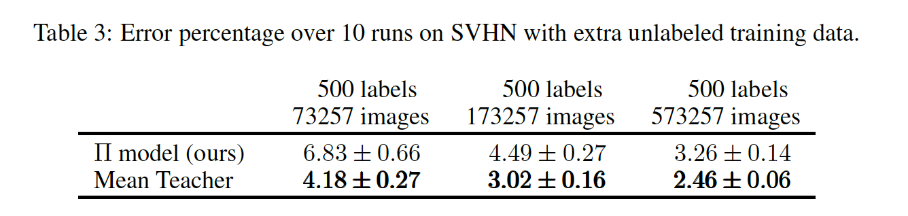

 

github：https://github.com/CuriousAI/mean-teacher

 

**1. Abstract**

​    研究问题：先前的半监督方法Temporal Ensembling有两个问题，由于在每个epoch更新a)无法适应大数据集；b) 无法适应实时场景。

​    本文提出：无监督学习的好坏取决于所生成target的质量，包括两种方法提高target质量, a) 仔细选择噪声；b) 仔细选择teacher模型(作为target的生成器)；c) 结合a) b)两种方法。本文从方法b出发，提出使用参数移动平均法生成好的teacher作为target生成器，能够在每一个step更新数据，并且适应于实时场景，实验表明该方法获得SOTA的效果。

​    Motiviation：参数平均法 + 噪声 能够获得好的target。参数平均法可以看作是生成一个网络适应类似的样本，平均法能够增强网络的鲁棒性。

 

**2. Methods**

训练过程：初始化teacher和student网络结构保持一致

1). 有标签的样本x1，y1输入到student得到loss1为分类loss；

2). 无标签样本输入到student得到预测的输出概率分布p1；

3). 无标签样本输入到teacher得到预测的输出概率分布p2；

4). 我们希望student和teacher的预测分布尽量接近，因此计算两个分布的loss2位consistency loss；

5). 使用总loss=loss1 + loss2更新student，再使用student的参数更新teacher，直到收敛。

 

consistency loss:

EMA方法更新teacher：

**3. Experiments**

3.1 SVHN and CIFAR-10

 

3.2 extra unlabeled training data

3.3 Ablation study

 

**4. Thought**

​    本文提出了一种参数平均法来获得更好的target生成网络，可以理解为平均法增强了网络的鲁棒性，增加了类似样本的解空间，从而可以生成更为鲁棒的target进行半监督学习。

​    **此外，参数平均法只有应用于完全相同的****student****与****teacher****之间，是否可以将****DML****融入进来进一步提高****target****生成的鲁棒性？**