> 基于比对学习contrastive learning的无监督学习方法

**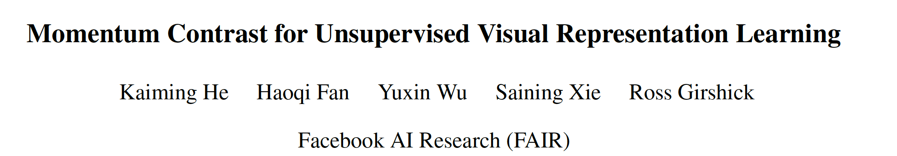**

**1. Abstract**

​    研究问题：本文提出的**动量损失无监督表示学习**预训练方法在很多任务上优于监督训练方法。

​    motiviation：借鉴NLP预训练任务，a) 大规模的字典可以学到输入数据好的feature；b) 字典key的encoder拥有一致性，尽管他在进化。但与NLP不同，**CV****的图片计算量过大**，因此，字典的大小有限。本文提出了一种队列字典和动量更新的方法MoCo在**有限****GPU****资源**的条件下实现预训练。

 

**2. Methods**

**2.1 MoCo**

**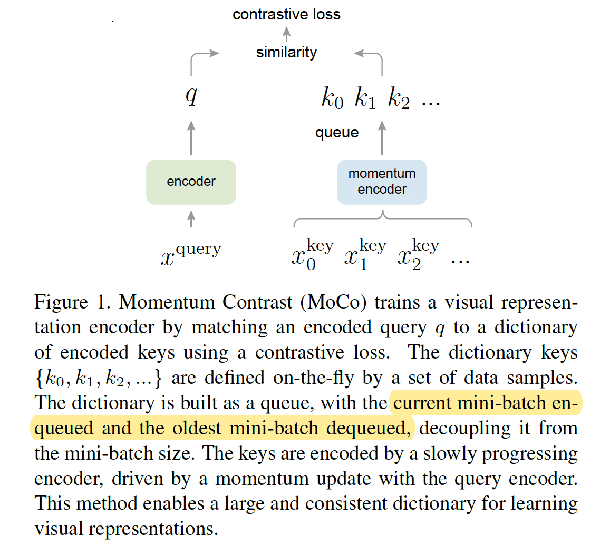**

 

**2.1 Contrastive Loss**

**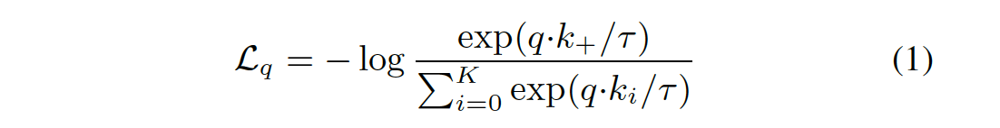**

对于一系列样本{k0, k1, ...}，一个query q所对应的key为k+，那么contrastive loss计算的是query正确的log softmax损失

 

**2.2** **队列字典**

1）. 字典的大小可以作为一个可调的超参数；

2）. 字典是不断动态更新的，将新的mini-batch入队，老的mini-batch出队，以防老的mini-batch影响encoder的一致性。

 

**2.3** **动量更新**

**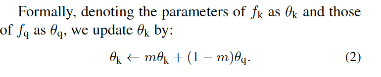**

使用队列字典在BP时，难以计算dict中所有样本的梯度，从而更新encoder。一种简单的办法是忽略query的梯度，但性能很差，因为忽略query会减少encoder的一致性。因此，本文提出动量更新，在更新key对应encoder的参数时，结合query的参数。

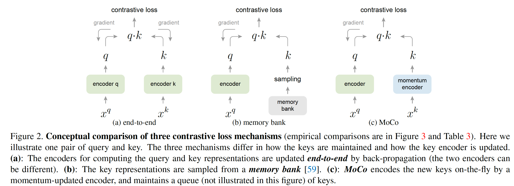

动量更新与其他更新策略的区别。

**2.4 Algorithm**

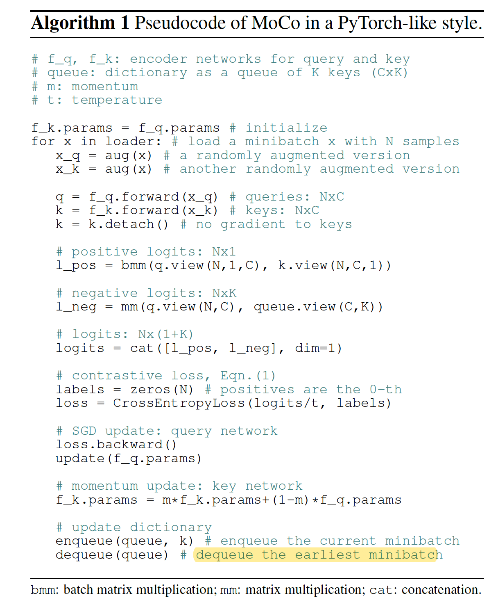

q和k分别为一个batch里面不同的random aug下的sample。预设置队列长度为K，每次将当前mini-batch样本入队，如果队满，则将最早入队的mini-batch出队。

 

**3. Experiments**

**3.1 MoCo****作为****pre-training****用于分类**

**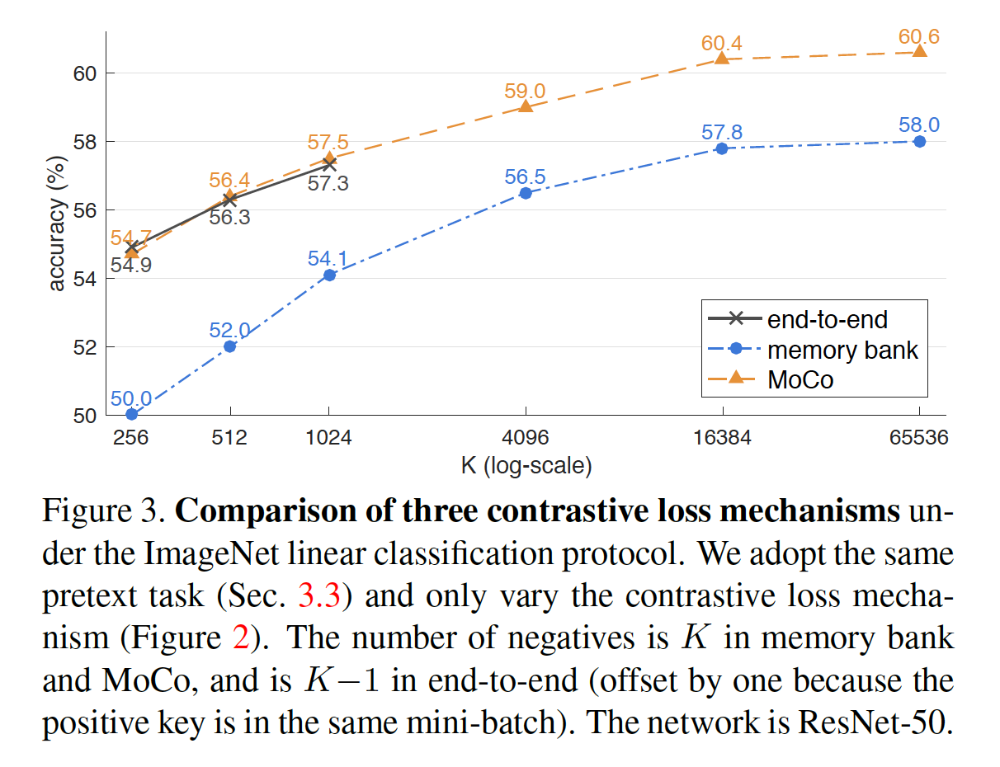**

**3.2 PASCAL VOC**

**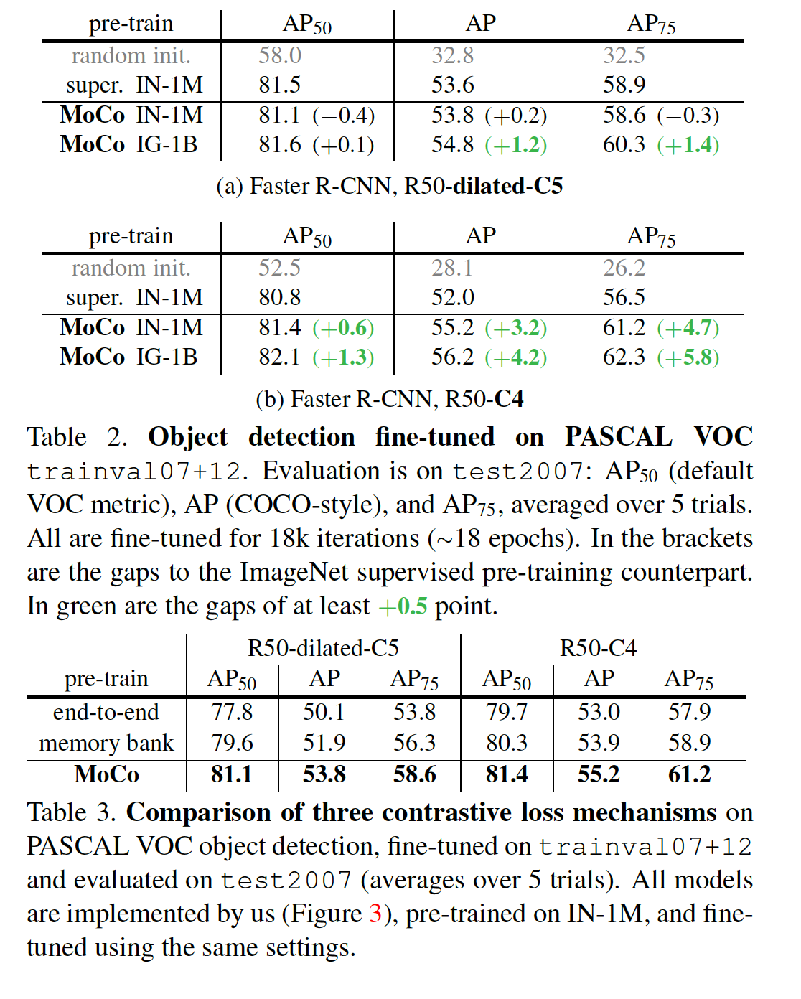**

**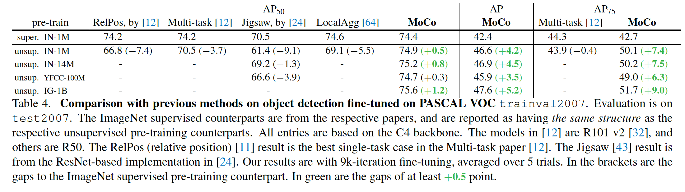**

**3.3 COCO**

**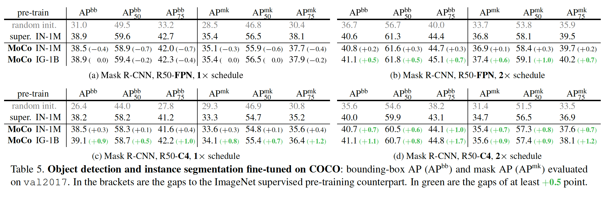**

**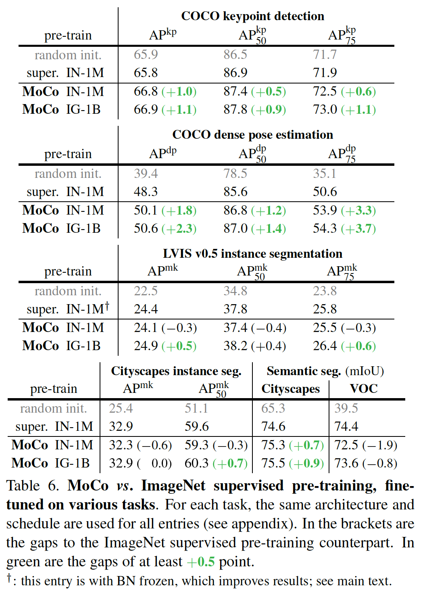**

**4. Thoughts**

MoCo实际上是一种特征学习，借鉴了NLP的预训练方法，使用query，key的方式，使得与query相似的key具有类似特征，与query相异的key特征不同。这里的相似性使用的是点积相似性。

此外，NLP的预训练和CV的预训练区别是NLP的样本计算量不大，只是比对，而CV需要计算，如点积相似性。