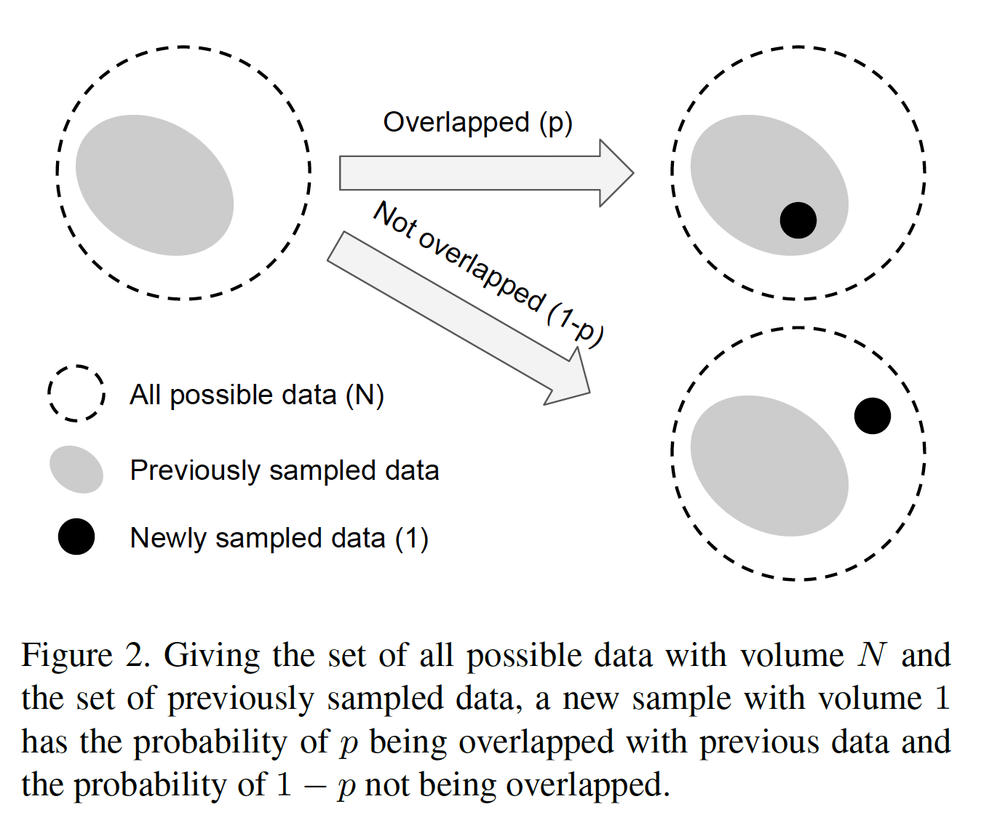

cb focal loss，解决类别不平衡问题。

 

**研究问题：**长尾数据集导致CNN模型性能下降，预测偏向于类别少数量多的类别。

 

**提出方法：**

​    提出一种类别平衡损失，**通过将每一个样例和一个小的邻域而不是单独的样本点关联，来衡量数据是否存在重叠**，使用采样时的每个类别的有效样本数来re-weighting损失，使得多数量的类别样本不会覆盖少数量的类别，不需知道数据分布（public task的有着数据均匀分布的先验），未引入任何参数。

 

**思考：**

1. 基于随机覆盖理论估计采样时的有效样本数，用该有效样本数的倒数来re-weigting损失，有效样本数的公式使用数学归纳法推导，值得一看。

2. 实验证明了基于sigmoid CE的类别平衡CB损失在实验中性能较好，并提出了CB focal loss，进一步平衡，是focal loss的进一步扩展。

3. 该方法的特点是：未考虑任何数据的先验分布，直接在采样时估计有效样本数，**未引入任何超参数，在实际任务中，不一定稳定有效，因为采样过程本身就不稳定**。

 

**1. Related Works**

解决长尾数据分布有两种方法：

a）. re-sampling：通过resampling来保持每一类别的样本数一致，但会产生两种问题，1）增加了重复样本，提高训练成本；2）模型对重复样本产生过拟合。

b）. 设计类别平衡loss。

 

**2. Effective Number of Samples**

****

随着采样data的增加，被覆盖的概率p越来越大，这里的overlap应该是指：是否和previously采样数据属于同类，属于则，overlap。

在CNN训练中，由于data aug的引入，实际训练的样本数N很小，因此，N可以看做是独立原型样本。

通过数学归纳法，证明了有效样本数的构造公式是一个关于采样样本数n的一个等比数列，这里的有效样本数指的是同类有效样本数。

根据有效样本的构造公式，当N很大时，有效样本数=采样样本数，该类每个样本都是独立原型，对应tail类；当N=1时，只存在1个独立原型，该类的其他样本都可以由该独立原型变换而来，比如数据增强、数据转换等，对应head类。

 

**3. Class-Balanced Loss**

**CB softmax CE loss:** 

**CB sigmoid CE loss:**

sigmoid将多分类问题转化为C个二分类问题，可适用于real-world、细粒度大的数据集，因为softmax会受到类别之间的信息的干扰，而sigmoid函数会把网络输出独立映射到[0, 1]之间，不受互信息的干扰。

**CB Focal Loss:**

**4. Experiments**

实验效果在标准数据集上还不错。