## 1. Abstract
Fast R-CNN已经实现了end-to-end结构的网络，但在提取RP阶段使用**Selective Search**时耗大的方法。本文使用基于CNN的RPN网络提取RP，使得提取RP和检测部分得以融合，大大加速了检测网络。

源码(Pytorch)：[https://github.com/jwyang/faster-rcnn.pytorch](https://github.com/jwyang/faster-rcnn.pytorch)

## 2. Methods
### 2.1 Overall Framework
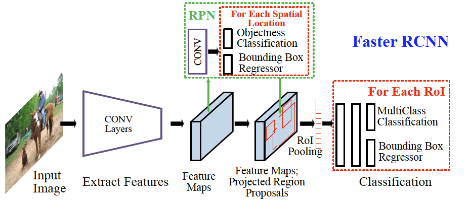
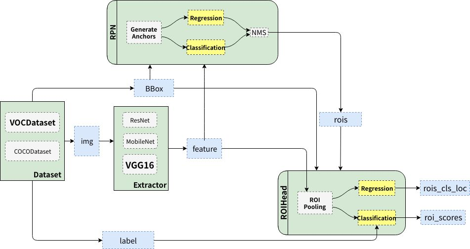

Faster RCNN主要包括三个过程：
- 提特征：使用VGG16或ResNet101；
- Region Proposal：利用提取的特征，经过RPN网络，找出一定的rois；
- 分类与回归：将rois和图像的特征输入到Fast RCNN，对这些rois进行分类，判断属于什么类别，同时对这些rois的位置进行微调。

### 2.2 RPN

**Anchors:** 
在feature map使用$n\times n$的sliding window，选取sliding window的中心点映射回原图，并选取不同的scale（大小）和aspect ratio（anchor boxes的长宽比）形成$k$个不同的anchors，总共得到$WHk$个anchors，$WH$分别为feature map的宽和高。
根据CNN的**Translation-Invariant(转换不变性)**，$k$个anchors可作为回归参考box。

**Loss Function:**
RPN的loss包含分类损失和bbox回归损失，分类使用二分类损失即是否是目标物体，本文提出了两种分类标准：
- 取IOU最大的anchor作为positive
- 取IOU大于0.7的为positive
本文选取第一种，因为在极端情况下，第二种可能找不到positive样本。

选取anchor的过程如下：
- 对于每一个ground truth bounding box (gt_bbox)，选择和它重叠度（IoU）最高的一个anchor作为正样本
- 对于剩下的anchor，从中选择和任意一个gt_bbox重叠度超过0.7的anchor，作为正样本，正样本的数目不超过128个。
- 随机选择和gt_bbox重叠度小于0.3的anchor作为负样本。负样本和正样本的总数为256。

回归使用L1 smooth loss：
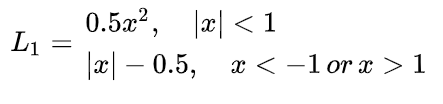
smooth L1能够平滑**离群点**的作用，更有利于目标检测任务。

总体loss函数：
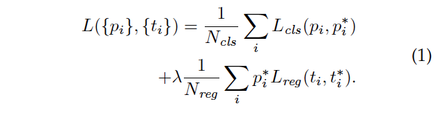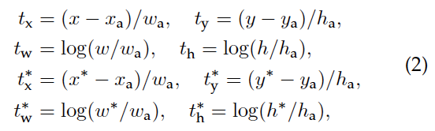

其中$p_{i}^{*}=I(is \_object)$，$t_{i}$指预测box与anchor box的相对偏移量，$t_{i}^{*}$指gt box与anchor box的偏移量，学习目标是使得predict box接近于gt box。

**注意：**在计算回归损失时，RPN只计算正样本的损失。

**Training:**
RPN可使用BP + SGD训练，由于初始的anchors大部分都是negative samples，为了保证正样本与负样本的比例一致，随机采样256个anchors，并保持正负样本1:1的比例。

### 2.3 RPN生成ROI的过程
RPN在自身训练的同时，还会提供RoIs（region of interests）给Fast RCNN（RoIHead）作为训练样本。RPN生成RoIs的过程(ProposalCreator)如下：
- 对于每张图片，利用它的feature map， 计算 (H/16)× (W/16)×9（大概20000）个anchor属于前景的概率，以及对应的位置参数。
- 选取概率较大的12000个anchor，利用回归的位置参数，修正这12000个anchor的位置，得到RoIs
- 利用非极大值（(Non-maximum suppression, NMS）抑制，选出概率最大的2000个RoIs
**注意：**在inference的时候，为了提高处理速度，12000和2000分别变为6000和300。这部分的操作不需要进行反向传播，因此可以利用numpy/tensor实现。RPN的输出：RoIs（形如2000×4或者300×4的tensor）
### 2.4 RPN与Fast R-CNN共享权值训练
RPN用于提取region proposal，Fast R-CNN完成检测任务，接下来需要把两者放在同一网络结构中训练共享卷积的Multi-task网络模型，本文提出了三种训练方法：
- **a. 交替训练：**先训练RPN，再使用RPN得到的RP训练Fast R-CNN，重复上一过程；
- **b. 似然联合训练：**将RPN与Fast R-CNN融合一起寻来拿，但忽略了RoI的对于bbox的坐标导数，丢失了一定的精度： 
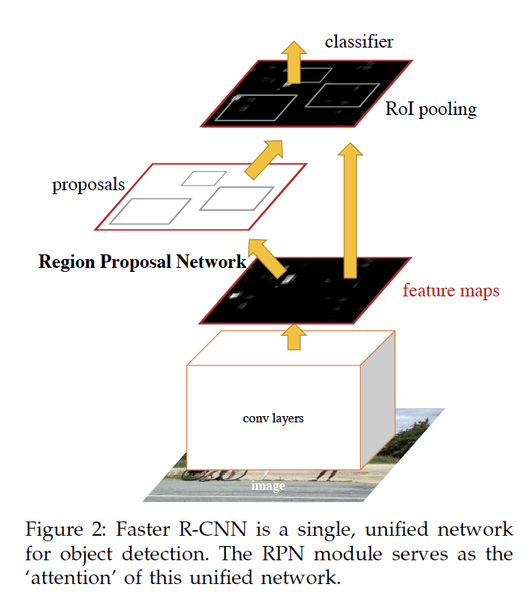
- **c. 非似然联合训练：**需要考虑box的坐标导数，但ROI layer对于坐标的导数是一个非平凡问题，不在本文讨论的范畴；

结合上述分析，本文提出了一种**4-Step Alternating Training**：
- 第一步：用ImageNet预训练模型初始化RPN，**独立**训练一个RPN网络；
- 第二步：仍然使用ImageNet初始化Fast R-CNN，将上一步训练的RPN作为region proposal提取器作为输入，单独训练Fast R-CNN，至此两个网络权值不共享；
- 第三步：使用第二步的Fast R-CNN网络参数初始化一个新的RPN网络，保持RPN、Fast R-CNN共享卷积层不更新，仅仅训练RPN独有的网络层，重新训练，此时两个网络已共享了卷积层；
- 第四步：固定共享网络层，将Fast R-CNN独有的网络层加入训练，最后形成一个共享卷积层的RPN和Fast R-CNN网络。
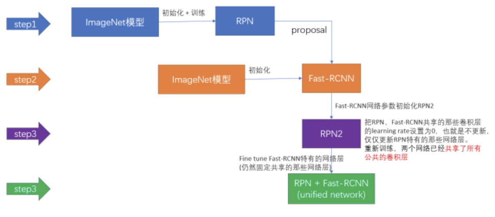

## 3. 补充
### 3.1 ROI
ROI pooling层用于将原始image上的RP映射到feature map上做max pooling操作，从而训练关注所有的RP，加速训练和测试速度，ROI具体的步骤如下：
- 1. 根据输入image，将ROI映射到feature map上对应位置；(此处的ROI即region proposal)
- 2. 将映射区域划分为相同大小的sections，sections的数量与输出维度相同；
- 3. 对每个sections进行max pooling操作。

**Example：**
考虑输入大小为 8*8的feature map，输出大小为2*2
(1). 输入固定大小的feature map
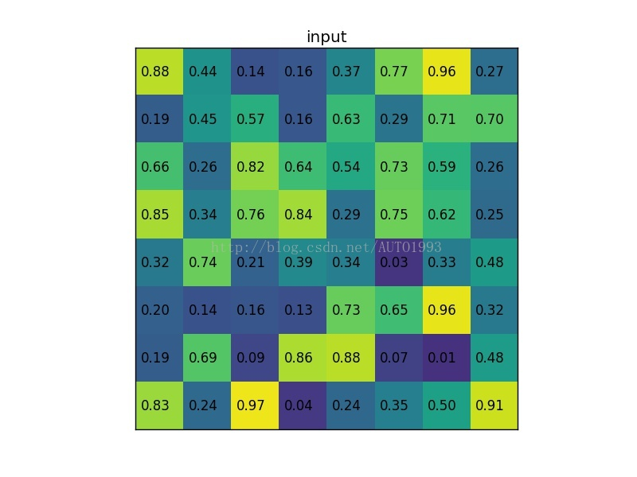
(2). region proposal投影

(3). 划分区域
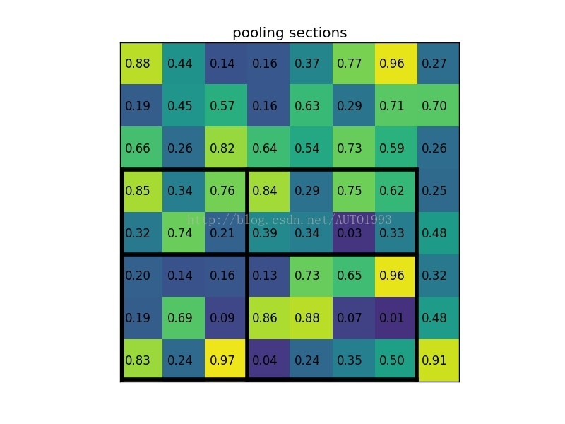
(4). max pooling
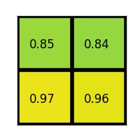

### 3.2 ROI如何映射到feature map？
首先理解**感受野**的概念：**CNN中某一层的输出结果中一个元素对应的输入层的区域大小为感受野receptive field。感受野的大小有kernel size，stride，padding和output size一起决定**
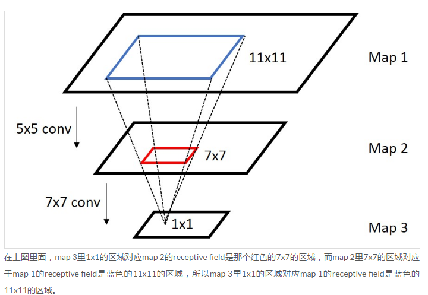
- 前向计算输出size：
$$r_{i+1}=\frac{r_{i}-k_{i}+2\cdot padding}{stride_{i}}+1
$$
- 反向计算输入size：
$$r_{i}=stride_{i}(r_{i+1}-1)+k_{i} - 2\cdot padding
$$**因此通过逐层反向计算输入size便可得到feature map上某点对应的原始图片的感受野。**

一般地，取$padding=\lfloor k_{i}/2 \rfloor$，那么
- 当$k_{i}$为奇数，$r_{i}=s_{i}\cdot r_{i+1}$
- 当$k_{i}$为偶数，$r_{i}=s_{i}\cdot r_{i+1}-0.5$
由于$r$是整数坐标值，基本可以认为$r_{i}=s_{i}\cdot r_{i+1}$，因此进行逐层求感受野得到：
$$r_{0}=S\cdot r_{i+1}(S=\prod_{0}^{i}s_{i})
$$

部分来源于：[https://blog.csdn.net/qq_38906523/article/details/80190807](https://blog.csdn.net/qq_38906523/article/details/80190807)