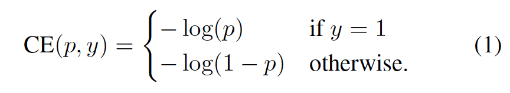
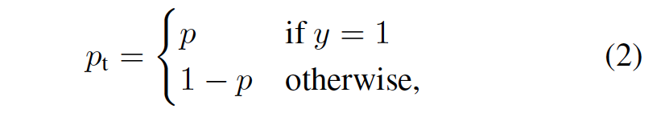
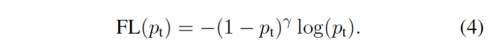
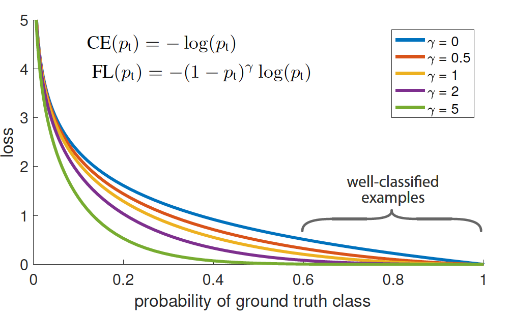
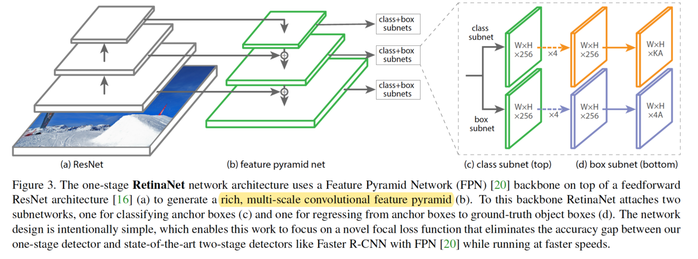
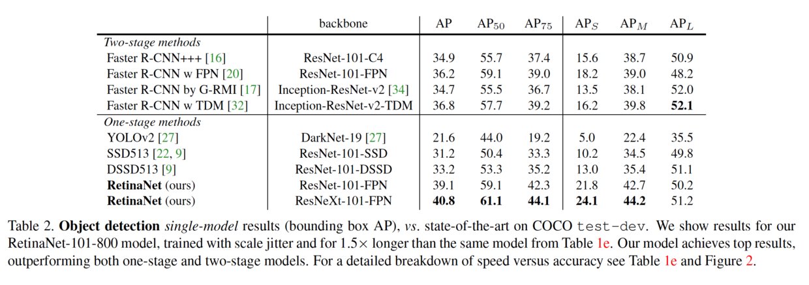

## 1. Abstract
在目标检测领域中，前景类和背景类别不平衡问题是影响one-stage和two-stage检测器性能的主要原因，本文提出了新的损失函数，旨在降低大量易分类样本的loss权重，平衡易分类样本和难分类样本的loss，从而提高one-stage检测器的ap。

源码：[https://github.com/facebookresearch/Detectron)

## 2. Focal Loss
**交叉熵损失：**

交叉熵损失对于易于区分大类，即$p_{t}>0.5$的类仍然引入了少量的loss，随着大量易分类样本的引入，少量的loss不断积累盖过了难分类的类。

**Focal Loss：**

讨论：
1. $p_{t}$:
 当$p_{t}\rightarrow0$，权重$(1-p_{t})^{\gamma}\rightarrow 1$，FL对于错误分类当样本loss无影响；
当$p_{t}\rightarrow1$，权重$(1-p_{t})^{\gamma}\rightarrow 0$，FL对于易分类当样本当loss降权接近于0，以平衡难分类样本当loss。
2. $\gamma$：
当$\gamma=0$时，FL等价于CE；
随着$\gamma$当增加，FL对于易分类当样本当降权作用增大。

## 3. RetinaNet

Retinanet是one-stage当目标检测器，其结构如下：
1. 使用FPN作为backbone来提取多尺寸卷积特征金字塔，而不是前向传播当ResNet；
2. 选取了3种不同比率和3种不同大小比形成9种不同的anchors，来计算focal loss；
3. 使用FCN作为分类和回归的子网络。

## 4. Inference and Training
**Inference**：多个level的FPN生成了多个检测框和对应的分数，使用NMS非极大值抑制方法选取分数最高的框，并抑制分数低的框。

**Focal loss**：每幅图片采样约100k个anchors，在计算focal loss时，除以难分类anchors的数量以标准化，因为大量的易分类的样本只有很小的loss。

## 5. Experiment Results
