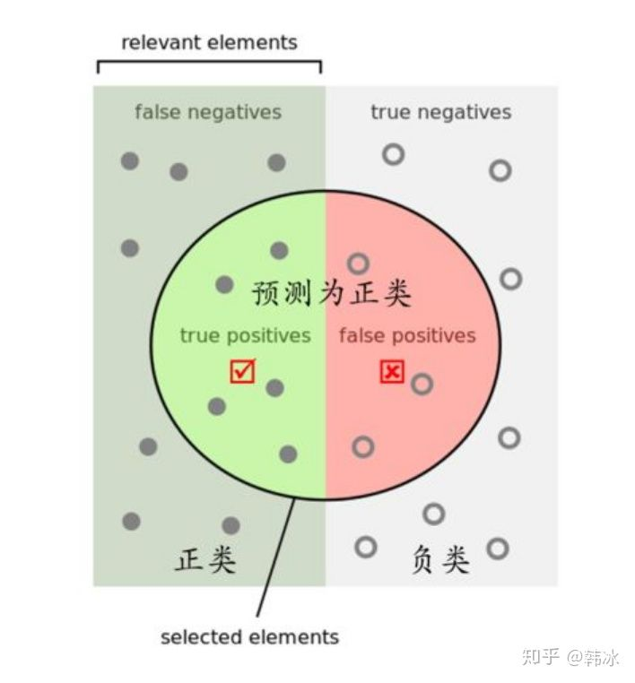
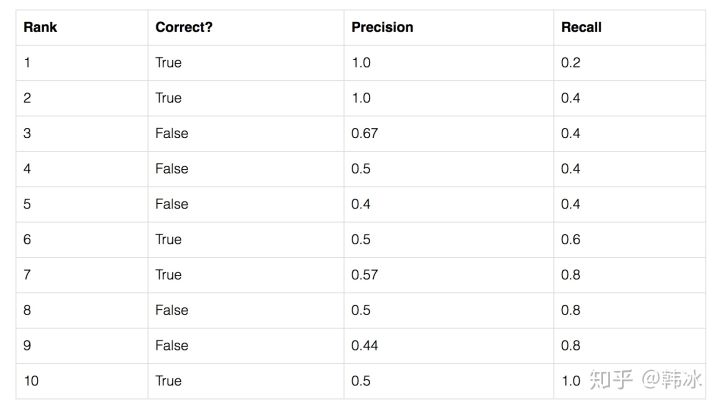
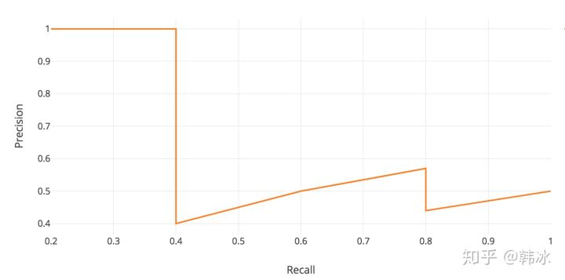
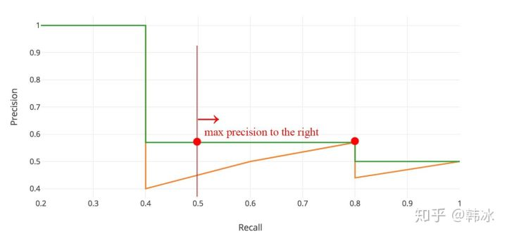

## 1. 精确率P和召回率R
首先了解关于TP、FP、TN和FN的含义：
TP：模型预测正确的正样本，gt为正样本；
FP：模型预测错误的负样本，gt为负样本；
TN：模型预测正确的负样本，gt为负样本；
FN：模型预测错误的正样本，gt为正样本：
注意：**TP、FP、TN、FN都是模型预测的结果，没有ground truth，正例在分类问题中指的是某一个label。**

- 精确率（查准率，检索的数据集）：反应真正例在检索中的数据所占的比例，包括正样本预测为正，正样本预测为负
$$P = \frac{TP}{TP+FP}$$
- 召回率（查全率，整个数据集）：反应总样本中的正例有多少被预测正确了，包括正例预测为正，负例预测为正，

## 2. AP
在介绍AP之前，首先理解PR曲线，以检测为例，假设数据集中共有5个待检测物体，模型预测出10个候选框，按照模型置信度对候选框进行排序：

以Recall值为横轴，Precision值为纵轴，我们可以得到PR曲线：

**AP(Average Precision)**
AP就是对PR曲线求积分：
$$AP = \int_{0}^{1}p(r)dr

实际上，需要对PR平滑处理，对其每个点Precision对值取右侧最大的Precision：

在COCO数据集中，在PR曲线中采样100个点进行计算，即：
$$AP=\frac{1}{100}\sum_{r_{1},r_{2},\cdots,r_{100}}P_{smooth}(i)$$

## 3. mAP
mAP所有类别的平均AP值：
$$mAP=\frac{1}{k}\sum_{i=1}^{k}AP_{i}

(部分参考：[https://zhuanlan.zhihu.com/p/88896868](https://zhuanlan.zhihu.com/p/88896868))