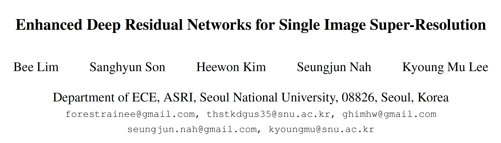
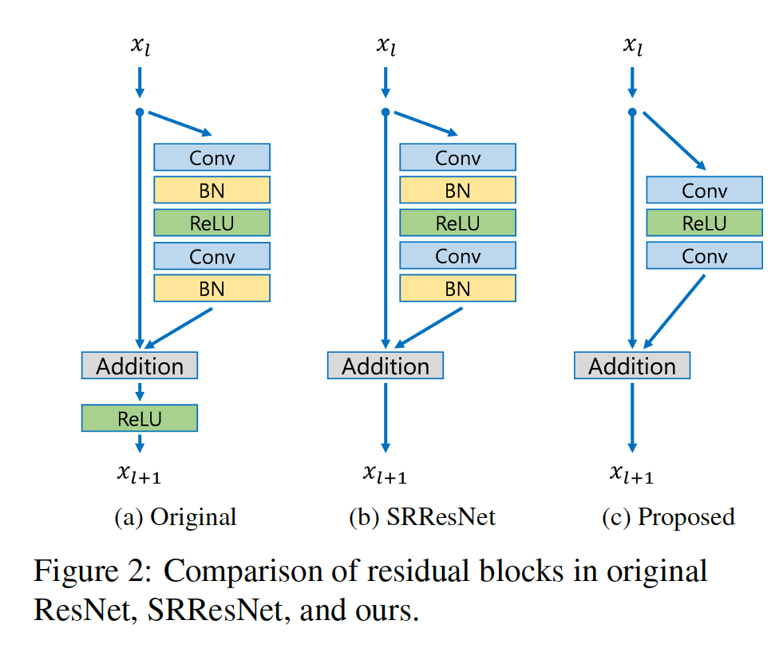
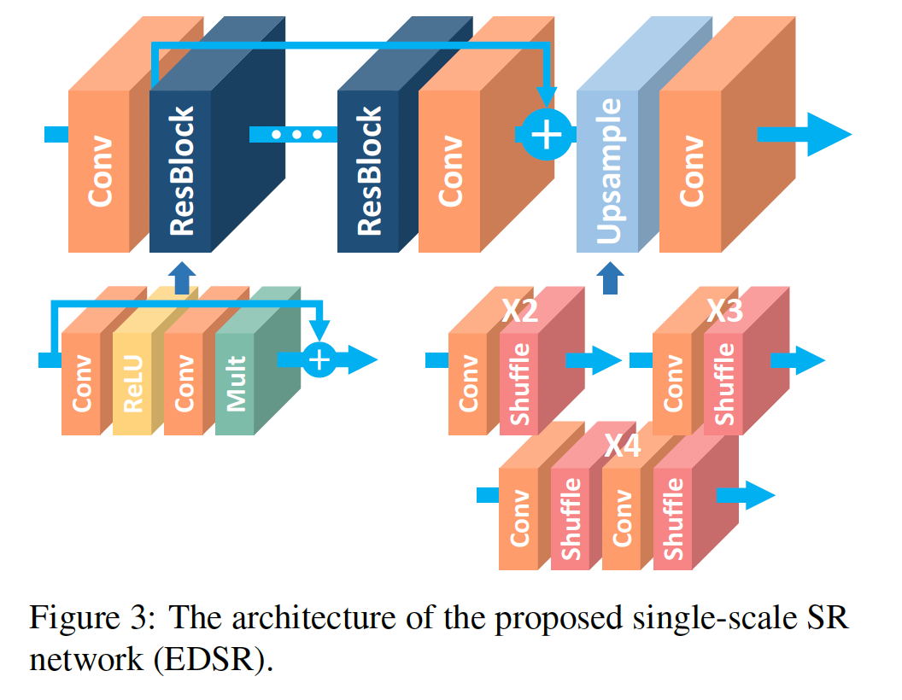
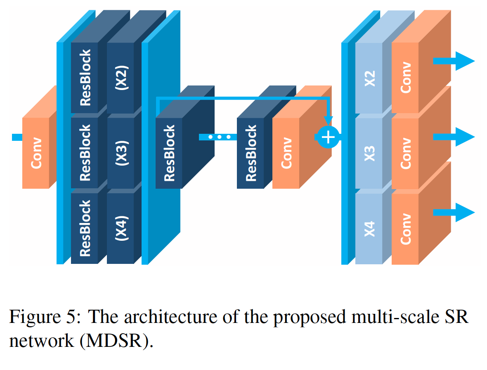
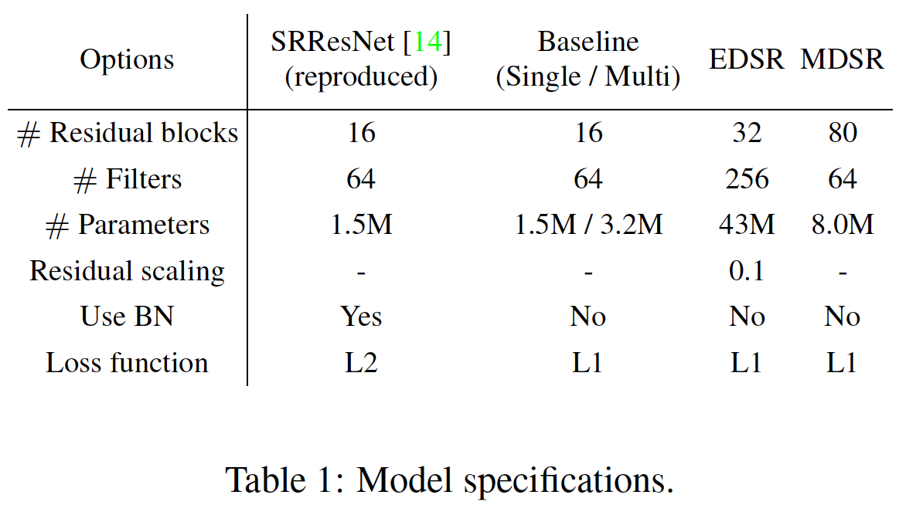
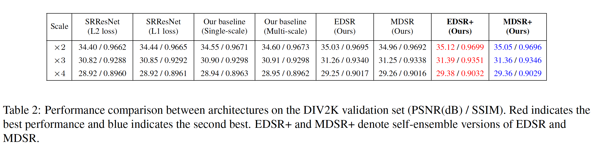
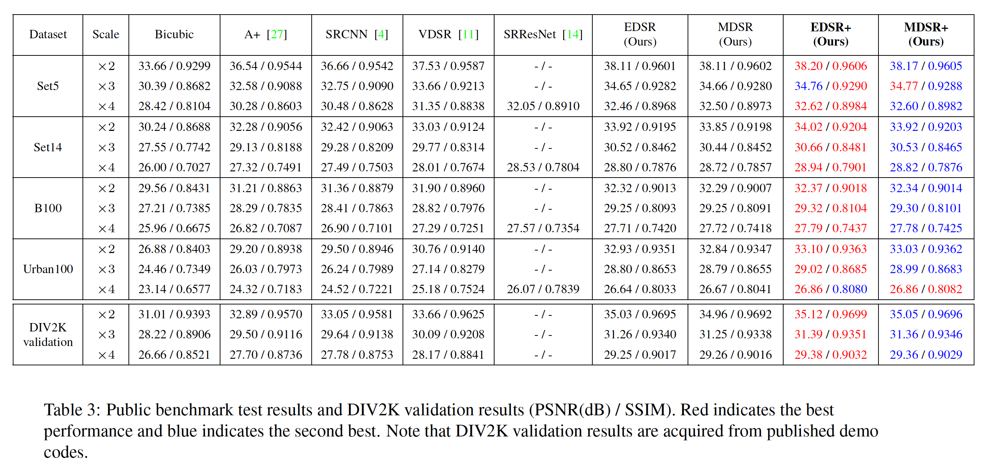

[[arXiv](https://arxiv.org/abs/1707.02921)][[github](https://github.com/thstkdgus35/EDSR-PyTorch)]，EDSR code可作为SR的codebase

 

**1. Abstract**     

​    NTIRE2017超分冠军，主要有以下两点贡献：a) 对于low-level的超分任务移除了ResNet的BN；b）提出多尺度融合方法在单模型中输出不同scale的重构图像。

 

**2. Problems**

SISR现有问题：

a). 模型的表现易受网络结构、初始化、训练方法的干扰，鲁棒性差；

b). 大多数SR算法只能输出单尺度的重构图像，对于多尺度图像如VDSR大大提高了SR性能，但VDSR预测时需要bibcuic图片延长了训练时间。

c). 之前的方法完全使用ResNet这种high-level任务的结构，而对于low-level任务的SR仍需优化ResNet结构。

 

**3. Methods**

**3.1 Residual blocks**

​    1）EDSR移除了BN，从而节省了大量计算资源，因为BN的计算量和一层CNN相当。

​    2）本文指出增大特征通道数带来的性能提升比增加网络深度更有效，因为CNN的参数量约等于O(BF^2)，B为深度，F为特征通道数，因此增加F能够显著增大模型的容量，但大量feature map会导致训练过程中数值不稳定，因此采用residual scaling方法稳定数值，即在残差块相加前乘以缩小系数稳定数值。**EDSR baseline****设置B=32****，F=256****，scaling factor=0.1****。**

 

**3.2 Single scale EDSR**

​    关于upsample：使用PixelShuffle方法进行up-scale，将(N,r*r*C,H,W) transoform到(N, C, rH, rW)，其中r为上采样因子，参考Real-Time Single Image and Video Super-Resolution Using an Efficient Sub-Pixel Convolutional Neural Network[[arXiv](https://arxiv.org/abs/1609.05158)]。

 

**3.3 Multi-scale EDSR**

多尺寸模型结构：

1）head：使用5*5大卷积核预处理，增加感受野；

2）multi-scale downsample：不同尺寸的ResBlock组成downsample模块；

3）body：多个共享res block形成主分支；

4）多尺寸的上采样模块处理组成重建模块。

 

**3.4 Model Statistics**

 

**4. Experiments**

**4.1 Settings**

1）预处理：将图片归一化到RGB range，减去均值。

2）参数设置：见论文或源码；

3）训练方式：*2 scale的模型直接下单，接着用*2模型初始化*3和*4的模型。

4）Loss：使用L1 loss

5）Geometric self-ensemble prediction（数据增强）：预测时，我们将输入图像旋转翻折得到8个预测结果，最后将8个结果反变换取平均得到最终结果。

 

**4.2 Results**

**5. Thoughs**

1） 在Multi-scale重建中如何提取有效的不同scale的上下文信息得到rich embedding的context information？

​    在不同scale的feature map蒸馏互相关矩阵？

2）尝试将RKD和DML应用于SISR的pipeline看是否涨点？