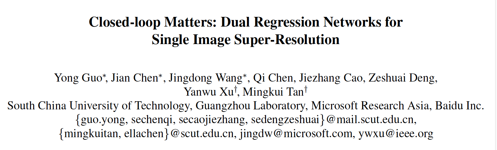

CVPR2020，github：https://github.com/guoyongcs/DRN.

 

**highlight**

\1. 从SR两个关键性问题出发：ill-posed问题和LR-HR pair难以获得，借鉴CycleGAN的思想，针对ill-poesd问题，加了一个**dual loss**来限制LR->HR的解空间；针对LR-HR pair难获得，提出使用dual loss来训unpaired data。（dual loss的假设：对于LR->HR存在映射函数P，那么对于HR->LR映射函数D，对输入数据x，有）

\2. 结果在**unpaired data**实验中较为明显，有大幅度的涨点，说明使用dual loss来指导unpaired data的训练，可以适应labeled data的domain，有一定的adaptation作用。

 

**思考：**

\1. 与StyleTransfer任务相比，SISR任务有label，不需要构建鉴别器，而ST任务需要构建GAN，SISR可以看作是ST任务无label的简化版，所以可以参考很多的ST方法；

\2. SISR任务在现实场景感觉超分的性能有限，特别是泛化性能不强，SISR这些深度方法工业级别的应用还是个有挑战的问题，希望能进一步了解工业级别的超分方法。

 

**1. Abstract**

**研究问题：**

1). SISR是一个ill-posed问题，即解不确定问题，因为存在无数个HR图片可退化到同一个LR，解空间大导致学习困难，无法很好的收敛；

2). 现实中LR-HR对难以获得，并且模型难以泛化到其他的退化核中。

**本文方法：**

提出一种对偶回归机制，在LR data添加额外的constraint来减少解空间，不仅学习从LR到HR的映射，构建对偶问题也学习LR的退化核，从而不依赖于HR，更加符合现实中的应用。

**Motiviation****：**

如果LR->HR的映射是最优的，那么SR能够被dowmsampled到同一个LR，即对于LR->HR存在映射函数P，那么对于HR->LR映射函数D，对输入数据x，有。（缩小解空间的假设）

 

**2. Methods**

**2.1 Paired Data**

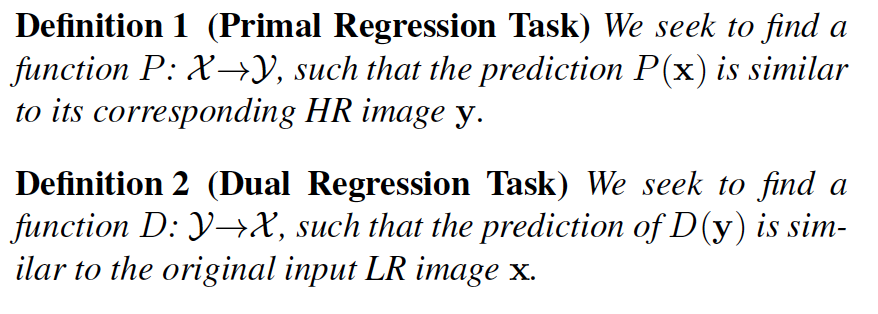

类似于CycleGAN，构建两种回归任务的网络P和D：

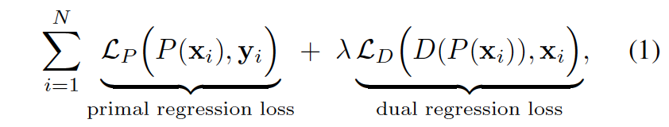

公式1为训练网络P的损失函数，包括SR loss + dual loss，dual loss可以被看作是一个正则化的手段。

训练网络Q的损失函数只有dual loss，因为超分任务关注于LR -> HR，并且本文实验证明这样做没有提升，而且参数量也大了一倍。

**2.2 Unpaired data**

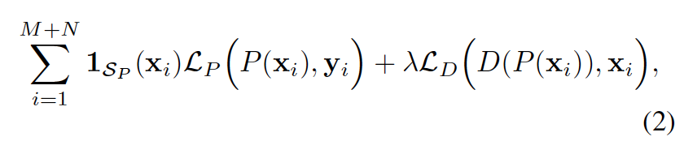

​    上式为unpaired data训练P的损失函数，其中M是从unpaired data采样的样本数，N是从paired data采样的样本数，Sp是paired data domain。当碰到unpaired data时，损失为dual loss（不需要label）；碰到paired data时，损失为监督损失。直观上是让unpaired data适应labeled data 的domain，起到domain adaptation的作用。

**2.3 Framework**

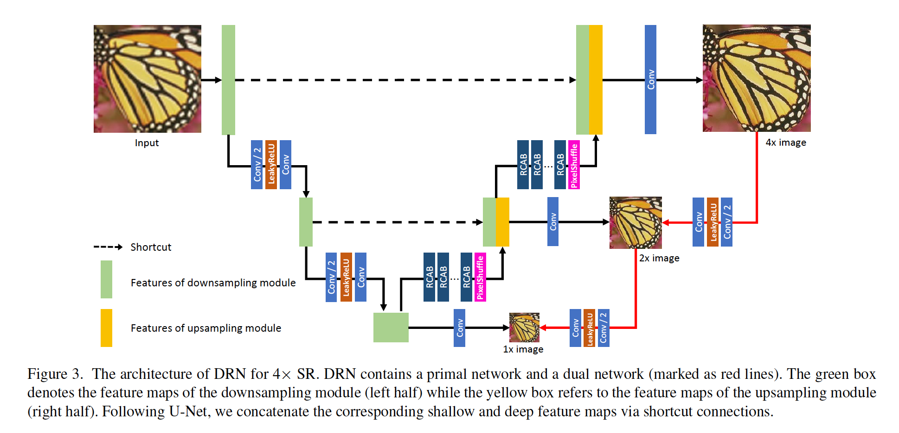

U-net结构，可同时输出多个scale的图片

**2.4 Training**

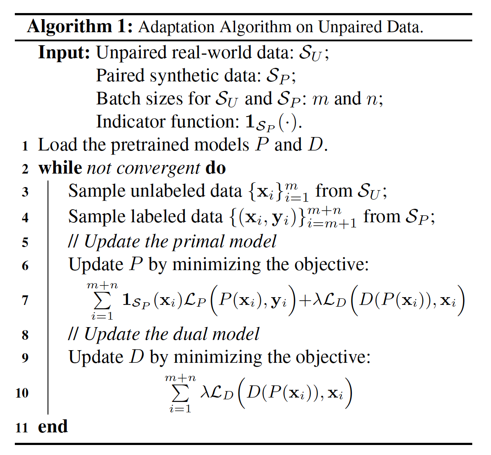

 

**3. Experiments**

**3.1 Results on Supervised Image SuperResolution**

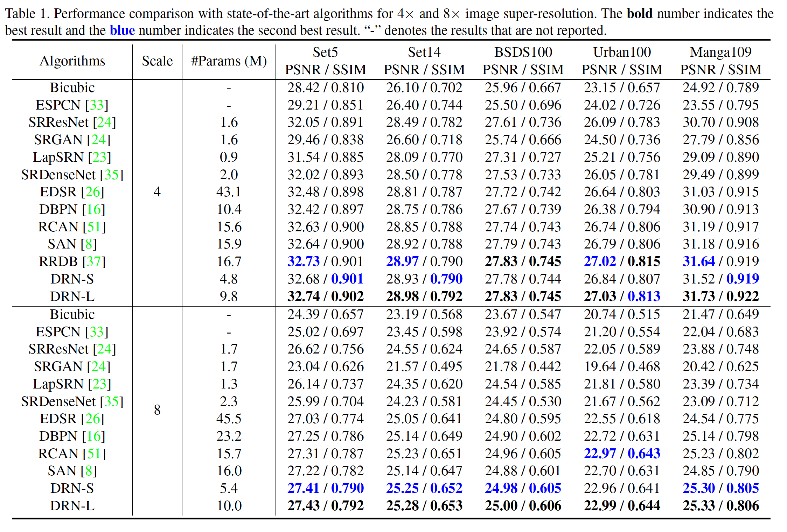

在paired data下有部分提升，且网络的参数量少，可能取决于网络结构的设计，。

3.2 Adaptation Results on Unpaired Data

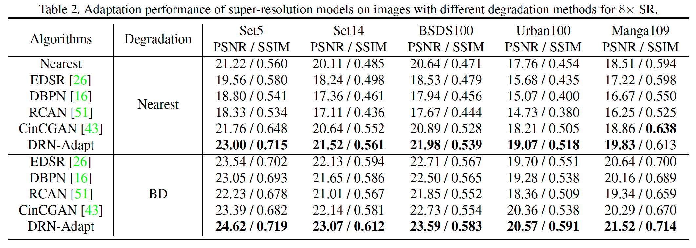

在adaptaion实验中，DRN效果明显，有大幅度涨点。

**3.3 Ablative study**

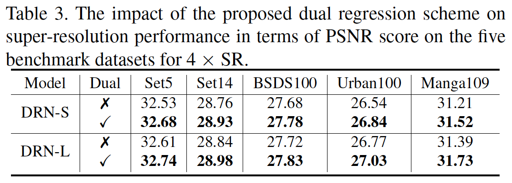

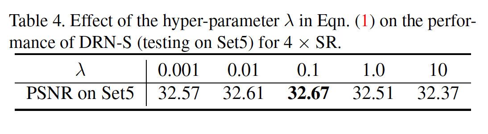

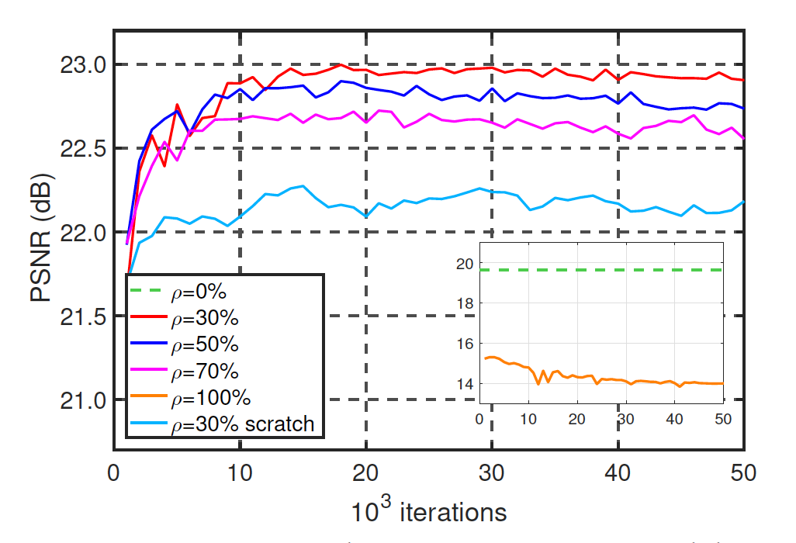

**3.4** **真实场景的效果**

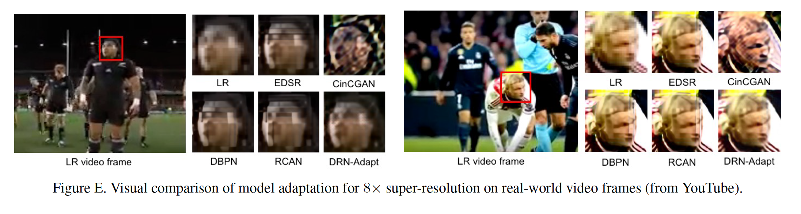