> 无数据知识蒸馏

**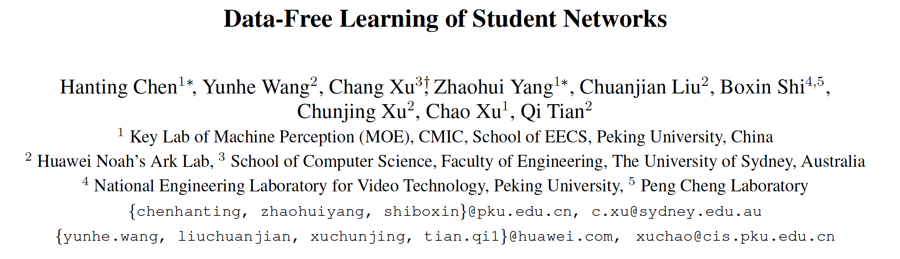**

本文是华为Noah实验室所做工作

github: https://github.com/huawei-noah/Data-Efficient-Model-Compression

 

**1. Abstract**

​    研究问题：出于隐私保护，当teacher模型结构参数和训练数据不可见时，如何进行蒸馏？

​    本文方法：提出使用**GAN**结构，将teacher作为**固定的****discriminator**，鉴别是real image还是generated image，使用自定义的generator网络**模仿训练集**生成训练样本结合teacher来训练student。

​    motiviation：使用generator输出的中间feature map以及输出的概率分布来模仿训练集样本的生成。

 

**2. Methods**

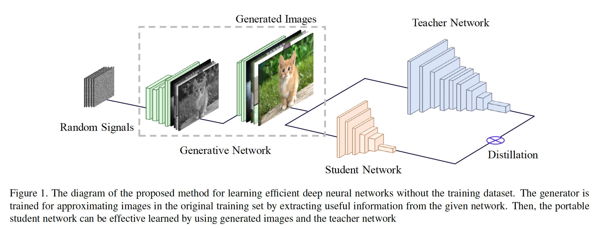

定义三种loss定义random signals的模仿真实training data的损失。

**2.1 GAN Loss**

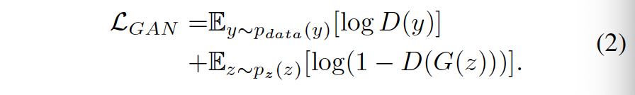

公式2为香草GAN的总损失函数。

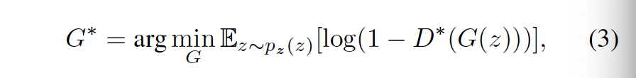

公式3为固定D后优化D的目标函数。

**2.2 One-hot Loss**

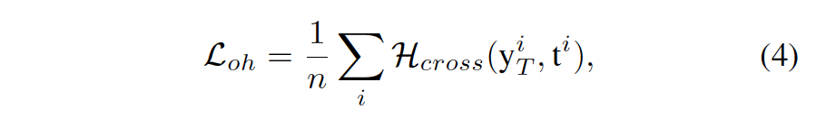

若G生成的图片分布类似于training data，那么D对该图片的预测输出分布应该接近于one-hot分布，标签输出的概率分布应该是discriminate的。

**2.3 Activiation Loss**

**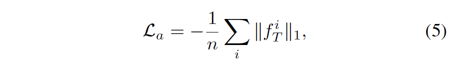**

DNN的feature map隐含了training data中固有的信息，对于分类任务，training data的激活特征图谱值往往较高，有很明显的discriminate feature，因此引入activation loss让G模仿real training data

**2.4 Information Loss**    

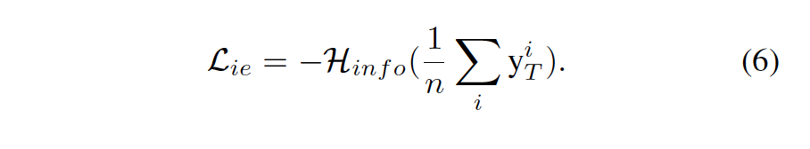

现实training data中，每个类的数量基本是平衡的，因此，为了让G模仿真实的training data，我们让G生成的n个img输入D中得到的平均输出分布y的**熵最大**(即每个类别平均输出分数接近，会不会与one-hot矛盾？不会，one-hot希望每个样本的输出分布接近one-hot，info-loss希望一批数据的平均输出分布接近，保证每个类别都有，**理想状态下输出****4****个分布为****[1, 0, 0, 0], [0, 1, 0, 0], [0, 0, 1, 0], [0, 0, 0, 1]**，既保证了one-hot，又保证了类别平衡)

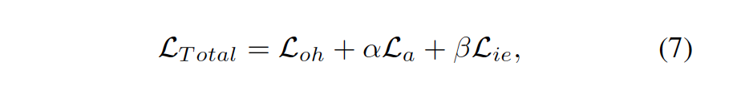

总损失函数如公式7.

**2.5 Pipeline**           

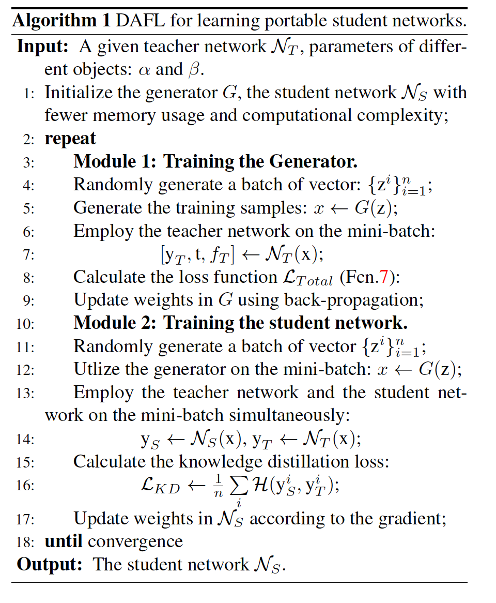

训练G：

\1. 初始化G和Ns

\2. 将teacher作为D固定，随机生成一个batch的向量输入到G中输出generated images x；

\3. 将x输入到D中，计算Ltotal；

\4. 使用Ltotal更新G得到trained G

训练S：

\1. 随机生成一个batch的向量

\2. 使用G生成generated images，输入到S和T；

\3. 计算KD loss

\4. 使用KD loss更新S的参数。

 

**3. Experiments**       

**3.1 MNIST**

**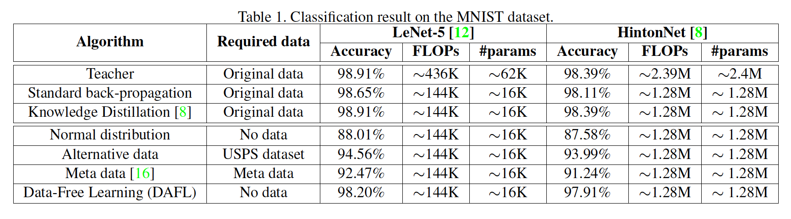**

**3.2 Ablation Study**

**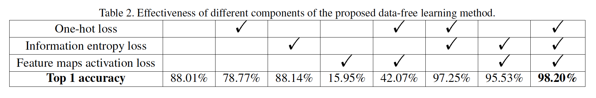**

**3.3 CIFAR**

**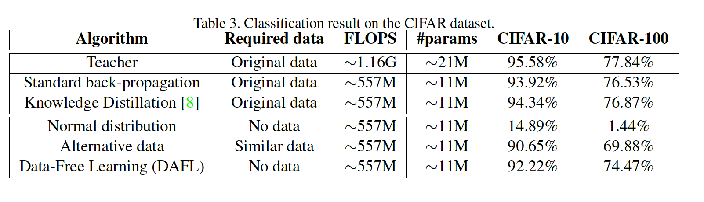**

 

**4. Thoughts**

   本文提供了一种无监督蒸馏的思路，不直接使用training data，而是通过training data在teacher网络中所表现的特征（输出概率分布，feature map）使用GAN模仿生成training data，接着训练student。

​    **网络输出特征来表征数据的特性。**

 