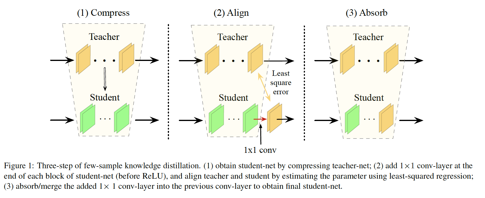

> 小样本知识蒸馏

论文阅读：

intel lab，代码待公开

 

**1. Abstraction** 

​    研究问题：

l 当常见的网络压缩方法(如剪枝、权值分解、网络瘦身)压缩率较高时，性能会大打折扣，如何既保持一定的压缩率，又不会丢失太多性能；

l 当只有teacher网络和少量的样本时，传统压缩方法，如fine-tune和设计合适的loss函数蒸馏的方法往往需要依赖大量的样本，如何在有限的样本数下实现高效蒸馏。

本文方法：本文结合了**网络压缩和蒸馏**提出一种小样本高效压缩方法，pipeline如下：

1）首先使用剪枝或权重分解的压缩方法压缩teacher得到被压缩的student；

2）在student的每个block后添加1*1的conv**对齐**teacher(由于压缩的student仍然具有一定的表征能力，1*1的conv足以补齐teacher与student之间的gap)；

3）前馈unlabeled few samples，使用**BCD****法**代替SGD法估计1*1conv的参数，可以在few samples的情况下对齐teacher；

4）1*1的conv可以和前层conv融合，基本不会增加参数量和计算量。

本文优势：

1). 网络压缩适用于边缘设备；

2). 适用于云端压缩，当用户只上传了部分数据，出于隐私保护；

3). FSKD具有较快的网络收敛速度。

 

**2. Methods**

整个pipleline如abstract所示。

 

**2.1 BCD****法对齐****teacher****（弥补压缩****gap****）**

****

层级使用最小二乘法更新参数，包括新添的1*1 conv，其中Q为1*1 conv，X为网络某一层的输出， M是网络blocks的数量。

​    使用BCD(block level 序列更新法)而不是SGD的原因：

1). BCD对于每一个block能够序列更新，不需要太多samples，而SGD将所有的block的loss考虑在一起，理论上需要更多的数据，适用于小样本学习；

2). BCD比SGD方法更加有效。

 

**2.2** **可吸收的****1\*1 conv**

理论1: 如果两个conv W和Q（1*1 conv）的输出channel和输入channel一样，且中间无任何激活函数，那么Q可以融入W成为W’

推论1: 当（1*1 conv的输出channel = 1*1 conv的输入channel = 前层conv输出channel）时，融合的conv与未融合前具有相同的参数和计算花费。

 

**3. Experiments**

**3.1 Filter** **剪枝**

****

student与teacher在未剪枝的filter上做l2 loss。

****

****

**3.2 Network Slimming****（网络瘦身，通道剪枝稀疏化）**

****

**3.3** **权重分解**

****

****

 

**4. Thought**

本文提出了使用一种可吸收的1*1 conv来将被压缩的student与未压缩的teacher对齐，并且提出了一种小样本学习方法来学习1*1 conv（**会不会产生过拟合？在****KD****体系中，因为有泛化能力较强的teacher****指导，小样本不会轻易过拟合**），理论证明了1*1 conv在特定条件下可以与前层conv融合，不增加计算量和参数。最后结合了剪枝、网络瘦身、权重分解等常见的压缩方法证明本方法的有效性。

该论文结合了网络压缩和KD方法，在一定程度上解决了网络压缩率过大时，如何提高小模型性能。