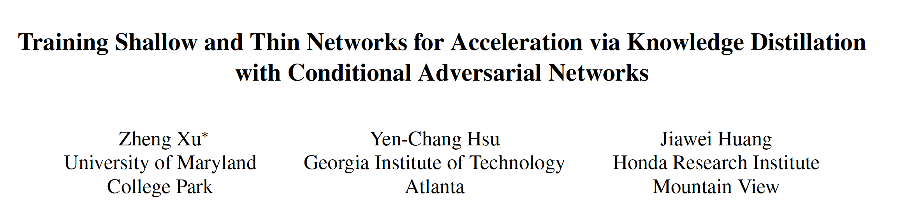

https://arxiv.org/abs/1709.00513

 

**1. Abstract**

​    本文从student的损失函数着手，使用一种可学习的损失函数GAN，并提出了一种**条件生成网络****CGAN****来进行知识迁移，将****student****的输出作为生成器，使用****MLP****作为鉴别器鉴别输出****logits****是来自于****student****或****teacher****，**当鉴别器难以鉴别时，student网络很好的学习到了teacher的知识，完成了知识蒸馏。

 

本文所提出方法的优势：

(1). 基于GAN的方法比基于KD的方法**更灵活**，**GAN****的鉴别器的结构设计比****KD****的温度系数的设置更加灵活**

(2). 基于GAN的方法能够捕获输出的**多模态性质**，如(car, cat, dog)存在两种模态的输出分布(0.6, 0.4, 0)和(0.7, 0.3, 0)，KD方法只能捕获固定模态的dark knowledge，本文提出的基于**鉴别器的损失函数作为**dark knowledge有利于捕获多模态信息

 

**2. Methods**

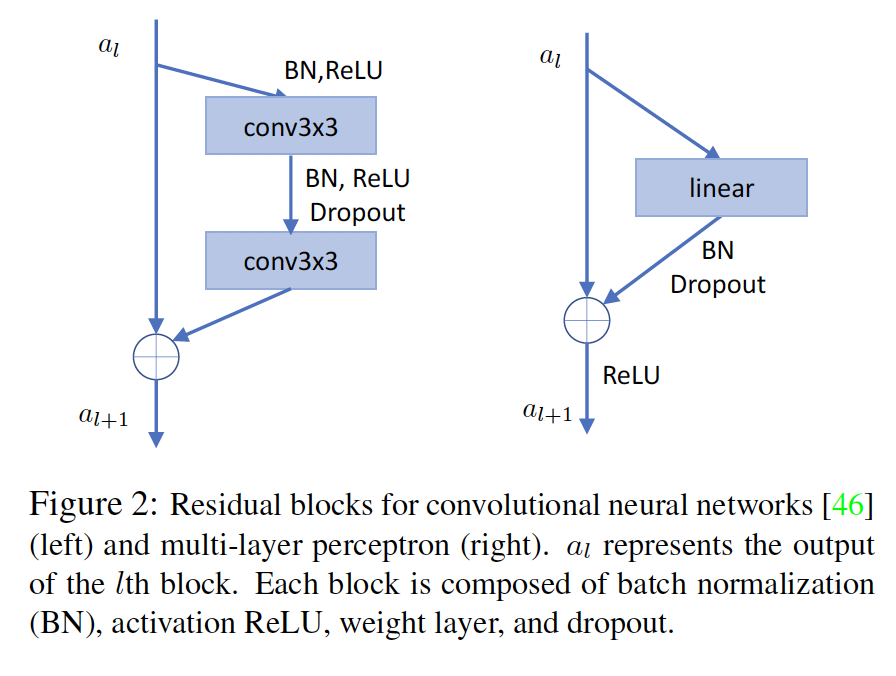

使用Residual block作为base block，保持了student和teacher的同构性。

**2. 1KD**

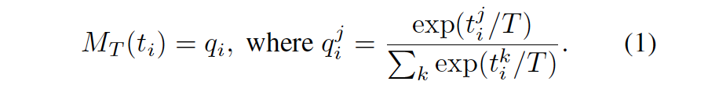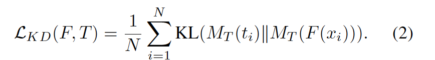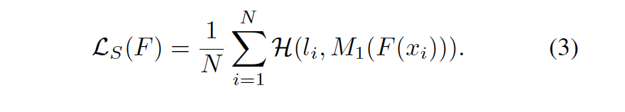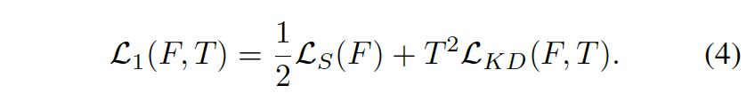

传统KD的损失函数。

 

**2.2** **整体框架**

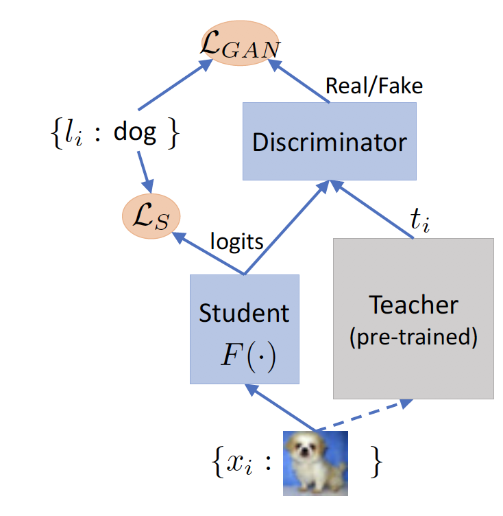

基于GAN方法的KD框架。

 

 

**2.3 Discriminator**

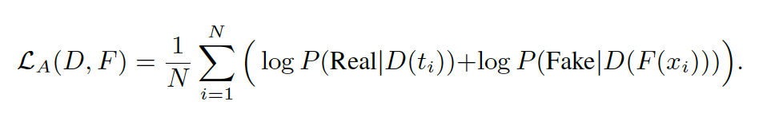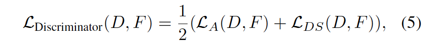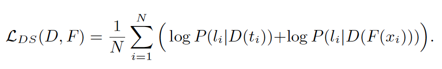

L_A是二分类的交叉熵，为了解决GAN训练的不稳定性（即使使用WGAN或LSGAN），**本文采用了****Auxiliary Classifier GANs****的思路，在判别器施加输出类别信息，增强****label****监督，缓解了****GAN****难以训练的问题**，判别器输出共C+2维的向量，C是类别信息，2是Real和Fake类别，指代输出的logtis来自于student和teacher的概率，**然后假设：类别信息和****Real/Fake****是相互独立的。**

 

**2.4 Generator**

 

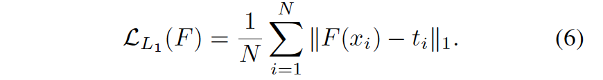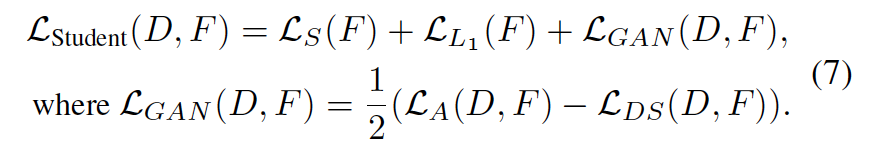

student网络的损失包含三个部分：

(1). Ls: 与真实标签的监督损失。

(2). L_L1: 与teacher输出logits的L1损失。（instance-level，实例级别的**L1****损失有利于****GAN****的训练**）

(3). L_GAN: GAN损失（category-level）

 

**2.5** **训练**

先固定student，用判别器的loss优化判别器，再用student loss优化Student。

 

**3. Experiments**

**3.1** **总体实验结果**

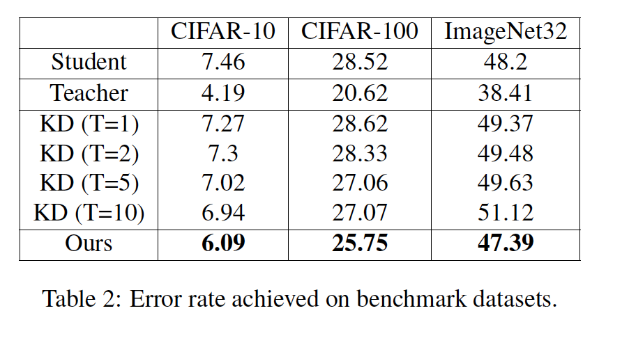

**3.2 Ablantion study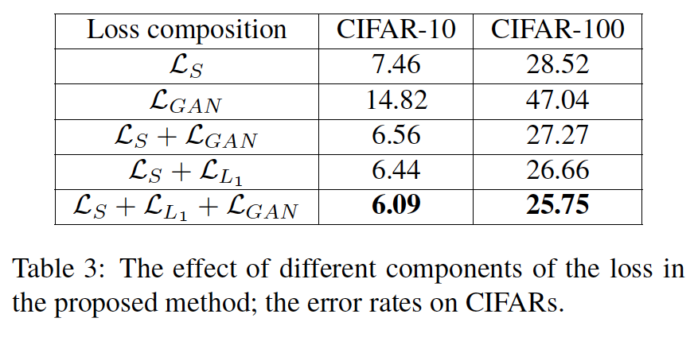**

可以看到以单独的GAN损失训练student并不会获得很好的效果。

 

**3.3 Trade-off between size and accurate**

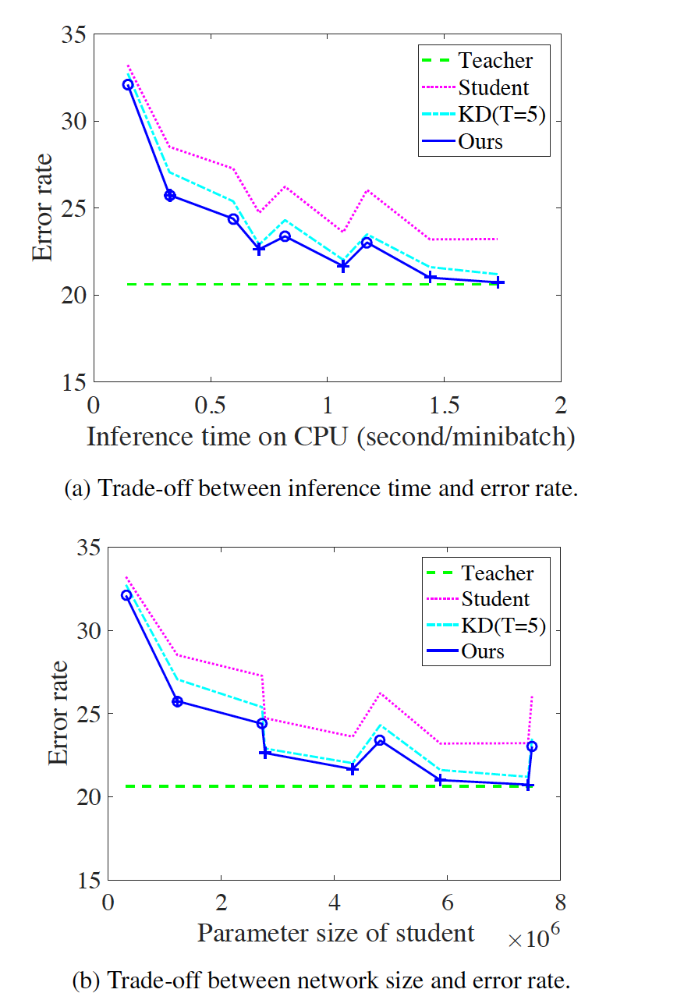

**4. Thoughts****：**

（1）本文假设了鉴别器输出的label和Real/Fake是条件独立的，但实际上Real/Fake易受student和teacher的输出分布的影响，是否可以使用GNN来建模label和Real/Fake之间的多标签之间的关系？