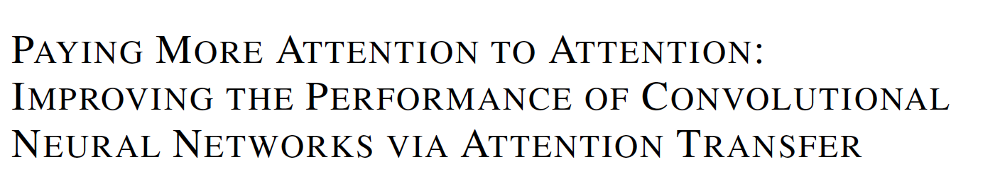

**2017**

**1. Abstract**

  本文提出了一种基于Spatial Attention的KD方法，解决了当student的架构和深度与teacher差距过大时，无法很好的收敛，AT+KD可以构建浅宽的student网络，学习teacher网络的attention maps知识，并探究了基于激活的attention和基于梯度的attention对模型蒸馏的表现，实验证明基于激活的attention+KD方法具有更好的学习能力和收敛速度。

 

源码：https://github.com/szagoruyko/attention-transfer

 

**Contributions****：**

(1). 本文使用Attention机制蒸馏teacher的attention map知识。

(2). 本文提出了两种attention机制：基于激活函数的和基于梯度的空间注意力图谱Spatial Attention map

(3). 本文实验证明了Attention能够提升深度网络的性能，包括残差和非残差网络。

(4). 本文展现了基于激活函数的attention比激活函数迁移更好的性能。

 

**2. Related work**

可视化注意力图谱问题：

(1). 基于梯度方法计算网络输出的雅可比矩阵，但不能明显区分各个类别。

(2). 使用deconvnet将特定的特征图谱映射到图像。

(3). 基于类别的可视化注意力图谱，通过移除顶层的avg-pooling layer，并将线性层转换为卷积层，从而生成每一个类的注意力图谱。

 

**3. Attention Transfer**

**3.1** **基于激活的注意力迁移**

 

**激活函数：**

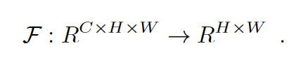

  F是基于激活的注意力迁移函数，将3D feature map映射为2D Attention map，其有如下的激活方式：

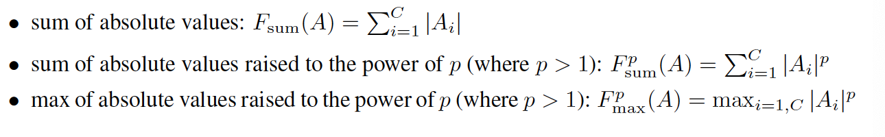

(1). channel wise对应pixels求和。求和能初步凸显出凸显的轮廓、线、边的信息。

(2). channel wise对应pixels的p的次方求和。能够压缩低pixel，增加高pixel，提高discriminative region的权重，增加对比度。随着p的升高，一些细节会逐渐消失。

(3). channel wise对应的p次方求max。p次方后取最显著的channel。

 

**不同****Level****下不同激活的可视化****Attention map****：**

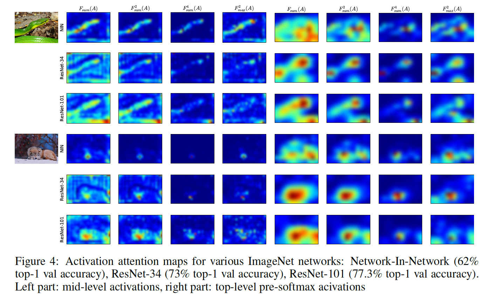

(1). 低层的attention map能够显示凸显大部分的特征。

(2). 中层的attention map能够显示具有区分度的区域，如眼睛、鼻子、嘴唇等，discriminative regions

(3). 高层的attention map能够显示完整的特征图片，但会关注主要的region，忽略次要的region。

 

**Teacher-student** **网络结构设计：**

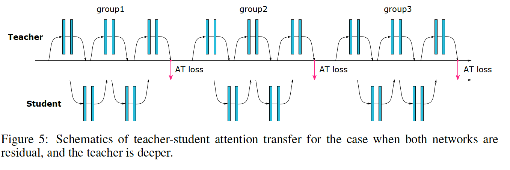

采用group hints的方法，每一个teacher-student pair计算一次hint loss，总损失函数：

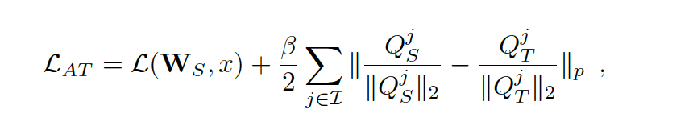

总损失函数 = student的交叉熵损失 + group-wise的attention loss；

  attention-loss的计算为l2 norm后的attention map之间的p范数，本文取二范数，本文指出，**如果不经过****l2 norm****，****student****的训练会失败**，可能导致梯度爆炸和消失。

  此外，本实验假设计算attention loss所需的student和teacher的attention map的shape是一样的，如果不同，则需要修改attention map映射到相同的shape。**基于激活的****Attention****方法的训练方式是与****fitnets****不同，是****one-stage training****。**

 

**3.2****基于梯度的注意力迁移**

  基于梯度的Attention transfer：探究当输入location变化时，输出结果的变化有多大，因此使student学习teacher的输出对输入的梯度图谱。

 

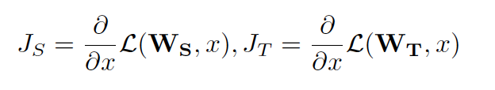

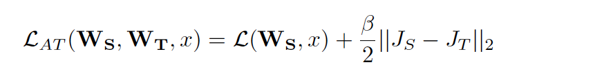

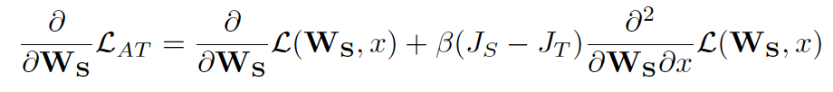

 

  其中Js和JT是student和teacher输出对输入的梯度，损失函数 = 交叉熵 + 梯度图谱差的二范数，**因此需要两次****back propagation****，第一次计算****loss****，第二次更新参数。**

  此外，本文提出将teacher的输入x进行水平flip操作进行数据增强，作为网络正则化手段。

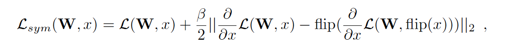

 

**4. Experiments**

**CIFAR-10:**

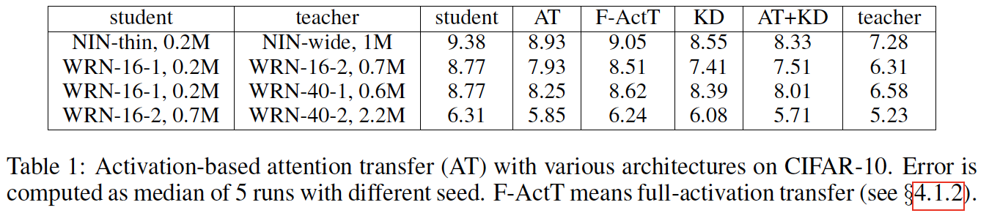

 

**不同激活函数之间对比：**

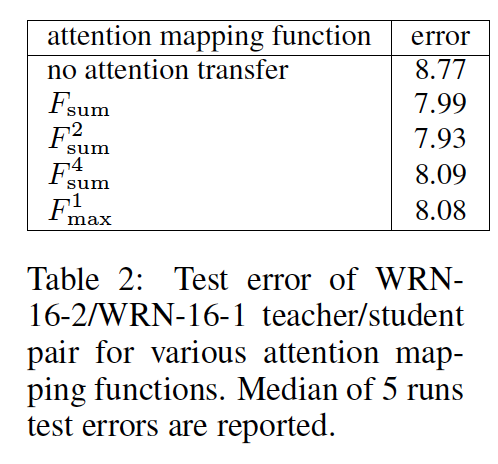

**基于梯度不同标准化类型的对比：**

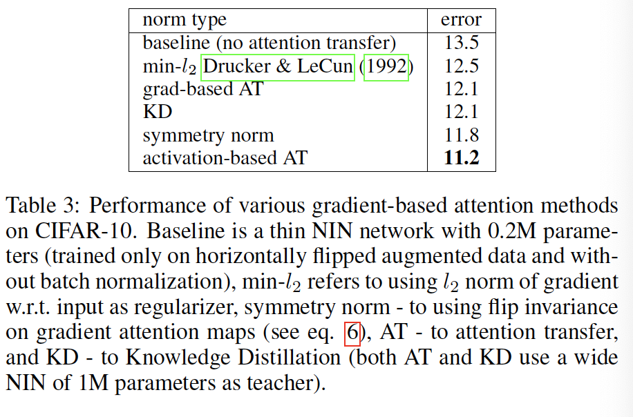

**大图片的实验对比：**

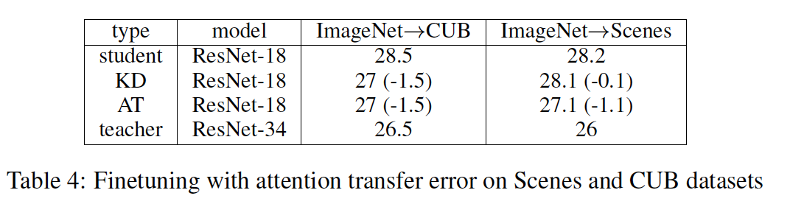

**5. Thoughts**

\1. 是否有其他更好的attention设计方法？

本文蒸馏了channel-wise的attention，并没考虑单个map的attention，是否可以在单个map不同region设计更好的attention，让student学习teacher的高层feature map metrics，如region sum、region pow、 region mean等，从而可以压缩student的深度。

其他channel-wise的attention，参考：

A gift from knowledge distillation: Fast optimization, network minimization and transfer learning

 

\2. 本文的训练方式是one-stage training，stage-wise training是否能加速student的收敛，获得更好的性能？

 

\3. 这里仍然是one teacher，引入多个teacher 层级强化训练是否会更好？

参考TAKD

https://arxiv.org/abs/1902.03393v1

 

\4. 为了增强student的泛化能力，是否可以将训练student的数据集迁移到另外的数据集中？

 

\5. 现有的教师学生网络模型中教师网络都是静态的，网络容量固定了，但教师也需要学习那些学习能力更强的学生网络，增强教师网络的鲁棒性，从而增强学生网络的泛化能力。

  如何解决学生网络性能变差的问题？

 