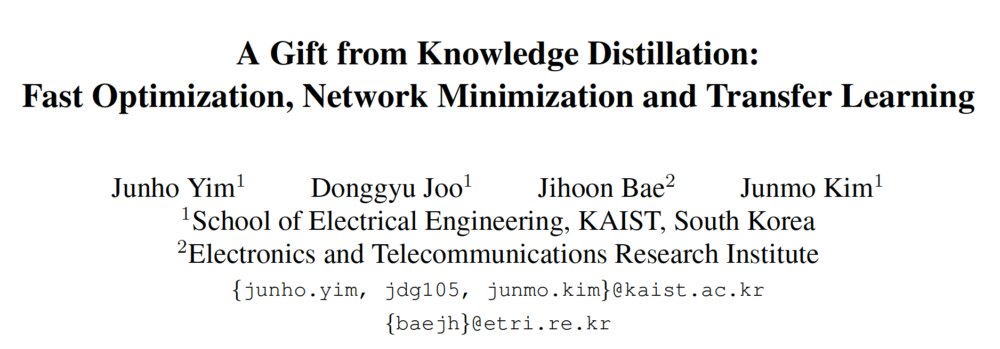
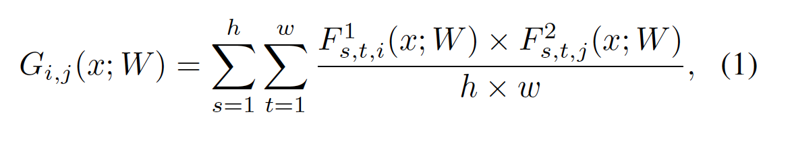
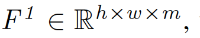
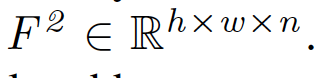
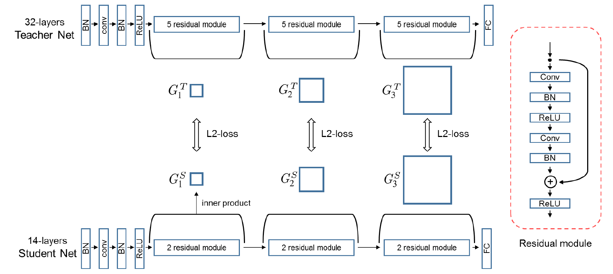
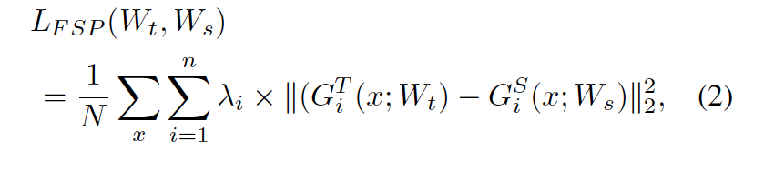
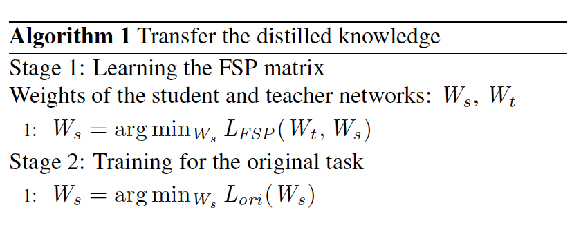
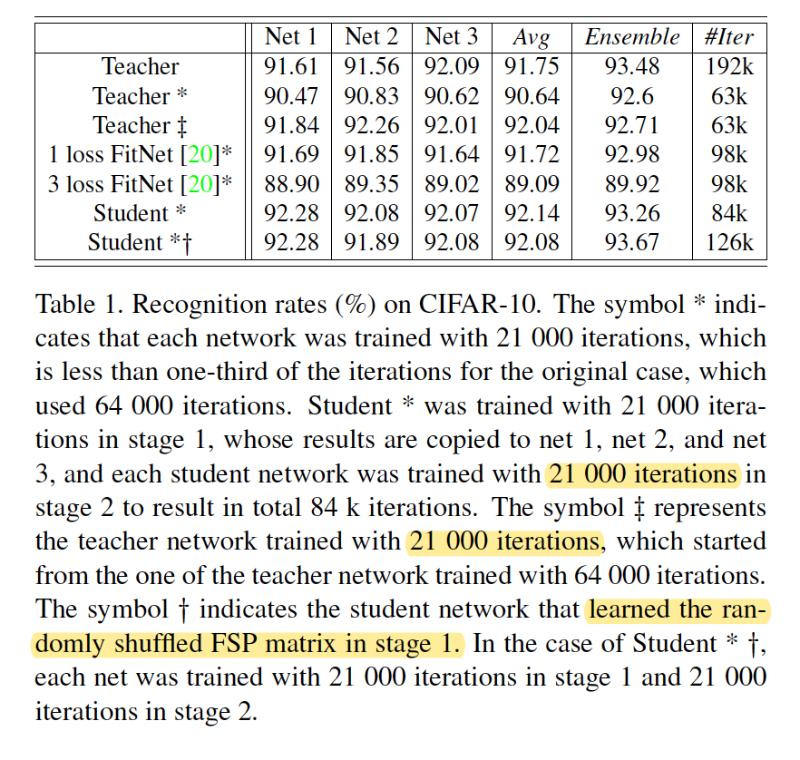
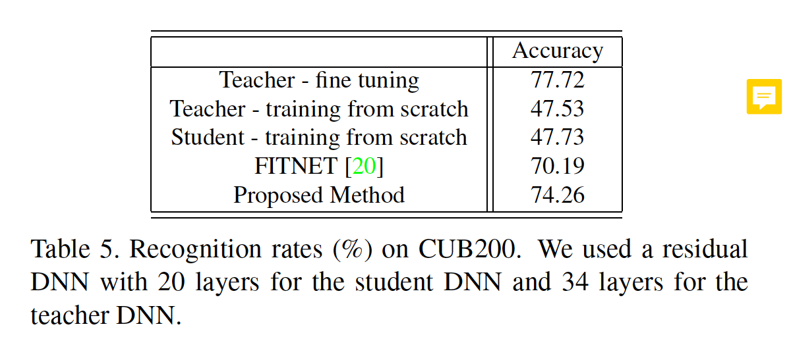

url: http://openaccess.thecvf.com/content_cvpr_2017/papers/Yim_A_Gift_From_CVPR_2017_paper.pdf

 

**1. Abstract** 

  本文研究了DNN中间两层的不同channel之间feature map的內积作为dark knowledge来学习（feature map的size相同），有助于student学习到解决问题的过程，而不是像fitnet只学习中间层的输出，即问题的答案，使用two-stage训练方法，先使用FSP Loss训练student，再单独训练student，实验证明了FSP方法有利于加快收敛速度、提升KD性能。

 

**2. Method** 

**2.1 FSP****矩阵**

​    FSP（Flow of the solution procedure）矩阵也称Gram矩阵(在style transfer

有应用)，其定义为：

其中F1和F2是所选择的两个中间层， ，h、w为feature map的size，m和n分别为F1和F2的channel数。上式计算两个大小相同、channel不同的feature map F1、F2之间的內积和。G_ij是F1的第i个channel和F2第j个channel之间的內积和，从而学习F1和F2之间的channel-wise的相关性。

 

**2.2** **网络结构**

Overall framework：

 

FSP的loss函数如下：

所有的FSP矩阵的L2 loss平均值。

 

**2.3** **训练过程**

同fitnet

**3. Experiments**

**3.1 CIFAR-10**

****

FSP方法加快了训练速度，只需要teacher的1/3的iter即可收敛。

**3.1 Transfer learning**

实验证明FSP方法在迁移学习上是有效的。

 

 

**4. Thoughts****：**

（1）本文仍然限制了teacher和student具有相同的结构，保证student和teacher的FSP矩阵保持相同的size，即feature map size相同，如何解决两个不同size的layer，并能自适应选择最优的两层layer是值得探讨的问题

 

（2）本文仍然是提取channel-wise的特征，并没考虑feature map层的region level特征，是否有好的现有work？

 

 

 