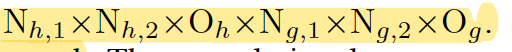

2015

**1. Abstract**

本文从teacher net的中间层，指导student net的中间层，提出了Hint-based training方法，将student net分为两步来训练，先使用HT训练半层，再使用KD训练整个网络。从而构建一个更thin和deeper的student net（比teacher net要瘦，但比更深，实验证明了student net的深度能够提高模型的容量），但由于teacher net的中间层神经元远大于student net，因此需要引入额外的参数来进行映射。

 

与KD logits区别：

KD logits蒸馏了输出层；

Fitnet蒸馏了中间层，并提出分阶段训练方法；

Fitnet使用更深的student net，增加模型的容量。

 

**2. Method**

​    本文提出使用teacher net的中间层来指导student net的预训练，再使用KD训练整个student net。

 

**2.1 Stage wise training****：**

(1). Hint-based training：

上式是第一阶段的的training loss即hint loss，其中h是hint layer，g是guided layer，uh是teacher net到第h层的前馈函数，vg是student net到第g层的前馈函数，W_hint是对应的teacher net的参数，W_guided是需要学习的student net的参数。由于student net神经元个数比teacher net少，因此第g层的输出维度小于teacher net的hint layer，此时引入一个回归器，将student net的中间层输出映射到teacher net中间层相同的维度，并计算其MSE 损失，其中包含了回归参数Wr。

 

**关于****Hint layer****和****Guided layer****的选择：**

​    hint layer是一种**正则化**的手段，可以理解为teacher隐层监督student net，如果guided layer很深，student net就会陷入过度正则化（因为接近output layer，student net后续不具有自我学习能力），因此我们选择中间层作为hint layer和guided layer。

 

**关于回归器的选择：**

​    假设teacher net的输出了O_h个N_h1×N_h2个feature map，student net输出了O_g个N_g1×N_g2个feature map,如果使用线性映射器，则会引入

这么多参数，又考虑到feature map的位置不变性，因此使用conv layer来进行映射，卷积层的shape：

(in_channel, out_channel, H, W) = (O_g, O_h, k1, k2)

其中N_gi - ki + 1 = N_hi，step=1， pad=0。 此外，应注意：为了保证hint layer 和 guided layer具有可比性，回归器必须和hint layer的输出层具有相同的非线性激活，如都是ReLu。

(2). KD training:

使用KD再训练整个student net，并在训练过程中，逐步退火λ，减少teacher net给予的监督，即减少teacher net的正则化强度，student net通过自我学习提高能力。（师傅领进门，修行靠个人哇）

 

**2.2****与课程学习****curriculum learning****之间的关系**

  hint-based training实际上是curriculum learning的一个特例，student net网络先学习teacher net的中间层表征，再使用KD logits训练整个网络，并在训练过程中不断退火λ，减少teacher net的监督。本文指出了，在student net学习初期，**teacher net****具有很高的****teacher confidence**，对sutdent net的指导作用比student net自身学习的大，因此，初始λ较大，随着student net具有一定的学习能力时，**teacher net****具有较低的****teacher confidence**，因此通过退火λ减少teacher net的监督，减少正则化强度。

 

**3. Experiments**

**3.1 CIFAR 10 and CIFAR 100**

**3.2 SVHN and MINIST**

**3.3** **分析****student net****的深度对于****HT****的影响**

可以看到KD无法训练更深的网络，而HT可以训练更深的网络，从而提高模型容量和准确率。上图显示了：

(1). HT可以训练更深的网络，相比于BP和KD

(2). 当网络容量固定，深度模型的性能大于浅层模型。

 

**3.4** **模型表现与速度的权衡**

**4. Thoughts**

(1). 关于hint layer 和 guided layer的选择问题：

本文选择了中间层作为hint layer和guided layer，是否其他层会更好，亦或者选择多层作为hint layer和guided layer，做一个multi-stage leanring，有没有一个自适应选择的方法？

 

(2). 蒸馏选择：

HT和KD logits分别蒸馏了中间层和输出层，是否可以蒸馏输入层，即压缩训练样本，进行小样本学习？

参考华为诺亚实验室的：PU compression

https://arxiv.org/pdf/1909.09757.pdf

 

(3). 关于中间层的蒸馏方法：

本文只是在feature map上计算MSE作为loss，MSE是否是一个很好的指标？是否有其他的蒸馏方法，比如使用Attention提取teacher net中间层的hint information来作为student net的监督？

参考：下一篇文章

 

(4). 关于深瘦网络的性能：

虽然深层网络可以提高模型准确率，但随着网络深度的增加，准确率的提升只来源于网络的容量，如参数量，16层的ResNet和1000层的ResNet在相同参数量的情况下模型表现一样，此外深瘦的网络可并行化能力差，训练耗时增加。是否存在其他蒸馏方法构建浅宽的student？

参考下一篇文章

 