> 蒸馏feature map的statistics

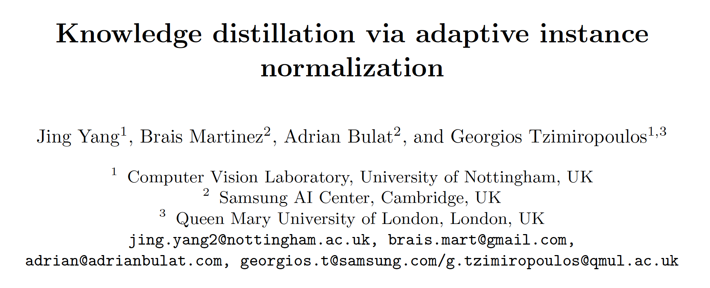

本文提供了两种思想：

\1. 蒸馏feature map的高阶数学统计量，channel-wise的均值和方差，RKD可以视为在batch-wise蒸馏二阶和三阶统计量；

\2. 将student学到的知识反馈给teacher，让teacher判断是否可取。实际上，构建同构同参的T’，将student的知识(如statistics)用于teacher的输出feature map F’，使得F’包含了student的知识，最后在teacher同时前馈F和F’，在输出层计算L2 Loss作为反馈loss。

 

可研究的点：

\1. 尝试batch-wise点统计量；

\2. 尝试提取channel之间的相关性（好像没有work做过）；

\3. 反馈loss的应用。

 

**1. Abstract**

本文针对channel-wise的均值和方差蒸馏feature map的metrics，不同于先前方法，本文设计了新的loss用于将迁移的知识反馈给teacher，teacher去判断是否值得学习。

在分类任务上，与SOTA方法，如RKD、CKD、AT等方法相比，取得显著提升。

 

**2. Methods**

**2.1 Framework**

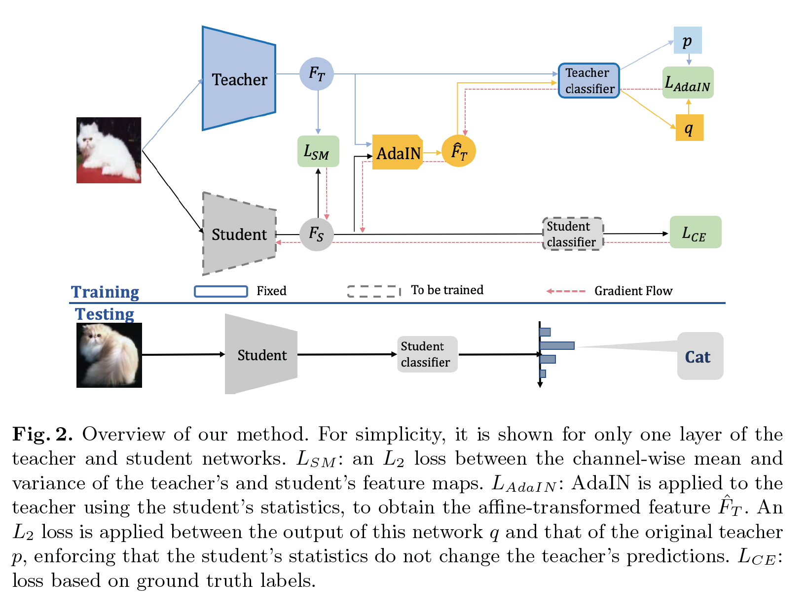

引入了三种loss：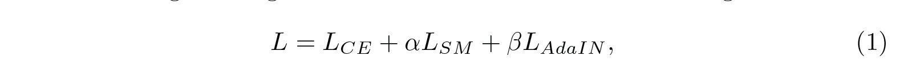

Lce：task-specified loss，交叉熵；

Lsm：蒸馏metric loss，statistics之间的L2 loss；

LAdaIN：反馈loss，反馈输出与teacher原输出之间的L2 loss。

**2.2 Statistics Transfer**

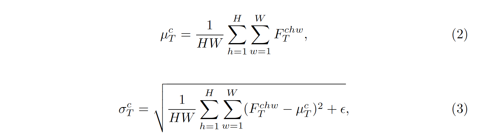

上式为在teacher上计算的channel-wise均值和方差，Lsm: 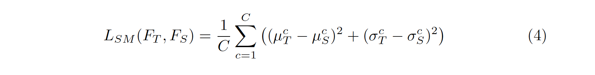 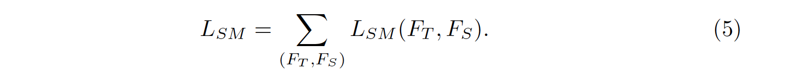

**2.3** **反馈****loss**

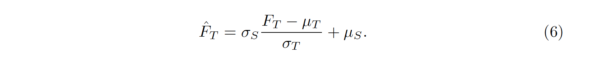

上式使用student的knowledge构建student空间的teacher feature map，LAdaIN:

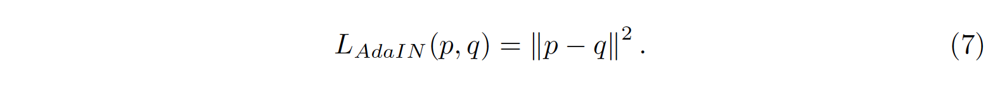

其中p和q分别是原始teacher的feature map F和反馈feature map F’得到的输出概率分布。

**2.4 Training**

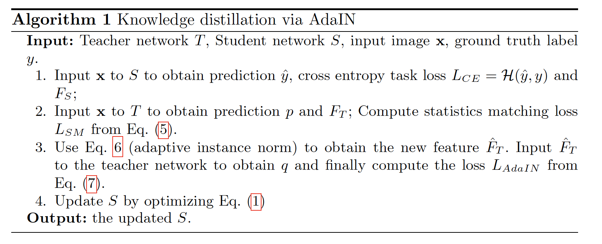

 

**3. Experiments**

**3.1 Ablation Study**

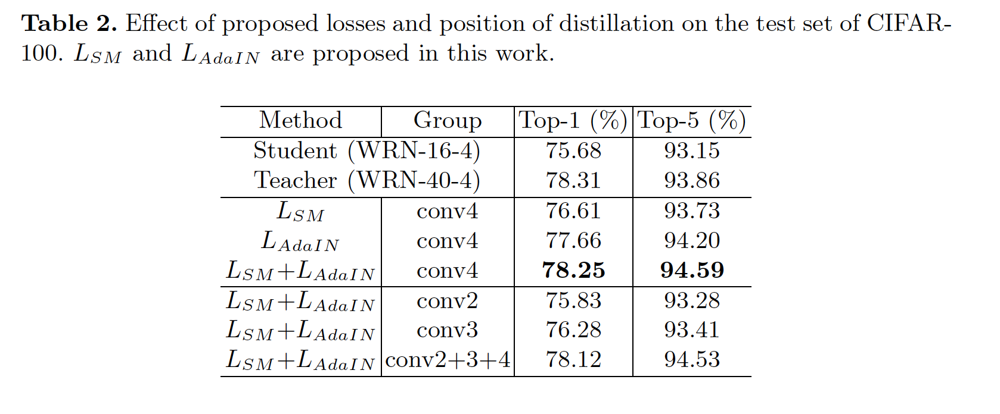

可以看到对于high-level的分类任务，高层conv往往具有disriminative的特征，蒸馏高层conv比底层conv更为有效，而同时蒸低层和高层可能会导致难以学习。

思考：对于SISR任务，可以实验尝试同时蒸馏低频和高频信息。

**3.2 Teacher-student similarity**

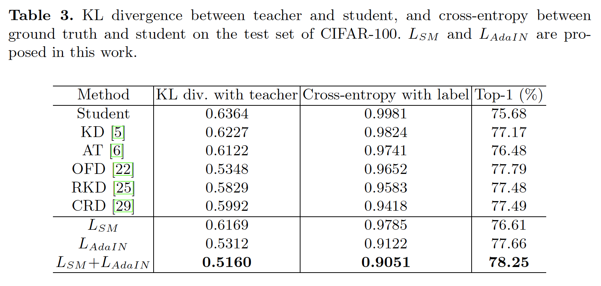

可以看到本方法能使得student的输出KL散度逼近于teacher。

**3.3 Teacher-student distance** 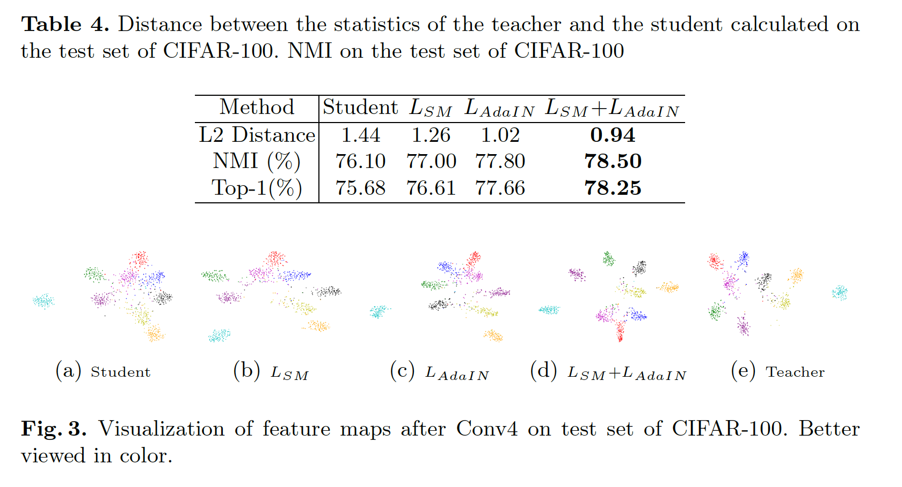

student的距离与teacher也更接近了。

**3.4 SOTA****方法对比**

CIFAR10:

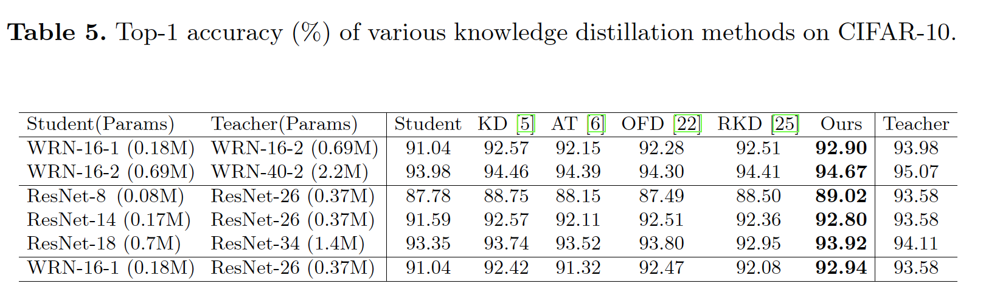

CIFAR100:

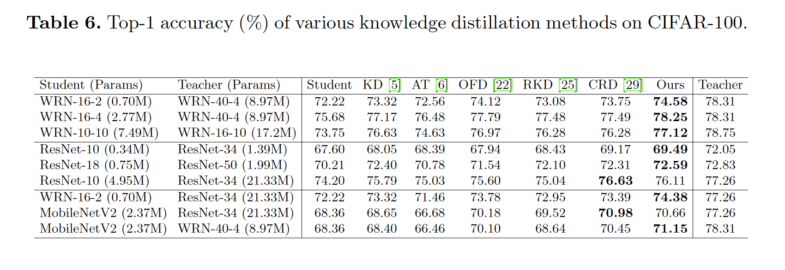

ImageNet：

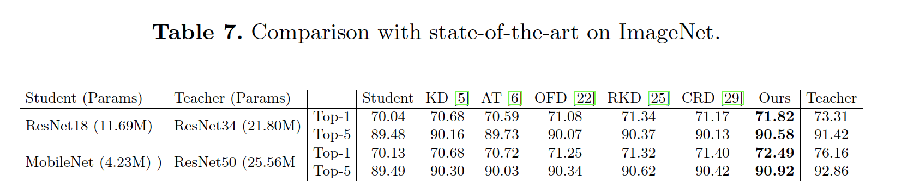

 