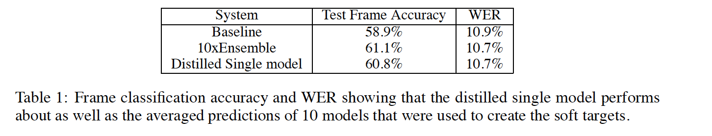

知识蒸馏KD指使用已经训练好的复杂的Teacher模型，指导训练一个轻量的Student模型，在减小模型大小和计算资源的同时，Student模型尽量保持Teacher模型的准确率，本文是KD的开山之作。

 

1. Contribution：

(1). 传统的监督任务的监督信号是one-hot vector[0, 0, 1, 0, 0,…]，所含的信息只有log(n)，其中n为分类类别的数量，KD通过使用Teacher网络的输出softmax概率分布[0.2, 0.01, 0.7, 0.09]作为Student网络的监督信号指导Student网络学习，其中进一步使用温度系数T来得到更为平滑的softmax概率分布，从而提供更多的类内和类间监督信息。

(2). 此外，本文也提出使用多个专家模型来区分易混淆的类别，能够实现并行的细粒度分类。

 

2. Distillation

平滑softmax，T > 1时，有平滑效果，增强类间和类内的监督信息。对于Student模型，其平滑交叉熵损失：

其中pi是Teacher模型输出的soft target，qi为Student模型输出的softmax output，本文提出使用多任务损失函数作为Student模型的损失：

其中Lhard是one-hot label作为监督的传统交叉熵损失，λ为权重系数，为了平衡在反馈过程中，梯度被温度系数T缩减了T^2倍。

 

3. MNIST上的实验

   使用soft target能明显提高Student模型的预测性能，学习到类内和类间监督信息，如本文在训练Student时，在训练集去除了3这个类别，soft target策略在测试时能预测部分的3，而没有soft target则完全学习不到3这个类别。

 

4. 语音识别的实验

 

5. 大数据集上的集成模型

   在大数据集上训练多个模型的计算资源很大，本文提出了使用一个通用generalist模型在所有的数据集上进行训练，使用多个专用specialist模型在部分细粒度(Fine-grained)类别的数据集外加一个dustbin(从剩余类别随机采样)进行训练，其中可以通过计算类别混淆矩阵、聚类的方法来区别细粒度类别。但这样训练会导致专用模型对其他的类别的分类能力为0，为了解决这个问题，本文将generalist生成的soft target进行fine-tune：

   Step1：对于每一个测试样例，首先通过generalist模型找到top n的classes，记为k。

Step2：然后找到与k相交的specialist记为Ak，通过最小化generalist和specialist与测试样例的输出概率分布的KL散度（使得测试样例输出概率分布同时贴近于generalist和specialist的输出概率分布）：

其中p^m和p^g为specialist和generalist生成的soft概率分布，

 

6. 大数据集JFT的结果

