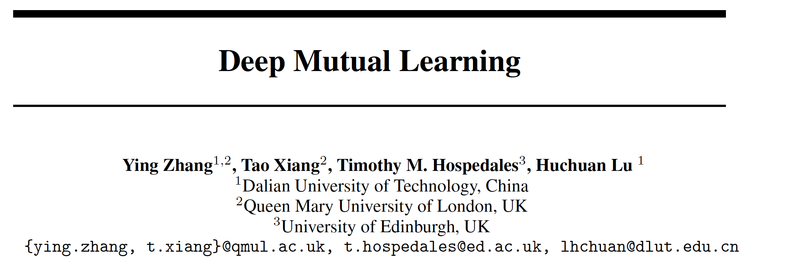

 

github： 

 

**1. Abstract**

​    本文从蒸馏的**学习策略**入手，提出了无teacher，students之间相互学习的学习策略，使得网络输出具有多模态性质，提高了网络的**鲁棒性**。

​    **Motiviation****：**小模型仍然具有与大模型同样的表征能力，但小模型的解空间小，难以获得局部最优解，即难以训练。而大模型的解空间更大，局部最优解更易获得，且鲁棒性更强。本文提出了多个学生网络互相蒸馏输出概率分布的蒸馏策略，让student适应多个可能的局部最优解的模态，提高了网络的鲁棒性。

​    一个形象的比喻：在广阔的田野里，一个微小的扰动几乎不会被注意；而在狭窄的山谷里，一个铁针落地的声音便会发出很大的声响。DML并没有增大网络的解空间，而是融合了多个局部最优解，提高鲁棒性。

 

**2. Methods**

**2.1 Formulation****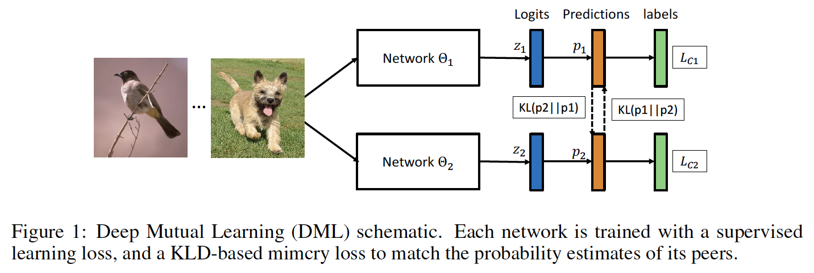**

输出softmax概率分布：

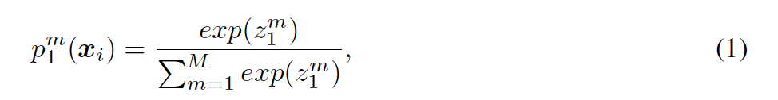

交叉熵损失：

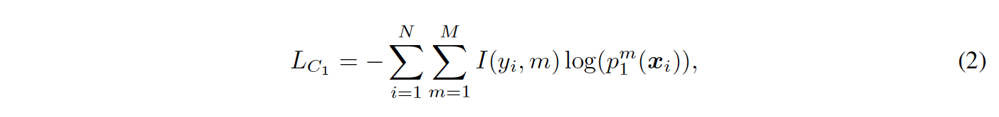

其中，I(yi, m)是指示函数，p1和p2的KL散度作为蒸馏目标：

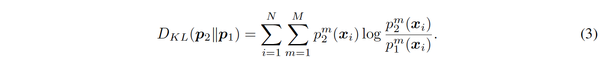

KL散度为了让p1的输出分布尽量接近p2的输出分布，上述衡量p1输出分布与p2输出分布的接近程度，于是有**DML****损失函数**：

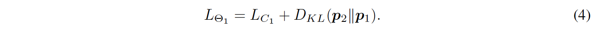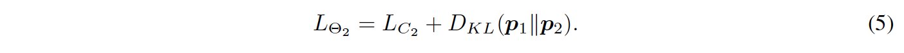

注意：KL散度**不具有对称性**，以首项为基准，衡量后项与首项的接近程度。

 

**2.2 Optimisation**

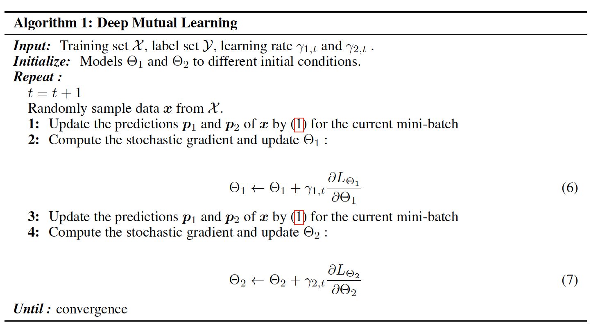

当存在2个student时，需两次前馈和反馈，分段更新参数。

 

**2.2 Extension to Larger Student Cohorts**

当存在K个student队列时，存在两种训练策略，1）对于第k个student，计算其与K-1个student的KL散度求和平均作为loss函数；2）对于第k个student，计算K-1个输出分布的均值pavg，计算pk与pavg的KL散度：

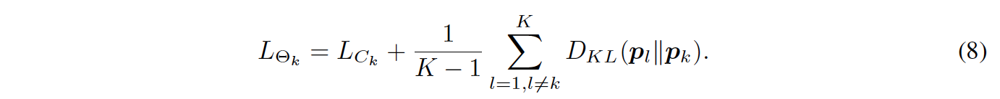

   **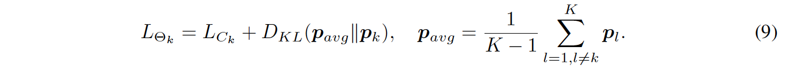**

本文指出取均值操作是的所有的student的p_avg接近，降低了学习器的输出分布多样性，带来降点。

 

**3. Experiments**

**3.1 CIFAR-100**

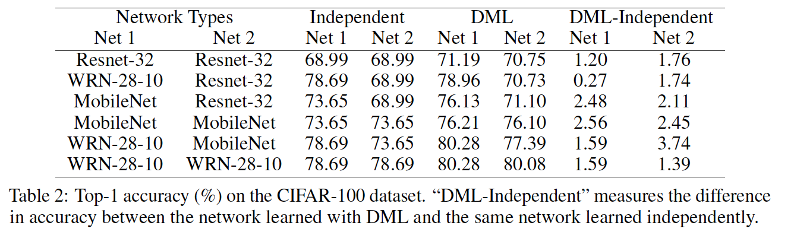

**3.2 Market-1501****，****Re-ID****任务**

​    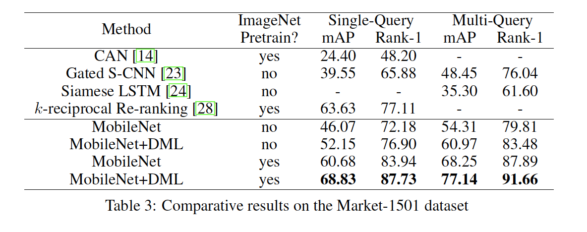

与有teacher监督蒸馏的对比：

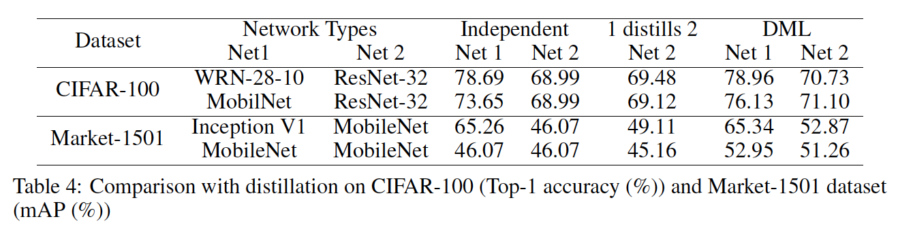

 

**3.3** **大规模****Student****的****DML**

**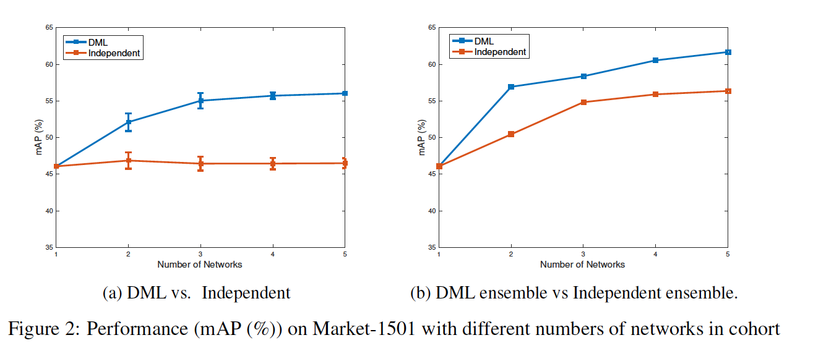**

**3.4** **鲁棒性实验**

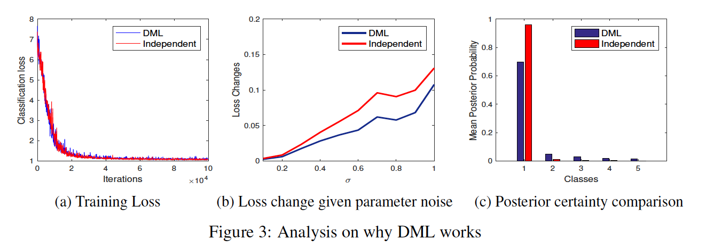

图a)显示了训练loss出现波动，对于TP样本，DML仍存在KL散度的loss；图b)显示DML比传统模型具有一定的抗噪能力。

 

**4. Thoughts**

（1）本文提出了无teacher监督的多个学生网络相互学习的蒸馏学习方法，旨在让student学习多模态输出分布，提高网络的鲁棒性，