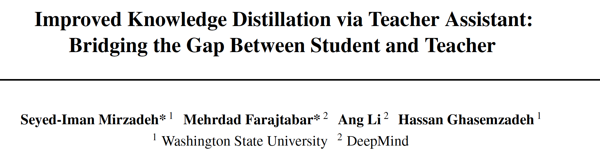

2019

**1. Abstract**

  本文发现当teacher和student的capacity gap过大时，不利于student的学习。因此，引入了中间网络TAKD——助教网络TA来指导student的学习。TA的引入在于让student学习一个**soft teacher**，而不是state-of-art的**hard teacher**，增加student的泛化性能。

  此外，本文研究了在teacher size、student size和TA的数量k固定时，如何选择最优的TA size，提出了一种动态规划的方法，并给出了实验结论：当TA的表现是teacher和student的平均值时，此时TZ size最优。

 

github：https://github.com/imirzadeh/Teacher-Assistant-Knowledge-Distillation

 

 

**2. Related work**

本文的related work介绍的挺详细，可以参考。

 

**3. TAKD**

**3.1 The Gap**

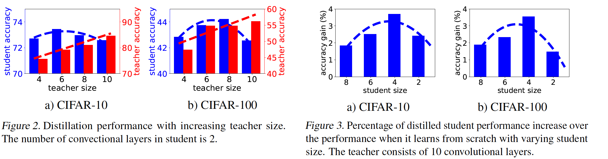

  本文指出，随着teacher网络容量增大，会出现以下几种现象：

(1). teacher性能的增加为学生提供了更好的监督。

(2). 随着teacher复杂度的增高，student没有足够的capacity来学习teacher。

(3). 随着teacher对于数据置信度的增加，导致输出的logits变得hard，减弱了dark knowledge的作用。

 

**3.2 TAKD**

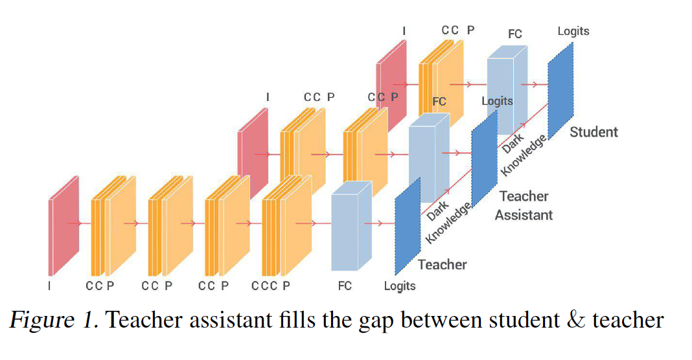

​    TAKD在teacher与student间引入了多个助教网络TA指导student的学习，student可以学得更多的dark knowledge，从而拥有更强的泛化性能。

 

**4. Experiments**

**4.1 Overall comparison**

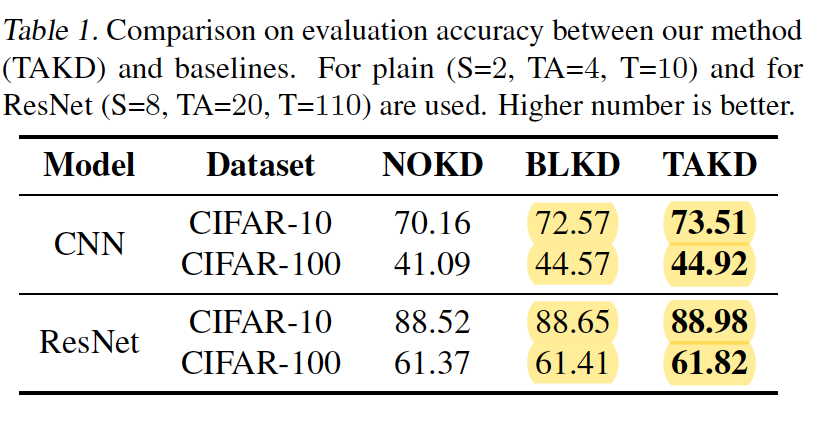

实验证明TAKD获得较好的效果。

 

**4.2 TA size**

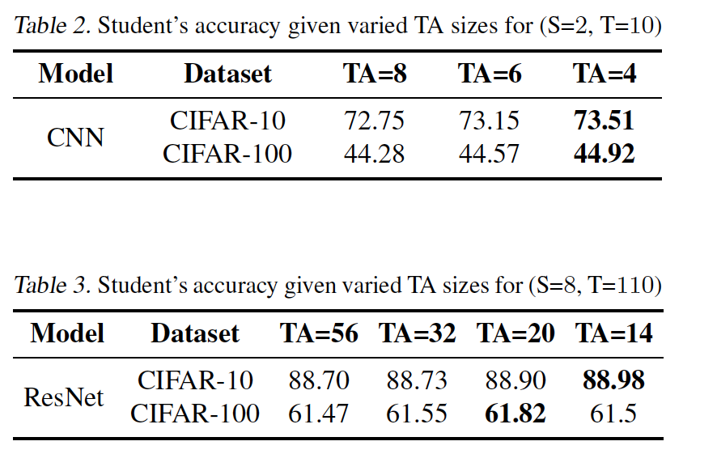

TA size的选择是影响模型性能的重要因素。

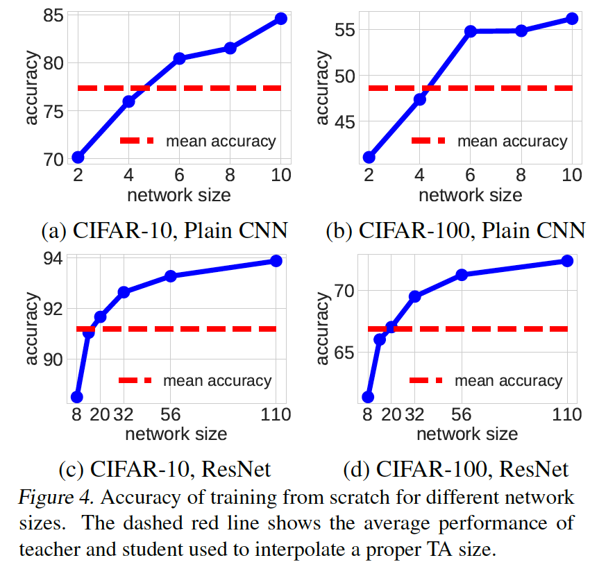

实验证明：TA size取决于student和teacher的mean performance，而不是mean size。

**4.3** **为什么使用****KD-TA**

 

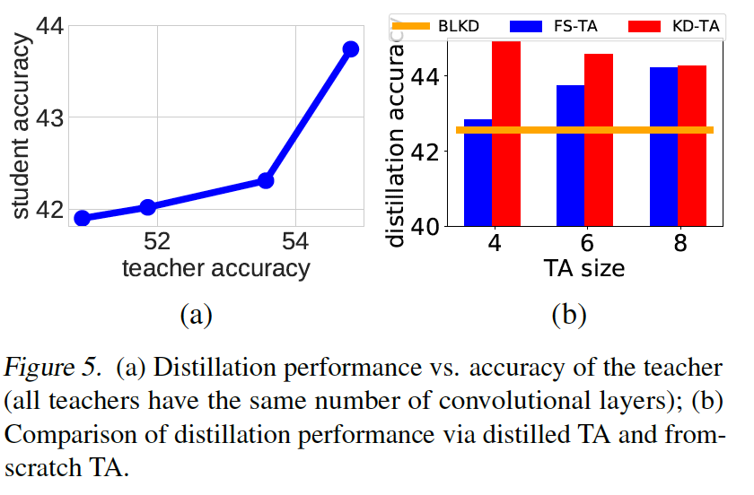

实验证明KD-TA能够学习更多的dark knowledge，增强student的泛化能力（正则化强度）。

 

**4.4****多****TA****的探讨**

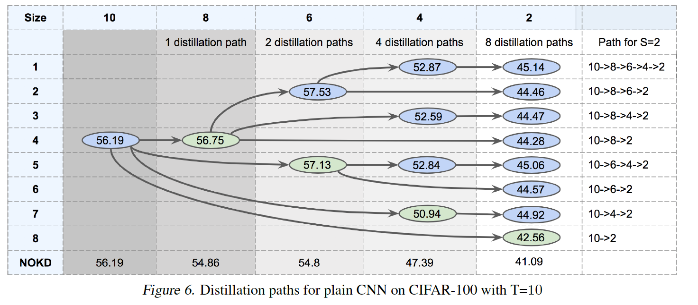

本文设置了不同的TA路径进行实验，实验表明全路径覆盖表现最优，即引入(n - m - 1)个单层TA，n、m分别是teacher和student的层数，但所需的计算资源也是最大的。

 

**本文进一步探讨了当****student****和****teacher****的层数固定、****TA****数量固定为****k****个，如何寻找最优的****TA path****：**

当路径长度为k的TA达到最优时，路径长度为k-1的TA一定达到最优，因为本文证明了提高TA路径长度，一定可以提升student模型表现，因此满足最优子问题性质，可以使用动态规划方法求解：

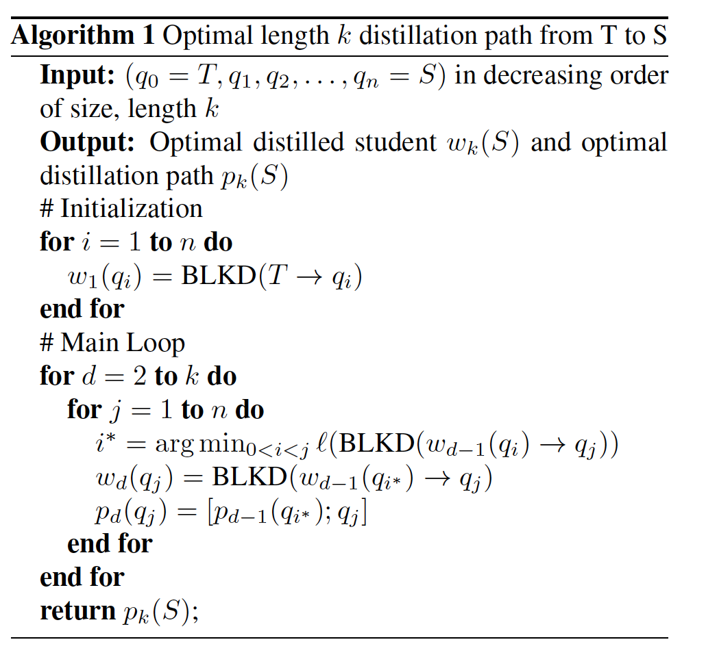

所需的时间复杂度为O(kn^2)，而穷举则需要C(n-1)(k-1)的指数复杂度。

 

**4.5****与其他的****KD****模型对比**

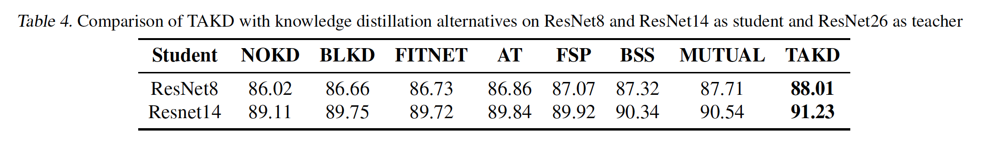

 

**4.6****理论证明（略）**

参考原文，使用VC维理论，结合T、S、TA之间的gap大小解释。

 

**4.7 Loss Landscape****观察**

**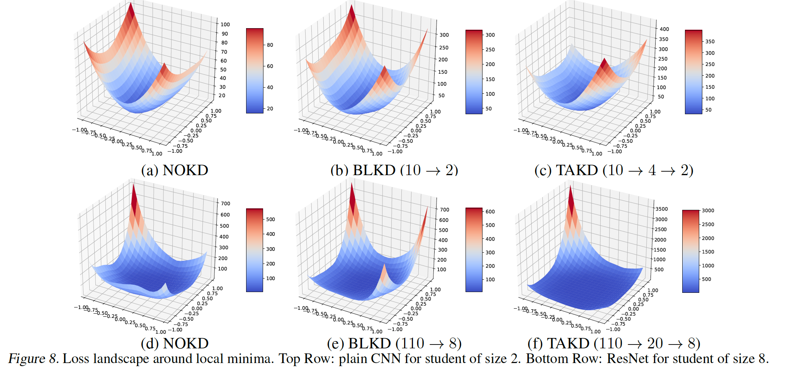**

可以发现KD方法使得student的loss landscape更加的平滑，在实验上说明了soft target起作用的原因，此外，本文提出的TAKD，在KD的基础上对teacher的输出logits实现了进一步的soft，通过层级的TA，student可以学习到更多的dark knowledge，从而增强student的鲁棒性和泛化能力。

 

**5. Thoughts**

(1). TAKD在一定程度减弱由于student capacity的降低导致student没有足够能力学习teacher的问题。