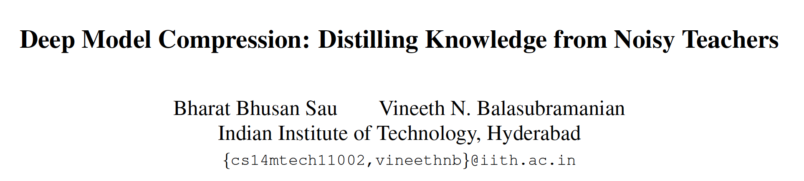
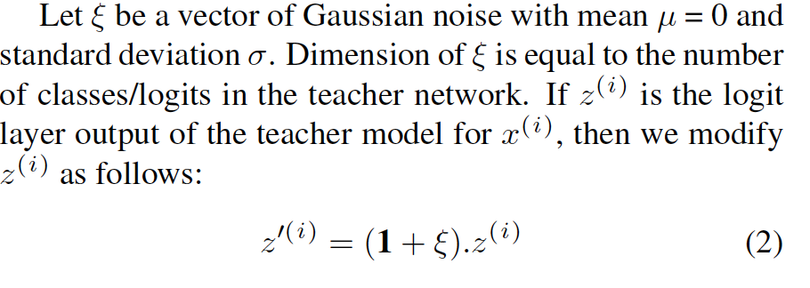
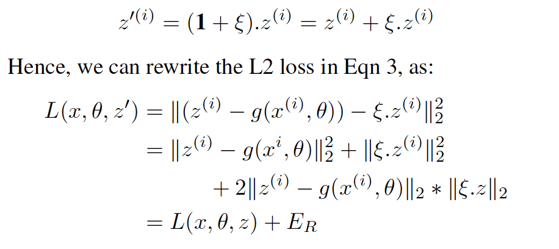
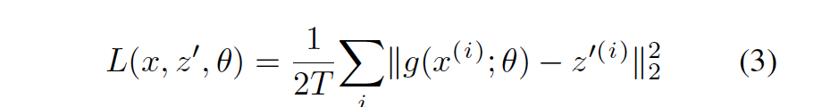
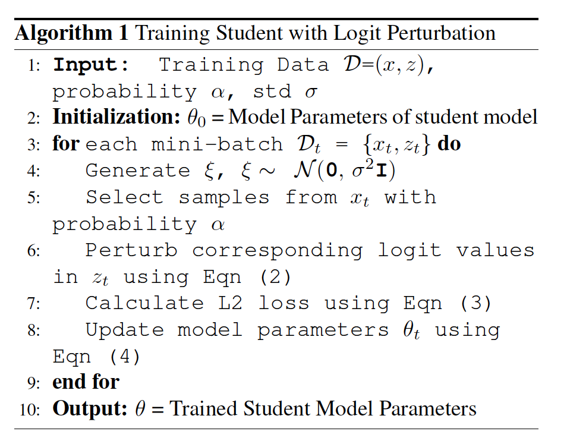
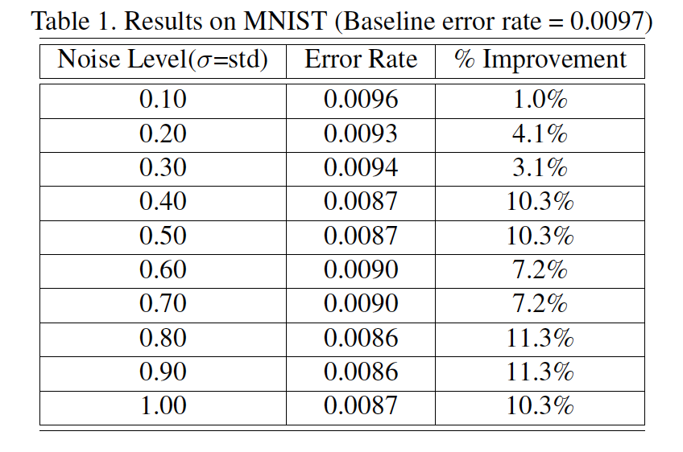
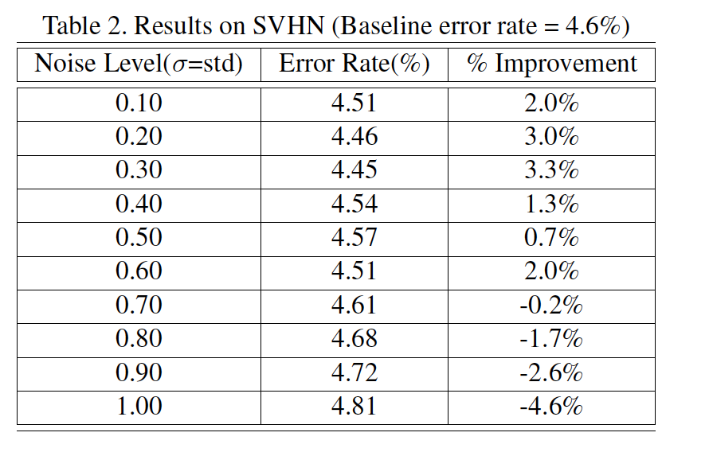
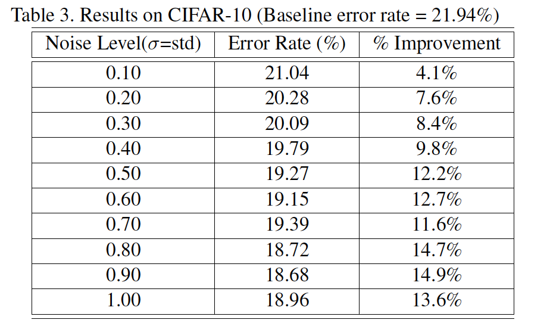
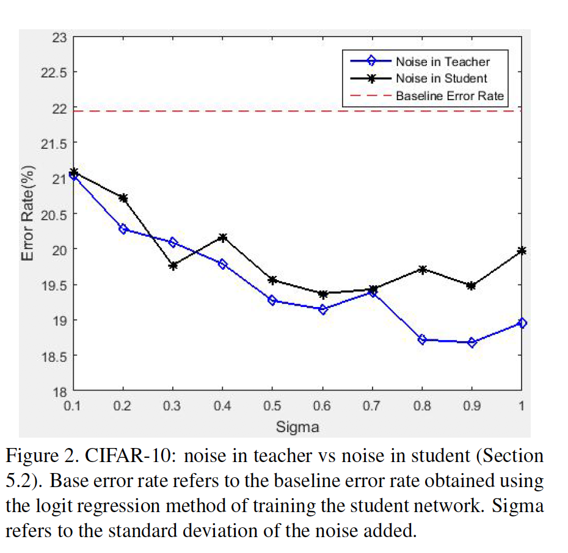
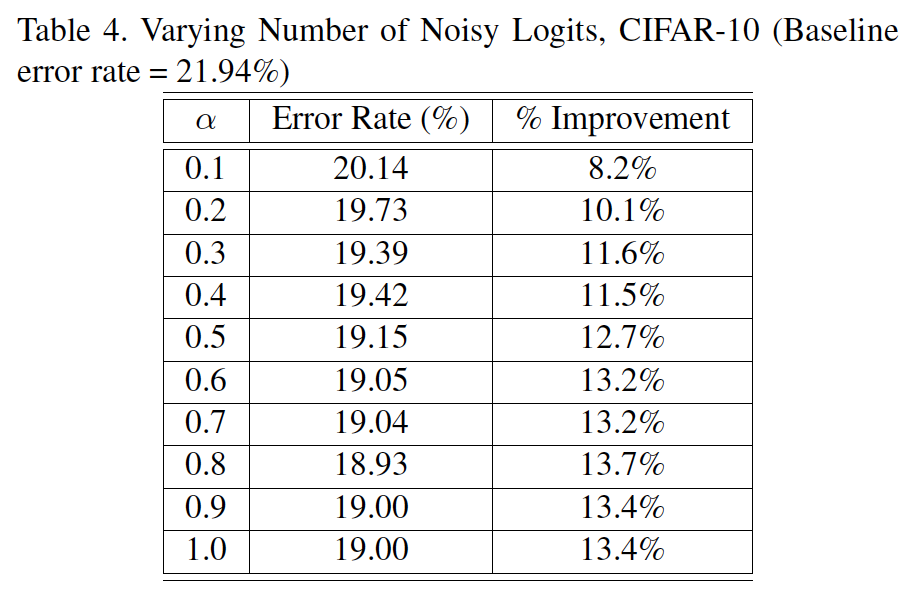

 

highlight:

1. 本文研究ensemble teacher作为正则化手段对于蒸馏性能的提升，本文认为在teacher输出logits添加高斯noise等价于使用多个相同结构的teacher来监督student。

 

可研究的点：

1. bishop证明在输入数据添加高斯噪声，等价于添加L2正则化。在teacher输出logits添加noise等价于L2 + 乘积正则化，后续可尝试这种正则化的作用。

 

**1. Method**

输出logit添加均值为0，方差为sigma的噪声：

​    等价于原始loss + L2正则 + 乘积正则

​    损失函数：

**2. Training** 

注意：在mini-batch样本中随机以alpha概率选择样本添加噪声。

 

**3. Experiments**

**Ablative study****：**

