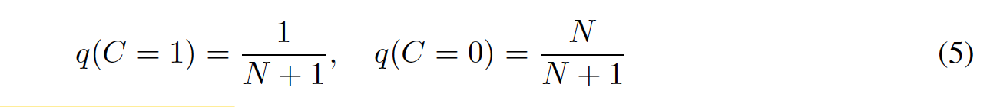

http://github.com/HobbitLong/RepDistiller.

本文主要思想：

​    contrastive learning的主要idea：学习一个表征，在这个表征里，positive样本对在某个metric是非常接近的，而negative样本对是远离的，比如使用L2距离来衡量样本之间的相似度。

​    通过最大化teacher和student表征空间的互信息lower bound，从而使得student表征空间中拥有更多的teacher信息，对于这个最大化互信息值的问题，本文转化为最大化一个二分类问题的某个label的期望。通过**预蒸馏**表征空间，可以让student初始化到一个与teacher非常相似的状态，然后再使用其他蒸馏方法结合特定任务进行学习。

​    关于mutual information estimate可以关注InfoNCE

Representation learning with contrastive predictive coding

 

可研究的点：

\1. 表征空间的预蒸馏，是否可以借鉴moco的思想，设计合适的表征metric，进行蒸馏？

对于一个fine-tuned teacher，其拥有discriminate的特征空间，表现在相似样本输出的metric（L2，cos）接近，异类样本的输出metric远离，而student的特征空间不具备此性质，如何迁移特征空间？类似于RKD，蒸馏一个batch里面样本的之间的metric。

\2. 使用互信息值来表征两个分布（推广到两个网络，teacher和student）的相似性。

 

**1. Abstract**

研究问题：

​    KD方法最小化teacher和student之间的KL散度，但忽略了teacher和student的结构特征。

本文方法：

​    从teacher的数据表征能力出发，通过最大化teacher和student表征空间的互信息值，从而使得student表征空间中拥有更多的teacher信息，实验证明本文方法比单模型压缩、集成压缩和跨模态压缩效果较好。

 

**2. Method**

**2.1 framework**

**2.2 contrastive loss**

分布符号规定，通过最大化teacher和student之间的**互信息值**可**以使得****student****模型的表征空间拥有更多的****teacher****模型表征空间的信息：**

​    定义q为以C = 0 / 1作为潜在变量的分布，当C=1时，是来自于teacher和student的联合分布，当C=0时，是来自于各自边际分布的乘积。若每N对来自各边际分布的样本对，有1对来自于联合分布，那么有C的先验：

通过贝叶斯公式得到C的后验概率：

我们定义teacher和student的互信息如下：

根据不等式关系，我们可以得到互信息的下界：

通过最大化互信息值，即最大化logq(C=1|T,S)，然而我们并不知道联合分布，因此，定义一个model h:{T, S} -> [0, 1]的映射，0对应单独从T或S的边际分布采样得到的样本（互信息为0），1对应从T和S的联合分布采样得到（存在互信息值），因此问题转化为一个二分类问题：

根据吉布斯不等式，可以使用h*近似替代q(C=1|T, S)我们可以得到互信息的下界：

我们期望，互信息的下界最大，即使得样本来自于T和S的联合分布的期望最大：

由于h*依赖于当前的student，我们将互信息的下界弱化：

最后的优化问题转化为：

实际上，h的形式是：

其中g(.)是teacher或student的表征空间，tao是温度系数，M是数据集的样本数，N是负样本的个数。

 

**2.3 KD objective**

Hinton KD：

**2.4 Cross-Modal transfer**

使用在某个大规模domain训好的teacher，指导另外一个domain少量数据的训练。

 

**2.5** **集成蒸馏**

将多个teacher累加即可。

 

**3. Experiments**

**3.1 CIFAR 100**

**correlation map****：**

 

**3.2 ImageNet**

**3.3 Dataset Transfer**

CRD具有较好的数据集泛化能力。

 

**3.4** **与其他****Contrastive objectives****对比**

两种sampling方法：

1) 无监督情况：采样不同的样本

2）有监督情况：采样不同label的样本；

而无监督会使得同一类样本的margin会拉大

 

**3.5** **超参分析**

包含两个个超参数

N：负样本个数；

tao：温度

 