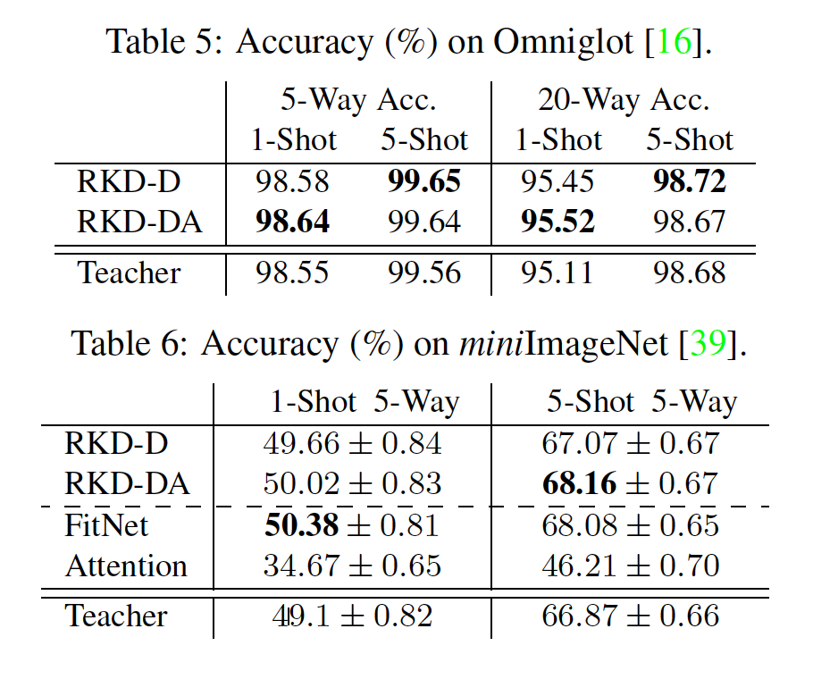
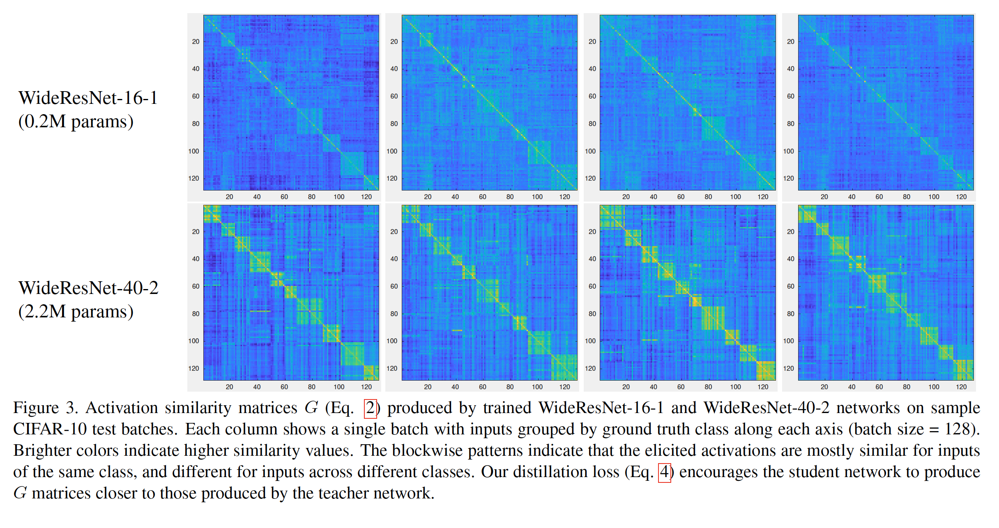

> 以一个batch不同样本之间的相关信息作为知识进行蒸馏

 

github：https://github.com/lenscloth/RKD

KD的一些开源工具：https://zhuanlan.zhihu.com/p/99086687

 

**1. Abstract**

​    传统KD方法只是让student学习teacher的输出点级别point-wise，本文提出了学习teacher数据点的相互关系structure-wise，分别提出了距离级别和角度级别的蒸馏方法，实验证明该方法在Metric Learning任务上比SOTA有显著提升。

 

**2. Methods**

**2.1 RKD**

 

​    传统KD损失函数：

其中，l是teacher和student的损失函数，xi是输入数据。Hinton所提的KD使用KL散度来惩罚student。

​    RKD的损失函数：

其中是样本点(x1, x2, ..., xn)的相关函数提取结构级别的知识，structure-wise的知识有利于student学得high-order的知识，如距离、方差、角度等，而不是单点。注意：当N=1时，RKD即为IKD（Instance-level KD，传统KD）。

 

**2.1** **距离级别的****RKD——****二元关系**

相关函数为标准化的欧式距离，除以平均欧式距离以实现标准化。距离级别的RKD损失函数：

其中为huber loss：

huber loss是一个带参损失函数，用于解决MSE对奇异点的损失过大而导致对记忆点过拟合的问题，本文取δ=1，当误差大于δ，则使用线性损失，否则使用平方损失。

 

**2.1** **角度级别的****RKD——****三元关系**

​    相关函数为ij向量与kj向量的标准余弦值，student学习角度这一高阶量来学习teacher的高阶structure-wise的知识。

 

**2.1 RKD****的总函数**

同IKD，RKD仍需要student自我学习，加强自我监督。

 

**3. Experiments**

**3.1 Metric learning**

​    图像检索的Triplet loss：

参考https://blog.csdn.net/tangwei2014/article/details/46788025，用于训练差异性较小的样本，如人脸，旨在寻找一个合适的相似性函数。

​    Triplet loss定义了三种样本：锚样本、正样本和负样本，

1.锚样本：随机从训练集选择一个样本。

2.正样本：与锚样本同类的样本

3.负样本：与锚样本不同类的样本

优化的目标是使得锚样本与正样本的距离最小，并且锚样本与负样本的距离至少 > m。

 

上表显示RKD在图像检索上有显著提升，大约2个点，此外，无l2标准化的RKD优于有l2标准化的RKD，说明RKD本身具有标准化作用。

**3.2** **自蒸馏**

​    将teacher作为student自蒸馏：

可以发现单轮自蒸馏比多轮性能好，可以推测随着轮数的增多，student过度正则泛化，监督力度不够或teacher的本身容量不够。

**3.3 SOTA****对比**

****

**3.4** **领域自适应**

数据集上的迁移学习：

​    RKD不具有领域适应能力，即不能很好的泛化到新数据集的数据相互关系。

 

**3.5** **图像分类**

​    RKD对于instance-level的任务提升并不大，但对于structure-level如metric learning提升较大，因为RKD中相关性知识对于student的学习具有较大的惩罚力度。

 

**3.6** **小样本学习**

 

**4. Thoughts**

（1）本文让student学习二元和三元相关知识，如果推广到n元的话，实验结果会怎么变化？

推测：计算量大，训练难度大，不具有好的数据迁移能力。

（2）RKD的损失函数为全部的样本空间，是否可以借鉴Bert的思想进行随机mask，比如在每个epoch中，随机选择一部分二元组进行学习？

（3）如何自适应的选择蒸馏层？

 

ICCV2019

 

Motivation:

相似的输入有相似的激活图谱，将一个batch特征图的点积相关性作为蒸馏metric。

 

可参考的点：

1. 点积作为相似性度量，蒸馏单位，一个batch；

2. 对于CLS任务提升不大，和RKD一样，对于蒸馏不同样本feature map之间的点积相关性对于分类任务提升不大，性能不及HKD，可能模型本身就具有一定的输入输出相似性，网络的输出对于相似的输入具有一定的鲁棒性。这里强加了相似性对齐，也有微小的提升。

 

**1. Method**

 

teacher和student分别计算L2 norm的点积相似度，最后使用F范数作为迁移函数。

 

**2. Experiment**

**2.1 CIFAR10**

****

**2.2 Visualization**

****

 

**highlight****：**

1. 本文类似于RKD，蒸馏一个batch的样本关系；

2. 本文只提出了二阶关系的蒸馏，并使用高斯RBF作为二阶metric，提出使用P阶Talor展开的近似高斯RBF的metric；

3. 对于mini-batch的采样策略，本文提出了一种类平衡采样和聚类采样；

4. 本文还是在embedding space上进行蒸馏，如何在feature map级别进行？

 

**可研究的点：**

1. 尝试高斯RBF作为二阶metric；

2. 尝试改进采样策略。

 

**1. Methods**

**1.1 Correlation Congruence**

二阶metric：

P阶Talor展开近似指数：

**1.2 Sampling strategy**

random sampler可能会采样都为同类的样本或都为异类的样本，降低了instance相关性之间的显著性。

本文提出两种采样策略：

1）. CUR：每类采样相等个数的样本；

2）. SUR：首先使用k-means聚类teacher的feature map得到超类，之后采样超类的样本。

 

**2. Experiments**

**2.1 CIFAR-100**

**2.2 ImageNet-1K**

**2.3 Re-ID**

**2.4 Face Recognition**

**2.5 Ablation**

metric：

P：

Sampling strategy：

**2.6 Visualization**

